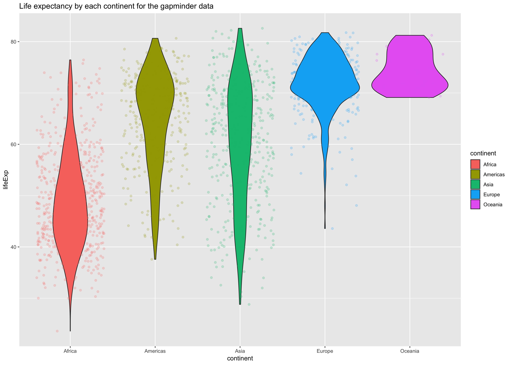

Table of Contents:

-   [Load the gapminder data set](#load-the-gapminder-data-set)
-   [Part 1: Factor management](#part-1-factor-management)
    -   [Drop Oceania and remove unused factor levels](#drop-oceania-and-remove-unused-factor-levels)
    -   [Reorder the levels of countries in the forcats package](#reorder-the-levels-of-countries-in-the-forcats-package)
    -   [Experiment with the arrange() function](#experiment-with-the-arrange-function)
-   [Part 2: File I/O](#part-2-file-io)
-   [Part 3: Visualization design](#part-3-visualization-design)
-   [Part 4: Writing figures to file](#part-4-writing-figures-to-file)
-   [But I want to do more!](#but-i-want-to-do-more)

# Load the gapminder data set 
I will be working with the gapminder data set for my final assignment for STAT545A. Since we are very familiarized with that data set because we have used it a lot in class and in previous assignments, I will skip introducing the data set.

```{r}
library(gapminder) # laod gapminder data set
suppressPackageStartupMessages(library(tidyverse)) # tidyverse loads dplyr and forcats packages
```


Let's have a quick look at the head of the gapminder data set to remind ourselves what we are working with

```{r}
head(gapminder) # view top six rows of gapminder data set
```

Ok, so we can clearly see from using the head function that we have the factors, country, continent, year, lifeExp, pop and gdpPercap to work with. 

```{r}
gapminder %>% 
  str() # look at the structure of the gapminder data set
```

In the str() function output for the gapminder data frame, focus in on the number of factor levels for continent. We can see there is currently 5 levels. Let's have a look at what exactly those levels are by using the levels() function  
```{r}
gapminder$continent %>% 
  levels() # see what the levels of gapminder$continent are.
```

We can see that the five levels are Africa, Americas, Asia, Europe, and Oceania. This will change below in Part 1 of HW05.

# Part 1: Factor management

In this first part of the assignment, I will work with the gapminder data set. I have two major objectives, the first of which is to drop Oceania and remove unused factor levels. The second objective is to reorder the levels of the countries in the forcats package.

## Drop Oceania and remove unused factor levels

I will use the Base R: `droplevels()` which may operate on an entire data frame or a factor because all that I want to all entries related to Oceania in the gapminder data frame. To accomplish this, I must use the dplyr and forcats packages because I will be relying on various functions from those packages (as you will see below).

Next, I will filter all rows of the data frame for all continents but Oceania.

```{r}
gap_no_Oceania <- gapminder %>% 
  filter(continent != "Oceania") # filters for rows for all continents but Oceania.
```

Now, I can simply use the base R, droplevels() function to drop the observations in the columns that have no observations. We can use the droplevels() function to act upon on our removal of the entries corresponding to Oceania. I chose to use the droplevels() function over the `forcats::fct_drop()` becauze droplevels() operates on either an entire data frame or a factor, while fct_drop() only operates on a factor.

Note that we had to store the gap_no_Oceania into a variable (I just used gap_no_Oceania for simplicity) to make the droplevels() function result last and not just relative to the below code block. 

```{r}
gap_no_Oceania <- gap_no_Oceania %>% 
  droplevels() # if no observation in the column, then it drops the corresponding level

gap_no_Oceania %>%
  str() # continent only has levels Africa, Asia, and Europe and the countries of those guys
```

By using the str() function, we can see that gap_no_Oceania now has four continent factor levels and not five as we saw originally.

Also, notice that we have 1680 observations of 6 variables in gap_no_Oceania. On the other hand, in the original gapminder data frame using the str() function, the output stated that there was 1704 obs. of 6 variables. So, some observations were removed when we used the combo of filter() and droplevels(), but the number of variables remained the same (which is what we wanted).

Let's check to see that Oceania was the continent factor level that was removed!

```{r}
gap_no_Oceania$continent %>% 
  levels() # see what the levels of gap_no_Oceania$continent are.
```

Success! We can see that we only have the four continents, Africa, Americas, Asia and Europe as our factor levels for continent. We no longer have Oceania as a factor level for continent. So we succeeded in dropping the unused level from the continent factor in the gapminder data frame.

We can also check that the countries corresponding to Oceania were dropped in gap_no_Oceania. 

First, let's view the countries of Oceania from the gapminder data frame.

```{r}
gapminder %>% 
  filter(continent == "Oceania") %>% 
  select(country) %>% 
  unique()  # see what the possible countries are in Oceania
```

Notice that the only countries corresponding to Oceania in the gapminder data frame are Australia and New Zealand. So, we would expect Australia and New Zealand to be missing in gap_no_Oceania$country.

```{r}
gap_no_Oceania$country %>% 
  levels() # see what the levels of gap_no_Oceania$country are.

# Let's if Australia and New Zealand are to be found in gap_no_Oceania$country.
gap_no_Oceania %>% 
  select(country) %>% 
  filter(country %in% c("Australia", "New Zealand")) # filters to Australia and New Zealand rows

```
We can see that there are no rows in the resulting tibble. Hence, we have confirmed that tehre are no Australia and New Zealand rows that were found in gap_no_Oceania$country.

## Reorder the levels of countries in the forcats package

Here, I will use the forcats package to change the order of the factor levels of a subset of countries in the gapminder data frame. I will base my reordering choice on the quantitative variable lifeExp. Additionally, instead of focusing on the plain ol' median lifeExp, I will use the mean to analyze the life expectancy differences of the countries. I will investigate just the gapminder data of Europe in the year of 2007 to keep the data to a minimum so we can focus on the analysis.

Now, we will load the ggplot2 package to do factor level reordering and display the results graphically.

```{r}
library(ggplot2) # load ggplot2 package
```

Next, we will filter for just the rows of Europe in 2007 and display the life expectancy of the European countries in a scatterplot.

```{r}
gap_europe_2007 <- gapminder %>% 
  filter(year == 2007, continent == "Europe") # filter the rows to keep just the data of Europe in 2007

ggplot(gap_europe_2007, aes(lifeExp, country)) + 
  geom_point() + # plot the plain old gap_europe_2007 to see the unordered chaos of points that result.
  ggtitle("Life exp. of the European countries in 2007") # add title
```

We can see the life expectancies are unordered. The above scatterplot looks rather chaotic and difficult to interpret.

So, we will now use the forcats package to manipulate the order of the factor levels of country specific to this subset of the gapminder data set.

Suppose that we wanted the mean to be in order in ascending or descending order. We will try that out below by employing the forcats package! We will use the `fct_reorder` function to do this because we want to reorder the factor levels by arranging according to another variable (in this case, weighted_mean). Note that `fct_reorder()` by default orders by the median weighted lifeExp. By default, it computes a summary statistic (default: median) for each category in the factor. Note that our summary statistic will be the mean as we are specifying that as `.fun = mean` in the fct_reorder() function.

```{r}
gap_europe_2007 %>% 
  mutate(country = fct_reorder(country, lifeExp, .fun = mean)) %>% # reorder the European countries in 2007 by mean life Expectancy (more readable) in ascending order
  ggplot(aes(lifeExp, country)) + 
  geom_point() + # plot a scatterplot of the above
  ggtitle("Mean life exp. of European countries in 2007 (in ascending order)") # add title
```

The resulting scatterplot is much more organized and easy to interpret. For example, we can easily spot that Iceland has the highest mean life expetancy in 2007 of the European countries, which is just under 82 years old. In conclusion, we should probably all move to Iceland if we want to live long lives (just kidding).

We may set the parameter of the fct_reorder() function to .desc = FALSE, but that is unnecessary because, by default fct_reorder() orders from lowest to highest. 

Now, we shall look use `fct_reorder` to view a graph of the contients ordered in descending order. Note that we did set .desc = TRUE to achieve that goal in a quick and easy way.

```{r}
gap_europe_2007 %>% 
  mutate(country = fct_reorder(country, lifeExp, .fun = mean, .desc = TRUE)) %>% # reorder the European countries in 2007 by mean life Expectancy (more readable) in descending order
  ggplot(aes(lifeExp, country)) +
  geom_point() + # plot a scatterplot
  ggtitle("Mean life exp. of European countries in 2007 (in decreasing order)") # add title

```

The same information is conveyed as in the above scatterplot for the ascending order of the mean life expectancy of the European countries in 2007. So, we can still see that Iceland has the highest mean life expectancy at just under 82 years old and Turkey has the lowest mean life expectancy at just under 72 years old (for 2007). I should not that for this data, it probably makes more sense for the first scatterplot (in ascending order) for easy readability of the mean life expectancies of the European countries in 2007.

Now, suppose we wanted to hone in on the top five countries with high life expectancies (according to the results of our above scatterplots of the mean life expectancy of the European countries in 2007), which were Iceland, Switzerland, Spain, Sweden, and France. So let's create a subset of the data.

```{r}
select_countries <- c("Iceland", "Switzerland", "Spain", "Sweden", "France")
gap_select <- gapminder %>%  # df of just the 5 countries
  filter(country %in% select_countries) %>% 
  droplevels() # drop unused levels

head(gap_select) # view the top six rows of our subset of the gapminder data frame
```


```{r}
gap_select %>% 
  ggplot(aes(year, lifeExp)) +
  geom_line(aes(group=country, colour=country)) + # plot of life expectancy over time for those 5 countries
  ggtitle("Life expectancy over time for the top five European countries in 2007") # add title
```


Now, we will use `fct_reorder2(f, x, y)` to reorder factor `f`, which for our example would be country. The function looks at max year (x) value and takes corresponding life expectancy (y) value. It will reorder the countries according to the life expectancy at the very end.

```{r}
 # Reorders the five European countries of gap_select according to the life expectancy at the very end.
gap_select %>% 
  mutate(country = fct_reorder2(country, year, lifeExp)) %>% 
ggplot(aes(year, lifeExp)) +
  geom_line(aes(colour=country)) + # plot of life expectancy over time for those 5 countries
  ggtitle("Life expectancy over time for the top five European countries in 2007") # add title
```

Notice that when we used `fct_reorder2()`, Iceland went first, then Switzerland, then Spain. This order corresponds to the order that we saw in the scatterplot of gap_europe_2007, which makes sense because we are reordering the five countries by their last life expectancy (which would be in 2007). That is a quick check to make sure that our code and output was what we expected.


## Experiment with the arrange() function

I want to explore the arrange() function a little on the top five European countries in terms of life expectancy in 2007.

Let's print out the output for the five countries with the highest life expectancy in 2007.

```{r}
gap_select_2007 <- gap_select %>%  
  filter(year %in% 2007) # tibble of just the 5 countries with the top life expectancy in the year 2007

gap_select_2007 # view the the gap_select_2007 tibble
```

We can arrange that data set in terms of increasing life expectancy. Let's do that below. Note that the following code is based on Jenny's from [here](https://www.stat.ubc.ca/~jenny/STAT545A/block08_bossYourFactors.html#specialty-functions-for-making-factors).

```{r}
gap_select_2007_ascend <- within(gap_select_2007, country <- reorder(country, lifeExp, .fun = mean))

levels(gap_select_2007_ascend$country) # View the order of the levels of the countries. We expect them to be arranged in ascending order of lifeExp.
```

However, we can see if we look at gap_select_2007_ascend, the row order has not changed to be arranged in order of ascending mean lifeExp. Let's view it as a scatterplot to see this.

```{r}
gap_select_2007_ascend %>% 
  ggplot(aes(lifeExp, country)) + 
  geom_point() + # plot a scatterplot of life expectancy versus country for the five European countries with the highest life expectancies in 2007
  ggtitle("Life expectancy vs. country for the top five European countries in 2007") # add title
```

So, the output is not what we want. We wanted the order to be France, Sweden, Spain, Switzerland and then Iceland to be in order of ascending life expectancy. 

The arrange function comes to our rescue. This funciton from the plyr package lets us reorder the factor levels and make the new row order remain. As Jenny stated on her webpage (see the above link), the arrange function "is a nice wrapper around the built-in function order()".

```{r}
gap_select_2007_ascend_arr <- arrange(gap_select_2007_ascend, country) 

gap_select_2007_ascend_arr %>% # use the arrange function to display the countries in order of ascending life expectancy
  ggplot(aes(lifeExp, country)) + 
  geom_point() + # plot a scatterplot of life expectancy versus country for the five countries with the highest  life expectancies in 2007
  ggtitle("Life expectancy vs. country for the top five European countries in 2007") # add title
```

Perfect. That scatterplot is exactly what we wanted. The European countries are now arranged according in ascending order of life expectancy in 2007.

# Part 2: File I/O

I will experiment with write_csv()/read_csv(). Since we have already played with and filtered to get the five countries with the highest life expectancy in 2007 in the gapminder data frame, we will use what we have and see how it does when we write a csv of it. We will look at both versions, when the the rows are alphabetically ordered by country and when the rows are in ascending order of life expectancy in 2007. 

First, we will look at the gap_select_2007, which was the output for the five countries with the highest life expectancy in 2007 and the rows are alphabetically ordered by country.

```{r}
# Write gap_select_2007.csv 
write.csv(gap_select_2007, file = "gap_select_2007.csv") 

# Read in gap_select_2007.csv 
gap_select_2007_read <- read.csv("gap_select_2007.csv") 

gap_select_2007_read # view the read-in gap_select_2007.csv
```

We see that we have still retained the same alphabetical order by country. All six variables that were originally in gap_select_2007, which were country, continent, year, lifeExp, pop and gdpPercap are still there and their values have not changed. The only major difference that I can spot is that we now have a new column X which has five entries ranging from 1 to 5. Why is that happening? One explanation that I found from [here](https://stackoverflow.com/questions/10441437/why-am-i-getting-x-in-my-column-names-when-reading-a-data-frame) states that "read.csv() is a wrapper around the more general read.table() function". The behavior of adding a new column with an X header is consistent with the behaviour of the read.table() function. If we don't want this to happen, we can try to add `row.names = FALSE` to the write.csv() function to override that behaviour of adding an extra column for the rows with 1 to 5. Let's try that and see if we can get just the variables that we want.

```{r}
# Write gap_select_2007.csv 
write.csv(gap_select_2007, file = "gap_select_2007_2.csv", row.names=FALSE) 

# Read in gap_select_2007.csv 
gap_select_2007_read_2 <- read.csv("gap_select_2007_2.csv") 

gap_select_2007_read_2 # let's see what we got when we read in the CSV
```
Excellent, that is precisely what we want. The gap_select_2007_read_2 looks exactly like gap_select_2007.

Next, I will look at the when the rows are in ascending order of life expectancy in 2007. In particular, we should look to see if the rows are still arranged in order of ascending life expectancy when we read in the CSV.

```{r}
# Write gap_select_2007_ascend_arr.csv
write.csv(gap_select_2007_ascend_arr, file = "gap_select_2007_ascend_arr.csv", row.names=FALSE) 

# Read in gap_select_2007_ascend_arr.csv
gap_select_2007_ascend_arr <- read.csv("gap_select_2007_ascend_arr.csv") 

gap_select_2007_ascend_arr # let's see what we got when we read in the CSV
```

Interesting. We had gap_select_2007_ascend_arr in order of ascending life expectancy and when we import the CSV file that we wrote using that data, the row order was preserved.

That certainly makes working with that data easier. We don't have to use the rearrange the data once we import it (well, for this example we don't... other data sets may require data rearrangement).

# Part 3: Visualization design

In the previous HW03 for this course, I tried to use gganimate, which is one kind of package that can enhance ggplot2 by animating ggplot2 graphics. I will try to explore that again and see if, with a better understanding of ggplot2, I can create a plot that is both informative and that more effectively uses the gganimate package.

First, I will load the required packages to use gganimate the way I want to with ggplot2.

```{r message = FALSE}

library(devtools) # load devtools package

devtools::install_github('thomasp85/gganimate') # install gganimate package this way because it is not installing when we use the install.packages() function with R 3.5.1. Also, gganimate is Github-based (not based on CRAN).

library(gganimate) # laod gganimate package
```

Next, I will show what I made in HW03 by using ggnimate. The following plot/animation illustrates a line chart over time of the mean gdpPercap of Singapore, Kuwait, and Hong Kong. I chose to follow the gdpPercap of those three places over time because they had a high mean GDP per capita of over 25,000 PPP dollars in 2007 (I explored that more in HW03). I thought that revealing the meaan gdpPercap over time would be interesting because then you don't see the whole picture immediately. You can focus more on how the mean gdpPercap got there.

```{r message = FALSE}
library(transformr) # load transformr package to draw line

lifeExp.bycontyr <- gapminder %>% 
  select(country, year, gdpPercap) %>% # only select country, year, and gdpPercap columns
  filter((country == "Kuwait" | country == "Singapore" | country == "Hong Kong, China") & year <= 1992) %>%
  group_by(country, year) %>% # group by country and year
  mutate(meangdp = mean(gdpPercap)) %>% # add mean gdpPercap columnr
  ggplot(aes(x =  year, y = meangdp, color = country, group = country)) +
  geom_path(size = 2, alpha = 0.4, arrow = arrow()) + # lines of the mean gdpPercap of the 3 countries over the years
  # gganimate code parts are below 
  transition_reveal(year, year) # transitions are the years

lifeExp.bycontyr # let's see the animation!
```

One of the problems that I encountered with this animation was that it ran at a decent speed on my RStudio, but when I pushed it to Github, the animation ran at a snail's pace. I was bummed to learn that there wasn't an quick and easy fix to this becaue the transition_reveal() is still being worked on. So, I left it at that.

Now, I am aiming to display different information from the gapminder data set and use the gganimate package. What I want to display is how the GDP per capita and populations of Americas and Europe changed over time. The size of the points corresponds to the mean gdpPercap at that time. For the base of the following code, see [here](https://github.com/thomasp85/gganimate). 

```{r}
Am_Euro_gap <- gapminder %>% 
filter(continent == "Americas" | continent == "Europe") %>% 
group_by(continent, year) %>% # group by continent and year
mutate(meangdp = mean(gdpPercap)) # add mean gdpPercap columnn

Am_Euro_gap_ggplot2 <- Am_Euro_gap %>% 
ggplot(aes(pop, gdpPercap, size = meangdp, colour = country)) +
  scale_colour_manual(values = country_colors) +
  scale_size(range = c(2, 12)) +
  geom_point(alpha = 0.8, show.legend = FALSE) +
  scale_x_log10() + # scale the gdpPercap by log10
  facet_wrap(~ continent) # facet_wrap by continent
  
  Am_Euro_gap_ggplot2 + 
  # gganimate code parts are below 
  labs(title = 'Year: {frame_time}', x = 'population', y = 'GDP per capita') +
  transition_time(year) +
  ease_aes('linear')
```

This side-by-side animated plot gives us a feel for how the population vs GDP per capita changed over time for Americas and Europe. It is more general than precise. It allows us to see general patterns, and then we could construct more specific plots for the patterns that we wish to examine.

We can see a couple things right off the bat on the plot. Overall, we can see that as the populations increase, the European countries tyipically have a higher GDP per capita than the countries from the Americas as the years go by. Also note that the size of the points for Europe quickly get much larger than the Americas, meaning that the mean GDP per capita of the European countries gets larger than the Americas countries over time. Another thing to note is that it appears that the GDP per capita of the European countries rise relatively close together as as the population of the European countries stabilizes. On the other hand, for the GDP per capita of the Americas countries, there appears to be two countries which have a relatively stable high population and for which their GDP per capita rise above the rest. Another related observation about the Americas is that the population of the majority of the countries increases over time but their GDP per capita does not get nearly as large as the two countries whose GDP per capita rose above the rest. 

We can try to use use the plotly package to accomplish something similar to what gganimate did. Let's examine how exactly the plot produced by plotly differs from the plot that we produced using gganimate.  

```{r}
suppressPackageStartupMessages(library(plotly)) # load plotly package
```

Also, I will install phantomjs() by using `webshot::install_phantomjs()` to display a preview shot of the plot produced using plotly on Github.

First, we can try the easy option and just use ggplotly on Am_Euro_gap_ggplot to see what we get.

```{r}
ggplotly_Am_Euro <- ggplotly(Am_Euro_gap_ggplot2) # ggplotly Am_Euro_gap_ggplot2 to see what we get.

htmlwidgets::saveWidget(ggplotly_Am_Euro, file = "ggplotly_Am_Euro.html")
```

The actual plotly plot is may be interacted with [here](https://raw.githack.com/STAT545-UBC-students/hw05-rachlobay/master/ggplotly_Am_Euro.html).

The result looks like art. It is cool that if we hover over the plot produced by plotly, we can see the important information - what the population, GDP per capita, mean GDP per capita, and what country that the spot that we are hovering over pertains to. However, there are some drawbacks to using ggplotly. For example, when I tried to animate the above ggplotly, it became very difficult very quick because the following `  animation_button(x = 1, xanchor = "right", y = 0, yanchor = "bottom")` line in particular threw an error that is difficult to fix. 

On the other hand, if we manually attach am_Euro_gap and manually create a plot_ly of that data, it becomes easier to animate it. For the base of the following code, see [here](https://plot.ly/r/animations/).

```{r message=FALSE, warning=FALSE}
attach(Am_Euro_gap) # attach am_Euro_gap 

Am_Euro_gap_plotly <-   plot_ly(
    x = ~pop, 
    y = ~gdpPercap, 
    size = ~meangdp, 
    color = ~country, 
    frame = ~year, 
    text = ~country, 
    hoverinfo = "text",
    type = 'scatter',
    mode = 'markers'
  ) %>%
  layout(
    xaxis = list(
      type = "log"
    )
  )
# plotly version of how the GDP per capita and populations of Americas and Europe changed over time

plotly_Am_Euro_gap <- Am_Euro_gap_plotly %>% 
  animation_opts(1000, easing = "elastic", redraw = FALSE)  %>% 
  animation_button(x = 1, xanchor = "right", y = 0, yanchor = "bottom") %>% # add an animation button
animation_slider(currentvalue = list(prefix = "YEAR ", font = list(color = "red"))) # add a slider

htmlwidgets::saveWidget(plotly_Am_Euro_gap, file = "plotly_Am_Euro_gap.html")
```

The interactive plot is found [here](https://raw.githack.com/STAT545-UBC-students/hw05-rachlobay/master/plotly_Am_Euro_gap.html).

This basically does what gganimate does - we can track how population vs GDP per capita changed over time for Americas and Europe. One awesome and informative aspect of this plot is that if we hover over the plot produced by plotly, we can see what particular country each dot corresponds to. Hence, plotly makes it easier to track particular countries over time than ggnimate does. The drawback was that I couldn't easily find an equivalent to `facet_wrap()` like we have in ggplot2 so that the plots are side-by-side for the Americas and Europe. So, the countries for Americas and Europe are on the same plot, which is not the separation we were looking for. 

# Part 4: Writing figures to file

I will use `ggsave()` to save a plot to file. Following that, I will use `` to load and embed that figure in my report.

It is worth mentioning that if we have just produced the plot, we can simply type `ggsave("SPIFFY_PLOT_NAME.png")` to save our nifty plot. I will use a simple violin plot with jitter for life expectancy separated by continent to demonstrate this. When I use ggsave(), I will scale the plot to be 3/4 of its original size. We should see this size difference when we load and embed the figure after.

When we use the scale argument, the number that is put in to make the figure bigger or smaller is rather counterintuitive. For a scale number less than 1, the plot will be bigger and for scale number greater than 1 the figure will be smaller.Also, the scale argument changes the size of the text on your plot (meaning the title and axes labels). 

```{r message = FALSE}
gapminder %>% 
ggplot(aes(x = continent, y = lifeExp, fill = continent)) + 
  geom_violin() + # simple violin with jitter of life expectancy by continent
  geom_jitter(alpha = 0.2, aes(color = continent)) + # add some jitter colored by continent to the boxplot
  ggtitle("Life expectancy by each continent for the gapminder data")

ggsave("lifeExp-continent-violin-plot.png", scale = 1.75) # save the plot using ggsave() 
```

Now, I will load and embed the figure.




We can more precisely change the width or height of the figure, using those arguments in ggsave(). You might ask, what are the units of the width and height? Well, the default is the current graphics device size. If we don't want that, we can specify the width and height using the `units` argument. Some units we could use are "cm", "mm", "in". For example, if we wanted the units of both width and height to be in cm, simply type `units = "cm"`. 

```{r}
ggsave("lifeExp-continent-violin-plot-cm.png", width = 40, height = 40, units = "cm") # show the  effect of changing the width and height to 20 cm each
```


The dpi argument allows us to change the resolution of the plot. According to this [ggplot2 reference](https://ggplot2.tidyverse.org/reference/ggsave.html), it may take in "retina" (320), "print" (300), or "screen" (72) and applies to only raster output.

So what is a raster output and how does it differ from vector output? Well, this [source](https://designshack.net/articles/layouts/vector-vs-raster-what-do-i-use/) says:

> "There are two types of digital graphics files – vector and raster. Vector images are made of hundreds of thousands of tiny lines and curves (or paths) to create an image. Raster images are composed of pixels. But how do you know what format is best for your next project?""

The above source defines what a raster graphic is:

> "Raster images are often called bitmap images because they are made of millions of tiny squares, called pixels."

Some examples of raster images are graphics like, jpg, gif, png, and tif.

The source confirms that the majority of images that you see on websites are of the raster variety. Such raster images are useful for online publications, but not so much for printed projects because raster images are often saved in low resolution. This is why we would want to change the DPI when we save an image. If we knew we wanted to print the image sometime, go for high DPI so that the image will not "suffer during the printing process".

```{r}
ggsave("lifeExp-continent-violin-plot-print-dpi.png", dpi = "print") # save the plot with dpi set to print (so we get high DPI and our image will hopefully look good when we go to print it).
```

And let's load and embed the image to see the high dpi output:


Since we've talked some about rasters, we can move on and talk a little about vectors. Again, I am referring to [here](https://designshack.net/articles/layouts/vector-vs-raster-what-do-i-use/)

> "Vector images, which are made of thin lines and curves known as paths, are rooted in mathematical theory."

So, vectors are in terms of lines and nodes. Vectors are such that they look smooth when you zoom in (which is a benefit over raster images).

Some examples of raster images are graphics like, PDF, SVG, and postscript.

> Text is one of the most common types of vector image. No matter how much you increase a font’s size, for example, its look never changes.

A vector's file size is often smaller than a raster graphic's file size because we are not using millions of pixels, but mathematical-based language in a vector.

One negative side to vectors is that people often just save vectors as a program-specific file. So, vectors sometimes have compatibility issues. This means that if other people don't have access to that particular program, they will have a heck of a time trying to access the program-specific vector file.

Note that ggsave() is advisable for saving ggplot() figures. However, when we are looking at saving non-ggplot figures and writing them to files, there are different methods available.

The process for writing a figure to a vector file in RStudio could be thought of as follows:
1) Open a graphics device before creating the plot or figure. For example, on Mac I could use quartz(), wheras on a Windows computer I could use windows().
2) Create the graph.
3) Turn off (close) the graphics device.

Suppose we have finished typing up and displaying a plot that we want to write as a pdf.

```{r}
# We created the below plot
x <- c(1,2,3,4,5) # define x vector 
y <- c(2,2,2,3,3) # define y vector
plot(x, y) # simple plot of x versus y 
```

When we have a figure up on our screen like that, we can quickly write it as a pdf by doing the following:

```{r}
quartz() # open a graph window before creating graph
dev.print(pdf, "beautiful-plot.pdf") # the leftmost argument says to put a clone of the above figure as a pdf and the right argument indicates the name of our pdf
```

The longer way to write a pdf is by using the pdf() function. Even though this is longer, it does have some advantages over the quick method. For example, we Once we have everything we want in our pdf, using this method we should close the pdf file once we are done writing it by typing `dev.off()`

```{r message = FALSE}
quartz() # open a graph window before creating graph
pdf("test.pdf") # write the PDF as a file
x <- c(1,2,3,4,5) # define x vector 
y <- c(2,4,6,8,10) # define y vector
plot(x, y) # simple plot of x versus y 
dev.off() # close file of PDF
```

We can test that we indeed got a pdf written in our working directory from the list.files() command:

```{r}
list.files(pattern = "^test*") # see if our test.pdf file is in our working directory
```

So, there is a test.pdf in our working directory.

# But I want to do more

I will pick a handful of the countries, each of which one may associate with a stereotypical desserts. My objective is to create a new factor by mapping the existing country factor levels to the new levels. The factor that I will create is stereotypical desserts for the countries Australia, France, Germany, Italy, Japan, Turkey, and United States.

So, first I must create an excerpt of the Gapminder data, filtered to just those countries. That is easy enough using our handy filter function and the droplevels() function.

```{r}
dessert_countries <- c("Australia", "Turkey", "United States", "France", "Germany", "Italy", "Japan")

gap_country_desserts <- gapminder %>% 
  filter(country %in% dessert_countries) %>% 
  droplevels() # drop unused factor levels (because we'd still have all the countries from gapminder data, if we didn't).

gap_country_desserts$country %>% 
  levels() # see what the levels of gap_country_desserts$country are.
```

Awesome. So gap_country_desserts is comprised of the countries that we will use for our stereotypical dessert factor addition.

Next, I will use a combination of the mutate function from the dplyr package and the fct_recode() function from the forcats package, which will allow me to change the factor levels of the countries to have the desserts for the specified countries.

```{r}
gap_country_desserts <- gap_country_desserts %>% 
mutate(stereotypicaldessert = fct_recode(country, "Lamingtons" = "Australia", "Turkish Delight" = "Turkey", "Apple Pie" = "United States", "Crème Brûlée" = "France", "Black Forest Cake" = "Germany", "Cannoli" = "Italy", "Matcha Ice Cream" = "Japan"))

head(gap_country_desserts) # have a look at the head of the dataset to see if we got a new column with the desserts corresponding to the country.
```

Let's also check the tail of gap_country_desserts to check that the country in the last six rows corresponds to the correct stereotypicaldessert.

```{r}
tail(gap_country_desserts) 
```

We get what we wanted. To elaborate, we see that United States corresponds to the Apple Pie level of the stereotypicaldessert factor.

Finally, we will check to see what the levels of stereotypicaldessert are. We expect them to be the desserts that we specified above.

```{r}
gap_country_desserts$stereotypicaldessert %>% 
  levels()
```

As was expected, we got that the levels of stereotypicaldessert are the desserts specified for each of the countries from the above subset.


