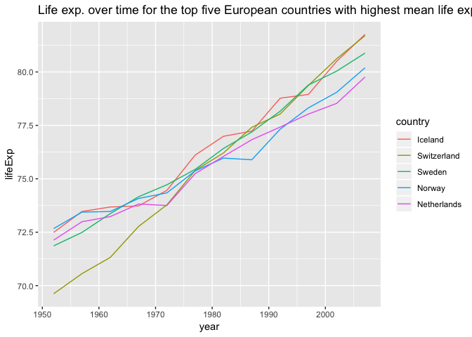

STAT545-HW05-factor-and-figure-management
================
Rachel Lobay
2018-10-13

Table of Contents:

-   [Load the gapminder data set](#load-the-gapminder-data-set)
-   [Part 1: Factor management](#part-1-factor-management)
    -   [Drop Oceania and remove unused factor levels](#drop-oceania-and-remove-unused-factor-levels)
    -   [Reorder the levels of countries in the forcats package](#reorder-the-levels-of-countries-in-the-forcats-package)
    -   [Experiment with the arrange() function](#experiment-with-the-arrange-function)
-   [Part 2: File I/O](#part-2-file-io)
-   [Part 3: Visualization design](#part-3-visualization-design)
-   [Part 4: Writing figures to file](#part-4-writing-figures-to-file)

Load the gapminder data set
===========================

I will be working with the gapminder data set for my final assignment for STAT545A. Since we are very familiarized with that data set because we have used it a lot in class and in previous assignments, I will skip introducing the data set.

``` r
library(gapminder) # laod gapminder data set
suppressPackageStartupMessages(library(tidyverse)) # tidyverse loads dplyr and forcats packages
```

Let's have a quick look at the head of the gapminder data set to remind ourselves what we are working with

``` r
head(gapminder) # view top six rows of gapminder data set
```

    ## # A tibble: 6 x 6
    ##   country     continent  year lifeExp      pop gdpPercap
    ##   <fct>       <fct>     <int>   <dbl>    <int>     <dbl>
    ## 1 Afghanistan Asia       1952    28.8  8425333      779.
    ## 2 Afghanistan Asia       1957    30.3  9240934      821.
    ## 3 Afghanistan Asia       1962    32.0 10267083      853.
    ## 4 Afghanistan Asia       1967    34.0 11537966      836.
    ## 5 Afghanistan Asia       1972    36.1 13079460      740.
    ## 6 Afghanistan Asia       1977    38.4 14880372      786.

Ok, so we can clearly see from using the head function that we have the factors, country, continent, year, lifeExp, pop and gdpPercap to work with.

``` r
gapminder %>% 
  str() # look at the structure of the gapminder data set
```

    ## Classes 'tbl_df', 'tbl' and 'data.frame':    1704 obs. of  6 variables:
    ##  $ country  : Factor w/ 142 levels "Afghanistan",..: 1 1 1 1 1 1 1 1 1 1 ...
    ##  $ continent: Factor w/ 5 levels "Africa","Americas",..: 3 3 3 3 3 3 3 3 3 3 ...
    ##  $ year     : int  1952 1957 1962 1967 1972 1977 1982 1987 1992 1997 ...
    ##  $ lifeExp  : num  28.8 30.3 32 34 36.1 ...
    ##  $ pop      : int  8425333 9240934 10267083 11537966 13079460 14880372 12881816 13867957 16317921 22227415 ...
    ##  $ gdpPercap: num  779 821 853 836 740 ...

In the str() function output for the gapminder data frame, focus in on the number of factor levels for continent. We can see there is currently 5 levels. Let's have a look at what exactly those levels are by using the levels() function

``` r
gapminder$continent %>% 
  levels() # see what the levels of gapminder$continent are.
```

    ## [1] "Africa"   "Americas" "Asia"     "Europe"   "Oceania"

We can see that the five levels are Africa, Americas, Asia, Europe, and Oceania. This will change below in Part 1 of HW05.

Part 1: Factor management
=========================

In this first part of the assignment, I will work with the gapminder data set. I have two major objectives, the first of which is to drop Oceania and remove unused factor levels. The second objective is to reorder the levels of the countries in the forcats package.

Drop Oceania and remove unused factor levels
--------------------------------------------

I will use the Base R: `droplevels()` which may operate on an entire data frame or a factor because all that I want to all entries related to Oceania in the gapminder data frame. To accomplish this, I must use the dplyr and forcats packages because I will be relying on various functions from those packages (as you will see below).

Next, I will filter all rows of the data frame for all continents but Oceania.

``` r
gap_no_Oceania <- gapminder %>% 
  filter(continent != "Oceania") # filters for rows for all continents but Oceania.
```

Now, I can simply use the base R, droplevels() function to drop the observations in the columns that have no observations. We can use the droplevels() function to act upon on our removal of the entries corresponding to Oceania. I chose to use the droplevels() function over the `forcats::fct_drop()` becauze droplevels() operates on either an entire data frame or a factor, while fct\_drop() only operates on a factor.

Note that we had to store the gap\_no\_Oceania into a variable (I just used gap\_no\_Oceania for simplicity) to make the droplevels() function result last and not just relative to the below code block.

``` r
gap_no_Oceania <- gap_no_Oceania %>% 
  droplevels() # if no observation in the column, then it drops the corresponding level

gap_no_Oceania %>%
  str() # continent only has levels Africa, Asia, and Europe and the countries of those guys
```

    ## Classes 'tbl_df', 'tbl' and 'data.frame':    1680 obs. of  6 variables:
    ##  $ country  : Factor w/ 140 levels "Afghanistan",..: 1 1 1 1 1 1 1 1 1 1 ...
    ##  $ continent: Factor w/ 4 levels "Africa","Americas",..: 3 3 3 3 3 3 3 3 3 3 ...
    ##  $ year     : int  1952 1957 1962 1967 1972 1977 1982 1987 1992 1997 ...
    ##  $ lifeExp  : num  28.8 30.3 32 34 36.1 ...
    ##  $ pop      : int  8425333 9240934 10267083 11537966 13079460 14880372 12881816 13867957 16317921 22227415 ...
    ##  $ gdpPercap: num  779 821 853 836 740 ...

By using the str() function, we can see that gap\_no\_Oceania now has four continent factor levels and not five as we saw originally.

Also, notice that we have 1680 observations of 6 variables in gap\_no\_Oceania. On the other hand, in the original gapminder data frame using the str() function, the output stated that there was 1704 obs. of 6 variables. So, some observations were removed when we used the combo of filter() and droplevels(), but the number of variables remained the same (which is what we wanted).

Let's check to see that Oceania was the continent factor level that was removed!

``` r
gap_no_Oceania$continent %>% 
  levels() # see what the levels of gap_no_Oceania$continent are.
```

    ## [1] "Africa"   "Americas" "Asia"     "Europe"

Success! We can see that we only have the four continents, Africa, Americas, Asia and Europe as our factor levels for continent. We no longer have Oceania as a factor level for continent. So we succeeded in dropping the unused level from the continent factor in the gapminder data frame.

We can also check that the countries corresponding to Oceania were dropped in gap\_no\_Oceania.

First, let's view the countries of Oceania from the gapminder data frame.

``` r
gapminder %>% 
  filter(continent == "Oceania") %>% 
  select(country) %>% 
  unique()  # see what the possible countries are in Oceania
```

    ## # A tibble: 2 x 1
    ##   country    
    ##   <fct>      
    ## 1 Australia  
    ## 2 New Zealand

Notice that the only countries corresponding to Oceania in the gapminder data frame are Australia and New Zealand. So, we would expect Australia and New Zealand to be missing in gap\_no\_Oceania$country.

``` r
gap_no_Oceania$country %>% 
  levels() # see what the levels of gap_no_Oceania$country are.
```

    ##   [1] "Afghanistan"              "Albania"                 
    ##   [3] "Algeria"                  "Angola"                  
    ##   [5] "Argentina"                "Austria"                 
    ##   [7] "Bahrain"                  "Bangladesh"              
    ##   [9] "Belgium"                  "Benin"                   
    ##  [11] "Bolivia"                  "Bosnia and Herzegovina"  
    ##  [13] "Botswana"                 "Brazil"                  
    ##  [15] "Bulgaria"                 "Burkina Faso"            
    ##  [17] "Burundi"                  "Cambodia"                
    ##  [19] "Cameroon"                 "Canada"                  
    ##  [21] "Central African Republic" "Chad"                    
    ##  [23] "Chile"                    "China"                   
    ##  [25] "Colombia"                 "Comoros"                 
    ##  [27] "Congo, Dem. Rep."         "Congo, Rep."             
    ##  [29] "Costa Rica"               "Cote d'Ivoire"           
    ##  [31] "Croatia"                  "Cuba"                    
    ##  [33] "Czech Republic"           "Denmark"                 
    ##  [35] "Djibouti"                 "Dominican Republic"      
    ##  [37] "Ecuador"                  "Egypt"                   
    ##  [39] "El Salvador"              "Equatorial Guinea"       
    ##  [41] "Eritrea"                  "Ethiopia"                
    ##  [43] "Finland"                  "France"                  
    ##  [45] "Gabon"                    "Gambia"                  
    ##  [47] "Germany"                  "Ghana"                   
    ##  [49] "Greece"                   "Guatemala"               
    ##  [51] "Guinea"                   "Guinea-Bissau"           
    ##  [53] "Haiti"                    "Honduras"                
    ##  [55] "Hong Kong, China"         "Hungary"                 
    ##  [57] "Iceland"                  "India"                   
    ##  [59] "Indonesia"                "Iran"                    
    ##  [61] "Iraq"                     "Ireland"                 
    ##  [63] "Israel"                   "Italy"                   
    ##  [65] "Jamaica"                  "Japan"                   
    ##  [67] "Jordan"                   "Kenya"                   
    ##  [69] "Korea, Dem. Rep."         "Korea, Rep."             
    ##  [71] "Kuwait"                   "Lebanon"                 
    ##  [73] "Lesotho"                  "Liberia"                 
    ##  [75] "Libya"                    "Madagascar"              
    ##  [77] "Malawi"                   "Malaysia"                
    ##  [79] "Mali"                     "Mauritania"              
    ##  [81] "Mauritius"                "Mexico"                  
    ##  [83] "Mongolia"                 "Montenegro"              
    ##  [85] "Morocco"                  "Mozambique"              
    ##  [87] "Myanmar"                  "Namibia"                 
    ##  [89] "Nepal"                    "Netherlands"             
    ##  [91] "Nicaragua"                "Niger"                   
    ##  [93] "Nigeria"                  "Norway"                  
    ##  [95] "Oman"                     "Pakistan"                
    ##  [97] "Panama"                   "Paraguay"                
    ##  [99] "Peru"                     "Philippines"             
    ## [101] "Poland"                   "Portugal"                
    ## [103] "Puerto Rico"              "Reunion"                 
    ## [105] "Romania"                  "Rwanda"                  
    ## [107] "Sao Tome and Principe"    "Saudi Arabia"            
    ## [109] "Senegal"                  "Serbia"                  
    ## [111] "Sierra Leone"             "Singapore"               
    ## [113] "Slovak Republic"          "Slovenia"                
    ## [115] "Somalia"                  "South Africa"            
    ## [117] "Spain"                    "Sri Lanka"               
    ## [119] "Sudan"                    "Swaziland"               
    ## [121] "Sweden"                   "Switzerland"             
    ## [123] "Syria"                    "Taiwan"                  
    ## [125] "Tanzania"                 "Thailand"                
    ## [127] "Togo"                     "Trinidad and Tobago"     
    ## [129] "Tunisia"                  "Turkey"                  
    ## [131] "Uganda"                   "United Kingdom"          
    ## [133] "United States"            "Uruguay"                 
    ## [135] "Venezuela"                "Vietnam"                 
    ## [137] "West Bank and Gaza"       "Yemen, Rep."             
    ## [139] "Zambia"                   "Zimbabwe"

``` r
# Let's if Australia and New Zealand are to be found in gap_no_Oceania$country.
gap_no_Oceania %>% 
  select(country) %>% 
  filter(country %in% c("Australia", "New Zealand")) # filters to Australia and New Zealand rows
```

    ## # A tibble: 0 x 1
    ## # ... with 1 variable: country <fct>

We can see that there are no rows in the resulting tibble. Hence, we have confirmed that tehre are no Australia and New Zealand rows that were found in gap\_no\_Oceania$country.

Reorder the levels of countries in the forcats package
------------------------------------------------------

Here, I will use the forcats package to change the order of the factor levels of a subset of countries in the gapminder data frame. I will base my reordering choice on the quantitative variable lifeExp. Additionally, instead of focusing on the plain ol' median lifeExp, I will use the mean to analyze the life expectancy differences of the countries. I will investigate just the gapminder data of Europe in the year of 2007 to keep the data to a minimum so we can focus on the analysis.

Now, we will load the ggplot2 package to do factor level reordering and display the results graphically.

``` r
library(ggplot2) # load ggplot2 package
```

Next, we will filter for just the rows of Europe in 2007 and display the life expectancy of the European countries in a scatterplot.

``` r
gap_europe_2007 <- gapminder %>% 
  filter(year == 2007, continent == "Europe") # filter the rows to keep just the data of Europe in 2007

ggplot(gap_europe_2007, aes(lifeExp, country)) + 
  geom_point() + # plot the plain old gap_europe_2007 to see the unordered chaos of points that result.
  ggtitle("Life exp. of the European countries in 2007") # add title
```


We can see the life expectancies are unordered. The above scatterplot looks rather chaotic and difficult to interpret.

So, we will now use the forcats package to manipulate the order of the factor levels of country specific to this subset of the gapminder data set.

Suppose that we wanted the mean to be in order in ascending or descending order. We will try that out below by employing the forcats package! We will use the `fct_reorder` function to do this because we want to reorder the factor levels by arranging according to another variable (in this case, weighted\_mean). Note that `fct_reorder()` by default orders by the median weighted lifeExp. By default, it computes a summary statistic (default: median) for each category in the factor. Note that our summary statistic will be the mean as we are specifying that as `.fun = mean` in the fct\_reorder() function.

``` r
gap_europe_2007 %>% 
  mutate(country = fct_reorder(country, lifeExp, .fun = mean)) %>% # reorder the European countries in 2007 by mean life Expectancy (more readable) in ascending order
  ggplot(aes(lifeExp, country)) + 
  geom_point() + # plot a scatterplot of the above
  ggtitle("Mean life exp. of European countries in 2007 (in ascending order)") # add title
```


The resulting scatterplot is much more organized and easy to interpret. For example, we can easily spot that Iceland has the highest mean life expetancy in 2007 of the European countries, which is just under 82 years old. In conclusion, we should probably all move to Iceland if we want to live long lives (just kidding).

We may set the parameter of the fct\_reorder() function to .desc = FALSE, but that is unnecessary because, by default fct\_reorder() orders from lowest to highest.

Now, we shall look use `fct_reorder` to view a graph of the contients ordered in descending order. Note that we did set .desc = TRUE to achieve that goal in a quick and easy way.

``` r
gap_europe_2007 %>% 
  mutate(country = fct_reorder(country, lifeExp, .fun = mean, .desc = TRUE)) %>% # reorder the European countries in 2007 by mean life Expectancy (more readable) in descending order
  ggplot(aes(lifeExp, country)) +
  geom_point() + # plot a scatterplot
  ggtitle("Mean life exp. of European countries in 2007 (in decreasing order)") # add title
```


The same information is conveyed as in the above scatterplot for the ascending order of the mean life expectancy of the European countries in 2007. So, we can still see that Iceland has the highest mean life expectancy at just under 82 years old and Turkey has the lowest mean life expectancy at just under 72 years old (for 2007). I should not that for this data, it probably makes more sense for the first scatterplot (in ascending order) for easy readability of the mean life expectancies of the European countries in 2007.

Now, suppose we wanted to hone in on the top five countries with high life expectancies (according to the results of our above scatterplots of the mean life expectancy of the European countries in 2007), which were Iceland, Switzerland, Spain, Sweden, and France. So let's create a subset of the data.

``` r
select_countries <- c("Iceland", "Switzerland", "Spain", "Sweden", "France")
gap_select <- gapminder %>%  # df of just the 5 countries
  filter(country %in% select_countries) %>% 
  droplevels() # drop unused levels

head(gap_select) # view the top six rows of our subset of the gapminder data frame
```

    ## # A tibble: 6 x 6
    ##   country continent  year lifeExp      pop gdpPercap
    ##   <fct>   <fct>     <int>   <dbl>    <int>     <dbl>
    ## 1 France  Europe     1952    67.4 42459667     7030.
    ## 2 France  Europe     1957    68.9 44310863     8663.
    ## 3 France  Europe     1962    70.5 47124000    10560.
    ## 4 France  Europe     1967    71.6 49569000    13000.
    ## 5 France  Europe     1972    72.4 51732000    16107.
    ## 6 France  Europe     1977    73.8 53165019    18293.

``` r
gap_select %>% 
  ggplot(aes(year, lifeExp)) +
  geom_line(aes(group=country, colour=country)) + # plot of life expectancy over time for those 5 countries
  ggtitle("Life expectancy over time for the top five European countries in 2007") # add title
```


Now, we will use `fct_reorder2(f, x, y)` to reorder factor `f`, which for our example would be country. The function looks at max year (x) value and takes corresponding life expectancy (y) value. It will reorder the countries according to the life expectancy at the very end.

``` r
 # Reorders the five European countries of gap_select according to the life expectancy at the very end.
gap_select %>% 
  mutate(country = fct_reorder2(country, year, lifeExp)) %>% 
ggplot(aes(year, lifeExp)) +
  geom_line(aes(colour=country)) + # plot of life expectancy over time for those 5 countries
  ggtitle("Life expectancy over time for the top five European countries in 2007") # add title
```


Notice that when we used `fct_reorder2()`, Iceland went first, then Switzerland, then Spain. This order corresponds to the order that we saw in the scatterplot of gap\_europe\_2007, which makes sense because we are reordering the five countries by their last life expectancy (which would be in 2007). That is a quick check to make sure that our code and output was what we expected.

Experiment with the arrange() function
--------------------------------------

I want to explore the arrange() function a little on the top five European countries in terms of life expectancy in 2007.

Let's print out the output for the five countries with the highest life expectancy in 2007.

``` r
gap_select_2007 <- gap_select %>%  
  filter(year %in% 2007) # tibble of just the 5 countries with the top life expectancy in the year 2007

gap_select_2007 # view the the gap_select_2007 tibble
```

    ## # A tibble: 5 x 6
    ##   country     continent  year lifeExp      pop gdpPercap
    ##   <fct>       <fct>     <int>   <dbl>    <int>     <dbl>
    ## 1 France      Europe     2007    80.7 61083916    30470.
    ## 2 Iceland     Europe     2007    81.8   301931    36181.
    ## 3 Spain       Europe     2007    80.9 40448191    28821.
    ## 4 Sweden      Europe     2007    80.9  9031088    33860.
    ## 5 Switzerland Europe     2007    81.7  7554661    37506.

We can arrange that data set in terms of increasing life expectancy. Let's do that below. Note that the following code is based on Jenny's from [here](https://www.stat.ubc.ca/~jenny/STAT545A/block08_bossYourFactors.html#specialty-functions-for-making-factors).

``` r
gap_select_2007_ascend <- within(gap_select_2007, country <- reorder(country, lifeExp, .fun = mean))

levels(gap_select_2007_ascend$country) # View the order of the levels of the countries. We expect them to be arranged in ascending order of lifeExp.
```

    ## [1] "France"      "Sweden"      "Spain"       "Switzerland" "Iceland"

However, we can see if we look at gap\_select\_2007\_ascend, the row order has not changed to be arranged in order of ascending mean lifeExp. Let's view it as a scatterplot to see this.

``` r
gap_select_2007_ascend %>% 
  ggplot(aes(lifeExp, country)) + 
  geom_point() + # plot a scatterplot of life expectancy versus country for the five European countries with the highest life expectancies in 2007
  ggtitle("Life expectancy vs. country for the top five European countries in 2007") # add title
```


So, the output is not what we want. We wanted the order to be France, Sweden, Spain, Switzerland and then Iceland to be in order of ascending life expectancy.

The arrange function comes to our rescue. This funciton from the plyr package lets us reorder the factor levels and make the new row order remain. As Jenny stated on her webpage (see the above link), the arrange function "is a nice wrapper around the built-in function order()".

``` r
gap_select_2007_ascend_arr <- arrange(gap_select_2007_ascend, country) 

gap_select_2007_ascend_arr %>% # use the arrange function to display the countries in order of ascending life expectancy
  ggplot(aes(lifeExp, country)) + 
  geom_point() + # plot a scatterplot of life expectancy versus country for the five countries with the highest  life expectancies in 2007
  ggtitle("Life expectancy vs. country for the top five European countries in 2007") # add title
```


Perfect. That scatterplot is exactly what we wanted. The European countries are now arranged according in ascending order of life expectancy in 2007.

Part 2: File I/O
================

I will experiment with write\_csv()/read\_csv(). Since we have already played with and filtered to get the five countries with the highest life expectancy in 2007 in the gapminder data frame, we will use what we have and see how it does when we write a csv of it. We will look at both versions, when the the rows are alphabetically ordered by country and when the rows are in ascending order of life expectancy in 2007.

First, we will look at the gap\_select\_2007, which was the output for the five countries with the highest life expectancy in 2007 and the rows are alphabetically ordered by country.

``` r
# Write gap_select_2007.csv 
write.csv(gap_select_2007, file = "gap_select_2007.csv") 

# Read in gap_select_2007.csv 
gap_select_2007_read <- read.csv("gap_select_2007.csv") 

gap_select_2007_read # view the read-in gap_select_2007.csv
```

    ##   X     country continent year lifeExp      pop gdpPercap
    ## 1 1      France    Europe 2007  80.657 61083916  30470.02
    ## 2 2     Iceland    Europe 2007  81.757   301931  36180.79
    ## 3 3       Spain    Europe 2007  80.941 40448191  28821.06
    ## 4 4      Sweden    Europe 2007  80.884  9031088  33859.75
    ## 5 5 Switzerland    Europe 2007  81.701  7554661  37506.42

We see that we have still retained the same alphabetical order by country. All six variables that were originally in gap\_select\_2007, which were country, continent, year, lifeExp, pop and gdpPercap are still there and their values have not changed. The only major difference that I can spot is that we now have a new column X which has five entries ranging from 1 to 5. Why is that happening? One explanation that I found from [here](https://stackoverflow.com/questions/10441437/why-am-i-getting-x-in-my-column-names-when-reading-a-data-frame) states that "read.csv() is a wrapper around the more general read.table() function". The behavior of adding a new column with an X header is consistent with the behaviour of the read.table() function. If we don't want this to happen, we can try to add `row.names = FALSE` to the write.csv() function to override that behaviour of adding an extra column for the rows with 1 to 5. Let's try that and see if we can get just the variables that we want.

``` r
# Write gap_select_2007.csv 
write.csv(gap_select_2007, file = "gap_select_2007_2.csv", row.names=FALSE) 

# Read in gap_select_2007.csv 
gap_select_2007_read_2 <- read.csv("gap_select_2007_2.csv") 

gap_select_2007_read_2 # let's see what we got when we read in the CSV
```

    ##       country continent year lifeExp      pop gdpPercap
    ## 1      France    Europe 2007  80.657 61083916  30470.02
    ## 2     Iceland    Europe 2007  81.757   301931  36180.79
    ## 3       Spain    Europe 2007  80.941 40448191  28821.06
    ## 4      Sweden    Europe 2007  80.884  9031088  33859.75
    ## 5 Switzerland    Europe 2007  81.701  7554661  37506.42

Excellent, that is precisely what we want. The gap\_select\_2007\_read\_2 looks exactly like gap\_select\_2007.

Next, I will look at the when the rows are in ascending order of life expectancy in 2007. In particular, we should look to see if the rows are still arranged in order of ascending life expectancy when we read in the CSV.

``` r
# Write gap_select_2007_ascend_arr.csv
write.csv(gap_select_2007_ascend_arr, file = "gap_select_2007_ascend_arr.csv", row.names=FALSE) 

# Read in gap_select_2007_ascend_arr.csv
gap_select_2007_ascend_arr <- read.csv("gap_select_2007_ascend_arr.csv") 

gap_select_2007_ascend_arr # let's see what we got when we read in the CSV
```

    ##       country continent year lifeExp      pop gdpPercap
    ## 1      France    Europe 2007  80.657 61083916  30470.02
    ## 2      Sweden    Europe 2007  80.884  9031088  33859.75
    ## 3       Spain    Europe 2007  80.941 40448191  28821.06
    ## 4 Switzerland    Europe 2007  81.701  7554661  37506.42
    ## 5     Iceland    Europe 2007  81.757   301931  36180.79

Interesting. We had gap\_select\_2007\_ascend\_arr in order of ascending life expectancy and when we import the CSV file that we wrote using that data, the row order was preserved.

That certainly makes working with that data easier. We don't have to use the rearrange the data once we import it (well, for this example we don't... other data sets may require data rearrangement).

Part 3: Visualization design
============================

In the previous HW03 for this course, I tried to use gganimate, which is one kind of package that can enhance ggplot2 by animating ggplot2 graphics. I will try to explore that again and see if, with a better understanding of ggplot2, I can create a plot that is both informative and that more effectively uses the gganimate package.

First, I will load the required packages to use gganimate the way I want to with ggplot2.

``` r
library(devtools) # load devtools package

devtools::install_github('thomasp85/gganimate') # install gganimate package this way because it is not installing when we use the install.packages() function with R 3.5.1. Also, gganimate is Github-based (not based on CRAN).

library(gganimate) # laod gganimate package
```

Next, I will show what I made in HW03 by using ggnimate. The following plot/animation illustrates a line chart over time of the mean gdpPercap of Singapore, Kuwait, and Hong Kong. I chose to follow the gdpPercap of those three places over time because they had a high mean GDP per capita of over 25,000 PPP dollars in 2007 (I explored that more in HW03). I thought that revealing the meaan gdpPercap over time would be interesting because then you don't see the whole picture immediately. You can focus more on how the mean gdpPercap got there.

``` r
library(transformr) # load transformr package to draw line

lifeExp.bycontyr <- gapminder %>% 
  select(country, year, gdpPercap) %>% # only select country, year, and gdpPercap columns
  filter((country == "Kuwait" | country == "Singapore" | country == "Hong Kong, China") & year <= 1992) %>%
  group_by(country, year) %>% # group by country and year
  mutate(meangdp = mean(gdpPercap)) %>% # add mean gdpPercap columnr
  ggplot(aes(x =  year, y = meangdp, color = country, group = country)) +
  geom_path(size = 2, alpha = 0.4, arrow = arrow()) + # lines of the mean gdpPercap of the 3 countries over the years
  # gganimate code parts are below 
  transition_reveal(year, year) # transitions are the years

lifeExp.bycontyr # let's see the animation!
```


One of the problems that I encountered with this animation was that it ran at a decent speed on my RStudio, but when I pushed it to Github, the animation ran at a snail's pace. I was bummed to learn that there wasn't an quick and easy fix to this becaue the transition\_reveal() is still being worked on. So, I left it at that.

Now, I am aiming to display different information from the gapminder data set and use the gganimate package. What I want to display is how the GDP per capita and populations of Americas and Europe changed over time. The size of the points corresponds to the mean gdpPercap at that time. For the base of the following code, see [here](https://github.com/thomasp85/gganimate).

``` r
Am_Euro_gap <- gapminder %>% 
filter(continent == "Americas" | continent == "Europe") %>% 
group_by(continent, year) %>% # group by continent and year
mutate(meangdp = mean(gdpPercap)) # add mean gdpPercap columnn

Am_Euro_gap_ggplot2 <- Am_Euro_gap %>% 
ggplot(aes(pop, gdpPercap, size = meangdp, colour = country)) +
  scale_colour_manual(values = country_colors) +
  scale_size(range = c(2, 12)) +
  geom_point(alpha = 0.8, show.legend = FALSE) +
  scale_x_log10() + # scale the gdpPercap by log10
  facet_wrap(~ continent) # facet_wrap by continent
  
  Am_Euro_gap_ggplot2 + 
  # gganimate code parts are below 
  labs(title = 'Year: {frame_time}', x = 'population', y = 'GDP per capita') +
  transition_time(year) +
  ease_aes('linear')
```


This side-by-side animated plot gives us a feel for how the population vs GDP per capita changed over time for Americas and Europe. It is more general than precise. It allows us to see general patterns, and then we could construct more specific plots for the patterns that we wish to examine.

We can see a couple things right off the bat on the plot. Overall, we can see that as the populations increase, the European countries tyipically have a higher GDP per capita than the countries from the Americas as the years go by. Also note that the size of the points for Europe quickly get much larger than the Americas, meaning that the mean GDP per capita of the European countries gets larger than the Americas countries over time. Another thing to note is that it appears that the GDP per capita of the European countries rise relatively close together as as the population of the European countries stabilizes. On the other hand, for the GDP per capita of the Americas countries, there appears to be two countries which have a relatively stable high population and for which their GDP per capita rise above the rest. Another related observation about the Americas is that the population of the majority of the countries increases over time but their GDP per capita does not get nearly as large as the two countries whose GDP per capita rose above the rest.

We can try to use use the plotly package to accomplish something similar to what gganimate did. Let's examine how exactly the plot produced by plotly differs from the plot that we produced using gganimate.

``` r
suppressPackageStartupMessages(library(plotly)) # load plotly package
```

First, we can try the easy option and just use ggplotly on Am\_Euro\_gap\_ggplot to see what we get.

``` r
ggplotly(Am_Euro_gap_ggplot2) # ggplotly Am_Euro_gap_ggplot2 to see what we get.
```

    ## PhantomJS not found. You can install it with webshot::install_phantomjs(). If it is installed, please make sure the phantomjs executable can be found via the PATH variable.

<!--html_preserve-->

<script type="application/json" data-for="htmlwidget-a8d68bfbad5f2f2abbe0">{"x":{"data":[{"x":[6.10812407900229,6.16923492198768,6.23757816869007,6.29755480152527,6.35479085960984,6.39950896977843,6.44405994909427,6.48789045385217,6.52198726667002,6.53504562745736,6.54512296626454,6.55636558952193],"y":[1601.056136,1942.284244,2312.888958,2760.196931,3313.422188,3533.00391,3630.880722,3738.932735,2497.437901,3193.054604,4604.211737,5937.029526],"text":["pop:   1282697<br />gdpPercap:  1601.0561<br />meangdp:  5661.057<br />country: Albania","pop:   1476505<br />gdpPercap:  1942.2842<br />meangdp:  6963.013<br />country: Albania","pop:   1728137<br />gdpPercap:  2312.8890<br />meangdp:  8365.487<br />country: Albania","pop:   1984060<br />gdpPercap:  2760.1969<br />meangdp: 10143.824<br />country: Albania","pop:   2263554<br />gdpPercap:  3313.4222<br />meangdp: 12479.575<br />country: Albania","pop:   2509048<br />gdpPercap:  3533.0039<br />meangdp: 14283.979<br />country: Albania","pop:   2780097<br />gdpPercap:  3630.8807<br />meangdp: 15617.897<br />country: Albania","pop:   3075321<br />gdpPercap:  3738.9327<br />meangdp: 17214.311<br />country: Albania","pop:   3326498<br />gdpPercap:  2497.4379<br />meangdp: 17061.568<br />country: Albania","pop:   3428038<br />gdpPercap:  3193.0546<br />meangdp: 19076.782<br />country: Albania","pop:   3508512<br />gdpPercap:  4604.2117<br />meangdp: 21711.732<br />country: Albania","pop:   3600523<br />gdpPercap:  5937.0295<br />meangdp: 25054.482<br />country: Albania"],"type":"scatter","mode":"markers","marker":{"autocolorscale":false,"color":"rgba(210,236,177,1)","opacity":0.8,"size":[17.9387534155481,21.573505691986,24.6446368506997,27.8821126143134,31.4776183995289,33.9215751080984,35.5916406438721,37.4680166665456,37.293610658979,39.5181744128755,42.2120864548206,45.3543307086614],"symbol":"circle","line":{"width":1.88976377952756,"color":"rgba(210,236,177,1)"}},"hoveron":"points","name":"Albania","legendgroup":"Albania","showlegend":true,"xaxis":"x2","yaxis":"y","hoverinfo":"text","frame":null},{"x":[7.25229357123016,7.2924895083657,7.32804882240158,7.36048406891054,7.39409777929812,7.43110355991517,7.4674804471571,7.49997447396264,7.53095421516498,7.55875011445191,7.58355152045433,7.60532581203339],"y":[5911.315053,6856.856212,7133.166023,8052.953021,9443.038526,10079.02674,8997.897412,9139.671389,9308.41871,10967.28195,8797.640716,12779.37964],"text":["pop:  17876956<br />gdpPercap:  5911.3151<br />meangdp:  4079.063<br />country: Argentina","pop:  19610538<br />gdpPercap:  6856.8562<br />meangdp:  4616.044<br />country: Argentina","pop:  21283783<br />gdpPercap:  7133.1660<br />meangdp:  4901.542<br />country: Argentina","pop:  22934225<br />gdpPercap:  8052.9530<br />meangdp:  5668.253<br />country: Argentina","pop:  24779799<br />gdpPercap:  9443.0385<br />meangdp:  6491.334<br />country: Argentina","pop:  26983828<br />gdpPercap: 10079.0267<br />meangdp:  7352.007<br />country: Argentina","pop:  29341374<br />gdpPercap:  8997.8974<br />meangdp:  7506.737<br />country: Argentina","pop:  31620918<br />gdpPercap:  9139.6714<br />meangdp:  7793.400<br />country: Argentina","pop:  33958947<br />gdpPercap:  9308.4187<br />meangdp:  8044.934<br />country: Argentina","pop:  36203463<br />gdpPercap: 10967.2820<br />meangdp:  8889.301<br />country: Argentina","pop:  38331121<br />gdpPercap:  8797.6407<br />meangdp:  9287.677<br />country: Argentina","pop:  40301927<br />gdpPercap: 12779.3796<br />meangdp: 11003.032<br />country: Argentina"],"type":"scatter","mode":"markers","marker":{"autocolorscale":false,"color":"rgba(198,32,38,1)","opacity":0.8,"size":[7.55905511811024,13.6063580686985,15.0432430812763,17.9623338326022,20.3763180602178,22.4887701560541,22.8375995723122,23.4636600872571,23.993367266896,25.6585097704948,26.3930870838704,29.2740510713326],"symbol":"circle","line":{"width":1.88976377952756,"color":"rgba(198,32,38,1)"}},"hoveron":"points","name":"Argentina","legendgroup":"Argentina","showlegend":true,"xaxis":"x","yaxis":"y","hoverinfo":"text","frame":null},{"x":[6.84059358617279,6.84297474175035,6.85308124589494,6.86787966571552,6.87761325078282,6.87900579851558,6.87936044888946,6.8796063487027,6.89844921823119,6.90686686149661,6.91106764984263,6.9138023593167],"y":[6137.076492,8842.59803,10750.72111,12834.6024,16661.6256,19749.4223,21597.08362,23687.82607,27042.01868,29095.92066,32417.60769,36126.4927],"text":["pop:   6927772<br />gdpPercap:  6137.0765<br />meangdp:  5661.057<br />country: Austria","pop:   6965860<br />gdpPercap:  8842.5980<br />meangdp:  6963.013<br />country: Austria","pop:   7129864<br />gdpPercap: 10750.7211<br />meangdp:  8365.487<br />country: Austria","pop:   7376998<br />gdpPercap: 12834.6024<br />meangdp: 10143.824<br />country: Austria","pop:   7544201<br />gdpPercap: 16661.6256<br />meangdp: 12479.575<br />country: Austria","pop:   7568430<br />gdpPercap: 19749.4223<br />meangdp: 14283.979<br />country: Austria","pop:   7574613<br />gdpPercap: 21597.0836<br />meangdp: 15617.897<br />country: Austria","pop:   7578903<br />gdpPercap: 23687.8261<br />meangdp: 17214.311<br />country: Austria","pop:   7914969<br />gdpPercap: 27042.0187<br />meangdp: 17061.568<br />country: Austria","pop:   8069876<br />gdpPercap: 29095.9207<br />meangdp: 19076.782<br />country: Austria","pop:   8148312<br />gdpPercap: 32417.6077<br />meangdp: 21711.732<br />country: Austria","pop:   8199783<br />gdpPercap: 36126.4927<br />meangdp: 25054.482<br />country: Austria"],"type":"scatter","mode":"markers","marker":{"autocolorscale":false,"color":"rgba(146,200,88,1)","opacity":0.8,"size":[17.9387534155481,21.573505691986,24.6446368506997,27.8821126143134,31.4776183995289,33.9215751080984,35.5916406438721,37.4680166665456,37.293610658979,39.5181744128755,42.2120864548206,45.3543307086614],"symbol":"circle","line":{"width":1.88976377952756,"color":"rgba(146,200,88,1)"}},"hoveron":"points","name":"Austria","legendgroup":"Austria","showlegend":true,"xaxis":"x2","yaxis":"y","hoverinfo":"text","frame":null},{"x":[6.94103439092039,6.95371674324765,6.96465554887678,6.98029886413772,6.9871789741769,6.99219108640516,6.99371404599784,6.99432595287393,7.00197683235402,7.00859110257657,7.01334164088012,7.01670858278068],"y":[8343.105127,9714.960623,10991.20676,13149.04119,16672.14356,19117.97448,20979.84589,22525.56308,25575.57069,27561.19663,30485.88375,33692.60508],"text":["pop:   8730405<br />gdpPercap:  8343.1051<br />meangdp:  5661.057<br />country: Belgium","pop:   8989111<br />gdpPercap:  9714.9606<br />meangdp:  6963.013<br />country: Belgium","pop:   9218400<br />gdpPercap: 10991.2068<br />meangdp:  8365.487<br />country: Belgium","pop:   9556500<br />gdpPercap: 13149.0412<br />meangdp: 10143.824<br />country: Belgium","pop:   9709100<br />gdpPercap: 16672.1436<br />meangdp: 12479.575<br />country: Belgium","pop:   9821800<br />gdpPercap: 19117.9745<br />meangdp: 14283.979<br />country: Belgium","pop:   9856303<br />gdpPercap: 20979.8459<br />meangdp: 15617.897<br />country: Belgium","pop:   9870200<br />gdpPercap: 22525.5631<br />meangdp: 17214.311<br />country: Belgium","pop:  10045622<br />gdpPercap: 25575.5707<br />meangdp: 17061.568<br />country: Belgium","pop:  10199787<br />gdpPercap: 27561.1966<br />meangdp: 19076.782<br />country: Belgium","pop:  10311970<br />gdpPercap: 30485.8838<br />meangdp: 21711.732<br />country: Belgium","pop:  10392226<br />gdpPercap: 33692.6051<br />meangdp: 25054.482<br />country: Belgium"],"type":"scatter","mode":"markers","marker":{"autocolorscale":false,"color":"rgba(109,173,53,1)","opacity":0.8,"size":[17.9387534155481,21.573505691986,24.6446368506997,27.8821126143134,31.4776183995289,33.9215751080984,35.5916406438721,37.4680166665456,37.293610658979,39.5181744128755,42.2120864548206,45.3543307086614],"symbol":"circle","line":{"width":1.88976377952756,"color":"rgba(109,173,53,1)"}},"hoveron":"points","name":"Belgium","legendgroup":"Belgium","showlegend":true,"xaxis":"x2","yaxis":"y","hoverinfo":"text","frame":null},{"x":[6.45989209132637,6.50674011014488,6.55556816388209,6.60645284581946,6.65952373228061,6.70583943214993,6.75145032393789,6.78932464265084,6.83843669288617,6.88610634551002,6.92660654496669,6.95995445468329],"y":[2677.326347,2127.686326,2180.972546,2586.886053,2980.331339,3548.097832,3156.510452,2753.69149,2961.699694,3326.143191,3413.26269,3822.137084],"text":["pop:   2883315<br />gdpPercap:  2677.3263<br />meangdp:  4079.063<br />country: Bolivia","pop:   3211738<br />gdpPercap:  2127.6863<br />meangdp:  4616.044<br />country: Bolivia","pop:   3593918<br />gdpPercap:  2180.9725<br />meangdp:  4901.542<br />country: Bolivia","pop:   4040665<br />gdpPercap:  2586.8861<br />meangdp:  5668.253<br />country: Bolivia","pop:   4565872<br />gdpPercap:  2980.3313<br />meangdp:  6491.334<br />country: Bolivia","pop:   5079716<br />gdpPercap:  3548.0978<br />meangdp:  7352.007<br />country: Bolivia","pop:   5642224<br />gdpPercap:  3156.5105<br />meangdp:  7506.737<br />country: Bolivia","pop:   6156369<br />gdpPercap:  2753.6915<br />meangdp:  7793.400<br />country: Bolivia","pop:   6893451<br />gdpPercap:  2961.6997<br />meangdp:  8044.934<br />country: Bolivia","pop:   7693188<br />gdpPercap:  3326.1432<br />meangdp:  8889.301<br />country: Bolivia","pop:   8445134<br />gdpPercap:  3413.2627<br />meangdp:  9287.677<br />country: Bolivia","pop:   9119152<br />gdpPercap:  3822.1371<br />meangdp: 11003.032<br />country: Bolivia"],"type":"scatter","mode":"markers","marker":{"autocolorscale":false,"color":"rgba(245,119,72,1)","opacity":0.8,"size":[7.55905511811024,13.6063580686985,15.0432430812763,17.9623338326022,20.3763180602178,22.4887701560541,22.8375995723122,23.4636600872571,23.993367266896,25.6585097704948,26.3930870838704,29.2740510713326],"symbol":"circle","line":{"width":1.88976377952756,"color":"rgba(245,119,72,1)"}},"hoveron":"points","name":"Bolivia","legendgroup":"Bolivia","showlegend":true,"xaxis":"x","yaxis":"y","hoverinfo":"text","frame":null},{"x":[6.44575983648863,6.48798633112939,6.52491514753987,6.55448916000382,6.58194965837332,6.61129836229643,6.62041643328335,6.63738734803206,6.62900294584236,6.55714614231836,6.61965838088869,6.65822114364125],"y":[973.5331948,1353.989176,1709.683679,2172.352423,2860.16975,3528.481305,4126.613157,4314.114757,2546.781445,4766.355904,6018.975239,7446.298803],"text":["pop:   2791000<br />gdpPercap:   973.5332<br />meangdp:  5661.057<br />country: Bosnia and Herzegovina","pop:   3076000<br />gdpPercap:  1353.9892<br />meangdp:  6963.013<br />country: Bosnia and Herzegovina","pop:   3349000<br />gdpPercap:  1709.6837<br />meangdp:  8365.487<br />country: Bosnia and Herzegovina","pop:   3585000<br />gdpPercap:  2172.3524<br />meangdp: 10143.824<br />country: Bosnia and Herzegovina","pop:   3819000<br />gdpPercap:  2860.1698<br />meangdp: 12479.575<br />country: Bosnia and Herzegovina","pop:   4086000<br />gdpPercap:  3528.4813<br />meangdp: 14283.979<br />country: Bosnia and Herzegovina","pop:   4172693<br />gdpPercap:  4126.6132<br />meangdp: 15617.897<br />country: Bosnia and Herzegovina","pop:   4338977<br />gdpPercap:  4314.1148<br />meangdp: 17214.311<br />country: Bosnia and Herzegovina","pop:   4256013<br />gdpPercap:  2546.7814<br />meangdp: 17061.568<br />country: Bosnia and Herzegovina","pop:   3607000<br />gdpPercap:  4766.3559<br />meangdp: 19076.782<br />country: Bosnia and Herzegovina","pop:   4165416<br />gdpPercap:  6018.9752<br />meangdp: 21711.732<br />country: Bosnia and Herzegovina","pop:   4552198<br />gdpPercap:  7446.2988<br />meangdp: 25054.482<br />country: Bosnia and Herzegovina"],"type":"scatter","mode":"markers","marker":{"autocolorscale":false,"color":"rgba(191,228,146,1)","opacity":0.8,"size":[17.9387534155481,21.573505691986,24.6446368506997,27.8821126143134,31.4776183995289,33.9215751080984,35.5916406438721,37.4680166665456,37.293610658979,39.5181744128755,42.2120864548206,45.3543307086614],"symbol":"circle","line":{"width":1.88976377952756,"color":"rgba(191,228,146,1)"}},"hoveron":"points","name":"Bosnia and Herzegovina","legendgroup":"Bosnia and Herzegovina","showlegend":true,"xaxis":"x2","yaxis":"y","hoverinfo":"text","frame":null},{"x":[7.75283607374536,7.81658045429149,7.88103862422843,7.94472848727433,8.00363308679688,8.0580992354048,8.11046492192487,8.15514793203822,8.19305770628512,8.22672030278363,8.25506547101309,8.27877793676229],"y":[2108.944355,2487.365989,3336.585802,3429.864357,4985.711467,6660.118654,7030.835878,7807.095818,6950.283021,7957.980824,8131.212843,9065.800825],"text":["pop:  56602560<br />gdpPercap:  2108.9444<br />meangdp:  4079.063<br />country: Brazil","pop:  65551171<br />gdpPercap:  2487.3660<br />meangdp:  4616.044<br />country: Brazil","pop:  76039390<br />gdpPercap:  3336.5858<br />meangdp:  4901.542<br />country: Brazil","pop:  88049823<br />gdpPercap:  3429.8644<br />meangdp:  5668.253<br />country: Brazil","pop: 100840058<br />gdpPercap:  4985.7115<br />meangdp:  6491.334<br />country: Brazil","pop: 114313951<br />gdpPercap:  6660.1187<br />meangdp:  7352.007<br />country: Brazil","pop: 128962939<br />gdpPercap:  7030.8359<br />meangdp:  7506.737<br />country: Brazil","pop: 142938076<br />gdpPercap:  7807.0958<br />meangdp:  7793.400<br />country: Brazil","pop: 155975974<br />gdpPercap:  6950.2830<br />meangdp:  8044.934<br />country: Brazil","pop: 168546719<br />gdpPercap:  7957.9808<br />meangdp:  8889.301<br />country: Brazil","pop: 179914212<br />gdpPercap:  8131.2128<br />meangdp:  9287.677<br />country: Brazil","pop: 190010647<br />gdpPercap:  9065.8008<br />meangdp: 11003.032<br />country: Brazil"],"type":"scatter","mode":"markers","marker":{"autocolorscale":false,"color":"rgba(173,8,38,1)","opacity":0.8,"size":[7.55905511811024,13.6063580686985,15.0432430812763,17.9623338326022,20.3763180602178,22.4887701560541,22.8375995723122,23.4636600872571,23.993367266896,25.6585097704948,26.3930870838704,29.2740510713326],"symbol":"circle","line":{"width":1.88976377952756,"color":"rgba(173,8,38,1)"}},"hoveron":"points","name":"Brazil","legendgroup":"Brazil","showlegend":true,"xaxis":"x","yaxis":"y","hoverinfo":"text","frame":null},{"x":[6.86182702793332,6.88373261955217,6.90379221599936,6.91961283476104,6.93329490036684,6.94433567807589,6.94900424042199,6.9528872318736,6.93744296223327,6.90666128668945,6.88433075449437,6.86468061266828],"y":[2444.286648,3008.670727,4254.337839,5577.0028,6597.494398,7612.240438,8224.191647,8239.854824,6302.623438,5970.38876,7696.777725,10680.79282],"text":["pop:   7274900<br />gdpPercap:  2444.2866<br />meangdp:  5661.057<br />country: Bulgaria","pop:   7651254<br />gdpPercap:  3008.6707<br />meangdp:  6963.013<br />country: Bulgaria","pop:   8012946<br />gdpPercap:  4254.3378<br />meangdp:  8365.487<br />country: Bulgaria","pop:   8310226<br />gdpPercap:  5577.0028<br />meangdp: 10143.824<br />country: Bulgaria","pop:   8576200<br />gdpPercap:  6597.4944<br />meangdp: 12479.575<br />country: Bulgaria","pop:   8797022<br />gdpPercap:  7612.2404<br />meangdp: 14283.979<br />country: Bulgaria","pop:   8892098<br />gdpPercap:  8224.1916<br />meangdp: 15617.897<br />country: Bulgaria","pop:   8971958<br />gdpPercap:  8239.8548<br />meangdp: 17214.311<br />country: Bulgaria","pop:   8658506<br />gdpPercap:  6302.6234<br />meangdp: 17061.568<br />country: Bulgaria","pop:   8066057<br />gdpPercap:  5970.3888<br />meangdp: 19076.782<br />country: Bulgaria","pop:   7661799<br />gdpPercap:  7696.7777<br />meangdp: 21711.732<br />country: Bulgaria","pop:   7322858<br />gdpPercap: 10680.7928<br />meangdp: 25054.482<br />country: Bulgaria"],"type":"scatter","mode":"markers","marker":{"autocolorscale":false,"color":"rgba(138,195,79,1)","opacity":0.8,"size":[17.9387534155481,21.573505691986,24.6446368506997,27.8821126143134,31.4776183995289,33.9215751080984,35.5916406438721,37.4680166665456,37.293610658979,39.5181744128755,42.2120864548206,45.3543307086614],"symbol":"circle","line":{"width":1.88976377952756,"color":"rgba(138,195,79,1)"}},"hoveron":"points","name":"Bulgaria","legendgroup":"Bulgaria","showlegend":true,"xaxis":"x2","yaxis":"y","hoverinfo":"text","frame":null},{"x":[7.16983848293508,7.23070824547897,7.27843002248034,7.31847586488727,7.34800289421412,7.37651126048543,7.40143328397242,7.42405961810748,7.45520284537011,7.48152636903094,7.50382155907198,7.52361825299845],"y":[11367.16112,12489.95006,13462.48555,16076.58803,18970.57086,22090.88306,22898.79214,26626.51503,26342.88426,28954.92589,33328.96507,36319.23501],"text":["pop:  14785584<br />gdpPercap: 11367.1611<br />meangdp:  4079.063<br />country: Canada","pop:  17010154<br />gdpPercap: 12489.9501<br />meangdp:  4616.044<br />country: Canada","pop:  18985849<br />gdpPercap: 13462.4855<br />meangdp:  4901.542<br />country: Canada","pop:  20819767<br />gdpPercap: 16076.5880<br />meangdp:  5668.253<br />country: Canada","pop:  22284500<br />gdpPercap: 18970.5709<br />meangdp:  6491.334<br />country: Canada","pop:  23796400<br />gdpPercap: 22090.8831<br />meangdp:  7352.007<br />country: Canada","pop:  25201900<br />gdpPercap: 22898.7921<br />meangdp:  7506.737<br />country: Canada","pop:  26549700<br />gdpPercap: 26626.5150<br />meangdp:  7793.400<br />country: Canada","pop:  28523502<br />gdpPercap: 26342.8843<br />meangdp:  8044.934<br />country: Canada","pop:  30305843<br />gdpPercap: 28954.9259<br />meangdp:  8889.301<br />country: Canada","pop:  31902268<br />gdpPercap: 33328.9651<br />meangdp:  9287.677<br />country: Canada","pop:  33390141<br />gdpPercap: 36319.2350<br />meangdp: 11003.032<br />country: Canada"],"type":"scatter","mode":"markers","marker":{"autocolorscale":false,"color":"rgba(206,39,38,1)","opacity":0.8,"size":[7.55905511811024,13.6063580686985,15.0432430812763,17.9623338326022,20.3763180602178,22.4887701560541,22.8375995723122,23.4636600872571,23.993367266896,25.6585097704948,26.3930870838704,29.2740510713326],"symbol":"circle","line":{"width":1.88976377952756,"color":"rgba(206,39,38,1)"}},"hoveron":"points","name":"Canada","legendgroup":"Canada","showlegend":true,"xaxis":"x","yaxis":"y","hoverinfo":"text","frame":null},{"x":[6.80465857085865,6.84809214453258,6.90098169830183,6.94738019154818,6.98755562190991,7.02529738414821,7.06021085548407,7.09563493057993,7.13267565711127,7.16435074379929,7.19024892215974,7.21178085573692],"y":[3939.978789,4315.622723,4519.094331,5106.654313,5494.024437,4756.763836,5095.665738,5547.063754,7596.125964,10118.05318,10778.78385,13171.63885],"text":["pop:   6377619<br />gdpPercap:  3939.9788<br />meangdp:  4079.063<br />country: Chile","pop:   7048426<br />gdpPercap:  4315.6227<br />meangdp:  4616.044<br />country: Chile","pop:   7961258<br />gdpPercap:  4519.0943<br />meangdp:  4901.542<br />country: Chile","pop:   8858908<br />gdpPercap:  5106.6543<br />meangdp:  5668.253<br />country: Chile","pop:   9717524<br />gdpPercap:  5494.0244<br />meangdp:  6491.334<br />country: Chile","pop:  10599793<br />gdpPercap:  4756.7638<br />meangdp:  7352.007<br />country: Chile","pop:  11487112<br />gdpPercap:  5095.6657<br />meangdp:  7506.737<br />country: Chile","pop:  12463354<br />gdpPercap:  5547.0638<br />meangdp:  7793.400<br />country: Chile","pop:  13572994<br />gdpPercap:  7596.1260<br />meangdp:  8044.934<br />country: Chile","pop:  14599929<br />gdpPercap: 10118.0532<br />meangdp:  8889.301<br />country: Chile","pop:  15497046<br />gdpPercap: 10778.7838<br />meangdp:  9287.677<br />country: Chile","pop:  16284741<br />gdpPercap: 13171.6388<br />meangdp: 11003.032<br />country: Chile"],"type":"scatter","mode":"markers","marker":{"autocolorscale":false,"color":"rgba(224,68,48,1)","opacity":0.8,"size":[7.55905511811024,13.6063580686985,15.0432430812763,17.9623338326022,20.3763180602178,22.4887701560541,22.8375995723122,23.4636600872571,23.993367266896,25.6585097704948,26.3930870838704,29.2740510713326],"symbol":"circle","line":{"width":1.88976377952756,"color":"rgba(224,68,48,1)"}},"hoveron":"points","name":"Chile","legendgroup":"Chile","showlegend":true,"xaxis":"x","yaxis":"y","hoverinfo":"text","frame":null},{"x":[7.09169406938468,7.16094827100262,7.23070137745535,7.29587543851545,7.35300959186078,7.39957702396121,7.44349210929331,7.49086049508897,7.53406065776018,7.57585529055642,7.61287099287291,7.64569288214711],"y":[2144.115096,2323.805581,2492.351109,2678.729839,3264.660041,3815.80787,4397.575659,4903.2191,5444.648617,6117.361746,5755.259962,7006.580419],"text":["pop:  12350771<br />gdpPercap:  2144.1151<br />meangdp:  4079.063<br />country: Colombia","pop:  14485993<br />gdpPercap:  2323.8056<br />meangdp:  4616.044<br />country: Colombia","pop:  17009885<br />gdpPercap:  2492.3511<br />meangdp:  4901.542<br />country: Colombia","pop:  19764027<br />gdpPercap:  2678.7298<br />meangdp:  5668.253<br />country: Colombia","pop:  22542890<br />gdpPercap:  3264.6600<br />meangdp:  6491.334<br />country: Colombia","pop:  25094412<br />gdpPercap:  3815.8079<br />meangdp:  7352.007<br />country: Colombia","pop:  27764644<br />gdpPercap:  4397.5757<br />meangdp:  7506.737<br />country: Colombia","pop:  30964245<br />gdpPercap:  4903.2191<br />meangdp:  7793.400<br />country: Colombia","pop:  34202721<br />gdpPercap:  5444.6486<br />meangdp:  8044.934<br />country: Colombia","pop:  37657830<br />gdpPercap:  6117.3617<br />meangdp:  8889.301<br />country: Colombia","pop:  41008227<br />gdpPercap:  5755.2600<br />meangdp:  9287.677<br />country: Colombia","pop:  44227550<br />gdpPercap:  7006.5804<br />meangdp: 11003.032<br />country: Colombia"],"type":"scatter","mode":"markers","marker":{"autocolorscale":false,"color":"rgba(190,24,38,1)","opacity":0.8,"size":[7.55905511811024,13.6063580686985,15.0432430812763,17.9623338326022,20.3763180602178,22.4887701560541,22.8375995723122,23.4636600872571,23.993367266896,25.6585097704948,26.3930870838704,29.2740510713326],"symbol":"circle","line":{"width":1.88976377952756,"color":"rgba(190,24,38,1)"}},"hoveron":"points","name":"Colombia","legendgroup":"Colombia","showlegend":true,"xaxis":"x","yaxis":"y","hoverinfo":"text","frame":null},{"x":[5.96675963440488,6.04622193722164,6.12878266160458,6.20104654271753,6.26358778466475,6.32396474841318,6.38459836384835,6.44712871547527,6.50149963542071,6.54630904399094,6.58375789405229,6.61635828582133],"y":[2627.009471,2990.010802,3460.937025,4161.727834,5118.146939,5926.876967,5262.734751,5629.915318,6160.416317,6677.045314,7723.447195,9645.06142],"text":["pop:    926317<br />gdpPercap:  2627.0095<br />meangdp:  4079.063<br />country: Costa Rica","pop:   1112300<br />gdpPercap:  2990.0108<br />meangdp:  4616.044<br />country: Costa Rica","pop:   1345187<br />gdpPercap:  3460.9370<br />meangdp:  4901.542<br />country: Costa Rica","pop:   1588717<br />gdpPercap:  4161.7278<br />meangdp:  5668.253<br />country: Costa Rica","pop:   1834796<br />gdpPercap:  5118.1469<br />meangdp:  6491.334<br />country: Costa Rica","pop:   2108457<br />gdpPercap:  5926.8770<br />meangdp:  7352.007<br />country: Costa Rica","pop:   2424367<br />gdpPercap:  5262.7348<br />meangdp:  7506.737<br />country: Costa Rica","pop:   2799811<br />gdpPercap:  5629.9153<br />meangdp:  7793.400<br />country: Costa Rica","pop:   3173216<br />gdpPercap:  6160.4163<br />meangdp:  8044.934<br />country: Costa Rica","pop:   3518107<br />gdpPercap:  6677.0453<br />meangdp:  8889.301<br />country: Costa Rica","pop:   3834934<br />gdpPercap:  7723.4472<br />meangdp:  9287.677<br />country: Costa Rica","pop:   4133884<br />gdpPercap:  9645.0614<br />meangdp: 11003.032<br />country: Costa Rica"],"type":"scatter","mode":"markers","marker":{"autocolorscale":false,"color":"rgba(253,182,104,1)","opacity":0.8,"size":[7.55905511811024,13.6063580686985,15.0432430812763,17.9623338326022,20.3763180602178,22.4887701560541,22.8375995723122,23.4636600872571,23.993367266896,25.6585097704948,26.3930870838704,29.2740510713326],"symbol":"circle","line":{"width":1.88976377952756,"color":"rgba(253,182,104,1)"}},"hoveron":"points","name":"Costa Rica","legendgroup":"Costa Rica","showlegend":true,"xaxis":"x","yaxis":"y","hoverinfo":"text","frame":null},{"x":[6.58908114941996,6.60110806105346,6.61029351917628,6.62059052446396,6.62585857751068,6.63535032151174,6.64477014174722,6.65169562770433,6.65263432438487,6.64783219336504,6.65137688229069,6.65256657554249],"y":[3119.23652,4338.231617,5477.890018,6960.297861,9164.090127,11305.38517,13221.82184,13822.58394,8447.794873,9875.604515,11628.38895,14619.22272],"text":["pop:   3882229<br />gdpPercap:  3119.2365<br />meangdp:  5661.057<br />country: Croatia","pop:   3991242<br />gdpPercap:  4338.2316<br />meangdp:  6963.013<br />country: Croatia","pop:   4076557<br />gdpPercap:  5477.8900<br />meangdp:  8365.487<br />country: Croatia","pop:   4174366<br />gdpPercap:  6960.2979<br />meangdp: 10143.824<br />country: Croatia","pop:   4225310<br />gdpPercap:  9164.0901<br />meangdp: 12479.575<br />country: Croatia","pop:   4318673<br />gdpPercap: 11305.3852<br />meangdp: 14283.979<br />country: Croatia","pop:   4413368<br />gdpPercap: 13221.8218<br />meangdp: 15617.897<br />country: Croatia","pop:   4484310<br />gdpPercap: 13822.5839<br />meangdp: 17214.311<br />country: Croatia","pop:   4494013<br />gdpPercap:  8447.7949<br />meangdp: 17061.568<br />country: Croatia","pop:   4444595<br />gdpPercap:  9875.6045<br />meangdp: 19076.782<br />country: Croatia","pop:   4481020<br />gdpPercap: 11628.3890<br />meangdp: 21711.732<br />country: Croatia","pop:   4493312<br />gdpPercap: 14619.2227<br />meangdp: 25054.482<br />country: Croatia"],"type":"scatter","mode":"markers","marker":{"autocolorscale":false,"color":"rgba(198,231,156,1)","opacity":0.8,"size":[17.9387534155481,21.573505691986,24.6446368506997,27.8821126143134,31.4776183995289,33.9215751080984,35.5916406438721,37.4680166665456,37.293610658979,39.5181744128755,42.2120864548206,45.3543307086614],"symbol":"circle","line":{"width":1.88976377952756,"color":"rgba(198,231,156,1)"}},"hoveron":"points","name":"Croatia","legendgroup":"Croatia","showlegend":true,"xaxis":"x2","yaxis":"y","hoverinfo":"text","frame":null},{"x":[6.77871524968365,6.82221726174124,6.86059988205184,6.9105887635356,6.94602699851301,6.97945677170059,6.99074826627962,7.01029312832328,7.0303268361757,7.0407212603981,7.05026368396276,7.05755150654359],"y":[5586.53878,6092.174359,5180.75591,5690.268015,5305.445256,6380.494966,7316.918107,7532.924763,5592.843963,5431.990415,6340.646683,8948.102923],"text":["pop:   6007797<br />gdpPercap:  5586.5388<br />meangdp:  4079.063<br />country: Cuba","pop:   6640752<br />gdpPercap:  6092.1744<br />meangdp:  4616.044<br />country: Cuba","pop:   7254373<br />gdpPercap:  5180.7559<br />meangdp:  4901.542<br />country: Cuba","pop:   8139332<br />gdpPercap:  5690.2680<br />meangdp:  5668.253<br />country: Cuba","pop:   8831348<br />gdpPercap:  5305.4453<br />meangdp:  6491.334<br />country: Cuba","pop:   9537988<br />gdpPercap:  6380.4950<br />meangdp:  7352.007<br />country: Cuba","pop:   9789224<br />gdpPercap:  7316.9181<br />meangdp:  7506.737<br />country: Cuba","pop:  10239839<br />gdpPercap:  7532.9248<br />meangdp:  7793.400<br />country: Cuba","pop:  10723260<br />gdpPercap:  5592.8440<br />meangdp:  8044.934<br />country: Cuba","pop:  10983007<br />gdpPercap:  5431.9904<br />meangdp:  8889.301<br />country: Cuba","pop:  11226999<br />gdpPercap:  6340.6467<br />meangdp:  9287.677<br />country: Cuba","pop:  11416987<br />gdpPercap:  8948.1029<br />meangdp: 11003.032<br />country: Cuba"],"type":"scatter","mode":"markers","marker":{"autocolorscale":false,"color":"rgba(239,98,62,1)","opacity":0.8,"size":[7.55905511811024,13.6063580686985,15.0432430812763,17.9623338326022,20.3763180602178,22.4887701560541,22.8375995723122,23.4636600872571,23.993367266896,25.6585097704948,26.3930870838704,29.2740510713326],"symbol":"circle","line":{"width":1.88976377952756,"color":"rgba(239,98,62,1)"}},"hoveron":"points","name":"Cuba","legendgroup":"Cuba","showlegend":true,"xaxis":"x","yaxis":"y","hoverinfo":"text","frame":null},{"x":[6.96024158272777,6.9783521001424,6.98318780272896,6.9927791774568,6.99397195601082,7.00697555790498,7.01299337398574,7.01332593148884,7.01349878774809,7.01286703399267,7.0109905038898,7.00982230943478],"y":[6876.14025,8256.343918,10136.86713,11399.44489,13108.4536,14800.16062,15377.22855,16310.4434,14297.02122,16048.51424,17596.21022,22833.30851],"text":["pop:   9125183<br />gdpPercap:  6876.1403<br />meangdp:  5661.057<br />country: Czech Republic","pop:   9513758<br />gdpPercap:  8256.3439<br />meangdp:  6963.013<br />country: Czech Republic","pop:   9620282<br />gdpPercap: 10136.8671<br />meangdp:  8365.487<br />country: Czech Republic","pop:   9835109<br />gdpPercap: 11399.4449<br />meangdp: 10143.824<br />country: Czech Republic","pop:   9862158<br />gdpPercap: 13108.4536<br />meangdp: 12479.575<br />country: Czech Republic","pop:  10161915<br />gdpPercap: 14800.1606<br />meangdp: 14283.979<br />country: Czech Republic","pop:  10303704<br />gdpPercap: 15377.2285<br />meangdp: 15617.897<br />country: Czech Republic","pop:  10311597<br />gdpPercap: 16310.4434<br />meangdp: 17214.311<br />country: Czech Republic","pop:  10315702<br />gdpPercap: 14297.0212<br />meangdp: 17061.568<br />country: Czech Republic","pop:  10300707<br />gdpPercap: 16048.5142<br />meangdp: 19076.782<br />country: Czech Republic","pop:  10256295<br />gdpPercap: 17596.2102<br />meangdp: 21711.732<br />country: Czech Republic","pop:  10228744<br />gdpPercap: 22833.3085<br />meangdp: 25054.482<br />country: Czech Republic"],"type":"scatter","mode":"markers","marker":{"autocolorscale":false,"color":"rgba(123,185,62,1)","opacity":0.8,"size":[17.9387534155481,21.573505691986,24.6446368506997,27.8821126143134,31.4776183995289,33.9215751080984,35.5916406438721,37.4680166665456,37.293610658979,39.5181744128755,42.2120864548206,45.3543307086614],"symbol":"circle","line":{"width":1.88976377952756,"color":"rgba(123,185,62,1)"}},"hoveron":"points","name":"Czech Republic","legendgroup":"Czech Republic","showlegend":true,"xaxis":"x2","yaxis":"y","hoverinfo":"text","frame":null},{"x":[6.6368889069838,6.65203649415956,6.66716323322357,6.68473767197607,6.69823942802236,6.70658286559155,6.70908415855717,6.70986535041157,6.71360754323444,6.72293510986835,6.7303536625944,6.73783803676008],"y":[9692.385245,11099.65935,13583.31351,15937.21123,18866.20721,20422.9015,21688.04048,25116.17581,26406.73985,29804.34567,32166.50006,35278.41874],"text":["pop:   4334000<br />gdpPercap:  9692.3852<br />meangdp:  5661.057<br />country: Denmark","pop:   4487831<br />gdpPercap: 11099.6593<br />meangdp:  6963.013<br />country: Denmark","pop:   4646899<br />gdpPercap: 13583.3135<br />meangdp:  8365.487<br />country: Denmark","pop:   4838800<br />gdpPercap: 15937.2112<br />meangdp: 10143.824<br />country: Denmark","pop:   4991596<br />gdpPercap: 18866.2072<br />meangdp: 12479.575<br />country: Denmark","pop:   5088419<br />gdpPercap: 20422.9015<br />meangdp: 14283.979<br />country: Denmark","pop:   5117810<br />gdpPercap: 21688.0405<br />meangdp: 15617.897<br />country: Denmark","pop:   5127024<br />gdpPercap: 25116.1758<br />meangdp: 17214.311<br />country: Denmark","pop:   5171393<br />gdpPercap: 26406.7399<br />meangdp: 17061.568<br />country: Denmark","pop:   5283663<br />gdpPercap: 29804.3457<br />meangdp: 19076.782<br />country: Denmark","pop:   5374693<br />gdpPercap: 32166.5001<br />meangdp: 21711.732<br />country: Denmark","pop:   5468120<br />gdpPercap: 35278.4187<br />meangdp: 25054.482<br />country: Denmark"],"type":"scatter","mode":"markers","marker":{"autocolorscale":false,"color":"rgba(162,210,107,1)","opacity":0.8,"size":[17.9387534155481,21.573505691986,24.6446368506997,27.8821126143134,31.4776183995289,33.9215751080984,35.5916406438721,37.4680166665456,37.293610658979,39.5181744128755,42.2120864548206,45.3543307086614],"symbol":"circle","line":{"width":1.88976377952756,"color":"rgba(162,210,107,1)"}},"hoveron":"points","name":"Denmark","legendgroup":"Denmark","showlegend":true,"xaxis":"x2","yaxis":"y","hoverinfo":"text","frame":null},{"x":[6.3964340468684,6.46585645004907,6.5382511604407,6.60736343640072,6.66944045556713,6.72450524760992,6.77585421063462,6.82316744111543,6.86635711603398,6.90267487457569,6.93703227396428,6.96939829790727],"y":[1397.717137,1544.402995,1662.137359,1653.723003,2189.874499,2681.9889,2861.092386,2899.842175,3044.214214,3614.101285,4563.808154,6025.374752],"text":["pop:   2491346<br />gdpPercap:  1397.7171<br />meangdp:  4079.063<br />country: Dominican Republic","pop:   2923186<br />gdpPercap:  1544.4030<br />meangdp:  4616.044<br />country: Dominican Republic","pop:   3453434<br />gdpPercap:  1662.1374<br />meangdp:  4901.542<br />country: Dominican Republic","pop:   4049146<br />gdpPercap:  1653.7230<br />meangdp:  5668.253<br />country: Dominican Republic","pop:   4671329<br />gdpPercap:  2189.8745<br />meangdp:  6491.334<br />country: Dominican Republic","pop:   5302800<br />gdpPercap:  2681.9889<br />meangdp:  7352.007<br />country: Dominican Republic","pop:   5968349<br />gdpPercap:  2861.0924<br />meangdp:  7506.737<br />country: Dominican Republic","pop:   6655297<br />gdpPercap:  2899.8422<br />meangdp:  7793.400<br />country: Dominican Republic","pop:   7351181<br />gdpPercap:  3044.2142<br />meangdp:  8044.934<br />country: Dominican Republic","pop:   7992357<br />gdpPercap:  3614.1013<br />meangdp:  8889.301<br />country: Dominican Republic","pop:   8650322<br />gdpPercap:  4563.8082<br />meangdp:  9287.677<br />country: Dominican Republic","pop:   9319622<br />gdpPercap:  6025.3748<br />meangdp: 11003.032<br />country: Dominican Republic"],"type":"scatter","mode":"markers","marker":{"autocolorscale":false,"color":"rgba(244,109,67,1)","opacity":0.8,"size":[7.55905511811024,13.6063580686985,15.0432430812763,17.9623338326022,20.3763180602178,22.4887701560541,22.8375995723122,23.4636600872571,23.993367266896,25.6585097704948,26.3930870838704,29.2740510713326],"symbol":"circle","line":{"width":1.88976377952756,"color":"rgba(244,109,67,1)"}},"hoveron":"points","name":"Dominican Republic","legendgroup":"Dominican Republic","showlegend":true,"xaxis":"x","yaxis":"y","hoverinfo":"text","frame":null},{"x":[6.55007577267245,6.60835324413754,6.67040423032067,6.73499365922422,6.79924754532825,6.86206372432624,6.92251007339829,6.97978312162023,7.03134357782902,7.07597808569287,7.1113039915073,7.13848206422393],"y":[3522.110717,3780.546651,4086.114078,4579.074215,5280.99471,6679.62326,7213.791267,6481.776993,7103.702595,7429.455877,5773.044512,6873.262326],"text":["pop:   3548753<br />gdpPercap:  3522.1107<br />meangdp:  4079.063<br />country: Ecuador","pop:   4058385<br />gdpPercap:  3780.5467<br />meangdp:  4616.044<br />country: Ecuador","pop:   4681707<br />gdpPercap:  4086.1141<br />meangdp:  4901.542<br />country: Ecuador","pop:   5432424<br />gdpPercap:  4579.0742<br />meangdp:  5668.253<br />country: Ecuador","pop:   6298651<br />gdpPercap:  5280.9947<br />meangdp:  6491.334<br />country: Ecuador","pop:   7278866<br />gdpPercap:  6679.6233<br />meangdp:  7352.007<br />country: Ecuador","pop:   8365850<br />gdpPercap:  7213.7913<br />meangdp:  7506.737<br />country: Ecuador","pop:   9545158<br />gdpPercap:  6481.7770<br />meangdp:  7793.400<br />country: Ecuador","pop:  10748394<br />gdpPercap:  7103.7026<br />meangdp:  8044.934<br />country: Ecuador","pop:  11911819<br />gdpPercap:  7429.4559<br />meangdp:  8889.301<br />country: Ecuador","pop:  12921234<br />gdpPercap:  5773.0445<br />meangdp:  9287.677<br />country: Ecuador","pop:  13755680<br />gdpPercap:  6873.2623<br />meangdp: 11003.032<br />country: Ecuador"],"type":"scatter","mode":"markers","marker":{"autocolorscale":false,"color":"rgba(229,78,53,1)","opacity":0.8,"size":[7.55905511811024,13.6063580686985,15.0432430812763,17.9623338326022,20.3763180602178,22.4887701560541,22.8375995723122,23.4636600872571,23.993367266896,25.6585097704948,26.3930870838704,29.2740510713326],"symbol":"circle","line":{"width":1.88976377952756,"color":"rgba(229,78,53,1)"}},"hoveron":"points","name":"Ecuador","legendgroup":"Ecuador","showlegend":true,"xaxis":"x","yaxis":"y","hoverinfo":"text","frame":null},{"x":[6.31023966781098,6.37213933920129,6.43896725898615,6.50959589828458,6.57874267202767,6.63170609293362,6.65078071424816,6.68504218523824,6.72219356492992,6.76218615928291,6.80302540636499,6.84133994553781],"y":[3048.3029,3421.523218,3776.803627,4358.595393,4520.246008,5138.922374,4098.344175,4140.442097,4444.2317,5154.825496,5351.568666,5728.353514],"text":["pop:   2042865<br />gdpPercap:  3048.3029<br />meangdp:  4079.063<br />country: El Salvador","pop:   2355805<br />gdpPercap:  3421.5232<br />meangdp:  4616.044<br />country: El Salvador","pop:   2747687<br />gdpPercap:  3776.8036<br />meangdp:  4901.542<br />country: El Salvador","pop:   3232927<br />gdpPercap:  4358.5954<br />meangdp:  5668.253<br />country: El Salvador","pop:   3790903<br />gdpPercap:  4520.2460<br />meangdp:  6491.334<br />country: El Salvador","pop:   4282586<br />gdpPercap:  5138.9224<br />meangdp:  7352.007<br />country: El Salvador","pop:   4474873<br />gdpPercap:  4098.3442<br />meangdp:  7506.737<br />country: El Salvador","pop:   4842194<br />gdpPercap:  4140.4421<br />meangdp:  7793.400<br />country: El Salvador","pop:   5274649<br />gdpPercap:  4444.2317<br />meangdp:  8044.934<br />country: El Salvador","pop:   5783439<br />gdpPercap:  5154.8255<br />meangdp:  8889.301<br />country: El Salvador","pop:   6353681<br />gdpPercap:  5351.5687<br />meangdp:  9287.677<br />country: El Salvador","pop:   6939688<br />gdpPercap:  5728.3535<br />meangdp: 11003.032<br />country: El Salvador"],"type":"scatter","mode":"markers","marker":{"autocolorscale":false,"color":"rgba(250,152,86,1)","opacity":0.8,"size":[7.55905511811024,13.6063580686985,15.0432430812763,17.9623338326022,20.3763180602178,22.4887701560541,22.8375995723122,23.4636600872571,23.993367266896,25.6585097704948,26.3930870838704,29.2740510713326],"symbol":"circle","line":{"width":1.88976377952756,"color":"rgba(250,152,86,1)"}},"hoveron":"points","name":"El Salvador","legendgroup":"El Salvador","showlegend":true,"xaxis":"x","yaxis":"y","hoverinfo":"text","frame":null},{"x":[6.61177639699731,6.63588568528127,6.65238589250808,6.66329979500964,6.66648587527182,6.67567772762759,6.68367127065788,6.69299920396623,6.70252005737056,6.7104902072626,6.71542158418204,6.71920363205983],"y":[6424.519071,7545.415386,9371.842561,10921.63626,14358.8759,15605.42283,18533.15761,21141.01223,20647.16499,23723.9502,28204.59057,33207.0844],"text":["pop:   4090500<br />gdpPercap:  6424.5191<br />meangdp:  5661.057<br />country: Finland","pop:   4324000<br />gdpPercap:  7545.4154<br />meangdp:  6963.013<br />country: Finland","pop:   4491443<br />gdpPercap:  9371.8426<br />meangdp:  8365.487<br />country: Finland","pop:   4605744<br />gdpPercap: 10921.6363<br />meangdp: 10143.824<br />country: Finland","pop:   4639657<br />gdpPercap: 14358.8759<br />meangdp: 12479.575<br />country: Finland","pop:   4738902<br />gdpPercap: 15605.4228<br />meangdp: 14283.979<br />country: Finland","pop:   4826933<br />gdpPercap: 18533.1576<br />meangdp: 15617.897<br />country: Finland","pop:   4931729<br />gdpPercap: 21141.0122<br />meangdp: 17214.311<br />country: Finland","pop:   5041039<br />gdpPercap: 20647.1650<br />meangdp: 17061.568<br />country: Finland","pop:   5134406<br />gdpPercap: 23723.9502<br />meangdp: 19076.782<br />country: Finland","pop:   5193039<br />gdpPercap: 28204.5906<br />meangdp: 21711.732<br />country: Finland","pop:   5238460<br />gdpPercap: 33207.0844<br />meangdp: 25054.482<br />country: Finland"],"type":"scatter","mode":"markers","marker":{"autocolorscale":false,"color":"rgba(178,221,126,1)","opacity":0.8,"size":[17.9387534155481,21.573505691986,24.6446368506997,27.8821126143134,31.4776183995289,33.9215751080984,35.5916406438721,37.4680166665456,37.293610658979,39.5181744128755,42.2120864548206,45.3543307086614],"symbol":"circle","line":{"width":1.88976377952756,"color":"rgba(178,221,126,1)"}},"hoveron":"points","name":"Finland","legendgroup":"Finland","showlegend":true,"xaxis":"x2","yaxis":"y","hoverinfo":"text","frame":null},{"x":[7.62797658378595,7.64651020844931,7.67324214731804,7.69521015758051,7.71375926890151,7.72562597342032,7.73586677835762,7.74530984062408,7.75871648402121,7.76807121017808,7.77760829636113,7.78592687125726],"y":[7029.809327,8662.834898,10560.48553,12999.91766,16107.19171,18292.63514,20293.89746,22066.44214,24703.79615,25889.78487,28926.03234,30470.0167],"text":["pop:  42459667<br />gdpPercap:  7029.8093<br />meangdp:  5661.057<br />country: France","pop:  44310863<br />gdpPercap:  8662.8349<br />meangdp:  6963.013<br />country: France","pop:  47124000<br />gdpPercap: 10560.4855<br />meangdp:  8365.487<br />country: France","pop:  49569000<br />gdpPercap: 12999.9177<br />meangdp: 10143.824<br />country: France","pop:  51732000<br />gdpPercap: 16107.1917<br />meangdp: 12479.575<br />country: France","pop:  53165019<br />gdpPercap: 18292.6351<br />meangdp: 14283.979<br />country: France","pop:  54433565<br />gdpPercap: 20293.8975<br />meangdp: 15617.897<br />country: France","pop:  55630100<br />gdpPercap: 22066.4421<br />meangdp: 17214.311<br />country: France","pop:  57374179<br />gdpPercap: 24703.7961<br />meangdp: 17061.568<br />country: France","pop:  58623428<br />gdpPercap: 25889.7849<br />meangdp: 19076.782<br />country: France","pop:  59925035<br />gdpPercap: 28926.0323<br />meangdp: 21711.732<br />country: France","pop:  61083916<br />gdpPercap: 30470.0167<br />meangdp: 25054.482<br />country: France"],"type":"scatter","mode":"markers","marker":{"autocolorscale":false,"color":"rgba(49,112,27,1)","opacity":0.8,"size":[17.9387534155481,21.573505691986,24.6446368506997,27.8821126143134,31.4776183995289,33.9215751080984,35.5916406438721,37.4680166665456,37.293610658979,39.5181744128755,42.2120864548206,45.3543307086614],"symbol":"circle","line":{"width":1.88976377952756,"color":"rgba(49,112,27,1)"}},"hoveron":"points","name":"France","legendgroup":"France","showlegend":true,"xaxis":"x2","yaxis":"y","hoverinfo":"text","frame":null},{"x":[7.8397667603597,7.85137497476913,7.86769793277751,7.88291399316423,7.89606901976115,7.89298884584857,7.8939573224812,7.89052328115443,7.90632299346847,7.9138724940683,7.91566714218713,7.91593246114723],"y":[7144.114393,10187.82665,12902.46291,14745.62561,18016.18027,20512.92123,22031.53274,24639.18566,26505.30317,27788.88416,30035.80198,32170.37442],"text":["pop:  69145952<br />gdpPercap:  7144.1144<br />meangdp:  5661.057<br />country: Germany","pop:  71019069<br />gdpPercap: 10187.8267<br />meangdp:  6963.013<br />country: Germany","pop:  73739117<br />gdpPercap: 12902.4629<br />meangdp:  8365.487<br />country: Germany","pop:  76368453<br />gdpPercap: 14745.6256<br />meangdp: 10143.824<br />country: Germany","pop:  78717088<br />gdpPercap: 18016.1803<br />meangdp: 12479.575<br />country: Germany","pop:  78160773<br />gdpPercap: 20512.9212<br />meangdp: 14283.979<br />country: Germany","pop:  78335266<br />gdpPercap: 22031.5327<br />meangdp: 15617.897<br />country: Germany","pop:  77718298<br />gdpPercap: 24639.1857<br />meangdp: 17214.311<br />country: Germany","pop:  80597764<br />gdpPercap: 26505.3032<br />meangdp: 17061.568<br />country: Germany","pop:  82011073<br />gdpPercap: 27788.8842<br />meangdp: 19076.782<br />country: Germany","pop:  82350671<br />gdpPercap: 30035.8020<br />meangdp: 21711.732<br />country: Germany","pop:  82400996<br />gdpPercap: 32170.3744<br />meangdp: 25054.482<br />country: Germany"],"type":"scatter","mode":"markers","marker":{"autocolorscale":false,"color":"rgba(39,100,25,1)","opacity":0.8,"size":[17.9387534155481,21.573505691986,24.6446368506997,27.8821126143134,31.4776183995289,33.9215751080984,35.5916406438721,37.4680166665456,37.293610658979,39.5181744128755,42.2120864548206,45.3543307086614],"symbol":"circle","line":{"width":1.88976377952756,"color":"rgba(39,100,25,1)"}},"hoveron":"points","name":"Germany","legendgroup":"Germany","showlegend":true,"xaxis":"x2","yaxis":"y","hoverinfo":"text","frame":null},{"x":[6.88836205024859,6.90828219353258,6.92676588308023,6.94033919484423,6.94883473082252,6.9688787233152,6.99062651289939,6.99889069926123,7.01390810473156,7.02128739718147,7.02546410809082,7.02963900288956],"y":[3530.690067,4916.299889,6017.190733,8513.097016,12724.82957,14195.52428,15268.42089,16120.52839,17541.49634,18747.69814,22514.2548,27538.41188],"text":["pop:   7733250<br />gdpPercap:  3530.6901<br />meangdp:  5661.057<br />country: Greece","pop:   8096218<br />gdpPercap:  4916.2999<br />meangdp:  6963.013<br />country: Greece","pop:   8448233<br />gdpPercap:  6017.1907<br />meangdp:  8365.487<br />country: Greece","pop:   8716441<br />gdpPercap:  8513.0970<br />meangdp: 10143.824<br />country: Greece","pop:   8888628<br />gdpPercap: 12724.8296<br />meangdp: 12479.575<br />country: Greece","pop:   9308479<br />gdpPercap: 14195.5243<br />meangdp: 14283.979<br />country: Greece","pop:   9786480<br />gdpPercap: 15268.4209<br />meangdp: 15617.897<br />country: Greece","pop:   9974490<br />gdpPercap: 16120.5284<br />meangdp: 17214.311<br />country: Greece","pop:  10325429<br />gdpPercap: 17541.4963<br />meangdp: 17061.568<br />country: Greece","pop:  10502372<br />gdpPercap: 18747.6981<br />meangdp: 19076.782<br />country: Greece","pop:  10603863<br />gdpPercap: 22514.2548<br />meangdp: 21711.732<br />country: Greece","pop:  10706290<br />gdpPercap: 27538.4119<br />meangdp: 25054.482<br />country: Greece"],"type":"scatter","mode":"markers","marker":{"autocolorscale":false,"color":"rgba(89,156,40,1)","opacity":0.8,"size":[17.9387534155481,21.573505691986,24.6446368506997,27.8821126143134,31.4776183995289,33.9215751080984,35.5916406438721,37.4680166665456,37.293610658979,39.5181744128755,42.2120864548206,45.3543307086614],"symbol":"circle","line":{"width":1.88976377952756,"color":"rgba(89,156,40,1)"}},"hoveron":"points","name":"Greece","legendgroup":"Greece","showlegend":true,"xaxis":"x2","yaxis":"y","hoverinfo":"text","frame":null},{"x":[6.49781131084255,6.56120588809824,6.62416427360815,6.6712444166963,6.71177189374201,6.75613611568248,6.80588333099566,6.86489098185159,6.92875159241053,6.99139776533439,7.04838935874258,7.09943642853432],"y":[2428.237769,2617.155967,2750.364446,3242.531147,4031.408271,4879.992748,4820.49479,4246.485974,4439.45084,4684.313807,4858.347495,5186.050003],"text":["pop:   3146381<br />gdpPercap:  2428.2378<br />meangdp:  4079.063<br />country: Guatemala","pop:   3640876<br />gdpPercap:  2617.1560<br />meangdp:  4616.044<br />country: Guatemala","pop:   4208858<br />gdpPercap:  2750.3644<br />meangdp:  4901.542<br />country: Guatemala","pop:   4690773<br />gdpPercap:  3242.5311<br />meangdp:  5668.253<br />country: Guatemala","pop:   5149581<br />gdpPercap:  4031.4083<br />meangdp:  6491.334<br />country: Guatemala","pop:   5703430<br />gdpPercap:  4879.9927<br />meangdp:  7352.007<br />country: Guatemala","pop:   6395630<br />gdpPercap:  4820.4948<br />meangdp:  7506.737<br />country: Guatemala","pop:   7326406<br />gdpPercap:  4246.4860<br />meangdp:  7793.400<br />country: Guatemala","pop:   8486949<br />gdpPercap:  4439.4508<br />meangdp:  8044.934<br />country: Guatemala","pop:   9803875<br />gdpPercap:  4684.3138<br />meangdp:  8889.301<br />country: Guatemala","pop:  11178650<br />gdpPercap:  4858.3475<br />meangdp:  9287.677<br />country: Guatemala","pop:  12572928<br />gdpPercap:  5186.0500<br />meangdp: 11003.032<br />country: Guatemala"],"type":"scatter","mode":"markers","marker":{"autocolorscale":false,"color":"rgba(234,88,57,1)","opacity":0.8,"size":[7.55905511811024,13.6063580686985,15.0432430812763,17.9623338326022,20.3763180602178,22.4887701560541,22.8375995723122,23.4636600872571,23.993367266896,25.6585097704948,26.3930870838704,29.2740510713326],"symbol":"circle","line":{"width":1.88976377952756,"color":"rgba(234,88,57,1)"}},"hoveron":"points","name":"Guatemala","legendgroup":"Guatemala","showlegend":true,"xaxis":"x","yaxis":"y","hoverinfo":"text","frame":null},{"x":[6.50535187831588,6.54502256656847,6.58884627645422,6.63529641692368,6.6719408367182,6.69095357311873,6.71586961045702,6.7601361014955,6.80117600592809,6.83970079399557,6.88125058118347,6.92956267894046],"y":[1840.366939,1726.887882,1796.589032,1452.057666,1654.456946,1874.298931,2011.159549,1823.015995,1456.309517,1341.726931,1270.364932,1201.637154],"text":["pop:   3201488<br />gdpPercap:  1840.3669<br />meangdp:  4079.063<br />country: Haiti","pop:   3507701<br />gdpPercap:  1726.8879<br />meangdp:  4616.044<br />country: Haiti","pop:   3880130<br />gdpPercap:  1796.5890<br />meangdp:  4901.542<br />country: Haiti","pop:   4318137<br />gdpPercap:  1452.0577<br />meangdp:  5668.253<br />country: Haiti","pop:   4698301<br />gdpPercap:  1654.4569<br />meangdp:  6491.334<br />country: Haiti","pop:   4908554<br />gdpPercap:  1874.2989<br />meangdp:  7352.007<br />country: Haiti","pop:   5198399<br />gdpPercap:  2011.1595<br />meangdp:  7506.737<br />country: Haiti","pop:   5756203<br />gdpPercap:  1823.0160<br />meangdp:  7793.400<br />country: Haiti","pop:   6326682<br />gdpPercap:  1456.3095<br />meangdp:  8044.934<br />country: Haiti","pop:   6913545<br />gdpPercap:  1341.7269<br />meangdp:  8889.301<br />country: Haiti","pop:   7607651<br />gdpPercap:  1270.3649<br />meangdp:  9287.677<br />country: Haiti","pop:   8502814<br />gdpPercap:  1201.6372<br />meangdp: 11003.032<br />country: Haiti"],"type":"scatter","mode":"markers","marker":{"autocolorscale":false,"color":"rgba(247,130,77,1)","opacity":0.8,"size":[7.55905511811024,13.6063580686985,15.0432430812763,17.9623338326022,20.3763180602178,22.4887701560541,22.8375995723122,23.4636600872571,23.993367266896,25.6585097704948,26.3930870838704,29.2740510713326],"symbol":"circle","line":{"width":1.88976377952756,"color":"rgba(247,130,77,1)"}},"hoveron":"points","name":"Haiti","legendgroup":"Haiti","showlegend":true,"xaxis":"x","yaxis":"y","hoverinfo":"text","frame":null},{"x":[6.18111524857316,6.2480689478255,6.32017994782374,6.39805968374078,6.47204608233208,6.48504462056158,6.56460073766228,6.64070031790098,6.70563684531035,6.76848692270173,6.82460270992996,6.87412002556475],"y":[2194.926204,2220.487682,2291.156835,2538.269358,2529.842345,3203.208066,3121.760794,3023.096699,3081.694603,3160.454906,3099.72866,3548.330846],"text":["pop:   1517453<br />gdpPercap:  2194.9262<br />meangdp:  4079.063<br />country: Honduras","pop:   1770390<br />gdpPercap:  2220.4877<br />meangdp:  4616.044<br />country: Honduras","pop:   2090162<br />gdpPercap:  2291.1568<br />meangdp:  4901.542<br />country: Honduras","pop:   2500689<br />gdpPercap:  2538.2694<br />meangdp:  5668.253<br />country: Honduras","pop:   2965146<br />gdpPercap:  2529.8423<br />meangdp:  6491.334<br />country: Honduras","pop:   3055235<br />gdpPercap:  3203.2081<br />meangdp:  7352.007<br />country: Honduras","pop:   3669448<br />gdpPercap:  3121.7608<br />meangdp:  7506.737<br />country: Honduras","pop:   4372203<br />gdpPercap:  3023.0967<br />meangdp:  7793.400<br />country: Honduras","pop:   5077347<br />gdpPercap:  3081.6946<br />meangdp:  8044.934<br />country: Honduras","pop:   5867957<br />gdpPercap:  3160.4549<br />meangdp:  8889.301<br />country: Honduras","pop:   6677328<br />gdpPercap:  3099.7287<br />meangdp:  9287.677<br />country: Honduras","pop:   7483763<br />gdpPercap:  3548.3308<br />meangdp: 11003.032<br />country: Honduras"],"type":"scatter","mode":"markers","marker":{"autocolorscale":false,"color":"rgba(248,141,81,1)","opacity":0.8,"size":[7.55905511811024,13.6063580686985,15.0432430812763,17.9623338326022,20.3763180602178,22.4887701560541,22.8375995723122,23.4636600872571,23.993367266896,25.6585097704948,26.3930870838704,29.2740510713326],"symbol":"circle","line":{"width":1.88976377952756,"color":"rgba(248,141,81,1)"}},"hoveron":"points","name":"Honduras","legendgroup":"Honduras","showlegend":true,"xaxis":"x","yaxis":"y","hoverinfo":"text","frame":null},{"x":[6.97790642763712,6.99295096057045,7.00272747268983,7.00959628786964,7.01678651474053,7.02682614088638,7.02960837566988,7.02582752464161,7.01488512584353,7.01049856701512,7.00360324850056,6.99808959902029],"y":[5263.673816,6040.180011,7550.359877,9326.64467,10168.65611,11674.83737,12545.99066,12986.47998,10535.62855,11712.7768,14843.93556,18008.94444],"text":["pop:   9504000<br />gdpPercap:  5263.6738<br />meangdp:  5661.057<br />country: Hungary","pop:   9839000<br />gdpPercap:  6040.1800<br />meangdp:  6963.013<br />country: Hungary","pop:  10063000<br />gdpPercap:  7550.3599<br />meangdp:  8365.487<br />country: Hungary","pop:  10223422<br />gdpPercap:  9326.6447<br />meangdp: 10143.824<br />country: Hungary","pop:  10394091<br />gdpPercap: 10168.6561<br />meangdp: 12479.575<br />country: Hungary","pop:  10637171<br />gdpPercap: 11674.8374<br />meangdp: 14283.979<br />country: Hungary","pop:  10705535<br />gdpPercap: 12545.9907<br />meangdp: 15617.897<br />country: Hungary","pop:  10612740<br />gdpPercap: 12986.4800<br />meangdp: 17214.311<br />country: Hungary","pop:  10348684<br />gdpPercap: 10535.6285<br />meangdp: 17061.568<br />country: Hungary","pop:  10244684<br />gdpPercap: 11712.7768<br />meangdp: 19076.782<br />country: Hungary","pop:  10083313<br />gdpPercap: 14843.9356<br />meangdp: 21711.732<br />country: Hungary","pop:   9956108<br />gdpPercap: 18008.9444<br />meangdp: 25054.482<br />country: Hungary"],"type":"scatter","mode":"markers","marker":{"autocolorscale":false,"color":"rgba(95,161,45,1)","opacity":0.8,"size":[17.9387534155481,21.573505691986,24.6446368506997,27.8821126143134,31.4776183995289,33.9215751080984,35.5916406438721,37.4680166665456,37.293610658979,39.5181744128755,42.2120864548206,45.3543307086614],"symbol":"circle","line":{"width":1.88976377952756,"color":"rgba(95,161,45,1)"}},"hoveron":"points","name":"Hungary","legendgroup":"Hungary","showlegend":true,"xaxis":"x2","yaxis":"y","hoverinfo":"text","frame":null},{"x":[5.17015019303463,5.2177733774015,5.26019783994511,5.29814540763779,5.32071735060084,5.34600657452377,5.36921028949648,5.38859137197238,5.41331988536718,5.4332768739594,5.45943772441173,5.47990770539729],"y":[7267.688428,9244.001412,10350.15906,13319.89568,15798.06362,19654.96247,23269.6075,26923.20628,25144.39201,28061.09966,31163.20196,36180.78919],"text":["pop:    147962<br />gdpPercap:  7267.6884<br />meangdp:  5661.057<br />country: Iceland","pop:    165110<br />gdpPercap:  9244.0014<br />meangdp:  6963.013<br />country: Iceland","pop:    182053<br />gdpPercap: 10350.1591<br />meangdp:  8365.487<br />country: Iceland","pop:    198676<br />gdpPercap: 13319.8957<br />meangdp: 10143.824<br />country: Iceland","pop:    209275<br />gdpPercap: 15798.0636<br />meangdp: 12479.575<br />country: Iceland","pop:    221823<br />gdpPercap: 19654.9625<br />meangdp: 14283.979<br />country: Iceland","pop:    233997<br />gdpPercap: 23269.6075<br />meangdp: 15617.897<br />country: Iceland","pop:    244676<br />gdpPercap: 26923.2063<br />meangdp: 17214.311<br />country: Iceland","pop:    259012<br />gdpPercap: 25144.3920<br />meangdp: 17061.568<br />country: Iceland","pop:    271192<br />gdpPercap: 28061.0997<br />meangdp: 19076.782<br />country: Iceland","pop:    288030<br />gdpPercap: 31163.2020<br />meangdp: 21711.732<br />country: Iceland","pop:    301931<br />gdpPercap: 36180.7892<br />meangdp: 25054.482<br />country: Iceland"],"type":"scatter","mode":"markers","marker":{"autocolorscale":false,"color":"rgba(230,245,208,1)","opacity":0.8,"size":[17.9387534155481,21.573505691986,24.6446368506997,27.8821126143134,31.4776183995289,33.9215751080984,35.5916406438721,37.4680166665456,37.293610658979,39.5181744128755,42.2120864548206,45.3543307086614],"symbol":"circle","line":{"width":1.88976377952756,"color":"rgba(230,245,208,1)"}},"hoveron":"points","name":"Iceland","legendgroup":"Iceland","showlegend":true,"xaxis":"x2","yaxis":"y","hoverinfo":"text","frame":null},{"x":[6.47013930306601,6.4591239866591,6.45178643552429,6.46241297331255,6.48063922939018,6.51480002173772,6.54157924394658,6.5489909936468,6.55117677009207,6.56433850401558,6.58873713311896,6.61374523080546],"y":[5210.280328,5599.077872,6631.597314,7655.568963,9530.772896,11150.98113,12618.32141,13872.86652,17558.81555,24521.94713,34077.04939,40675.99635],"text":["pop:   2952156<br />gdpPercap:  5210.2803<br />meangdp:  5661.057<br />country: Ireland","pop:   2878220<br />gdpPercap:  5599.0779<br />meangdp:  6963.013<br />country: Ireland","pop:   2830000<br />gdpPercap:  6631.5973<br />meangdp:  8365.487<br />country: Ireland","pop:   2900100<br />gdpPercap:  7655.5690<br />meangdp: 10143.824<br />country: Ireland","pop:   3024400<br />gdpPercap:  9530.7729<br />meangdp: 12479.575<br />country: Ireland","pop:   3271900<br />gdpPercap: 11150.9811<br />meangdp: 14283.979<br />country: Ireland","pop:   3480000<br />gdpPercap: 12618.3214<br />meangdp: 15617.897<br />country: Ireland","pop:   3539900<br />gdpPercap: 13872.8665<br />meangdp: 17214.311<br />country: Ireland","pop:   3557761<br />gdpPercap: 17558.8155<br />meangdp: 17061.568<br />country: Ireland","pop:   3667233<br />gdpPercap: 24521.9471<br />meangdp: 19076.782<br />country: Ireland","pop:   3879155<br />gdpPercap: 34077.0494<br />meangdp: 21711.732<br />country: Ireland","pop:   4109086<br />gdpPercap: 40675.9964<br />meangdp: 25054.482<br />country: Ireland"],"type":"scatter","mode":"markers","marker":{"autocolorscale":false,"color":"rgba(204,233,167,1)","opacity":0.8,"size":[17.9387534155481,21.573505691986,24.6446368506997,27.8821126143134,31.4776183995289,33.9215751080984,35.5916406438721,37.4680166665456,37.293610658979,39.5181744128755,42.2120864548206,45.3543307086614],"symbol":"circle","line":{"width":1.88976377952756,"color":"rgba(204,233,167,1)"}},"hoveron":"points","name":"Ireland","legendgroup":"Ireland","showlegend":true,"xaxis":"x2","yaxis":"y","hoverinfo":"text","frame":null},{"x":[7.67820870865422,7.69180618547026,7.70623287663034,7.72153940552909,7.73532389785516,7.74864724443137,7.75232228214669,7.75381050988589,7.75466054083681,7.75951274743305,7.76288102976783,7.76453278759787],"y":[4931.404155,6248.656232,8243.58234,10022.40131,12269.27378,14255.98475,16537.4835,19207.23482,22013.64486,24675.02446,27968.09817,28569.7197],"text":["pop:  47666000<br />gdpPercap:  4931.4042<br />meangdp:  5661.057<br />country: Italy","pop:  49182000<br />gdpPercap:  6248.6562<br />meangdp:  6963.013<br />country: Italy","pop:  50843200<br />gdpPercap:  8243.5823<br />meangdp:  8365.487<br />country: Italy","pop:  52667100<br />gdpPercap: 10022.4013<br />meangdp: 10143.824<br />country: Italy","pop:  54365564<br />gdpPercap: 12269.2738<br />meangdp: 12479.575<br />country: Italy","pop:  56059245<br />gdpPercap: 14255.9847<br />meangdp: 14283.979<br />country: Italy","pop:  56535636<br />gdpPercap: 16537.4835<br />meangdp: 15617.897<br />country: Italy","pop:  56729703<br />gdpPercap: 19207.2348<br />meangdp: 17214.311<br />country: Italy","pop:  56840847<br />gdpPercap: 22013.6449<br />meangdp: 17061.568<br />country: Italy","pop:  57479469<br />gdpPercap: 24675.0245<br />meangdp: 19076.782<br />country: Italy","pop:  57926999<br />gdpPercap: 27968.0982<br />meangdp: 21711.732<br />country: Italy","pop:  58147733<br />gdpPercap: 28569.7197<br />meangdp: 25054.482<br />country: Italy"],"type":"scatter","mode":"markers","marker":{"autocolorscale":false,"color":"rgba(59,125,29,1)","opacity":0.8,"size":[17.9387534155481,21.573505691986,24.6446368506997,27.8821126143134,31.4776183995289,33.9215751080984,35.5916406438721,37.4680166665456,37.293610658979,39.5181744128755,42.2120864548206,45.3543307086614],"symbol":"circle","line":{"width":1.88976377952756,"color":"rgba(59,125,29,1)"}},"hoveron":"points","name":"Italy","legendgroup":"Italy","showlegend":true,"xaxis":"x2","yaxis":"y","hoverinfo":"text","frame":null},{"x":[6.15414845721398,6.18613384258686,6.22144762376247,6.26976877570731,6.30051200785945,6.33381269389409,6.36140841772622,6.36672284374502,6.37632470104821,6.40334550639349,6.42564163966884,6.44406541660536],"y":[2898.530881,4756.525781,5246.107524,6124.703451,7433.889293,6650.195573,6068.05135,6351.237495,7404.923685,7121.924704,6994.774861,7320.880262],"text":["pop:   1426095<br />gdpPercap:  2898.5309<br />meangdp:  4079.063<br />country: Jamaica","pop:   1535090<br />gdpPercap:  4756.5258<br />meangdp:  4616.044<br />country: Jamaica","pop:   1665128<br />gdpPercap:  5246.1075<br />meangdp:  4901.542<br />country: Jamaica","pop:   1861096<br />gdpPercap:  6124.7035<br />meangdp:  5668.253<br />country: Jamaica","pop:   1997616<br />gdpPercap:  7433.8893<br />meangdp:  6491.334<br />country: Jamaica","pop:   2156814<br />gdpPercap:  6650.1956<br />meangdp:  7352.007<br />country: Jamaica","pop:   2298309<br />gdpPercap:  6068.0513<br />meangdp:  7506.737<br />country: Jamaica","pop:   2326606<br />gdpPercap:  6351.2375<br />meangdp:  7793.400<br />country: Jamaica","pop:   2378618<br />gdpPercap:  7404.9237<br />meangdp:  8044.934<br />country: Jamaica","pop:   2531311<br />gdpPercap:  7121.9247<br />meangdp:  8889.301<br />country: Jamaica","pop:   2664659<br />gdpPercap:  6994.7749<br />meangdp:  9287.677<br />country: Jamaica","pop:   2780132<br />gdpPercap:  7320.8803<br />meangdp: 11003.032<br />country: Jamaica"],"type":"scatter","mode":"markers","marker":{"autocolorscale":false,"color":"rgba(253,215,136,1)","opacity":0.8,"size":[7.55905511811024,13.6063580686985,15.0432430812763,17.9623338326022,20.3763180602178,22.4887701560541,22.8375995723122,23.4636600872571,23.993367266896,25.6585097704948,26.3930870838704,29.2740510713326],"symbol":"circle","line":{"width":1.88976377952756,"color":"rgba(253,215,136,1)"}},"hoveron":"points","name":"Jamaica","legendgroup":"Jamaica","showlegend":true,"xaxis":"x","yaxis":"y","hoverinfo":"text","frame":null},{"x":[7.47920544821161,7.54426092752861,7.61406878973383,7.68120105422929,7.7480662058305,7.80454814491457,7.85516105735196,7.90375444842257,7.9450302780862,7.98179662470177,8.01063880737374,8.03623310392804],"y":[3478.125529,4131.546641,4581.609385,5754.733883,6809.40669,7674.929108,9611.147541,8688.156003,9472.384295,9767.29753,10742.44053,11977.57496],"text":["pop:  30144317<br />gdpPercap:  3478.1255<br />meangdp:  4079.063<br />country: Mexico","pop:  35015548<br />gdpPercap:  4131.5466<br />meangdp:  4616.044<br />country: Mexico","pop:  41121485<br />gdpPercap:  4581.6094<br />meangdp:  4901.542<br />country: Mexico","pop:  47995559<br />gdpPercap:  5754.7339<br />meangdp:  5668.253<br />country: Mexico","pop:  55984294<br />gdpPercap:  6809.4067<br />meangdp:  6491.334<br />country: Mexico","pop:  63759976<br />gdpPercap:  7674.9291<br />meangdp:  7352.007<br />country: Mexico","pop:  71640904<br />gdpPercap:  9611.1475<br />meangdp:  7506.737<br />country: Mexico","pop:  80122492<br />gdpPercap:  8688.1560<br />meangdp:  7793.400<br />country: Mexico","pop:  88111030<br />gdpPercap:  9472.3843<br />meangdp:  8044.934<br />country: Mexico","pop:  95895146<br />gdpPercap:  9767.2975<br />meangdp:  8889.301<br />country: Mexico","pop: 102479927<br />gdpPercap: 10742.4405<br />meangdp:  9287.677<br />country: Mexico","pop: 108700891<br />gdpPercap: 11977.5750<br />meangdp: 11003.032<br />country: Mexico"],"type":"scatter","mode":"markers","marker":{"autocolorscale":false,"color":"rgba(181,16,38,1)","opacity":0.8,"size":[7.55905511811024,13.6063580686985,15.0432430812763,17.9623338326022,20.3763180602178,22.4887701560541,22.8375995723122,23.4636600872571,23.993367266896,25.6585097704948,26.3930870838704,29.2740510713326],"symbol":"circle","line":{"width":1.88976377952756,"color":"rgba(181,16,38,1)"}},"hoveron":"points","name":"Mexico","legendgroup":"Mexico","showlegend":true,"xaxis":"x","yaxis":"y","hoverinfo":"text","frame":null},{"x":[5.616826168799,5.6462360542292,5.67626184350035,5.69986806474138,5.72236898790884,5.74824463670436,5.75015958499806,5.75547313802182,5.7935256776559,5.84051446556045,5.85747120723675,5.83552316150299],"y":[2647.585601,3682.259903,4649.593785,5907.850937,7778.414017,9595.929905,11222.58762,11732.51017,7003.339037,6465.613349,6557.194282,9253.896111],"text":["pop:    413834<br />gdpPercap:  2647.5856<br />meangdp:  5661.057<br />country: Montenegro","pop:    442829<br />gdpPercap:  3682.2599<br />meangdp:  6963.013<br />country: Montenegro","pop:    474528<br />gdpPercap:  4649.5938<br />meangdp:  8365.487<br />country: Montenegro","pop:    501035<br />gdpPercap:  5907.8509<br />meangdp: 10143.824<br />country: Montenegro","pop:    527678<br />gdpPercap:  7778.4140<br />meangdp: 12479.575<br />country: Montenegro","pop:    560073<br />gdpPercap:  9595.9299<br />meangdp: 14283.979<br />country: Montenegro","pop:    562548<br />gdpPercap: 11222.5876<br />meangdp: 15617.897<br />country: Montenegro","pop:    569473<br />gdpPercap: 11732.5102<br />meangdp: 17214.311<br />country: Montenegro","pop:    621621<br />gdpPercap:  7003.3390<br />meangdp: 17061.568<br />country: Montenegro","pop:    692651<br />gdpPercap:  6465.6133<br />meangdp: 19076.782<br />country: Montenegro","pop:    720230<br />gdpPercap:  6557.1943<br />meangdp: 21711.732<br />country: Montenegro","pop:    684736<br />gdpPercap:  9253.8961<br />meangdp: 25054.482<br />country: Montenegro"],"type":"scatter","mode":"markers","marker":{"autocolorscale":false,"color":"rgba(223,242,197,1)","opacity":0.8,"size":[17.9387534155481,21.573505691986,24.6446368506997,27.8821126143134,31.4776183995289,33.9215751080984,35.5916406438721,37.4680166665456,37.293610658979,39.5181744128755,42.2120864548206,45.3543307086614],"symbol":"circle","line":{"width":1.88976377952756,"color":"rgba(223,242,197,1)"}},"hoveron":"points","name":"Montenegro","legendgroup":"Montenegro","showlegend":true,"xaxis":"x2","yaxis":"y","hoverinfo":"text","frame":null},{"x":[7.01628052256472,7.0424330735684,7.07209133831573,7.10026099258187,7.12482604428533,7.14154348936819,7.15565180354644,7.16629030002858,7.1811070631867,7.19324885561332,7.20744127478366,7.21933857465912],"y":[8941.571858,11276.19344,12790.84956,15363.25136,18794.74567,21209.0592,21399.46046,23651.32361,26790.94961,30246.13063,33724.75778,36797.93332],"text":["pop:  10381988<br />gdpPercap:  8941.5719<br />meangdp:  5661.057<br />country: Netherlands","pop:  11026383<br />gdpPercap: 11276.1934<br />meangdp:  6963.013<br />country: Netherlands","pop:  11805689<br />gdpPercap: 12790.8496<br />meangdp:  8365.487<br />country: Netherlands","pop:  12596822<br />gdpPercap: 15363.2514<br />meangdp: 10143.824<br />country: Netherlands","pop:  13329874<br />gdpPercap: 18794.7457<br />meangdp: 12479.575<br />country: Netherlands","pop:  13852989<br />gdpPercap: 21209.0592<br />meangdp: 14283.979<br />country: Netherlands","pop:  14310401<br />gdpPercap: 21399.4605<br />meangdp: 15617.897<br />country: Netherlands","pop:  14665278<br />gdpPercap: 23651.3236<br />meangdp: 17214.311<br />country: Netherlands","pop:  15174244<br />gdpPercap: 26790.9496<br />meangdp: 17061.568<br />country: Netherlands","pop:  15604464<br />gdpPercap: 30246.1306<br />meangdp: 19076.782<br />country: Netherlands","pop:  16122830<br />gdpPercap: 33724.7578<br />meangdp: 21711.732<br />country: Netherlands","pop:  16570613<br />gdpPercap: 36797.9333<br />meangdp: 25054.482<br />country: Netherlands"],"type":"scatter","mode":"markers","marker":{"autocolorscale":false,"color":"rgba(82,150,36,1)","opacity":0.8,"size":[17.9387534155481,21.573505691986,24.6446368506997,27.8821126143134,31.4776183995289,33.9215751080984,35.5916406438721,37.4680166665456,37.293610658979,39.5181744128755,42.2120864548206,45.3543307086614],"symbol":"circle","line":{"width":1.88976377952756,"color":"rgba(82,150,36,1)"}},"hoveron":"points","name":"Netherlands","legendgroup":"Netherlands","showlegend":true,"xaxis":"x2","yaxis":"y","hoverinfo":"text","frame":null},{"x":[6.06662032567596,6.13316448735917,6.20156015900151,6.27079292533801,6.33903543248684,6.40732256782973,6.47413216602957,6.52431211142877,6.60400333904128,6.66366060290214,6.71154134257774,6.75399310885835],"y":[3112.363948,3457.415947,3634.364406,4643.393534,4688.593267,5486.371089,3470.338156,2955.984375,2170.151724,2253.023004,2474.548819,2749.320965],"text":["pop:   1165790<br />gdpPercap:  3112.3639<br />meangdp:  4079.063<br />country: Nicaragua","pop:   1358828<br />gdpPercap:  3457.4159<br />meangdp:  4616.044<br />country: Nicaragua","pop:   1590597<br />gdpPercap:  3634.3644<br />meangdp:  4901.542<br />country: Nicaragua","pop:   1865490<br />gdpPercap:  4643.3935<br />meangdp:  5668.253<br />country: Nicaragua","pop:   2182908<br />gdpPercap:  4688.5933<br />meangdp:  6491.334<br />country: Nicaragua","pop:   2554598<br />gdpPercap:  5486.3711<br />meangdp:  7352.007<br />country: Nicaragua","pop:   2979423<br />gdpPercap:  3470.3382<br />meangdp:  7506.737<br />country: Nicaragua","pop:   3344353<br />gdpPercap:  2955.9844<br />meangdp:  7793.400<br />country: Nicaragua","pop:   4017939<br />gdpPercap:  2170.1517<br />meangdp:  8044.934<br />country: Nicaragua","pop:   4609572<br />gdpPercap:  2253.0230<br />meangdp:  8889.301<br />country: Nicaragua","pop:   5146848<br />gdpPercap:  2474.5488<br />meangdp:  9287.677<br />country: Nicaragua","pop:   5675356<br />gdpPercap:  2749.3210<br />meangdp: 11003.032<br />country: Nicaragua"],"type":"scatter","mode":"markers","marker":{"autocolorscale":false,"color":"rgba(253,174,97,1)","opacity":0.8,"size":[7.55905511811024,13.6063580686985,15.0432430812763,17.9623338326022,20.3763180602178,22.4887701560541,22.8375995723122,23.4636600872571,23.993367266896,25.6585097704948,26.3930870838704,29.2740510713326],"symbol":"circle","line":{"width":1.88976377952756,"color":"rgba(253,174,97,1)"}},"hoveron":"points","name":"Nicaragua","legendgroup":"Nicaragua","showlegend":true,"xaxis":"x","yaxis":"y","hoverinfo":"text","frame":null},{"x":[6.522147820946,6.54306652412376,6.56097238857757,6.57818278912446,6.59472438810236,6.60672576164328,6.61434735908199,6.6218144748789,6.63208833951805,6.64401216101889,6.65663388485054,6.66538640601683],"y":[10095.42172,11653.97304,13450.40151,16361.87647,18965.05551,23311.34939,26298.63531,31540.9748,33965.66115,41283.16433,44683.97525,49357.19017],"text":["pop:   3327728<br />gdpPercap: 10095.4217<br />meangdp:  5661.057<br />country: Norway","pop:   3491938<br />gdpPercap: 11653.9730<br />meangdp:  6963.013<br />country: Norway","pop:   3638919<br />gdpPercap: 13450.4015<br />meangdp:  8365.487<br />country: Norway","pop:   3786019<br />gdpPercap: 16361.8765<br />meangdp: 10143.824<br />country: Norway","pop:   3933004<br />gdpPercap: 18965.0555<br />meangdp: 12479.575<br />country: Norway","pop:   4043205<br />gdpPercap: 23311.3494<br />meangdp: 14283.979<br />country: Norway","pop:   4114787<br />gdpPercap: 26298.6353<br />meangdp: 15617.897<br />country: Norway","pop:   4186147<br />gdpPercap: 31540.9748<br />meangdp: 17214.311<br />country: Norway","pop:   4286357<br />gdpPercap: 33965.6611<br />meangdp: 17061.568<br />country: Norway","pop:   4405672<br />gdpPercap: 41283.1643<br />meangdp: 19076.782<br />country: Norway","pop:   4535591<br />gdpPercap: 44683.9753<br />meangdp: 21711.732<br />country: Norway","pop:   4627926<br />gdpPercap: 49357.1902<br />meangdp: 25054.482<br />country: Norway"],"type":"scatter","mode":"markers","marker":{"autocolorscale":false,"color":"rgba(185,225,136,1)","opacity":0.8,"size":[17.9387534155481,21.573505691986,24.6446368506997,27.8821126143134,31.4776183995289,33.9215751080984,35.5916406438721,37.4680166665456,37.293610658979,39.5181744128755,42.2120864548206,45.3543307086614],"symbol":"circle","line":{"width":1.88976377952756,"color":"rgba(185,225,136,1)"}},"hoveron":"points","name":"Norway","legendgroup":"Norway","showlegend":true,"xaxis":"x2","yaxis":"y","hoverinfo":"text","frame":null},{"x":[5.97316481325947,6.02673994441227,6.08483534756065,6.1478265239719,6.20854454286805,6.26476636550626,6.30884282764139,6.35288434965851,6.39532586876986,6.43688285111626,6.47579826259847,6.51083618476938],"y":[2480.380334,2961.800905,3536.540301,4421.009084,5364.249663,5351.912144,7009.601598,7034.779161,6618.74305,7113.692252,7356.031934,9809.185636],"text":["pop:    940080<br />gdpPercap:  2480.3803<br />meangdp:  4079.063<br />country: Panama","pop:   1063506<br />gdpPercap:  2961.8009<br />meangdp:  4616.044<br />country: Panama","pop:   1215725<br />gdpPercap:  3536.5403<br />meangdp:  4901.542<br />country: Panama","pop:   1405486<br />gdpPercap:  4421.0091<br />meangdp:  5668.253<br />country: Panama","pop:   1616384<br />gdpPercap:  5364.2497<br />meangdp:  6491.334<br />country: Panama","pop:   1839782<br />gdpPercap:  5351.9121<br />meangdp:  7352.007<br />country: Panama","pop:   2036305<br />gdpPercap:  7009.6016<br />meangdp:  7506.737<br />country: Panama","pop:   2253639<br />gdpPercap:  7034.7792<br />meangdp:  7793.400<br />country: Panama","pop:   2484997<br />gdpPercap:  6618.7431<br />meangdp:  8044.934<br />country: Panama","pop:   2734531<br />gdpPercap:  7113.6923<br />meangdp:  8889.301<br />country: Panama","pop:   2990875<br />gdpPercap:  7356.0319<br />meangdp:  9287.677<br />country: Panama","pop:   3242173<br />gdpPercap:  9809.1856<br />meangdp: 11003.032<br />country: Panama"],"type":"scatter","mode":"markers","marker":{"autocolorscale":false,"color":"rgba(253,207,128,1)","opacity":0.8,"size":[7.55905511811024,13.6063580686985,15.0432430812763,17.9623338326022,20.3763180602178,22.4887701560541,22.8375995723122,23.4636600872571,23.993367266896,25.6585097704948,26.3930870838704,29.2740510713326],"symbol":"circle","line":{"width":1.88976377952756,"color":"rgba(253,207,128,1)"}},"hoveron":"points","name":"Panama","legendgroup":"Panama","showlegend":true,"xaxis":"x","yaxis":"y","hoverinfo":"text","frame":null},{"x":[6.19197498168859,6.24819452841941,6.30315565102936,6.35945317290133,6.41732286164072,6.47487071012683,6.52717074944308,6.58956001297184,6.65166027690621,6.71215477851133,6.7697089029566,6.82394003073454],"y":[1952.308701,2046.154706,2148.027146,2299.376311,2523.337977,3248.373311,4258.503604,3998.875695,4196.411078,4247.400261,3783.674243,4172.838464],"text":["pop:   1555876<br />gdpPercap:  1952.3087<br />meangdp:  4079.063<br />country: Paraguay","pop:   1770902<br />gdpPercap:  2046.1547<br />meangdp:  4616.044<br />country: Paraguay","pop:   2009813<br />gdpPercap:  2148.0271<br />meangdp:  4901.542<br />country: Paraguay","pop:   2287985<br />gdpPercap:  2299.3763<br />meangdp:  5668.253<br />country: Paraguay","pop:   2614104<br />gdpPercap:  2523.3380<br />meangdp:  6491.334<br />country: Paraguay","pop:   2984494<br />gdpPercap:  3248.3733<br />meangdp:  7352.007<br />country: Paraguay","pop:   3366439<br />gdpPercap:  4258.5036<br />meangdp:  7506.737<br />country: Paraguay","pop:   3886512<br />gdpPercap:  3998.8757<br />meangdp:  7793.400<br />country: Paraguay","pop:   4483945<br />gdpPercap:  4196.4111<br />meangdp:  8044.934<br />country: Paraguay","pop:   5154123<br />gdpPercap:  4247.4003<br />meangdp:  8889.301<br />country: Paraguay","pop:   5884491<br />gdpPercap:  3783.6742<br />meangdp:  9287.677<br />country: Paraguay","pop:   6667147<br />gdpPercap:  4172.8385<br />meangdp: 11003.032<br />country: Paraguay"],"type":"scatter","mode":"markers","marker":{"autocolorscale":false,"color":"rgba(251,163,91,1)","opacity":0.8,"size":[7.55905511811024,13.6063580686985,15.0432430812763,17.9623338326022,20.3763180602178,22.4887701560541,22.8375995723122,23.4636600872571,23.993367266896,25.6585097704948,26.3930870838704,29.2740510713326],"symbol":"circle","line":{"width":1.88976377952756,"color":"rgba(251,163,91,1)"}},"hoveron":"points","name":"Paraguay","legendgroup":"Paraguay","showlegend":true,"xaxis":"x","yaxis":"y","hoverinfo":"text","frame":null},{"x":[6.90448292180953,6.96123594548232,7.02187122616757,7.08393956106662,7.14472050440437,7.20385115261557,7.25828110621069,7.30526372771751,7.35083796713048,7.39354224828041,7.42763922121801,7.45749974622435],"y":[3758.523437,4245.256698,4957.037982,5788.09333,5937.827283,6281.290855,6434.501797,6360.943444,4446.380924,5838.347657,5909.020073,7408.905561],"text":["pop:   8025700<br />gdpPercap:  3758.5234<br />meangdp:  4079.063<br />country: Peru","pop:   9146100<br />gdpPercap:  4245.2567<br />meangdp:  4616.044<br />country: Peru","pop:  10516500<br />gdpPercap:  4957.0380<br />meangdp:  4901.542<br />country: Peru","pop:  12132200<br />gdpPercap:  5788.0933<br />meangdp:  5668.253<br />country: Peru","pop:  13954700<br />gdpPercap:  5937.8273<br />meangdp:  6491.334<br />country: Peru","pop:  15990099<br />gdpPercap:  6281.2909<br />meangdp:  7352.007<br />country: Peru","pop:  18125129<br />gdpPercap:  6434.5018<br />meangdp:  7506.737<br />country: Peru","pop:  20195924<br />gdpPercap:  6360.9434<br />meangdp:  7793.400<br />country: Peru","pop:  22430449<br />gdpPercap:  4446.3809<br />meangdp:  8044.934<br />country: Peru","pop:  24748122<br />gdpPercap:  5838.3477<br />meangdp:  8889.301<br />country: Peru","pop:  26769436<br />gdpPercap:  5909.0201<br />meangdp:  9287.677<br />country: Peru","pop:  28674757<br />gdpPercap:  7408.9056<br />meangdp: 11003.032<br />country: Peru"],"type":"scatter","mode":"markers","marker":{"autocolorscale":false,"color":"rgba(215,48,39,1)","opacity":0.8,"size":[7.55905511811024,13.6063580686985,15.0432430812763,17.9623338326022,20.3763180602178,22.4887701560541,22.8375995723122,23.4636600872571,23.993367266896,25.6585097704948,26.3930870838704,29.2740510713326],"symbol":"circle","line":{"width":1.88976377952756,"color":"rgba(215,48,39,1)"}},"hoveron":"points","name":"Peru","legendgroup":"Peru","showlegend":true,"xaxis":"x","yaxis":"y","hoverinfo":"text","frame":null},{"x":[7.41044908639291,7.45079311401269,7.48186692610899,7.50222738054036,7.51903405785688,7.53934279419845,7.55903693855121,7.576810066104,7.58399968818723,7.58720519449514,7.58687946631144,7.5856664461203],"y":[4029.329699,4734.253019,5338.752143,6557.152776,8006.506993,9508.141454,8451.531004,9082.351172,7738.881247,10159.58368,12002.23908,15389.92468],"text":["pop:  25730551<br />gdpPercap:  4029.3297<br />meangdp:  5661.057<br />country: Poland","pop:  28235346<br />gdpPercap:  4734.2530<br />meangdp:  6963.013<br />country: Poland","pop:  30329617<br />gdpPercap:  5338.7521<br />meangdp:  8365.487<br />country: Poland","pop:  31785378<br />gdpPercap:  6557.1528<br />meangdp: 10143.824<br />country: Poland","pop:  33039545<br />gdpPercap:  8006.5070<br />meangdp: 12479.575<br />country: Poland","pop:  34621254<br />gdpPercap:  9508.1415<br />meangdp: 14283.979<br />country: Poland","pop:  36227381<br />gdpPercap:  8451.5310<br />meangdp: 15617.897<br />country: Poland","pop:  37740710<br />gdpPercap:  9082.3512<br />meangdp: 17214.311<br />country: Poland","pop:  38370697<br />gdpPercap:  7738.8812<br />meangdp: 17061.568<br />country: Poland","pop:  38654957<br />gdpPercap: 10159.5837<br />meangdp: 19076.782<br />country: Poland","pop:  38625976<br />gdpPercap: 12002.2391<br />meangdp: 21711.732<br />country: Poland","pop:  38518241<br />gdpPercap: 15389.9247<br />meangdp: 25054.482<br />country: Poland"],"type":"scatter","mode":"markers","marker":{"autocolorscale":false,"color":"rgba(70,138,31,1)","opacity":0.8,"size":[17.9387534155481,21.573505691986,24.6446368506997,27.8821126143134,31.4776183995289,33.9215751080984,35.5916406438721,37.4680166665456,37.293610658979,39.5181744128755,42.2120864548206,45.3543307086614],"symbol":"circle","line":{"width":1.88976377952756,"color":"rgba(70,138,31,1)"}},"hoveron":"points","name":"Poland","legendgroup":"Poland","showlegend":true,"xaxis":"x2","yaxis":"y","hoverinfo":"text","frame":null},{"x":[6.9307478751866,6.94535285633138,6.95519690784578,6.95918454273119,6.9528142298462,6.985094001542,6.99386149853487,6.9963053770664,6.99684777005454,7.00674043821662,7.0184452964908,7.02705736997367],"y":[3068.319867,3774.571743,4727.954889,6361.517993,9022.247417,10172.48572,11753.84291,13039.30876,16207.26663,17641.03156,19970.90787,20509.64777],"text":["pop:   8526050<br />gdpPercap:  3068.3199<br />meangdp:  5661.057<br />country: Portugal","pop:   8817650<br />gdpPercap:  3774.5717<br />meangdp:  6963.013<br />country: Portugal","pop:   9019800<br />gdpPercap:  4727.9549<br />meangdp:  8365.487<br />country: Portugal","pop:   9103000<br />gdpPercap:  6361.5180<br />meangdp: 10143.824<br />country: Portugal","pop:   8970450<br />gdpPercap:  9022.2474<br />meangdp: 12479.575<br />country: Portugal","pop:   9662600<br />gdpPercap: 10172.4857<br />meangdp: 14283.979<br />country: Portugal","pop:   9859650<br />gdpPercap: 11753.8429<br />meangdp: 15617.897<br />country: Portugal","pop:   9915289<br />gdpPercap: 13039.3088<br />meangdp: 17214.311<br />country: Portugal","pop:   9927680<br />gdpPercap: 16207.2666<br />meangdp: 17061.568<br />country: Portugal","pop:  10156415<br />gdpPercap: 17641.0316<br />meangdp: 19076.782<br />country: Portugal","pop:  10433867<br />gdpPercap: 19970.9079<br />meangdp: 21711.732<br />country: Portugal","pop:  10642836<br />gdpPercap: 20509.6478<br />meangdp: 25054.482<br />country: Portugal"],"type":"scatter","mode":"markers","marker":{"autocolorscale":false,"color":"rgba(102,167,49,1)","opacity":0.8,"size":[17.9387534155481,21.573505691986,24.6446368506997,27.8821126143134,31.4776183995289,33.9215751080984,35.5916406438721,37.4680166665456,37.293610658979,39.5181744128755,42.2120864548206,45.3543307086614],"symbol":"circle","line":{"width":1.88976377952756,"color":"rgba(102,167,49,1)"}},"hoveron":"points","name":"Portugal","legendgroup":"Portugal","showlegend":true,"xaxis":"x2","yaxis":"y","hoverinfo":"text","frame":null},{"x":[6.34772021703404,6.3541084391474,6.38881957415917,6.42307556433367,6.45440760256764,6.48866745270317,6.51574154911658,6.53712215439867,6.5545104804927,6.57512200274144,6.58654297286881,6.59577071058565],"y":[3081.959785,3907.156189,5108.34463,6929.277714,9123.041742,9770.524921,10330.98915,12281.34191,14641.58711,16999.4333,18855.60618,19328.70901],"text":["pop:   2227000<br />gdpPercap:  3081.9598<br />meangdp:  4079.063<br />country: Puerto Rico","pop:   2260000<br />gdpPercap:  3907.1562<br />meangdp:  4616.044<br />country: Puerto Rico","pop:   2448046<br />gdpPercap:  5108.3446<br />meangdp:  4901.542<br />country: Puerto Rico","pop:   2648961<br />gdpPercap:  6929.2777<br />meangdp:  5668.253<br />country: Puerto Rico","pop:   2847132<br />gdpPercap:  9123.0417<br />meangdp:  6491.334<br />country: Puerto Rico","pop:   3080828<br />gdpPercap:  9770.5249<br />meangdp:  7352.007<br />country: Puerto Rico","pop:   3279001<br />gdpPercap: 10330.9891<br />meangdp:  7506.737<br />country: Puerto Rico","pop:   3444468<br />gdpPercap: 12281.3419<br />meangdp:  7793.400<br />country: Puerto Rico","pop:   3585176<br />gdpPercap: 14641.5871<br />meangdp:  8044.934<br />country: Puerto Rico","pop:   3759430<br />gdpPercap: 16999.4333<br />meangdp:  8889.301<br />country: Puerto Rico","pop:   3859606<br />gdpPercap: 18855.6062<br />meangdp:  9287.677<br />country: Puerto Rico","pop:   3942491<br />gdpPercap: 19328.7090<br />meangdp: 11003.032<br />country: Puerto Rico"],"type":"scatter","mode":"markers","marker":{"autocolorscale":false,"color":"rgba(253,190,112,1)","opacity":0.8,"size":[7.55905511811024,13.6063580686985,15.0432430812763,17.9623338326022,20.3763180602178,22.4887701560541,22.8375995723122,23.4636600872571,23.993367266896,25.6585097704948,26.3930870838704,29.2740510713326],"symbol":"circle","line":{"width":1.88976377952756,"color":"rgba(253,190,112,1)"}},"hoveron":"points","name":"Puerto Rico","legendgroup":"Puerto Rico","showlegend":true,"xaxis":"x","yaxis":"y","hoverinfo":"text","frame":null},{"x":[7.22089224921952,7.25113495025878,7.27139363422163,7.28521545449772,7.3151859773044,7.33563032048446,7.34940820421254,7.35576503000904,7.35787821359334,7.35338641081161,7.3503320965864,7.34783830099634],"y":[3144.613186,3943.370225,4734.997586,6470.866545,8011.414402,9356.39724,9605.314053,9696.273295,6598.409903,7346.547557,7885.360081,10808.47561],"text":["pop:  16630000<br />gdpPercap:  3144.6132<br />meangdp:  5661.057<br />country: Romania","pop:  17829327<br />gdpPercap:  3943.3702<br />meangdp:  6963.013<br />country: Romania","pop:  18680721<br />gdpPercap:  4734.9976<br />meangdp:  8365.487<br />country: Romania","pop:  19284814<br />gdpPercap:  6470.8665<br />meangdp: 10143.824<br />country: Romania","pop:  20662648<br />gdpPercap:  8011.4144<br />meangdp: 12479.575<br />country: Romania","pop:  21658597<br />gdpPercap:  9356.3972<br />meangdp: 14283.979<br />country: Romania","pop:  22356726<br />gdpPercap:  9605.3141<br />meangdp: 15617.897<br />country: Romania","pop:  22686371<br />gdpPercap:  9696.2733<br />meangdp: 17214.311<br />country: Romania","pop:  22797027<br />gdpPercap:  6598.4099<br />meangdp: 17061.568<br />country: Romania","pop:  22562458<br />gdpPercap:  7346.5476<br />meangdp: 19076.782<br />country: Romania","pop:  22404337<br />gdpPercap:  7885.3601<br />meangdp: 21711.732<br />country: Romania","pop:  22276056<br />gdpPercap: 10808.4756<br />meangdp: 25054.482<br />country: Romania"],"type":"scatter","mode":"markers","marker":{"autocolorscale":false,"color":"rgba(75,144,32,1)","opacity":0.8,"size":[17.9387534155481,21.573505691986,24.6446368506997,27.8821126143134,31.4776183995289,33.9215751080984,35.5916406438721,37.4680166665456,37.293610658979,39.5181744128755,42.2120864548206,45.3543307086614],"symbol":"circle","line":{"width":1.88976377952756,"color":"rgba(75,144,32,1)"}},"hoveron":"points","name":"Romania","legendgroup":"Romania","showlegend":true,"xaxis":"x2","yaxis":"y","hoverinfo":"text","frame":null},{"x":[6.83633342191737,6.86160220807541,6.88173035680056,6.90152490447963,6.91977282617063,6.93883817440542,6.95582354830688,6.96523854156291,6.99239430624969,7.01437745842093,7.0048181202695,7.00647738082414],"y":[3581.459448,4981.090891,6289.629157,7991.707066,10522.06749,12980.66956,15181.0927,15870.87851,9325.068238,7914.320304,7236.075251,9786.534714],"text":["pop:   6860147<br />gdpPercap:  3581.4594<br />meangdp:  5661.057<br />country: Serbia","pop:   7271135<br />gdpPercap:  4981.0909<br />meangdp:  6963.013<br />country: Serbia","pop:   7616060<br />gdpPercap:  6289.6292<br />meangdp:  8365.487<br />country: Serbia","pop:   7971222<br />gdpPercap:  7991.7071<br />meangdp: 10143.824<br />country: Serbia","pop:   8313288<br />gdpPercap: 10522.0675<br />meangdp: 12479.575<br />country: Serbia","pop:   8686367<br />gdpPercap: 12980.6696<br />meangdp: 14283.979<br />country: Serbia","pop:   9032824<br />gdpPercap: 15181.0927<br />meangdp: 15617.897<br />country: Serbia","pop:   9230783<br />gdpPercap: 15870.8785<br />meangdp: 17214.311<br />country: Serbia","pop:   9826397<br />gdpPercap:  9325.0682<br />meangdp: 17061.568<br />country: Serbia","pop:  10336594<br />gdpPercap:  7914.3203<br />meangdp: 19076.782<br />country: Serbia","pop:  10111559<br />gdpPercap:  7236.0753<br />meangdp: 21711.732<br />country: Serbia","pop:  10150265<br />gdpPercap:  9786.5347<br />meangdp: 25054.482<br />country: Serbia"],"type":"scatter","mode":"markers","marker":{"autocolorscale":false,"color":"rgba(116,179,58,1)","opacity":0.8,"size":[17.9387534155481,21.573505691986,24.6446368506997,27.8821126143134,31.4776183995289,33.9215751080984,35.5916406438721,37.4680166665456,37.293610658979,39.5181744128755,42.2120864548206,45.3543307086614],"symbol":"circle","line":{"width":1.88976377952756,"color":"rgba(116,179,58,1)"}},"hoveron":"points","name":"Serbia","legendgroup":"Serbia","showlegend":true,"xaxis":"x2","yaxis":"y","hoverinfo":"text","frame":null},{"x":[6.55122266583857,6.584814673283,6.62709782239711,6.6476018228567,6.66213738612054,6.68374954026573,6.70312304563845,6.71594638050759,6.72451245466983,6.73102518660387,6.73320143945121,6.73619739836553],"y":[5074.659104,6093.26298,7481.107598,8412.902397,9674.167626,10922.66404,11348.54585,12037.26758,9498.467723,12126.23065,13638.77837,18678.31435],"text":["pop:   3558137<br />gdpPercap:  5074.6591<br />meangdp:  5661.057<br />country: Slovak Republic","pop:   3844277<br />gdpPercap:  6093.2630<br />meangdp:  6963.013<br />country: Slovak Republic","pop:   4237384<br />gdpPercap:  7481.1076<br />meangdp:  8365.487<br />country: Slovak Republic","pop:   4442238<br />gdpPercap:  8412.9024<br />meangdp: 10143.824<br />country: Slovak Republic","pop:   4593433<br />gdpPercap:  9674.1676<br />meangdp: 12479.575<br />country: Slovak Republic","pop:   4827803<br />gdpPercap: 10922.6640<br />meangdp: 14283.979<br />country: Slovak Republic","pop:   5048043<br />gdpPercap: 11348.5459<br />meangdp: 15617.897<br />country: Slovak Republic","pop:   5199318<br />gdpPercap: 12037.2676<br />meangdp: 17214.311<br />country: Slovak Republic","pop:   5302888<br />gdpPercap:  9498.4677<br />meangdp: 17061.568<br />country: Slovak Republic","pop:   5383010<br />gdpPercap: 12126.2306<br />meangdp: 19076.782<br />country: Slovak Republic","pop:   5410052<br />gdpPercap: 13638.7784<br />meangdp: 21711.732<br />country: Slovak Republic","pop:   5447502<br />gdpPercap: 18678.3144<br />meangdp: 25054.482<br />country: Slovak Republic"],"type":"scatter","mode":"markers","marker":{"autocolorscale":false,"color":"rgba(170,216,117,1)","opacity":0.8,"size":[17.9387534155481,21.573505691986,24.6446368506997,27.8821126143134,31.4776183995289,33.9215751080984,35.5916406438721,37.4680166665456,37.293610658979,39.5181744128755,42.2120864548206,45.3543307086614],"symbol":"circle","line":{"width":1.88976377952756,"color":"rgba(170,216,117,1)"}},"hoveron":"points","name":"Slovak Republic","legendgroup":"Slovak Republic","showlegend":true,"xaxis":"x2","yaxis":"y","hoverinfo":"text","frame":null},{"x":[6.17304575579104,6.18556198519989,6.19947048947487,6.21667039398733,6.2290441361312,6.24227276836669,6.26980517742967,6.28911382248498,6.30085841545431,6.30354421768176,6.30351938918945,6.30303289626077],"y":[4215.041741,5862.276629,7402.303395,9405.489397,12383.4862,15277.03017,17866.72175,18678.53492,14214.71681,17161.10735,20660.01936,25768.25759],"text":["pop:   1489518<br />gdpPercap:  4215.0417<br />meangdp:  5661.057<br />country: Slovenia","pop:   1533070<br />gdpPercap:  5862.2766<br />meangdp:  6963.013<br />country: Slovenia","pop:   1582962<br />gdpPercap:  7402.3034<br />meangdp:  8365.487<br />country: Slovenia","pop:   1646912<br />gdpPercap:  9405.4894<br />meangdp: 10143.824<br />country: Slovenia","pop:   1694510<br />gdpPercap: 12383.4862<br />meangdp: 12479.575<br />country: Slovenia","pop:   1746919<br />gdpPercap: 15277.0302<br />meangdp: 14283.979<br />country: Slovenia","pop:   1861252<br />gdpPercap: 17866.7218<br />meangdp: 15617.897<br />country: Slovenia","pop:   1945870<br />gdpPercap: 18678.5349<br />meangdp: 17214.311<br />country: Slovenia","pop:   1999210<br />gdpPercap: 14214.7168<br />meangdp: 17061.568<br />country: Slovenia","pop:   2011612<br />gdpPercap: 17161.1073<br />meangdp: 19076.782<br />country: Slovenia","pop:   2011497<br />gdpPercap: 20660.0194<br />meangdp: 21711.732<br />country: Slovenia","pop:   2009245<br />gdpPercap: 25768.2576<br />meangdp: 25054.482<br />country: Slovenia"],"type":"scatter","mode":"markers","marker":{"autocolorscale":false,"color":"rgba(217,239,187,1)","opacity":0.8,"size":[17.9387534155481,21.573505691986,24.6446368506997,27.8821126143134,31.4776183995289,33.9215751080984,35.5916406438721,37.4680166665456,37.293610658979,39.5181744128755,42.2120864548206,45.3543307086614],"symbol":"circle","line":{"width":1.88976377952756,"color":"rgba(217,239,187,1)"}},"hoveron":"points","name":"Slovenia","legendgroup":"Slovenia","showlegend":true,"xaxis":"x2","yaxis":"y","hoverinfo":"text","frame":null},{"x":[7.45560413505433,7.47482230849023,7.49357042322382,7.51653900952693,7.53798473738447,7.56156645006712,7.57959280800759,7.58973409761159,7.59714031652566,7.60048762985278,7.60371277464455,7.60689910304876],"y":[3834.034742,4564.80241,5693.843879,7993.512294,10638.75131,13236.92117,13926.16997,15764.98313,18603.06452,20445.29896,24835.47166,28821.0637],"text":["pop:  28549870<br />gdpPercap:  3834.0347<br />meangdp:  5661.057<br />country: Spain","pop:  29841614<br />gdpPercap:  4564.8024<br />meangdp:  6963.013<br />country: Spain","pop:  31158061<br />gdpPercap:  5693.8439<br />meangdp:  8365.487<br />country: Spain","pop:  32850275<br />gdpPercap:  7993.5123<br />meangdp: 10143.824<br />country: Spain","pop:  34513161<br />gdpPercap: 10638.7513<br />meangdp: 12479.575<br />country: Spain","pop:  36439000<br />gdpPercap: 13236.9212<br />meangdp: 14283.979<br />country: Spain","pop:  37983310<br />gdpPercap: 13926.1700<br />meangdp: 15617.897<br />country: Spain","pop:  38880702<br />gdpPercap: 15764.9831<br />meangdp: 17214.311<br />country: Spain","pop:  39549438<br />gdpPercap: 18603.0645<br />meangdp: 17061.568<br />country: Spain","pop:  39855442<br />gdpPercap: 20445.2990<br />meangdp: 19076.782<br />country: Spain","pop:  40152517<br />gdpPercap: 24835.4717<br />meangdp: 21711.732<br />country: Spain","pop:  40448191<br />gdpPercap: 28821.0637<br />meangdp: 25054.482<br />country: Spain"],"type":"scatter","mode":"markers","marker":{"autocolorscale":false,"color":"rgba(65,131,30,1)","opacity":0.8,"size":[17.9387534155481,21.573505691986,24.6446368506997,27.8821126143134,31.4776183995289,33.9215751080984,35.5916406438721,37.4680166665456,37.293610658979,39.5181744128755,42.2120864548206,45.3543307086614],"symbol":"circle","line":{"width":1.88976377952756,"color":"rgba(65,131,30,1)"}},"hoveron":"points","name":"Spain","legendgroup":"Spain","showlegend":true,"xaxis":"x2","yaxis":"y","hoverinfo":"text","frame":null},{"x":[6.85276493639219,6.86710210255557,6.87861301074127,6.89586054259826,6.90967865198337,6.9165406934991,6.92039780551795,6.925384450692,6.94046005286635,6.94927380512744,6.95202557796251,6.95574007411558],"y":[8527.844662,9911.878226,12329.44192,15258.29697,17832.02464,18855.72521,20667.38125,23586.92927,23880.01683,25266.59499,29341.63093,33859.74835],"text":["pop:   7124673<br />gdpPercap:  8527.8447<br />meangdp:  5661.057<br />country: Sweden","pop:   7363802<br />gdpPercap:  9911.8782<br />meangdp:  6963.013<br />country: Sweden","pop:   7561588<br />gdpPercap: 12329.4419<br />meangdp:  8365.487<br />country: Sweden","pop:   7867931<br />gdpPercap: 15258.2970<br />meangdp: 10143.824<br />country: Sweden","pop:   8122293<br />gdpPercap: 17832.0246<br />meangdp: 12479.575<br />country: Sweden","pop:   8251648<br />gdpPercap: 18855.7252<br />meangdp: 14283.979<br />country: Sweden","pop:   8325260<br />gdpPercap: 20667.3812<br />meangdp: 15617.897<br />country: Sweden","pop:   8421403<br />gdpPercap: 23586.9293<br />meangdp: 17214.311<br />country: Sweden","pop:   8718867<br />gdpPercap: 23880.0168<br />meangdp: 17061.568<br />country: Sweden","pop:   8897619<br />gdpPercap: 25266.5950<br />meangdp: 19076.782<br />country: Sweden","pop:   8954175<br />gdpPercap: 29341.6309<br />meangdp: 21711.732<br />country: Sweden","pop:   9031088<br />gdpPercap: 33859.7484<br />meangdp: 25054.482<br />country: Sweden"],"type":"scatter","mode":"markers","marker":{"autocolorscale":false,"color":"rgba(130,190,69,1)","opacity":0.8,"size":[17.9387534155481,21.573505691986,24.6446368506997,27.8821126143134,31.4776183995289,33.9215751080984,35.5916406438721,37.4680166665456,37.293610658979,39.5181744128755,42.2120864548206,45.3543307086614],"symbol":"circle","line":{"width":1.88976377952756,"color":"rgba(130,190,69,1)"}},"hoveron":"points","name":"Sweden","legendgroup":"Sweden","showlegend":true,"xaxis":"x2","yaxis":"y","hoverinfo":"text","frame":null},{"x":[6.68259629146055,6.70977860184823,6.75327657018442,6.78268756823497,6.80627496551248,6.8004712750221,6.81077847143407,6.82281785745501,6.84481547056923,6.85695600505528,6.86698147797063,6.87821498103341],"y":[14734.23275,17909.48973,20431.0927,22966.14432,27195.11304,26982.29052,28397.71512,30281.70459,31871.5303,32135.32301,34480.95771,37506.41907],"text":["pop:   4815000<br />gdpPercap: 14734.2327<br />meangdp:  5661.057<br />country: Switzerland","pop:   5126000<br />gdpPercap: 17909.4897<br />meangdp:  6963.013<br />country: Switzerland","pop:   5666000<br />gdpPercap: 20431.0927<br />meangdp:  8365.487<br />country: Switzerland","pop:   6063000<br />gdpPercap: 22966.1443<br />meangdp: 10143.824<br />country: Switzerland","pop:   6401400<br />gdpPercap: 27195.1130<br />meangdp: 12479.575<br />country: Switzerland","pop:   6316424<br />gdpPercap: 26982.2905<br />meangdp: 14283.979<br />country: Switzerland","pop:   6468126<br />gdpPercap: 28397.7151<br />meangdp: 15617.897<br />country: Switzerland","pop:   6649942<br />gdpPercap: 30281.7046<br />meangdp: 17214.311<br />country: Switzerland","pop:   6995447<br />gdpPercap: 31871.5303<br />meangdp: 17061.568<br />country: Switzerland","pop:   7193761<br />gdpPercap: 32135.3230<br />meangdp: 19076.782<br />country: Switzerland","pop:   7361757<br />gdpPercap: 34480.9577<br />meangdp: 21711.732<br />country: Switzerland","pop:   7554661<br />gdpPercap: 37506.4191<br />meangdp: 25054.482<br />country: Switzerland"],"type":"scatter","mode":"markers","marker":{"autocolorscale":false,"color":"rgba(154,205,98,1)","opacity":0.8,"size":[17.9387534155481,21.573505691986,24.6446368506997,27.8821126143134,31.4776183995289,33.9215751080984,35.5916406438721,37.4680166665456,37.293610658979,39.5181744128755,42.2120864548206,45.3543307086614],"symbol":"circle","line":{"width":1.88976377952756,"color":"rgba(154,205,98,1)"}},"hoveron":"points","name":"Switzerland","legendgroup":"Switzerland","showlegend":true,"xaxis":"x2","yaxis":"y","hoverinfo":"text","frame":null},{"x":[5.82141526061797,5.88360466092229,5.94816738303424,5.98234134784264,5.98909324727121,6.01661930947576,6.04785055878239,6.07603426556859,6.07323027369527,6.05618080493804,6.04211538123535,6.02391389457986],"y":[3023.271928,4100.3934,4997.523971,5621.368472,6619.551419,7899.554209,9119.528607,7388.597823,7370.990932,8792.573126,11460.60023,18008.50924],"text":["pop:    662850<br />gdpPercap:  3023.2719<br />meangdp:  4079.063<br />country: Trinidad and Tobago","pop:    764900<br />gdpPercap:  4100.3934<br />meangdp:  4616.044<br />country: Trinidad and Tobago","pop:    887498<br />gdpPercap:  4997.5240<br />meangdp:  4901.542<br />country: Trinidad and Tobago","pop:    960155<br />gdpPercap:  5621.3685<br />meangdp:  5668.253<br />country: Trinidad and Tobago","pop:    975199<br />gdpPercap:  6619.5514<br />meangdp:  6491.334<br />country: Trinidad and Tobago","pop:   1039009<br />gdpPercap:  7899.5542<br />meangdp:  7352.007<br />country: Trinidad and Tobago","pop:   1116479<br />gdpPercap:  9119.5286<br />meangdp:  7506.737<br />country: Trinidad and Tobago","pop:   1191336<br />gdpPercap:  7388.5978<br />meangdp:  7793.400<br />country: Trinidad and Tobago","pop:   1183669<br />gdpPercap:  7370.9909<br />meangdp:  8044.934<br />country: Trinidad and Tobago","pop:   1138101<br />gdpPercap:  8792.5731<br />meangdp:  8889.301<br />country: Trinidad and Tobago","pop:   1101832<br />gdpPercap: 11460.6002<br />meangdp:  9287.677<br />country: Trinidad and Tobago","pop:   1056608<br />gdpPercap: 18008.5092<br />meangdp: 11003.032<br />country: Trinidad and Tobago"],"type":"scatter","mode":"markers","marker":{"autocolorscale":false,"color":"rgba(254,224,144,1)","opacity":0.8,"size":[7.55905511811024,13.6063580686985,15.0432430812763,17.9623338326022,20.3763180602178,22.4887701560541,22.8375995723122,23.4636600872571,23.993367266896,25.6585097704948,26.3930870838704,29.2740510713326],"symbol":"circle","line":{"width":1.88976377952756,"color":"rgba(254,224,144,1)"}},"hoveron":"points","name":"Trinidad and Tobago","legendgroup":"Trinidad and Tobago","showlegend":true,"xaxis":"x","yaxis":"y","hoverinfo":"text","frame":null},{"x":[7.34705035676171,7.40944175472754,7.47405147781346,7.52389359490062,7.5739496474394,7.62740716381799,7.6751254106853,7.72330235297967,7.76476732710679,7.79966888291569,7.82807267379264,7.85222768187928],"y":[1969.10098,2218.754257,2322.869908,2826.356387,3450.69638,4269.122326,4241.356344,5089.043686,5678.348271,6601.429915,6508.085718,8458.276384],"text":["pop:  22235677<br />gdpPercap:  1969.1010<br />meangdp:  5661.057<br />country: Turkey","pop:  25670939<br />gdpPercap:  2218.7543<br />meangdp:  6963.013<br />country: Turkey","pop:  29788695<br />gdpPercap:  2322.8699<br />meangdp:  8365.487<br />country: Turkey","pop:  33411317<br />gdpPercap:  2826.3564<br />meangdp: 10143.824<br />country: Turkey","pop:  37492953<br />gdpPercap:  3450.6964<br />meangdp: 12479.575<br />country: Turkey","pop:  42404033<br />gdpPercap:  4269.1223<br />meangdp: 14283.979<br />country: Turkey","pop:  47328791<br />gdpPercap:  4241.3563<br />meangdp: 15617.897<br />country: Turkey","pop:  52881328<br />gdpPercap:  5089.0437<br />meangdp: 17214.311<br />country: Turkey","pop:  58179144<br />gdpPercap:  5678.3483<br />meangdp: 17061.568<br />country: Turkey","pop:  63047647<br />gdpPercap:  6601.4299<br />meangdp: 19076.782<br />country: Turkey","pop:  67308928<br />gdpPercap:  6508.0857<br />meangdp: 21711.732<br />country: Turkey","pop:  71158647<br />gdpPercap:  8458.2764<br />meangdp: 25054.482<br />country: Turkey"],"type":"scatter","mode":"markers","marker":{"autocolorscale":false,"color":"rgba(44,106,26,1)","opacity":0.8,"size":[17.9387534155481,21.573505691986,24.6446368506997,27.8821126143134,31.4776183995289,33.9215751080984,35.5916406438721,37.4680166665456,37.293610658979,39.5181744128755,42.2120864548206,45.3543307086614],"symbol":"circle","line":{"width":1.88976377952756,"color":"rgba(44,106,26,1)"}},"hoveron":"points","name":"Turkey","legendgroup":"Turkey","showlegend":true,"xaxis":"x2","yaxis":"y","hoverinfo":"text","frame":null},{"x":[7.70268896815913,7.71121652432109,7.7266620192213,7.74003882196938,7.74880026069409,7.7495740043859,7.75081456094041,7.7557347921667,7.76242608199767,7.76943837413535,7.77751694183149,7.78373381409855],"y":[9979.508487,11283.17795,12477.17707,14142.85089,15895.11641,17428.74846,18232.42452,21664.78767,22705.09254,26074.53136,29478.99919,33203.26128],"text":["pop:  50430000<br />gdpPercap:  9979.5085<br />meangdp:  5661.057<br />country: United Kingdom","pop:  51430000<br />gdpPercap: 11283.1779<br />meangdp:  6963.013<br />country: United Kingdom","pop:  53292000<br />gdpPercap: 12477.1771<br />meangdp:  8365.487<br />country: United Kingdom","pop:  54959000<br />gdpPercap: 14142.8509<br />meangdp: 10143.824<br />country: United Kingdom","pop:  56079000<br />gdpPercap: 15895.1164<br />meangdp: 12479.575<br />country: United Kingdom","pop:  56179000<br />gdpPercap: 17428.7485<br />meangdp: 14283.979<br />country: United Kingdom","pop:  56339704<br />gdpPercap: 18232.4245<br />meangdp: 15617.897<br />country: United Kingdom","pop:  56981620<br />gdpPercap: 21664.7877<br />meangdp: 17214.311<br />country: United Kingdom","pop:  57866349<br />gdpPercap: 22705.0925<br />meangdp: 17061.568<br />country: United Kingdom","pop:  58808266<br />gdpPercap: 26074.5314<br />meangdp: 19076.782<br />country: United Kingdom","pop:  59912431<br />gdpPercap: 29478.9992<br />meangdp: 21711.732<br />country: United Kingdom","pop:  60776238<br />gdpPercap: 33203.2613<br />meangdp: 25054.482<br />country: United Kingdom"],"type":"scatter","mode":"markers","marker":{"autocolorscale":false,"color":"rgba(54,119,28,1)","opacity":0.8,"size":[17.9387534155481,21.573505691986,24.6446368506997,27.8821126143134,31.4776183995289,33.9215751080984,35.5916406438721,37.4680166665456,37.293610658979,39.5181744128755,42.2120864548206,45.3543307086614],"symbol":"circle","line":{"width":1.88976377952756,"color":"rgba(54,119,28,1)"}},"hoveron":"points","name":"United Kingdom","legendgroup":"United Kingdom","showlegend":true,"xaxis":"x2","yaxis":"y","hoverinfo":"text","frame":null},{"x":[8.19742667708184,8.2354880455417,8.27076731608707,8.29822409446976,8.32200416228664,8.34289422646615,8.36583946204006,8.38525500180701,8.40975428054592,8.43602225019194,8.45890291585187,8.47876836963079],"y":[13990.48208,14847.12712,16173.14586,19530.36557,21806.03594,24072.63213,25009.55914,29884.35041,32003.93224,35767.43303,39097.09955,42951.65309],"text":["pop: 157553000<br />gdpPercap: 13990.4821<br />meangdp:  4079.063<br />country: United States","pop: 171984000<br />gdpPercap: 14847.1271<br />meangdp:  4616.044<br />country: United States","pop: 186538000<br />gdpPercap: 16173.1459<br />meangdp:  4901.542<br />country: United States","pop: 198712000<br />gdpPercap: 19530.3656<br />meangdp:  5668.253<br />country: United States","pop: 209896000<br />gdpPercap: 21806.0359<br />meangdp:  6491.334<br />country: United States","pop: 220239000<br />gdpPercap: 24072.6321<br />meangdp:  7352.007<br />country: United States","pop: 232187835<br />gdpPercap: 25009.5591<br />meangdp:  7506.737<br />country: United States","pop: 242803533<br />gdpPercap: 29884.3504<br />meangdp:  7793.400<br />country: United States","pop: 256894189<br />gdpPercap: 32003.9322<br />meangdp:  8044.934<br />country: United States","pop: 272911760<br />gdpPercap: 35767.4330<br />meangdp:  8889.301<br />country: United States","pop: 287675526<br />gdpPercap: 39097.0995<br />meangdp:  9287.677<br />country: United States","pop: 301139947<br />gdpPercap: 42951.6531<br />meangdp: 11003.032<br />country: United States"],"type":"scatter","mode":"markers","marker":{"autocolorscale":false,"color":"rgba(165,0,38,1)","opacity":0.8,"size":[7.55905511811024,13.6063580686985,15.0432430812763,17.9623338326022,20.3763180602178,22.4887701560541,22.8375995723122,23.4636600872571,23.993367266896,25.6585097704948,26.3930870838704,29.2740510713326],"symbol":"circle","line":{"width":1.88976377952756,"color":"rgba(165,0,38,1)"}},"hoveron":"points","name":"United States","legendgroup":"United States","showlegend":true,"xaxis":"x","yaxis":"y","hoverinfo":"text","frame":null},{"x":[6.35275444497508,6.38470440016538,6.4147170386078,6.43910822402724,6.45171368894272,6.45841422421529,6.47041004991835,6.48360911811386,6.49820879287567,6.51359551158971,6.52673784399155,6.53750377095262],"y":[5716.766744,6150.772969,5603.357717,5444.61962,5703.408898,6504.339663,6920.223051,7452.398969,8137.004775,9230.240708,7727.002004,10611.46299],"text":["pop:   2252965<br />gdpPercap:  5716.7667<br />meangdp:  4079.063<br />country: Uruguay","pop:   2424959<br />gdpPercap:  6150.7730<br />meangdp:  4616.044<br />country: Uruguay","pop:   2598466<br />gdpPercap:  5603.3577<br />meangdp:  4901.542<br />country: Uruguay","pop:   2748579<br />gdpPercap:  5444.6196<br />meangdp:  5668.253<br />country: Uruguay","pop:   2829526<br />gdpPercap:  5703.4089<br />meangdp:  6491.334<br />country: Uruguay","pop:   2873520<br />gdpPercap:  6504.3397<br />meangdp:  7352.007<br />country: Uruguay","pop:   2953997<br />gdpPercap:  6920.2231<br />meangdp:  7506.737<br />country: Uruguay","pop:   3045153<br />gdpPercap:  7452.3990<br />meangdp:  7793.400<br />country: Uruguay","pop:   3149262<br />gdpPercap:  8137.0048<br />meangdp:  8044.934<br />country: Uruguay","pop:   3262838<br />gdpPercap:  9230.2407<br />meangdp:  8889.301<br />country: Uruguay","pop:   3363085<br />gdpPercap:  7727.0020<br />meangdp:  9287.677<br />country: Uruguay","pop:   3447496<br />gdpPercap: 10611.4630<br />meangdp: 11003.032<br />country: Uruguay"],"type":"scatter","mode":"markers","marker":{"autocolorscale":false,"color":"rgba(253,199,120,1)","opacity":0.8,"size":[7.55905511811024,13.6063580686985,15.0432430812763,17.9623338326022,20.3763180602178,22.4887701560541,22.8375995723122,23.4636600872571,23.993367266896,25.6585097704948,26.3930870838704,29.2740510713326],"symbol":"circle","line":{"width":1.88976377952756,"color":"rgba(253,199,120,1)"}},"hoveron":"points","name":"Uruguay","legendgroup":"Uruguay","showlegend":true,"xaxis":"x","yaxis":"y","hoverinfo":"text","frame":null},{"x":[6.73556441023752,6.82624770822874,6.91080443438523,6.98719919196605,7.06128841899813,7.13044837494513,7.19370232668702,7.2530999990927,7.30675867343162,7.34975135912559,7.38538585343506,7.41638521359104],"y":[7689.799761,9802.466526,8422.974165,9541.474188,10505.25966,13143.95095,11152.41011,9883.584648,10733.92631,10165.49518,8605.047831,11415.80569],"text":["pop:   5439568<br />gdpPercap:  7689.7998<br />meangdp:  4079.063<br />country: Venezuela","pop:   6702668<br />gdpPercap:  9802.4665<br />meangdp:  4616.044<br />country: Venezuela","pop:   8143375<br />gdpPercap:  8422.9742<br />meangdp:  4901.542<br />country: Venezuela","pop:   9709552<br />gdpPercap:  9541.4742<br />meangdp:  5668.253<br />country: Venezuela","pop:  11515649<br />gdpPercap: 10505.2597<br />meangdp:  6491.334<br />country: Venezuela","pop:  13503563<br />gdpPercap: 13143.9510<br />meangdp:  7352.007<br />country: Venezuela","pop:  15620766<br />gdpPercap: 11152.4101<br />meangdp:  7506.737<br />country: Venezuela","pop:  17910182<br />gdpPercap:  9883.5846<br />meangdp:  7793.400<br />country: Venezuela","pop:  20265563<br />gdpPercap: 10733.9263<br />meangdp:  8044.934<br />country: Venezuela","pop:  22374398<br />gdpPercap: 10165.4952<br />meangdp:  8889.301<br />country: Venezuela","pop:  24287670<br />gdpPercap:  8605.0478<br />meangdp:  9287.677<br />country: Venezuela","pop:  26084662<br />gdpPercap: 11415.8057<br />meangdp: 11003.032<br />country: Venezuela"],"type":"scatter","mode":"markers","marker":{"autocolorscale":false,"color":"rgba(219,58,43,1)","opacity":0.8,"size":[7.55905511811024,13.6063580686985,15.0432430812763,17.9623338326022,20.3763180602178,22.4887701560541,22.8375995723122,23.4636600872571,23.993367266896,25.6585097704948,26.3930870838704,29.2740510713326],"symbol":"circle","line":{"width":1.88976377952756,"color":"rgba(219,58,43,1)"}},"hoveron":"points","name":"Venezuela","legendgroup":"Venezuela","showlegend":true,"xaxis":"x","yaxis":"y","hoverinfo":"text","frame":null}],"layout":{"margin":{"t":37.9178082191781,"r":7.30593607305936,"b":40.1826484018265,"l":54.7945205479452},"plot_bgcolor":"rgba(235,235,235,1)","paper_bgcolor":"rgba(255,255,255,1)","font":{"color":"rgba(0,0,0,1)","family":"","size":14.6118721461187},"xaxis":{"domain":[0,0.489128071319852],"automargin":true,"type":"linear","autorange":false,"range":[5.00471928420483,8.6441992784606],"tickmode":"array","ticktext":["1e+06","1e+07","1e+08"],"tickvals":[6,7,8],"categoryorder":"array","categoryarray":["1e+06","1e+07","1e+08"],"nticks":null,"ticks":"outside","tickcolor":"rgba(51,51,51,1)","ticklen":3.65296803652968,"tickwidth":0.66417600664176,"showticklabels":true,"tickfont":{"color":"rgba(77,77,77,1)","family":"","size":11.689497716895},"tickangle":-0,"showline":false,"linecolor":null,"linewidth":0,"showgrid":true,"gridcolor":"rgba(255,255,255,1)","gridwidth":0.66417600664176,"zeroline":false,"anchor":"y","title":"","titlefont":{"color":"rgba(0,0,0,1)","family":"","size":14.6118721461187},"hoverformat":".2f"},"annotations":[{"text":"pop","x":0.5,"y":-0.0471841704718417,"showarrow":false,"ax":0,"ay":0,"font":{"color":"rgba(0,0,0,1)","family":"","size":14.6118721461187},"xref":"paper","yref":"paper","textangle":-0,"xanchor":"center","yanchor":"top","annotationType":"axis"},{"text":"gdpPercap","x":-0.0597956077408132,"y":0.5,"showarrow":false,"ax":0,"ay":0,"font":{"color":"rgba(0,0,0,1)","family":"","size":14.6118721461187},"xref":"paper","yref":"paper","textangle":-90,"xanchor":"right","yanchor":"center","annotationType":"axis"},{"text":"Americas","x":0.244564035659926,"y":1,"showarrow":false,"ax":0,"ay":0,"font":{"color":"rgba(26,26,26,1)","family":"","size":11.689497716895},"xref":"paper","yref":"paper","textangle":-0,"xanchor":"center","yanchor":"bottom"},{"text":"Europe","x":0.755435964340074,"y":1,"showarrow":false,"ax":0,"ay":0,"font":{"color":"rgba(26,26,26,1)","family":"","size":11.689497716895},"xref":"paper","yref":"paper","textangle":-0,"xanchor":"center","yanchor":"bottom"}],"yaxis":{"domain":[0,1],"automargin":true,"type":"linear","autorange":false,"range":[-1445.64965396,51776.37301876],"tickmode":"array","ticktext":["0","10000","20000","30000","40000","50000"],"tickvals":[0,10000,20000,30000,40000,50000],"categoryorder":"array","categoryarray":["0","10000","20000","30000","40000","50000"],"nticks":null,"ticks":"outside","tickcolor":"rgba(51,51,51,1)","ticklen":3.65296803652968,"tickwidth":0.66417600664176,"showticklabels":true,"tickfont":{"color":"rgba(77,77,77,1)","family":"","size":11.689497716895},"tickangle":-0,"showline":false,"linecolor":null,"linewidth":0,"showgrid":true,"gridcolor":"rgba(255,255,255,1)","gridwidth":0.66417600664176,"zeroline":false,"anchor":"x","title":"","titlefont":{"color":"rgba(0,0,0,1)","family":"","size":14.6118721461187},"hoverformat":".2f"},"shapes":[{"type":"rect","fillcolor":null,"line":{"color":null,"width":0,"linetype":[]},"yref":"paper","xref":"paper","x0":0,"x1":0.489128071319852,"y0":0,"y1":1},{"type":"rect","fillcolor":"rgba(217,217,217,1)","line":{"color":"transparent","width":0.66417600664176,"linetype":"solid"},"yref":"paper","xref":"paper","x0":0,"x1":0.489128071319852,"y0":0,"y1":23.37899543379,"yanchor":1,"ysizemode":"pixel"},{"type":"rect","fillcolor":null,"line":{"color":null,"width":0,"linetype":[]},"yref":"paper","xref":"paper","x0":0.510871928680148,"x1":1,"y0":0,"y1":1},{"type":"rect","fillcolor":"rgba(217,217,217,1)","line":{"color":"transparent","width":0.66417600664176,"linetype":"solid"},"yref":"paper","xref":"paper","x0":0.510871928680148,"x1":1,"y0":0,"y1":23.37899543379,"yanchor":1,"ysizemode":"pixel"}],"xaxis2":{"type":"linear","autorange":false,"range":[5.00471928420483,8.6441992784606],"tickmode":"array","ticktext":["1e+06","1e+07","1e+08"],"tickvals":[6,7,8],"categoryorder":"array","categoryarray":["1e+06","1e+07","1e+08"],"nticks":null,"ticks":"outside","tickcolor":"rgba(51,51,51,1)","ticklen":3.65296803652968,"tickwidth":0.66417600664176,"showticklabels":true,"tickfont":{"color":"rgba(77,77,77,1)","family":"","size":11.689497716895},"tickangle":-0,"showline":false,"linecolor":null,"linewidth":0,"showgrid":true,"domain":[0.510871928680148,1],"gridcolor":"rgba(255,255,255,1)","gridwidth":0.66417600664176,"zeroline":false,"anchor":"y","title":"","titlefont":{"color":"rgba(0,0,0,1)","family":"","size":14.6118721461187},"hoverformat":".2f"},"showlegend":true,"legend":{"bgcolor":"rgba(255,255,255,1)","bordercolor":"transparent","borderwidth":1.88976377952756,"font":{"color":"rgba(0,0,0,1)","family":"","size":11.689497716895},"y":1},"hovermode":"closest","barmode":"relative"},"config":{"doubleClick":"reset","modeBarButtonsToAdd":[{"name":"Collaborate","icon":{"width":1000,"ascent":500,"descent":-50,"path":"M487 375c7-10 9-23 5-36l-79-259c-3-12-11-23-22-31-11-8-22-12-35-12l-263 0c-15 0-29 5-43 15-13 10-23 23-28 37-5 13-5 25-1 37 0 0 0 3 1 7 1 5 1 8 1 11 0 2 0 4-1 6 0 3-1 5-1 6 1 2 2 4 3 6 1 2 2 4 4 6 2 3 4 5 5 7 5 7 9 16 13 26 4 10 7 19 9 26 0 2 0 5 0 9-1 4-1 6 0 8 0 2 2 5 4 8 3 3 5 5 5 7 4 6 8 15 12 26 4 11 7 19 7 26 1 1 0 4 0 9-1 4-1 7 0 8 1 2 3 5 6 8 4 4 6 6 6 7 4 5 8 13 13 24 4 11 7 20 7 28 1 1 0 4 0 7-1 3-1 6-1 7 0 2 1 4 3 6 1 1 3 4 5 6 2 3 3 5 5 6 1 2 3 5 4 9 2 3 3 7 5 10 1 3 2 6 4 10 2 4 4 7 6 9 2 3 4 5 7 7 3 2 7 3 11 3 3 0 8 0 13-1l0-1c7 2 12 2 14 2l218 0c14 0 25-5 32-16 8-10 10-23 6-37l-79-259c-7-22-13-37-20-43-7-7-19-10-37-10l-248 0c-5 0-9-2-11-5-2-3-2-7 0-12 4-13 18-20 41-20l264 0c5 0 10 2 16 5 5 3 8 6 10 11l85 282c2 5 2 10 2 17 7-3 13-7 17-13z m-304 0c-1-3-1-5 0-7 1-1 3-2 6-2l174 0c2 0 4 1 7 2 2 2 4 4 5 7l6 18c0 3 0 5-1 7-1 1-3 2-6 2l-173 0c-3 0-5-1-8-2-2-2-4-4-4-7z m-24-73c-1-3-1-5 0-7 2-2 3-2 6-2l174 0c2 0 5 0 7 2 3 2 4 4 5 7l6 18c1 2 0 5-1 6-1 2-3 3-5 3l-174 0c-3 0-5-1-7-3-3-1-4-4-5-6z"},"click":"function(gd) { \n        // is this being viewed in RStudio?\n        if (location.search == '?viewer_pane=1') {\n          alert('To learn about plotly for collaboration, visit:\\n https://cpsievert.github.io/plotly_book/plot-ly-for-collaboration.html');\n        } else {\n          window.open('https://cpsievert.github.io/plotly_book/plot-ly-for-collaboration.html', '_blank');\n        }\n      }"}],"cloud":false},"source":"A","attrs":{"abe3cede99a":{"x":{},"y":{},"size":{},"colour":{},"type":"scatter"}},"cur_data":"abe3cede99a","visdat":{"abe3cede99a":["function (y) ","x"]},"highlight":{"on":"plotly_click","persistent":false,"dynamic":false,"selectize":false,"opacityDim":0.2,"selected":{"opacity":1},"debounce":0},"base_url":"https://plot.ly"},"evals":["config.modeBarButtonsToAdd.0.click"],"jsHooks":[]}</script>
<!--/html_preserve-->
The result looks like art. It is cool that if we hover over the plot produced by plotly, we can see the important information - what the population, GDP per capita, mean GDP per capita, and what country that the spot that we are hovering over pertains to. However, there are some drawbacks to using ggplotly. For example, when I tried to animate the above ggplotly, it became very difficult very quick because the following `animation_button(x = 1, xanchor = "right", y = 0, yanchor = "bottom")` line in particular threw an error that is difficult to fix.

On the other hand, if we manually attach am\_Euro\_gap and manually create a plot\_ly of that data, it becomes easier to animate it. For the base of the following code, see [here](https://plot.ly/r/animations/).

``` r
library(plotly) # load plotly package
attach(Am_Euro_gap) # attach am_Euro_gap 

Am_Euro_gap_plotly <-   plot_ly(
    x = ~pop, 
    y = ~gdpPercap, 
    size = ~meangdp, 
    color = ~country, 
    frame = ~year, 
    text = ~country, 
    hoverinfo = "text",
    type = 'scatter',
    mode = 'markers'
  ) %>%
  layout(
    xaxis = list(
      type = "log"
    )
  )
# plotly version of how the GDP per capita and populations of Americas and Europe changed over time

Am_Euro_gap_plotly %>% 
  animation_opts(1000, easing = "elastic", redraw = FALSE)  %>% 
  animation_button(x = 1, xanchor = "right", y = 0, yanchor = "bottom") %>% # add an animation button
animation_slider(currentvalue = list(prefix = "YEAR ", font = list(color = "red"))) # add a slider
```

    ## Warning in RColorBrewer::brewer.pal(N, "Set2"): n too large, allowed maximum for palette Set2 is 8
    ## Returning the palette you asked for with that many colors

    ## Warning in RColorBrewer::brewer.pal(N, "Set2"): n too large, allowed maximum for palette Set2 is 8
    ## Returning the palette you asked for with that many colors

<!--html_preserve-->

<script type="application/json" data-for="htmlwidget-7650c875e63e1dc72b10">{"x":{"visdat":{"abe41bdc4bb":["function () ","plotlyVisDat"]},"cur_data":"abe41bdc4bb","attrs":{"abe41bdc4bb":{"x":{},"y":{},"text":{},"hoverinfo":"text","mode":"markers","color":{},"size":{},"frame":{},"alpha_stroke":1,"sizes":[10,100],"spans":[1,20],"type":"scatter"}},"layout":{"margin":{"b":40,"l":60,"t":25,"r":10},"xaxis":{"domain":[0,1],"automargin":true,"type":"log","title":"pop","range":[5.00471928420483,8.6441992784606]},"yaxis":{"domain":[0,1],"automargin":true,"title":"gdpPercap","range":[-1445.64965396,51776.37301876]},"hovermode":"closest","showlegend":true,"sliders":[{"currentvalue":{"prefix":"YEAR ","xanchor":"right","font":{"size":16,"color":"red"}},"steps":[{"method":"animate","args":[["1952"],{"transition":{"duration":1000,"easing":"elastic"},"frame":{"duration":1000,"redraw":false},"mode":"immediate"}],"label":"1952","value":"1952"},{"method":"animate","args":[["1957"],{"transition":{"duration":1000,"easing":"elastic"},"frame":{"duration":1000,"redraw":false},"mode":"immediate"}],"label":"1957","value":"1957"},{"method":"animate","args":[["1962"],{"transition":{"duration":1000,"easing":"elastic"},"frame":{"duration":1000,"redraw":false},"mode":"immediate"}],"label":"1962","value":"1962"},{"method":"animate","args":[["1967"],{"transition":{"duration":1000,"easing":"elastic"},"frame":{"duration":1000,"redraw":false},"mode":"immediate"}],"label":"1967","value":"1967"},{"method":"animate","args":[["1972"],{"transition":{"duration":1000,"easing":"elastic"},"frame":{"duration":1000,"redraw":false},"mode":"immediate"}],"label":"1972","value":"1972"},{"method":"animate","args":[["1977"],{"transition":{"duration":1000,"easing":"elastic"},"frame":{"duration":1000,"redraw":false},"mode":"immediate"}],"label":"1977","value":"1977"},{"method":"animate","args":[["1982"],{"transition":{"duration":1000,"easing":"elastic"},"frame":{"duration":1000,"redraw":false},"mode":"immediate"}],"label":"1982","value":"1982"},{"method":"animate","args":[["1987"],{"transition":{"duration":1000,"easing":"elastic"},"frame":{"duration":1000,"redraw":false},"mode":"immediate"}],"label":"1987","value":"1987"},{"method":"animate","args":[["1992"],{"transition":{"duration":1000,"easing":"elastic"},"frame":{"duration":1000,"redraw":false},"mode":"immediate"}],"label":"1992","value":"1992"},{"method":"animate","args":[["1997"],{"transition":{"duration":1000,"easing":"elastic"},"frame":{"duration":1000,"redraw":false},"mode":"immediate"}],"label":"1997","value":"1997"},{"method":"animate","args":[["2002"],{"transition":{"duration":1000,"easing":"elastic"},"frame":{"duration":1000,"redraw":false},"mode":"immediate"}],"label":"2002","value":"2002"},{"method":"animate","args":[["2007"],{"transition":{"duration":1000,"easing":"elastic"},"frame":{"duration":1000,"redraw":false},"mode":"immediate"}],"label":"2007","value":"2007"}],"visible":true,"pad":{"t":40}}],"updatemenus":[{"type":"buttons","direction":"right","showactive":false,"y":0,"x":1,"yanchor":"bottom","xanchor":"right","pad":{"t":60,"r":5},"buttons":[{"label":"Play","method":"animate","args":[null,{"fromcurrent":true,"mode":"immediate","transition":{"duration":1000,"easing":"elastic"},"frame":{"duration":1000,"redraw":false}}]}]}]},"source":"A","config":{"modeBarButtonsToAdd":[{"name":"Collaborate","icon":{"width":1000,"ascent":500,"descent":-50,"path":"M487 375c7-10 9-23 5-36l-79-259c-3-12-11-23-22-31-11-8-22-12-35-12l-263 0c-15 0-29 5-43 15-13 10-23 23-28 37-5 13-5 25-1 37 0 0 0 3 1 7 1 5 1 8 1 11 0 2 0 4-1 6 0 3-1 5-1 6 1 2 2 4 3 6 1 2 2 4 4 6 2 3 4 5 5 7 5 7 9 16 13 26 4 10 7 19 9 26 0 2 0 5 0 9-1 4-1 6 0 8 0 2 2 5 4 8 3 3 5 5 5 7 4 6 8 15 12 26 4 11 7 19 7 26 1 1 0 4 0 9-1 4-1 7 0 8 1 2 3 5 6 8 4 4 6 6 6 7 4 5 8 13 13 24 4 11 7 20 7 28 1 1 0 4 0 7-1 3-1 6-1 7 0 2 1 4 3 6 1 1 3 4 5 6 2 3 3 5 5 6 1 2 3 5 4 9 2 3 3 7 5 10 1 3 2 6 4 10 2 4 4 7 6 9 2 3 4 5 7 7 3 2 7 3 11 3 3 0 8 0 13-1l0-1c7 2 12 2 14 2l218 0c14 0 25-5 32-16 8-10 10-23 6-37l-79-259c-7-22-13-37-20-43-7-7-19-10-37-10l-248 0c-5 0-9-2-11-5-2-3-2-7 0-12 4-13 18-20 41-20l264 0c5 0 10 2 16 5 5 3 8 6 10 11l85 282c2 5 2 10 2 17 7-3 13-7 17-13z m-304 0c-1-3-1-5 0-7 1-1 3-2 6-2l174 0c2 0 4 1 7 2 2 2 4 4 5 7l6 18c0 3 0 5-1 7-1 1-3 2-6 2l-173 0c-3 0-5-1-8-2-2-2-4-4-4-7z m-24-73c-1-3-1-5 0-7 2-2 3-2 6-2l174 0c2 0 5 0 7 2 3 2 4 4 5 7l6 18c1 2 0 5-1 6-1 2-3 3-5 3l-174 0c-3 0-5-1-7-3-3-1-4-4-5-6z"},"click":"function(gd) { \n        // is this being viewed in RStudio?\n        if (location.search == '?viewer_pane=1') {\n          alert('To learn about plotly for collaboration, visit:\\n https://cpsievert.github.io/plotly_book/plot-ly-for-collaboration.html');\n        } else {\n          window.open('https://cpsievert.github.io/plotly_book/plot-ly-for-collaboration.html', '_blank');\n        }\n      }"}],"cloud":false},"data":[{"x":[1282697],"y":[1601.056136],"text":"Albania","hoverinfo":"text","mode":"markers","frame":"1952","type":"scatter","name":"Albania","marker":{"color":"rgba(115,192,162,1)","size":[16.7879234670842],"sizemode":"area","line":{"color":"rgba(115,192,162,1)"}},"textfont":{"color":"rgba(115,192,162,1)","size":16.7879234670842},"error_y":{"color":"rgba(115,192,162,1)","width":16.7879234670842},"error_x":{"color":"rgba(115,192,162,1)","width":16.7879234670842},"line":{"color":"rgba(115,192,162,1)","width":16.7879234670842},"xaxis":"x","yaxis":"y","visible":true},{"x":[17876956],"y":[5911.315053],"text":"Argentina","hoverinfo":"text","mode":"markers","frame":"1952","type":"scatter","name":"Argentina","marker":{"color":"rgba(146,186,152,1)","size":[10],"sizemode":"area","line":{"color":"rgba(146,186,152,1)"}},"textfont":{"color":"rgba(146,186,152,1)","size":10},"error_y":{"color":"rgba(146,186,152,1)","width":10},"error_x":{"color":"rgba(146,186,152,1)","width":10},"line":{"color":"rgba(146,186,152,1)","width":10},"xaxis":"x","yaxis":"y","visible":true},{"x":[6927772],"y":[6137.076492],"text":"Austria","hoverinfo":"text","mode":"markers","frame":"1952","type":"scatter","name":"Austria","marker":{"color":"rgba(164,181,145,1)","size":[16.7879234670842],"sizemode":"area","line":{"color":"rgba(164,181,145,1)"}},"textfont":{"color":"rgba(164,181,145,1)","size":16.7879234670842},"error_y":{"color":"rgba(164,181,145,1)","width":16.7879234670842},"error_x":{"color":"rgba(164,181,145,1)","width":16.7879234670842},"line":{"color":"rgba(164,181,145,1)","width":16.7879234670842},"xaxis":"x","yaxis":"y","visible":true},{"x":[8730405],"y":[8343.105127],"text":"Belgium","hoverinfo":"text","mode":"markers","frame":"1952","type":"scatter","name":"Belgium","marker":{"color":"rgba(186,174,135,1)","size":[16.7879234670842],"sizemode":"area","line":{"color":"rgba(186,174,135,1)"}},"textfont":{"color":"rgba(186,174,135,1)","size":16.7879234670842},"error_y":{"color":"rgba(186,174,135,1)","width":16.7879234670842},"error_x":{"color":"rgba(186,174,135,1)","width":16.7879234670842},"line":{"color":"rgba(186,174,135,1)","width":16.7879234670842},"xaxis":"x","yaxis":"y","visible":true},{"x":[2883315],"y":[2677.326347],"text":"Bolivia","hoverinfo":"text","mode":"markers","frame":"1952","type":"scatter","name":"Bolivia","marker":{"color":"rgba(199,169,128,1)","size":[10],"sizemode":"area","line":{"color":"rgba(199,169,128,1)"}},"textfont":{"color":"rgba(199,169,128,1)","size":10},"error_y":{"color":"rgba(199,169,128,1)","width":10},"error_x":{"color":"rgba(199,169,128,1)","width":10},"line":{"color":"rgba(199,169,128,1)","width":10},"xaxis":"x","yaxis":"y","visible":true},{"x":[2791000],"y":[973.5331948],"text":"Bosnia and Herzegovina","hoverinfo":"text","mode":"markers","frame":"1952","type":"scatter","name":"Bosnia and Herzegovina","marker":{"color":"rgba(206,166,125,1)","size":[16.7879234670842],"sizemode":"area","line":{"color":"rgba(206,166,125,1)"}},"textfont":{"color":"rgba(206,166,125,1)","size":16.7879234670842},"error_y":{"color":"rgba(206,166,125,1)","width":16.7879234670842},"error_x":{"color":"rgba(206,166,125,1)","width":16.7879234670842},"line":{"color":"rgba(206,166,125,1)","width":16.7879234670842},"xaxis":"x","yaxis":"y","visible":true},{"x":[56602560],"y":[2108.944355],"text":"Brazil","hoverinfo":"text","mode":"markers","frame":"1952","type":"scatter","name":"Brazil","marker":{"color":"rgba(218,161,118,1)","size":[10],"sizemode":"area","line":{"color":"rgba(218,161,118,1)"}},"textfont":{"color":"rgba(218,161,118,1)","size":10},"error_y":{"color":"rgba(218,161,118,1)","width":10},"error_x":{"color":"rgba(218,161,118,1)","width":10},"line":{"color":"rgba(218,161,118,1)","width":10},"xaxis":"x","yaxis":"y","visible":true},{"x":[7274900],"y":[2444.286648],"text":"Bulgaria","hoverinfo":"text","mode":"markers","frame":"1952","type":"scatter","name":"Bulgaria","marker":{"color":"rgba(224,158,115,1)","size":[16.7879234670842],"sizemode":"area","line":{"color":"rgba(224,158,115,1)"}},"textfont":{"color":"rgba(224,158,115,1)","size":16.7879234670842},"error_y":{"color":"rgba(224,158,115,1)","width":16.7879234670842},"error_x":{"color":"rgba(224,158,115,1)","width":16.7879234670842},"line":{"color":"rgba(224,158,115,1)","width":16.7879234670842},"xaxis":"x","yaxis":"y","visible":true},{"x":[14785584],"y":[11367.16112],"text":"Canada","hoverinfo":"text","mode":"markers","frame":"1952","type":"scatter","name":"Canada","marker":{"color":"rgba(251,142,98,1)","size":[10],"sizemode":"area","line":{"color":"rgba(251,142,98,1)"}},"textfont":{"color":"rgba(251,142,98,1)","size":10},"error_y":{"color":"rgba(251,142,98,1)","width":10},"error_x":{"color":"rgba(251,142,98,1)","width":10},"line":{"color":"rgba(251,142,98,1)","width":10},"xaxis":"x","yaxis":"y","visible":true},{"x":[6377619],"y":[3939.978789],"text":"Chile","hoverinfo":"text","mode":"markers","frame":"1952","type":"scatter","name":"Chile","marker":{"color":"rgba(240,144,113,1)","size":[10],"sizemode":"area","line":{"color":"rgba(240,144,113,1)"}},"textfont":{"color":"rgba(240,144,113,1)","size":10},"error_y":{"color":"rgba(240,144,113,1)","width":10},"error_x":{"color":"rgba(240,144,113,1)","width":10},"line":{"color":"rgba(240,144,113,1)","width":10},"xaxis":"x","yaxis":"y","visible":true},{"x":[12350771],"y":[2144.115096],"text":"Colombia","hoverinfo":"text","mode":"markers","frame":"1952","type":"scatter","name":"Colombia","marker":{"color":"rgba(232,146,124,1)","size":[10],"sizemode":"area","line":{"color":"rgba(232,146,124,1)"}},"textfont":{"color":"rgba(232,146,124,1)","size":10},"error_y":{"color":"rgba(232,146,124,1)","width":10},"error_x":{"color":"rgba(232,146,124,1)","width":10},"line":{"color":"rgba(232,146,124,1)","width":10},"xaxis":"x","yaxis":"y","visible":true},{"x":[926317],"y":[2627.009471],"text":"Costa Rica","hoverinfo":"text","mode":"markers","frame":"1952","type":"scatter","name":"Costa Rica","marker":{"color":"rgba(213,150,145,1)","size":[10],"sizemode":"area","line":{"color":"rgba(213,150,145,1)"}},"textfont":{"color":"rgba(213,150,145,1)","size":10},"error_y":{"color":"rgba(213,150,145,1)","width":10},"error_x":{"color":"rgba(213,150,145,1)","width":10},"line":{"color":"rgba(213,150,145,1)","width":10},"xaxis":"x","yaxis":"y","visible":true},{"x":[3882229],"y":[3119.23652],"text":"Croatia","hoverinfo":"text","mode":"markers","frame":"1952","type":"scatter","name":"Croatia","marker":{"color":"rgba(203,152,155,1)","size":[16.7879234670842],"sizemode":"area","line":{"color":"rgba(203,152,155,1)"}},"textfont":{"color":"rgba(203,152,155,1)","size":16.7879234670842},"error_y":{"color":"rgba(203,152,155,1)","width":16.7879234670842},"error_x":{"color":"rgba(203,152,155,1)","width":16.7879234670842},"line":{"color":"rgba(203,152,155,1)","width":16.7879234670842},"xaxis":"x","yaxis":"y","visible":true},{"x":[6007797],"y":[5586.53878],"text":"Cuba","hoverinfo":"text","mode":"markers","frame":"1952","type":"scatter","name":"Cuba","marker":{"color":"rgba(198,153,160,1)","size":[10],"sizemode":"area","line":{"color":"rgba(198,153,160,1)"}},"textfont":{"color":"rgba(198,153,160,1)","size":10},"error_y":{"color":"rgba(198,153,160,1)","width":10},"error_x":{"color":"rgba(198,153,160,1)","width":10},"line":{"color":"rgba(198,153,160,1)","width":10},"xaxis":"x","yaxis":"y","visible":true},{"x":[9125183],"y":[6876.14025],"text":"Czech Republic","hoverinfo":"text","mode":"markers","frame":"1952","type":"scatter","name":"Czech Republic","marker":{"color":"rgba(192,154,165,1)","size":[16.7879234670842],"sizemode":"area","line":{"color":"rgba(192,154,165,1)"}},"textfont":{"color":"rgba(192,154,165,1)","size":16.7879234670842},"error_y":{"color":"rgba(192,154,165,1)","width":16.7879234670842},"error_x":{"color":"rgba(192,154,165,1)","width":16.7879234670842},"line":{"color":"rgba(192,154,165,1)","width":16.7879234670842},"xaxis":"x","yaxis":"y","visible":true},{"x":[4334000],"y":[9692.385245],"text":"Denmark","hoverinfo":"text","mode":"markers","frame":"1952","type":"scatter","name":"Denmark","marker":{"color":"rgba(186,155,171,1)","size":[16.7879234670842],"sizemode":"area","line":{"color":"rgba(186,155,171,1)"}},"textfont":{"color":"rgba(186,155,171,1)","size":16.7879234670842},"error_y":{"color":"rgba(186,155,171,1)","width":16.7879234670842},"error_x":{"color":"rgba(186,155,171,1)","width":16.7879234670842},"line":{"color":"rgba(186,155,171,1)","width":16.7879234670842},"xaxis":"x","yaxis":"y","visible":true},{"x":[2491346],"y":[1397.717137],"text":"Dominican Republic","hoverinfo":"text","mode":"markers","frame":"1952","type":"scatter","name":"Dominican Republic","marker":{"color":"rgba(173,157,181,1)","size":[10],"sizemode":"area","line":{"color":"rgba(173,157,181,1)"}},"textfont":{"color":"rgba(173,157,181,1)","size":10},"error_y":{"color":"rgba(173,157,181,1)","width":10},"error_x":{"color":"rgba(173,157,181,1)","width":10},"line":{"color":"rgba(173,157,181,1)","width":10},"xaxis":"x","yaxis":"y","visible":true},{"x":[3548753],"y":[3522.110717],"text":"Ecuador","hoverinfo":"text","mode":"markers","frame":"1952","type":"scatter","name":"Ecuador","marker":{"color":"rgba(167,157,186,1)","size":[10],"sizemode":"area","line":{"color":"rgba(167,157,186,1)"}},"textfont":{"color":"rgba(167,157,186,1)","size":10},"error_y":{"color":"rgba(167,157,186,1)","width":10},"error_x":{"color":"rgba(167,157,186,1)","width":10},"line":{"color":"rgba(167,157,186,1)","width":10},"xaxis":"x","yaxis":"y","visible":true},{"x":[2042865],"y":[3048.3029],"text":"El Salvador","hoverinfo":"text","mode":"markers","frame":"1952","type":"scatter","name":"El Salvador","marker":{"color":"rgba(152,159,196,1)","size":[10],"sizemode":"area","line":{"color":"rgba(152,159,196,1)"}},"textfont":{"color":"rgba(152,159,196,1)","size":10},"error_y":{"color":"rgba(152,159,196,1)","width":10},"error_x":{"color":"rgba(152,159,196,1)","width":10},"line":{"color":"rgba(152,159,196,1)","width":10},"xaxis":"x","yaxis":"y","visible":true},{"x":[4090500],"y":[6424.519071],"text":"Finland","hoverinfo":"text","mode":"markers","frame":"1952","type":"scatter","name":"Finland","marker":{"color":"rgba(155,158,202,1)","size":[16.7879234670842],"sizemode":"area","line":{"color":"rgba(155,158,202,1)"}},"textfont":{"color":"rgba(155,158,202,1)","size":16.7879234670842},"error_y":{"color":"rgba(155,158,202,1)","width":16.7879234670842},"error_x":{"color":"rgba(155,158,202,1)","width":16.7879234670842},"line":{"color":"rgba(155,158,202,1)","width":16.7879234670842},"xaxis":"x","yaxis":"y","visible":true},{"x":[42459667],"y":[7029.809327],"text":"France","hoverinfo":"text","mode":"markers","frame":"1952","type":"scatter","name":"France","marker":{"color":"rgba(160,157,201,1)","size":[16.7879234670842],"sizemode":"area","line":{"color":"rgba(160,157,201,1)"}},"textfont":{"color":"rgba(160,157,201,1)","size":16.7879234670842},"error_y":{"color":"rgba(160,157,201,1)","width":16.7879234670842},"error_x":{"color":"rgba(160,157,201,1)","width":16.7879234670842},"line":{"color":"rgba(160,157,201,1)","width":16.7879234670842},"xaxis":"x","yaxis":"y","visible":true},{"x":[69145952],"y":[7144.114393],"text":"Germany","hoverinfo":"text","mode":"markers","frame":"1952","type":"scatter","name":"Germany","marker":{"color":"rgba(175,154,200,1)","size":[16.7879234670842],"sizemode":"area","line":{"color":"rgba(175,154,200,1)"}},"textfont":{"color":"rgba(175,154,200,1)","size":16.7879234670842},"error_y":{"color":"rgba(175,154,200,1)","width":16.7879234670842},"error_x":{"color":"rgba(175,154,200,1)","width":16.7879234670842},"line":{"color":"rgba(175,154,200,1)","width":16.7879234670842},"xaxis":"x","yaxis":"y","visible":true},{"x":[7733250],"y":[3530.690067],"text":"Greece","hoverinfo":"text","mode":"markers","frame":"1952","type":"scatter","name":"Greece","marker":{"color":"rgba(184,152,199,1)","size":[16.7879234670842],"sizemode":"area","line":{"color":"rgba(184,152,199,1)"}},"textfont":{"color":"rgba(184,152,199,1)","size":16.7879234670842},"error_y":{"color":"rgba(184,152,199,1)","width":16.7879234670842},"error_x":{"color":"rgba(184,152,199,1)","width":16.7879234670842},"line":{"color":"rgba(184,152,199,1)","width":16.7879234670842},"xaxis":"x","yaxis":"y","visible":true},{"x":[3146381],"y":[2428.237769],"text":"Guatemala","hoverinfo":"text","mode":"markers","frame":"1952","type":"scatter","name":"Guatemala","marker":{"color":"rgba(188,151,199,1)","size":[10],"sizemode":"area","line":{"color":"rgba(188,151,199,1)"}},"textfont":{"color":"rgba(188,151,199,1)","size":10},"error_y":{"color":"rgba(188,151,199,1)","width":10},"error_x":{"color":"rgba(188,151,199,1)","width":10},"line":{"color":"rgba(188,151,199,1)","width":10},"xaxis":"x","yaxis":"y","visible":true},{"x":[3201488],"y":[1840.366939],"text":"Haiti","hoverinfo":"text","mode":"markers","frame":"1952","type":"scatter","name":"Haiti","marker":{"color":"rgba(201,148,198,1)","size":[10],"sizemode":"area","line":{"color":"rgba(201,148,198,1)"}},"textfont":{"color":"rgba(201,148,198,1)","size":10},"error_y":{"color":"rgba(201,148,198,1)","width":10},"error_x":{"color":"rgba(201,148,198,1)","width":10},"line":{"color":"rgba(201,148,198,1)","width":10},"xaxis":"x","yaxis":"y","visible":true},{"x":[1517453],"y":[2194.926204],"text":"Honduras","hoverinfo":"text","mode":"markers","frame":"1952","type":"scatter","name":"Honduras","marker":{"color":"rgba(205,147,198,1)","size":[10],"sizemode":"area","line":{"color":"rgba(205,147,198,1)"}},"textfont":{"color":"rgba(205,147,198,1)","size":10},"error_y":{"color":"rgba(205,147,198,1)","width":10},"error_x":{"color":"rgba(205,147,198,1)","width":10},"line":{"color":"rgba(205,147,198,1)","width":10},"xaxis":"x","yaxis":"y","visible":true},{"x":[9504000],"y":[5263.673816],"text":"Hungary","hoverinfo":"text","mode":"markers","frame":"1952","type":"scatter","name":"Hungary","marker":{"color":"rgba(213,144,197,1)","size":[16.7879234670842],"sizemode":"area","line":{"color":"rgba(213,144,197,1)"}},"textfont":{"color":"rgba(213,144,197,1)","size":16.7879234670842},"error_y":{"color":"rgba(213,144,197,1)","width":16.7879234670842},"error_x":{"color":"rgba(213,144,197,1)","width":16.7879234670842},"line":{"color":"rgba(213,144,197,1)","width":16.7879234670842},"xaxis":"x","yaxis":"y","visible":true},{"x":[147962],"y":[7267.688428],"text":"Iceland","hoverinfo":"text","mode":"markers","frame":"1952","type":"scatter","name":"Iceland","marker":{"color":"rgba(218,143,196,1)","size":[16.7879234670842],"sizemode":"area","line":{"color":"rgba(218,143,196,1)"}},"textfont":{"color":"rgba(218,143,196,1)","size":16.7879234670842},"error_y":{"color":"rgba(218,143,196,1)","width":16.7879234670842},"error_x":{"color":"rgba(218,143,196,1)","width":16.7879234670842},"line":{"color":"rgba(218,143,196,1)","width":16.7879234670842},"xaxis":"x","yaxis":"y","visible":true},{"x":[2952156],"y":[5210.280328],"text":"Ireland","hoverinfo":"text","mode":"markers","frame":"1952","type":"scatter","name":"Ireland","marker":{"color":"rgba(228,145,187,1)","size":[16.7879234670842],"sizemode":"area","line":{"color":"rgba(228,145,187,1)"}},"textfont":{"color":"rgba(228,145,187,1)","size":16.7879234670842},"error_y":{"color":"rgba(228,145,187,1)","width":16.7879234670842},"error_x":{"color":"rgba(228,145,187,1)","width":16.7879234670842},"line":{"color":"rgba(228,145,187,1)","width":16.7879234670842},"xaxis":"x","yaxis":"y","visible":true},{"x":[47666000],"y":[4931.404155],"text":"Italy","hoverinfo":"text","mode":"markers","frame":"1952","type":"scatter","name":"Italy","marker":{"color":"rgba(223,154,177,1)","size":[16.7879234670842],"sizemode":"area","line":{"color":"rgba(223,154,177,1)"}},"textfont":{"color":"rgba(223,154,177,1)","size":16.7879234670842},"error_y":{"color":"rgba(223,154,177,1)","width":16.7879234670842},"error_x":{"color":"rgba(223,154,177,1)","width":16.7879234670842},"line":{"color":"rgba(223,154,177,1)","width":16.7879234670842},"xaxis":"x","yaxis":"y","visible":true},{"x":[1426095],"y":[2898.530881],"text":"Jamaica","hoverinfo":"text","mode":"markers","frame":"1952","type":"scatter","name":"Jamaica","marker":{"color":"rgba(221,159,172,1)","size":[10],"sizemode":"area","line":{"color":"rgba(221,159,172,1)"}},"textfont":{"color":"rgba(221,159,172,1)","size":10},"error_y":{"color":"rgba(221,159,172,1)","width":10},"error_x":{"color":"rgba(221,159,172,1)","width":10},"line":{"color":"rgba(221,159,172,1)","width":10},"xaxis":"x","yaxis":"y","visible":true},{"x":[30144317],"y":[3478.125529],"text":"Mexico","hoverinfo":"text","mode":"markers","frame":"1952","type":"scatter","name":"Mexico","marker":{"color":"rgba(173,216,82,1)","size":[10],"sizemode":"area","line":{"color":"rgba(173,216,82,1)"}},"textfont":{"color":"rgba(173,216,82,1)","size":10},"error_y":{"color":"rgba(173,216,82,1)","width":10},"error_x":{"color":"rgba(173,216,82,1)","width":10},"line":{"color":"rgba(173,216,82,1)","width":10},"xaxis":"x","yaxis":"y","visible":true},{"x":[413834],"y":[2647.585601],"text":"Montenegro","hoverinfo":"text","mode":"markers","frame":"1952","type":"scatter","name":"Montenegro","marker":{"color":"rgba(183,217,79,1)","size":[16.7879234670842],"sizemode":"area","line":{"color":"rgba(183,217,79,1)"}},"textfont":{"color":"rgba(183,217,79,1)","size":16.7879234670842},"error_y":{"color":"rgba(183,217,79,1)","width":16.7879234670842},"error_x":{"color":"rgba(183,217,79,1)","width":16.7879234670842},"line":{"color":"rgba(183,217,79,1)","width":16.7879234670842},"xaxis":"x","yaxis":"y","visible":true},{"x":[10381988],"y":[8941.571858],"text":"Netherlands","hoverinfo":"text","mode":"markers","frame":"1952","type":"scatter","name":"Netherlands","marker":{"color":"rgba(210,217,69,1)","size":[16.7879234670842],"sizemode":"area","line":{"color":"rgba(210,217,69,1)"}},"textfont":{"color":"rgba(210,217,69,1)","size":16.7879234670842},"error_y":{"color":"rgba(210,217,69,1)","width":16.7879234670842},"error_x":{"color":"rgba(210,217,69,1)","width":16.7879234670842},"line":{"color":"rgba(210,217,69,1)","width":16.7879234670842},"xaxis":"x","yaxis":"y","visible":true},{"x":[1165790],"y":[3112.363948],"text":"Nicaragua","hoverinfo":"text","mode":"markers","frame":"1952","type":"scatter","name":"Nicaragua","marker":{"color":"rgba(219,217,65,1)","size":[10],"sizemode":"area","line":{"color":"rgba(219,217,65,1)"}},"textfont":{"color":"rgba(219,217,65,1)","size":10},"error_y":{"color":"rgba(219,217,65,1)","width":10},"error_x":{"color":"rgba(219,217,65,1)","width":10},"line":{"color":"rgba(219,217,65,1)","width":10},"xaxis":"x","yaxis":"y","visible":true},{"x":[3327728],"y":[10095.42172],"text":"Norway","hoverinfo":"text","mode":"markers","frame":"1952","type":"scatter","name":"Norway","marker":{"color":"rgba(231,217,60,1)","size":[16.7879234670842],"sizemode":"area","line":{"color":"rgba(231,217,60,1)"}},"textfont":{"color":"rgba(231,217,60,1)","size":16.7879234670842},"error_y":{"color":"rgba(231,217,60,1)","width":16.7879234670842},"error_x":{"color":"rgba(231,217,60,1)","width":16.7879234670842},"line":{"color":"rgba(231,217,60,1)","width":16.7879234670842},"xaxis":"x","yaxis":"y","visible":true},{"x":[940080],"y":[2480.380334],"text":"Panama","hoverinfo":"text","mode":"markers","frame":"1952","type":"scatter","name":"Panama","marker":{"color":"rgba(244,217,53,1)","size":[10],"sizemode":"area","line":{"color":"rgba(244,217,53,1)"}},"textfont":{"color":"rgba(244,217,53,1)","size":10},"error_y":{"color":"rgba(244,217,53,1)","width":10},"error_x":{"color":"rgba(244,217,53,1)","width":10},"line":{"color":"rgba(244,217,53,1)","width":10},"xaxis":"x","yaxis":"y","visible":true},{"x":[1555876],"y":[1952.308701],"text":"Paraguay","hoverinfo":"text","mode":"markers","frame":"1952","type":"scatter","name":"Paraguay","marker":{"color":"rgba(248,217,51,1)","size":[10],"sizemode":"area","line":{"color":"rgba(248,217,51,1)"}},"textfont":{"color":"rgba(248,217,51,1)","size":10},"error_y":{"color":"rgba(248,217,51,1)","width":10},"error_x":{"color":"rgba(248,217,51,1)","width":10},"line":{"color":"rgba(248,217,51,1)","width":10},"xaxis":"x","yaxis":"y","visible":true},{"x":[8025700],"y":[3758.523437],"text":"Peru","hoverinfo":"text","mode":"markers","frame":"1952","type":"scatter","name":"Peru","marker":{"color":"rgba(252,217,49,1)","size":[10],"sizemode":"area","line":{"color":"rgba(252,217,49,1)"}},"textfont":{"color":"rgba(252,217,49,1)","size":10},"error_y":{"color":"rgba(252,217,49,1)","width":10},"error_x":{"color":"rgba(252,217,49,1)","width":10},"line":{"color":"rgba(252,217,49,1)","width":10},"xaxis":"x","yaxis":"y","visible":true},{"x":[25730551],"y":[4029.329699],"text":"Poland","hoverinfo":"text","mode":"markers","frame":"1952","type":"scatter","name":"Poland","marker":{"color":"rgba(254,216,57,1)","size":[16.7879234670842],"sizemode":"area","line":{"color":"rgba(254,216,57,1)"}},"textfont":{"color":"rgba(254,216,57,1)","size":16.7879234670842},"error_y":{"color":"rgba(254,216,57,1)","width":16.7879234670842},"error_x":{"color":"rgba(254,216,57,1)","width":16.7879234670842},"line":{"color":"rgba(254,216,57,1)","width":16.7879234670842},"xaxis":"x","yaxis":"y","visible":true},{"x":[8526050],"y":[3068.319867],"text":"Portugal","hoverinfo":"text","mode":"markers","frame":"1952","type":"scatter","name":"Portugal","marker":{"color":"rgba(253,215,64,1)","size":[16.7879234670842],"sizemode":"area","line":{"color":"rgba(253,215,64,1)"}},"textfont":{"color":"rgba(253,215,64,1)","size":16.7879234670842},"error_y":{"color":"rgba(253,215,64,1)","width":16.7879234670842},"error_x":{"color":"rgba(253,215,64,1)","width":16.7879234670842},"line":{"color":"rgba(253,215,64,1)","width":16.7879234670842},"xaxis":"x","yaxis":"y","visible":true},{"x":[2227000],"y":[3081.959785],"text":"Puerto Rico","hoverinfo":"text","mode":"markers","frame":"1952","type":"scatter","name":"Puerto Rico","marker":{"color":"rgba(252,213,70,1)","size":[10],"sizemode":"area","line":{"color":"rgba(252,213,70,1)"}},"textfont":{"color":"rgba(252,213,70,1)","size":10},"error_y":{"color":"rgba(252,213,70,1)","width":10},"error_x":{"color":"rgba(252,213,70,1)","width":10},"line":{"color":"rgba(252,213,70,1)","width":10},"xaxis":"x","yaxis":"y","visible":true},{"x":[16630000],"y":[3144.613186],"text":"Romania","hoverinfo":"text","mode":"markers","frame":"1952","type":"scatter","name":"Romania","marker":{"color":"rgba(249,211,81,1)","size":[16.7879234670842],"sizemode":"area","line":{"color":"rgba(249,211,81,1)"}},"textfont":{"color":"rgba(249,211,81,1)","size":16.7879234670842},"error_y":{"color":"rgba(249,211,81,1)","width":16.7879234670842},"error_x":{"color":"rgba(249,211,81,1)","width":16.7879234670842},"line":{"color":"rgba(249,211,81,1)","width":16.7879234670842},"xaxis":"x","yaxis":"y","visible":true},{"x":[6860147],"y":[3581.459448],"text":"Serbia","hoverinfo":"text","mode":"markers","frame":"1952","type":"scatter","name":"Serbia","marker":{"color":"rgba(243,206,106,1)","size":[16.7879234670842],"sizemode":"area","line":{"color":"rgba(243,206,106,1)"}},"textfont":{"color":"rgba(243,206,106,1)","size":16.7879234670842},"error_y":{"color":"rgba(243,206,106,1)","width":16.7879234670842},"error_x":{"color":"rgba(243,206,106,1)","width":16.7879234670842},"line":{"color":"rgba(243,206,106,1)","width":16.7879234670842},"xaxis":"x","yaxis":"y","visible":true},{"x":[3558137],"y":[5074.659104],"text":"Slovak Republic","hoverinfo":"text","mode":"markers","frame":"1952","type":"scatter","name":"Slovak Republic","marker":{"color":"rgba(239,203,120,1)","size":[16.7879234670842],"sizemode":"area","line":{"color":"rgba(239,203,120,1)"}},"textfont":{"color":"rgba(239,203,120,1)","size":16.7879234670842},"error_y":{"color":"rgba(239,203,120,1)","width":16.7879234670842},"error_x":{"color":"rgba(239,203,120,1)","width":16.7879234670842},"line":{"color":"rgba(239,203,120,1)","width":16.7879234670842},"xaxis":"x","yaxis":"y","visible":true},{"x":[1489518],"y":[4215.041741],"text":"Slovenia","hoverinfo":"text","mode":"markers","frame":"1952","type":"scatter","name":"Slovenia","marker":{"color":"rgba(238,202,124,1)","size":[16.7879234670842],"sizemode":"area","line":{"color":"rgba(238,202,124,1)"}},"textfont":{"color":"rgba(238,202,124,1)","size":16.7879234670842},"error_y":{"color":"rgba(238,202,124,1)","width":16.7879234670842},"error_x":{"color":"rgba(238,202,124,1)","width":16.7879234670842},"line":{"color":"rgba(238,202,124,1)","width":16.7879234670842},"xaxis":"x","yaxis":"y","visible":true},{"x":[28549870],"y":[3834.034742],"text":"Spain","hoverinfo":"text","mode":"markers","frame":"1952","type":"scatter","name":"Spain","marker":{"color":"rgba(234,199,136,1)","size":[16.7879234670842],"sizemode":"area","line":{"color":"rgba(234,199,136,1)"}},"textfont":{"color":"rgba(234,199,136,1)","size":16.7879234670842},"error_y":{"color":"rgba(234,199,136,1)","width":16.7879234670842},"error_x":{"color":"rgba(234,199,136,1)","width":16.7879234670842},"line":{"color":"rgba(234,199,136,1)","width":16.7879234670842},"xaxis":"x","yaxis":"y","visible":true},{"x":[7124673],"y":[8527.844662],"text":"Sweden","hoverinfo":"text","mode":"markers","frame":"1952","type":"scatter","name":"Sweden","marker":{"color":"rgba(226,195,150,1)","size":[16.7879234670842],"sizemode":"area","line":{"color":"rgba(226,195,150,1)"}},"textfont":{"color":"rgba(226,195,150,1)","size":16.7879234670842},"error_y":{"color":"rgba(226,195,150,1)","width":16.7879234670842},"error_x":{"color":"rgba(226,195,150,1)","width":16.7879234670842},"line":{"color":"rgba(226,195,150,1)","width":16.7879234670842},"xaxis":"x","yaxis":"y","visible":true},{"x":[4815000],"y":[14734.23275],"text":"Switzerland","hoverinfo":"text","mode":"markers","frame":"1952","type":"scatter","name":"Switzerland","marker":{"color":"rgba(224,194,151,1)","size":[16.7879234670842],"sizemode":"area","line":{"color":"rgba(224,194,151,1)"}},"textfont":{"color":"rgba(224,194,151,1)","size":16.7879234670842},"error_y":{"color":"rgba(224,194,151,1)","width":16.7879234670842},"error_x":{"color":"rgba(224,194,151,1)","width":16.7879234670842},"line":{"color":"rgba(224,194,151,1)","width":16.7879234670842},"xaxis":"x","yaxis":"y","visible":true},{"x":[662850],"y":[3023.271928],"text":"Trinidad and Tobago","hoverinfo":"text","mode":"markers","frame":"1952","type":"scatter","name":"Trinidad and Tobago","marker":{"color":"rgba(210,189,161,1)","size":[10],"sizemode":"area","line":{"color":"rgba(210,189,161,1)"}},"textfont":{"color":"rgba(210,189,161,1)","size":10},"error_y":{"color":"rgba(210,189,161,1)","width":10},"error_x":{"color":"rgba(210,189,161,1)","width":10},"line":{"color":"rgba(210,189,161,1)","width":10},"xaxis":"x","yaxis":"y","visible":true},{"x":[22235677],"y":[1969.10098],"text":"Turkey","hoverinfo":"text","mode":"markers","frame":"1952","type":"scatter","name":"Turkey","marker":{"color":"rgba(205,187,164,1)","size":[16.7879234670842],"sizemode":"area","line":{"color":"rgba(205,187,164,1)"}},"textfont":{"color":"rgba(205,187,164,1)","size":16.7879234670842},"error_y":{"color":"rgba(205,187,164,1)","width":16.7879234670842},"error_x":{"color":"rgba(205,187,164,1)","width":16.7879234670842},"line":{"color":"rgba(205,187,164,1)","width":16.7879234670842},"xaxis":"x","yaxis":"y","visible":true},{"x":[50430000],"y":[9979.508487],"text":"United Kingdom","hoverinfo":"text","mode":"markers","frame":"1952","type":"scatter","name":"United Kingdom","marker":{"color":"rgba(200,186,167,1)","size":[16.7879234670842],"sizemode":"area","line":{"color":"rgba(200,186,167,1)"}},"textfont":{"color":"rgba(200,186,167,1)","size":16.7879234670842},"error_y":{"color":"rgba(200,186,167,1)","width":16.7879234670842},"error_x":{"color":"rgba(200,186,167,1)","width":16.7879234670842},"line":{"color":"rgba(200,186,167,1)","width":16.7879234670842},"xaxis":"x","yaxis":"y","visible":true},{"x":[157553000],"y":[13990.48208],"text":"United States","hoverinfo":"text","mode":"markers","frame":"1952","type":"scatter","name":"United States","marker":{"color":"rgba(197,185,169,1)","size":[10],"sizemode":"area","line":{"color":"rgba(197,185,169,1)"}},"textfont":{"color":"rgba(197,185,169,1)","size":10},"error_y":{"color":"rgba(197,185,169,1)","width":10},"error_x":{"color":"rgba(197,185,169,1)","width":10},"line":{"color":"rgba(197,185,169,1)","width":10},"xaxis":"x","yaxis":"y","visible":true},{"x":[2252965],"y":[5716.766744],"text":"Uruguay","hoverinfo":"text","mode":"markers","frame":"1952","type":"scatter","name":"Uruguay","marker":{"color":"rgba(195,184,170,1)","size":[10],"sizemode":"area","line":{"color":"rgba(195,184,170,1)"}},"textfont":{"color":"rgba(195,184,170,1)","size":10},"error_y":{"color":"rgba(195,184,170,1)","width":10},"error_x":{"color":"rgba(195,184,170,1)","width":10},"line":{"color":"rgba(195,184,170,1)","width":10},"xaxis":"x","yaxis":"y","visible":true},{"x":[5439568],"y":[7689.799761],"text":"Venezuela","hoverinfo":"text","mode":"markers","frame":"1952","type":"scatter","name":"Venezuela","marker":{"color":"rgba(192,183,172,1)","size":[10],"sizemode":"area","line":{"color":"rgba(192,183,172,1)"}},"textfont":{"color":"rgba(192,183,172,1)","size":10},"error_y":{"color":"rgba(192,183,172,1)","width":10},"error_x":{"color":"rgba(192,183,172,1)","width":10},"line":{"color":"rgba(192,183,172,1)","width":10},"xaxis":"x","yaxis":"y","visible":true}],"highlight":{"on":"plotly_click","persistent":false,"dynamic":false,"selectize":false,"opacityDim":0.2,"selected":{"opacity":1},"debounce":0},"frames":[{"name":"1952","data":[{"x":[1282697],"y":[1601.056136],"text":"Albania","hoverinfo":"text","mode":"markers","frame":"1952","type":"scatter","name":"Albania","marker":{"color":"rgba(115,192,162,1)","size":[16.7879234670842],"sizemode":"area","line":{"color":"rgba(115,192,162,1)"}},"textfont":{"color":"rgba(115,192,162,1)","size":16.7879234670842},"error_y":{"color":"rgba(115,192,162,1)","width":16.7879234670842},"error_x":{"color":"rgba(115,192,162,1)","width":16.7879234670842},"line":{"color":"rgba(115,192,162,1)","width":16.7879234670842},"xaxis":"x","yaxis":"y","visible":true},{"x":[17876956],"y":[5911.315053],"text":"Argentina","hoverinfo":"text","mode":"markers","frame":"1952","type":"scatter","name":"Argentina","marker":{"color":"rgba(146,186,152,1)","size":[10],"sizemode":"area","line":{"color":"rgba(146,186,152,1)"}},"textfont":{"color":"rgba(146,186,152,1)","size":10},"error_y":{"color":"rgba(146,186,152,1)","width":10},"error_x":{"color":"rgba(146,186,152,1)","width":10},"line":{"color":"rgba(146,186,152,1)","width":10},"xaxis":"x","yaxis":"y","visible":true},{"x":[6927772],"y":[6137.076492],"text":"Austria","hoverinfo":"text","mode":"markers","frame":"1952","type":"scatter","name":"Austria","marker":{"color":"rgba(164,181,145,1)","size":[16.7879234670842],"sizemode":"area","line":{"color":"rgba(164,181,145,1)"}},"textfont":{"color":"rgba(164,181,145,1)","size":16.7879234670842},"error_y":{"color":"rgba(164,181,145,1)","width":16.7879234670842},"error_x":{"color":"rgba(164,181,145,1)","width":16.7879234670842},"line":{"color":"rgba(164,181,145,1)","width":16.7879234670842},"xaxis":"x","yaxis":"y","visible":true},{"x":[8730405],"y":[8343.105127],"text":"Belgium","hoverinfo":"text","mode":"markers","frame":"1952","type":"scatter","name":"Belgium","marker":{"color":"rgba(186,174,135,1)","size":[16.7879234670842],"sizemode":"area","line":{"color":"rgba(186,174,135,1)"}},"textfont":{"color":"rgba(186,174,135,1)","size":16.7879234670842},"error_y":{"color":"rgba(186,174,135,1)","width":16.7879234670842},"error_x":{"color":"rgba(186,174,135,1)","width":16.7879234670842},"line":{"color":"rgba(186,174,135,1)","width":16.7879234670842},"xaxis":"x","yaxis":"y","visible":true},{"x":[2883315],"y":[2677.326347],"text":"Bolivia","hoverinfo":"text","mode":"markers","frame":"1952","type":"scatter","name":"Bolivia","marker":{"color":"rgba(199,169,128,1)","size":[10],"sizemode":"area","line":{"color":"rgba(199,169,128,1)"}},"textfont":{"color":"rgba(199,169,128,1)","size":10},"error_y":{"color":"rgba(199,169,128,1)","width":10},"error_x":{"color":"rgba(199,169,128,1)","width":10},"line":{"color":"rgba(199,169,128,1)","width":10},"xaxis":"x","yaxis":"y","visible":true},{"x":[2791000],"y":[973.5331948],"text":"Bosnia and Herzegovina","hoverinfo":"text","mode":"markers","frame":"1952","type":"scatter","name":"Bosnia and Herzegovina","marker":{"color":"rgba(206,166,125,1)","size":[16.7879234670842],"sizemode":"area","line":{"color":"rgba(206,166,125,1)"}},"textfont":{"color":"rgba(206,166,125,1)","size":16.7879234670842},"error_y":{"color":"rgba(206,166,125,1)","width":16.7879234670842},"error_x":{"color":"rgba(206,166,125,1)","width":16.7879234670842},"line":{"color":"rgba(206,166,125,1)","width":16.7879234670842},"xaxis":"x","yaxis":"y","visible":true},{"x":[56602560],"y":[2108.944355],"text":"Brazil","hoverinfo":"text","mode":"markers","frame":"1952","type":"scatter","name":"Brazil","marker":{"color":"rgba(218,161,118,1)","size":[10],"sizemode":"area","line":{"color":"rgba(218,161,118,1)"}},"textfont":{"color":"rgba(218,161,118,1)","size":10},"error_y":{"color":"rgba(218,161,118,1)","width":10},"error_x":{"color":"rgba(218,161,118,1)","width":10},"line":{"color":"rgba(218,161,118,1)","width":10},"xaxis":"x","yaxis":"y","visible":true},{"x":[7274900],"y":[2444.286648],"text":"Bulgaria","hoverinfo":"text","mode":"markers","frame":"1952","type":"scatter","name":"Bulgaria","marker":{"color":"rgba(224,158,115,1)","size":[16.7879234670842],"sizemode":"area","line":{"color":"rgba(224,158,115,1)"}},"textfont":{"color":"rgba(224,158,115,1)","size":16.7879234670842},"error_y":{"color":"rgba(224,158,115,1)","width":16.7879234670842},"error_x":{"color":"rgba(224,158,115,1)","width":16.7879234670842},"line":{"color":"rgba(224,158,115,1)","width":16.7879234670842},"xaxis":"x","yaxis":"y","visible":true},{"x":[14785584],"y":[11367.16112],"text":"Canada","hoverinfo":"text","mode":"markers","frame":"1952","type":"scatter","name":"Canada","marker":{"color":"rgba(251,142,98,1)","size":[10],"sizemode":"area","line":{"color":"rgba(251,142,98,1)"}},"textfont":{"color":"rgba(251,142,98,1)","size":10},"error_y":{"color":"rgba(251,142,98,1)","width":10},"error_x":{"color":"rgba(251,142,98,1)","width":10},"line":{"color":"rgba(251,142,98,1)","width":10},"xaxis":"x","yaxis":"y","visible":true},{"x":[6377619],"y":[3939.978789],"text":"Chile","hoverinfo":"text","mode":"markers","frame":"1952","type":"scatter","name":"Chile","marker":{"color":"rgba(240,144,113,1)","size":[10],"sizemode":"area","line":{"color":"rgba(240,144,113,1)"}},"textfont":{"color":"rgba(240,144,113,1)","size":10},"error_y":{"color":"rgba(240,144,113,1)","width":10},"error_x":{"color":"rgba(240,144,113,1)","width":10},"line":{"color":"rgba(240,144,113,1)","width":10},"xaxis":"x","yaxis":"y","visible":true},{"x":[12350771],"y":[2144.115096],"text":"Colombia","hoverinfo":"text","mode":"markers","frame":"1952","type":"scatter","name":"Colombia","marker":{"color":"rgba(232,146,124,1)","size":[10],"sizemode":"area","line":{"color":"rgba(232,146,124,1)"}},"textfont":{"color":"rgba(232,146,124,1)","size":10},"error_y":{"color":"rgba(232,146,124,1)","width":10},"error_x":{"color":"rgba(232,146,124,1)","width":10},"line":{"color":"rgba(232,146,124,1)","width":10},"xaxis":"x","yaxis":"y","visible":true},{"x":[926317],"y":[2627.009471],"text":"Costa Rica","hoverinfo":"text","mode":"markers","frame":"1952","type":"scatter","name":"Costa Rica","marker":{"color":"rgba(213,150,145,1)","size":[10],"sizemode":"area","line":{"color":"rgba(213,150,145,1)"}},"textfont":{"color":"rgba(213,150,145,1)","size":10},"error_y":{"color":"rgba(213,150,145,1)","width":10},"error_x":{"color":"rgba(213,150,145,1)","width":10},"line":{"color":"rgba(213,150,145,1)","width":10},"xaxis":"x","yaxis":"y","visible":true},{"x":[3882229],"y":[3119.23652],"text":"Croatia","hoverinfo":"text","mode":"markers","frame":"1952","type":"scatter","name":"Croatia","marker":{"color":"rgba(203,152,155,1)","size":[16.7879234670842],"sizemode":"area","line":{"color":"rgba(203,152,155,1)"}},"textfont":{"color":"rgba(203,152,155,1)","size":16.7879234670842},"error_y":{"color":"rgba(203,152,155,1)","width":16.7879234670842},"error_x":{"color":"rgba(203,152,155,1)","width":16.7879234670842},"line":{"color":"rgba(203,152,155,1)","width":16.7879234670842},"xaxis":"x","yaxis":"y","visible":true},{"x":[6007797],"y":[5586.53878],"text":"Cuba","hoverinfo":"text","mode":"markers","frame":"1952","type":"scatter","name":"Cuba","marker":{"color":"rgba(198,153,160,1)","size":[10],"sizemode":"area","line":{"color":"rgba(198,153,160,1)"}},"textfont":{"color":"rgba(198,153,160,1)","size":10},"error_y":{"color":"rgba(198,153,160,1)","width":10},"error_x":{"color":"rgba(198,153,160,1)","width":10},"line":{"color":"rgba(198,153,160,1)","width":10},"xaxis":"x","yaxis":"y","visible":true},{"x":[9125183],"y":[6876.14025],"text":"Czech Republic","hoverinfo":"text","mode":"markers","frame":"1952","type":"scatter","name":"Czech Republic","marker":{"color":"rgba(192,154,165,1)","size":[16.7879234670842],"sizemode":"area","line":{"color":"rgba(192,154,165,1)"}},"textfont":{"color":"rgba(192,154,165,1)","size":16.7879234670842},"error_y":{"color":"rgba(192,154,165,1)","width":16.7879234670842},"error_x":{"color":"rgba(192,154,165,1)","width":16.7879234670842},"line":{"color":"rgba(192,154,165,1)","width":16.7879234670842},"xaxis":"x","yaxis":"y","visible":true},{"x":[4334000],"y":[9692.385245],"text":"Denmark","hoverinfo":"text","mode":"markers","frame":"1952","type":"scatter","name":"Denmark","marker":{"color":"rgba(186,155,171,1)","size":[16.7879234670842],"sizemode":"area","line":{"color":"rgba(186,155,171,1)"}},"textfont":{"color":"rgba(186,155,171,1)","size":16.7879234670842},"error_y":{"color":"rgba(186,155,171,1)","width":16.7879234670842},"error_x":{"color":"rgba(186,155,171,1)","width":16.7879234670842},"line":{"color":"rgba(186,155,171,1)","width":16.7879234670842},"xaxis":"x","yaxis":"y","visible":true},{"x":[2491346],"y":[1397.717137],"text":"Dominican Republic","hoverinfo":"text","mode":"markers","frame":"1952","type":"scatter","name":"Dominican Republic","marker":{"color":"rgba(173,157,181,1)","size":[10],"sizemode":"area","line":{"color":"rgba(173,157,181,1)"}},"textfont":{"color":"rgba(173,157,181,1)","size":10},"error_y":{"color":"rgba(173,157,181,1)","width":10},"error_x":{"color":"rgba(173,157,181,1)","width":10},"line":{"color":"rgba(173,157,181,1)","width":10},"xaxis":"x","yaxis":"y","visible":true},{"x":[3548753],"y":[3522.110717],"text":"Ecuador","hoverinfo":"text","mode":"markers","frame":"1952","type":"scatter","name":"Ecuador","marker":{"color":"rgba(167,157,186,1)","size":[10],"sizemode":"area","line":{"color":"rgba(167,157,186,1)"}},"textfont":{"color":"rgba(167,157,186,1)","size":10},"error_y":{"color":"rgba(167,157,186,1)","width":10},"error_x":{"color":"rgba(167,157,186,1)","width":10},"line":{"color":"rgba(167,157,186,1)","width":10},"xaxis":"x","yaxis":"y","visible":true},{"x":[2042865],"y":[3048.3029],"text":"El Salvador","hoverinfo":"text","mode":"markers","frame":"1952","type":"scatter","name":"El Salvador","marker":{"color":"rgba(152,159,196,1)","size":[10],"sizemode":"area","line":{"color":"rgba(152,159,196,1)"}},"textfont":{"color":"rgba(152,159,196,1)","size":10},"error_y":{"color":"rgba(152,159,196,1)","width":10},"error_x":{"color":"rgba(152,159,196,1)","width":10},"line":{"color":"rgba(152,159,196,1)","width":10},"xaxis":"x","yaxis":"y","visible":true},{"x":[4090500],"y":[6424.519071],"text":"Finland","hoverinfo":"text","mode":"markers","frame":"1952","type":"scatter","name":"Finland","marker":{"color":"rgba(155,158,202,1)","size":[16.7879234670842],"sizemode":"area","line":{"color":"rgba(155,158,202,1)"}},"textfont":{"color":"rgba(155,158,202,1)","size":16.7879234670842},"error_y":{"color":"rgba(155,158,202,1)","width":16.7879234670842},"error_x":{"color":"rgba(155,158,202,1)","width":16.7879234670842},"line":{"color":"rgba(155,158,202,1)","width":16.7879234670842},"xaxis":"x","yaxis":"y","visible":true},{"x":[42459667],"y":[7029.809327],"text":"France","hoverinfo":"text","mode":"markers","frame":"1952","type":"scatter","name":"France","marker":{"color":"rgba(160,157,201,1)","size":[16.7879234670842],"sizemode":"area","line":{"color":"rgba(160,157,201,1)"}},"textfont":{"color":"rgba(160,157,201,1)","size":16.7879234670842},"error_y":{"color":"rgba(160,157,201,1)","width":16.7879234670842},"error_x":{"color":"rgba(160,157,201,1)","width":16.7879234670842},"line":{"color":"rgba(160,157,201,1)","width":16.7879234670842},"xaxis":"x","yaxis":"y","visible":true},{"x":[69145952],"y":[7144.114393],"text":"Germany","hoverinfo":"text","mode":"markers","frame":"1952","type":"scatter","name":"Germany","marker":{"color":"rgba(175,154,200,1)","size":[16.7879234670842],"sizemode":"area","line":{"color":"rgba(175,154,200,1)"}},"textfont":{"color":"rgba(175,154,200,1)","size":16.7879234670842},"error_y":{"color":"rgba(175,154,200,1)","width":16.7879234670842},"error_x":{"color":"rgba(175,154,200,1)","width":16.7879234670842},"line":{"color":"rgba(175,154,200,1)","width":16.7879234670842},"xaxis":"x","yaxis":"y","visible":true},{"x":[7733250],"y":[3530.690067],"text":"Greece","hoverinfo":"text","mode":"markers","frame":"1952","type":"scatter","name":"Greece","marker":{"color":"rgba(184,152,199,1)","size":[16.7879234670842],"sizemode":"area","line":{"color":"rgba(184,152,199,1)"}},"textfont":{"color":"rgba(184,152,199,1)","size":16.7879234670842},"error_y":{"color":"rgba(184,152,199,1)","width":16.7879234670842},"error_x":{"color":"rgba(184,152,199,1)","width":16.7879234670842},"line":{"color":"rgba(184,152,199,1)","width":16.7879234670842},"xaxis":"x","yaxis":"y","visible":true},{"x":[3146381],"y":[2428.237769],"text":"Guatemala","hoverinfo":"text","mode":"markers","frame":"1952","type":"scatter","name":"Guatemala","marker":{"color":"rgba(188,151,199,1)","size":[10],"sizemode":"area","line":{"color":"rgba(188,151,199,1)"}},"textfont":{"color":"rgba(188,151,199,1)","size":10},"error_y":{"color":"rgba(188,151,199,1)","width":10},"error_x":{"color":"rgba(188,151,199,1)","width":10},"line":{"color":"rgba(188,151,199,1)","width":10},"xaxis":"x","yaxis":"y","visible":true},{"x":[3201488],"y":[1840.366939],"text":"Haiti","hoverinfo":"text","mode":"markers","frame":"1952","type":"scatter","name":"Haiti","marker":{"color":"rgba(201,148,198,1)","size":[10],"sizemode":"area","line":{"color":"rgba(201,148,198,1)"}},"textfont":{"color":"rgba(201,148,198,1)","size":10},"error_y":{"color":"rgba(201,148,198,1)","width":10},"error_x":{"color":"rgba(201,148,198,1)","width":10},"line":{"color":"rgba(201,148,198,1)","width":10},"xaxis":"x","yaxis":"y","visible":true},{"x":[1517453],"y":[2194.926204],"text":"Honduras","hoverinfo":"text","mode":"markers","frame":"1952","type":"scatter","name":"Honduras","marker":{"color":"rgba(205,147,198,1)","size":[10],"sizemode":"area","line":{"color":"rgba(205,147,198,1)"}},"textfont":{"color":"rgba(205,147,198,1)","size":10},"error_y":{"color":"rgba(205,147,198,1)","width":10},"error_x":{"color":"rgba(205,147,198,1)","width":10},"line":{"color":"rgba(205,147,198,1)","width":10},"xaxis":"x","yaxis":"y","visible":true},{"x":[9504000],"y":[5263.673816],"text":"Hungary","hoverinfo":"text","mode":"markers","frame":"1952","type":"scatter","name":"Hungary","marker":{"color":"rgba(213,144,197,1)","size":[16.7879234670842],"sizemode":"area","line":{"color":"rgba(213,144,197,1)"}},"textfont":{"color":"rgba(213,144,197,1)","size":16.7879234670842},"error_y":{"color":"rgba(213,144,197,1)","width":16.7879234670842},"error_x":{"color":"rgba(213,144,197,1)","width":16.7879234670842},"line":{"color":"rgba(213,144,197,1)","width":16.7879234670842},"xaxis":"x","yaxis":"y","visible":true},{"x":[147962],"y":[7267.688428],"text":"Iceland","hoverinfo":"text","mode":"markers","frame":"1952","type":"scatter","name":"Iceland","marker":{"color":"rgba(218,143,196,1)","size":[16.7879234670842],"sizemode":"area","line":{"color":"rgba(218,143,196,1)"}},"textfont":{"color":"rgba(218,143,196,1)","size":16.7879234670842},"error_y":{"color":"rgba(218,143,196,1)","width":16.7879234670842},"error_x":{"color":"rgba(218,143,196,1)","width":16.7879234670842},"line":{"color":"rgba(218,143,196,1)","width":16.7879234670842},"xaxis":"x","yaxis":"y","visible":true},{"x":[2952156],"y":[5210.280328],"text":"Ireland","hoverinfo":"text","mode":"markers","frame":"1952","type":"scatter","name":"Ireland","marker":{"color":"rgba(228,145,187,1)","size":[16.7879234670842],"sizemode":"area","line":{"color":"rgba(228,145,187,1)"}},"textfont":{"color":"rgba(228,145,187,1)","size":16.7879234670842},"error_y":{"color":"rgba(228,145,187,1)","width":16.7879234670842},"error_x":{"color":"rgba(228,145,187,1)","width":16.7879234670842},"line":{"color":"rgba(228,145,187,1)","width":16.7879234670842},"xaxis":"x","yaxis":"y","visible":true},{"x":[47666000],"y":[4931.404155],"text":"Italy","hoverinfo":"text","mode":"markers","frame":"1952","type":"scatter","name":"Italy","marker":{"color":"rgba(223,154,177,1)","size":[16.7879234670842],"sizemode":"area","line":{"color":"rgba(223,154,177,1)"}},"textfont":{"color":"rgba(223,154,177,1)","size":16.7879234670842},"error_y":{"color":"rgba(223,154,177,1)","width":16.7879234670842},"error_x":{"color":"rgba(223,154,177,1)","width":16.7879234670842},"line":{"color":"rgba(223,154,177,1)","width":16.7879234670842},"xaxis":"x","yaxis":"y","visible":true},{"x":[1426095],"y":[2898.530881],"text":"Jamaica","hoverinfo":"text","mode":"markers","frame":"1952","type":"scatter","name":"Jamaica","marker":{"color":"rgba(221,159,172,1)","size":[10],"sizemode":"area","line":{"color":"rgba(221,159,172,1)"}},"textfont":{"color":"rgba(221,159,172,1)","size":10},"error_y":{"color":"rgba(221,159,172,1)","width":10},"error_x":{"color":"rgba(221,159,172,1)","width":10},"line":{"color":"rgba(221,159,172,1)","width":10},"xaxis":"x","yaxis":"y","visible":true},{"x":[30144317],"y":[3478.125529],"text":"Mexico","hoverinfo":"text","mode":"markers","frame":"1952","type":"scatter","name":"Mexico","marker":{"color":"rgba(173,216,82,1)","size":[10],"sizemode":"area","line":{"color":"rgba(173,216,82,1)"}},"textfont":{"color":"rgba(173,216,82,1)","size":10},"error_y":{"color":"rgba(173,216,82,1)","width":10},"error_x":{"color":"rgba(173,216,82,1)","width":10},"line":{"color":"rgba(173,216,82,1)","width":10},"xaxis":"x","yaxis":"y","visible":true},{"x":[413834],"y":[2647.585601],"text":"Montenegro","hoverinfo":"text","mode":"markers","frame":"1952","type":"scatter","name":"Montenegro","marker":{"color":"rgba(183,217,79,1)","size":[16.7879234670842],"sizemode":"area","line":{"color":"rgba(183,217,79,1)"}},"textfont":{"color":"rgba(183,217,79,1)","size":16.7879234670842},"error_y":{"color":"rgba(183,217,79,1)","width":16.7879234670842},"error_x":{"color":"rgba(183,217,79,1)","width":16.7879234670842},"line":{"color":"rgba(183,217,79,1)","width":16.7879234670842},"xaxis":"x","yaxis":"y","visible":true},{"x":[10381988],"y":[8941.571858],"text":"Netherlands","hoverinfo":"text","mode":"markers","frame":"1952","type":"scatter","name":"Netherlands","marker":{"color":"rgba(210,217,69,1)","size":[16.7879234670842],"sizemode":"area","line":{"color":"rgba(210,217,69,1)"}},"textfont":{"color":"rgba(210,217,69,1)","size":16.7879234670842},"error_y":{"color":"rgba(210,217,69,1)","width":16.7879234670842},"error_x":{"color":"rgba(210,217,69,1)","width":16.7879234670842},"line":{"color":"rgba(210,217,69,1)","width":16.7879234670842},"xaxis":"x","yaxis":"y","visible":true},{"x":[1165790],"y":[3112.363948],"text":"Nicaragua","hoverinfo":"text","mode":"markers","frame":"1952","type":"scatter","name":"Nicaragua","marker":{"color":"rgba(219,217,65,1)","size":[10],"sizemode":"area","line":{"color":"rgba(219,217,65,1)"}},"textfont":{"color":"rgba(219,217,65,1)","size":10},"error_y":{"color":"rgba(219,217,65,1)","width":10},"error_x":{"color":"rgba(219,217,65,1)","width":10},"line":{"color":"rgba(219,217,65,1)","width":10},"xaxis":"x","yaxis":"y","visible":true},{"x":[3327728],"y":[10095.42172],"text":"Norway","hoverinfo":"text","mode":"markers","frame":"1952","type":"scatter","name":"Norway","marker":{"color":"rgba(231,217,60,1)","size":[16.7879234670842],"sizemode":"area","line":{"color":"rgba(231,217,60,1)"}},"textfont":{"color":"rgba(231,217,60,1)","size":16.7879234670842},"error_y":{"color":"rgba(231,217,60,1)","width":16.7879234670842},"error_x":{"color":"rgba(231,217,60,1)","width":16.7879234670842},"line":{"color":"rgba(231,217,60,1)","width":16.7879234670842},"xaxis":"x","yaxis":"y","visible":true},{"x":[940080],"y":[2480.380334],"text":"Panama","hoverinfo":"text","mode":"markers","frame":"1952","type":"scatter","name":"Panama","marker":{"color":"rgba(244,217,53,1)","size":[10],"sizemode":"area","line":{"color":"rgba(244,217,53,1)"}},"textfont":{"color":"rgba(244,217,53,1)","size":10},"error_y":{"color":"rgba(244,217,53,1)","width":10},"error_x":{"color":"rgba(244,217,53,1)","width":10},"line":{"color":"rgba(244,217,53,1)","width":10},"xaxis":"x","yaxis":"y","visible":true},{"x":[1555876],"y":[1952.308701],"text":"Paraguay","hoverinfo":"text","mode":"markers","frame":"1952","type":"scatter","name":"Paraguay","marker":{"color":"rgba(248,217,51,1)","size":[10],"sizemode":"area","line":{"color":"rgba(248,217,51,1)"}},"textfont":{"color":"rgba(248,217,51,1)","size":10},"error_y":{"color":"rgba(248,217,51,1)","width":10},"error_x":{"color":"rgba(248,217,51,1)","width":10},"line":{"color":"rgba(248,217,51,1)","width":10},"xaxis":"x","yaxis":"y","visible":true},{"x":[8025700],"y":[3758.523437],"text":"Peru","hoverinfo":"text","mode":"markers","frame":"1952","type":"scatter","name":"Peru","marker":{"color":"rgba(252,217,49,1)","size":[10],"sizemode":"area","line":{"color":"rgba(252,217,49,1)"}},"textfont":{"color":"rgba(252,217,49,1)","size":10},"error_y":{"color":"rgba(252,217,49,1)","width":10},"error_x":{"color":"rgba(252,217,49,1)","width":10},"line":{"color":"rgba(252,217,49,1)","width":10},"xaxis":"x","yaxis":"y","visible":true},{"x":[25730551],"y":[4029.329699],"text":"Poland","hoverinfo":"text","mode":"markers","frame":"1952","type":"scatter","name":"Poland","marker":{"color":"rgba(254,216,57,1)","size":[16.7879234670842],"sizemode":"area","line":{"color":"rgba(254,216,57,1)"}},"textfont":{"color":"rgba(254,216,57,1)","size":16.7879234670842},"error_y":{"color":"rgba(254,216,57,1)","width":16.7879234670842},"error_x":{"color":"rgba(254,216,57,1)","width":16.7879234670842},"line":{"color":"rgba(254,216,57,1)","width":16.7879234670842},"xaxis":"x","yaxis":"y","visible":true},{"x":[8526050],"y":[3068.319867],"text":"Portugal","hoverinfo":"text","mode":"markers","frame":"1952","type":"scatter","name":"Portugal","marker":{"color":"rgba(253,215,64,1)","size":[16.7879234670842],"sizemode":"area","line":{"color":"rgba(253,215,64,1)"}},"textfont":{"color":"rgba(253,215,64,1)","size":16.7879234670842},"error_y":{"color":"rgba(253,215,64,1)","width":16.7879234670842},"error_x":{"color":"rgba(253,215,64,1)","width":16.7879234670842},"line":{"color":"rgba(253,215,64,1)","width":16.7879234670842},"xaxis":"x","yaxis":"y","visible":true},{"x":[2227000],"y":[3081.959785],"text":"Puerto Rico","hoverinfo":"text","mode":"markers","frame":"1952","type":"scatter","name":"Puerto Rico","marker":{"color":"rgba(252,213,70,1)","size":[10],"sizemode":"area","line":{"color":"rgba(252,213,70,1)"}},"textfont":{"color":"rgba(252,213,70,1)","size":10},"error_y":{"color":"rgba(252,213,70,1)","width":10},"error_x":{"color":"rgba(252,213,70,1)","width":10},"line":{"color":"rgba(252,213,70,1)","width":10},"xaxis":"x","yaxis":"y","visible":true},{"x":[16630000],"y":[3144.613186],"text":"Romania","hoverinfo":"text","mode":"markers","frame":"1952","type":"scatter","name":"Romania","marker":{"color":"rgba(249,211,81,1)","size":[16.7879234670842],"sizemode":"area","line":{"color":"rgba(249,211,81,1)"}},"textfont":{"color":"rgba(249,211,81,1)","size":16.7879234670842},"error_y":{"color":"rgba(249,211,81,1)","width":16.7879234670842},"error_x":{"color":"rgba(249,211,81,1)","width":16.7879234670842},"line":{"color":"rgba(249,211,81,1)","width":16.7879234670842},"xaxis":"x","yaxis":"y","visible":true},{"x":[6860147],"y":[3581.459448],"text":"Serbia","hoverinfo":"text","mode":"markers","frame":"1952","type":"scatter","name":"Serbia","marker":{"color":"rgba(243,206,106,1)","size":[16.7879234670842],"sizemode":"area","line":{"color":"rgba(243,206,106,1)"}},"textfont":{"color":"rgba(243,206,106,1)","size":16.7879234670842},"error_y":{"color":"rgba(243,206,106,1)","width":16.7879234670842},"error_x":{"color":"rgba(243,206,106,1)","width":16.7879234670842},"line":{"color":"rgba(243,206,106,1)","width":16.7879234670842},"xaxis":"x","yaxis":"y","visible":true},{"x":[3558137],"y":[5074.659104],"text":"Slovak Republic","hoverinfo":"text","mode":"markers","frame":"1952","type":"scatter","name":"Slovak Republic","marker":{"color":"rgba(239,203,120,1)","size":[16.7879234670842],"sizemode":"area","line":{"color":"rgba(239,203,120,1)"}},"textfont":{"color":"rgba(239,203,120,1)","size":16.7879234670842},"error_y":{"color":"rgba(239,203,120,1)","width":16.7879234670842},"error_x":{"color":"rgba(239,203,120,1)","width":16.7879234670842},"line":{"color":"rgba(239,203,120,1)","width":16.7879234670842},"xaxis":"x","yaxis":"y","visible":true},{"x":[1489518],"y":[4215.041741],"text":"Slovenia","hoverinfo":"text","mode":"markers","frame":"1952","type":"scatter","name":"Slovenia","marker":{"color":"rgba(238,202,124,1)","size":[16.7879234670842],"sizemode":"area","line":{"color":"rgba(238,202,124,1)"}},"textfont":{"color":"rgba(238,202,124,1)","size":16.7879234670842},"error_y":{"color":"rgba(238,202,124,1)","width":16.7879234670842},"error_x":{"color":"rgba(238,202,124,1)","width":16.7879234670842},"line":{"color":"rgba(238,202,124,1)","width":16.7879234670842},"xaxis":"x","yaxis":"y","visible":true},{"x":[28549870],"y":[3834.034742],"text":"Spain","hoverinfo":"text","mode":"markers","frame":"1952","type":"scatter","name":"Spain","marker":{"color":"rgba(234,199,136,1)","size":[16.7879234670842],"sizemode":"area","line":{"color":"rgba(234,199,136,1)"}},"textfont":{"color":"rgba(234,199,136,1)","size":16.7879234670842},"error_y":{"color":"rgba(234,199,136,1)","width":16.7879234670842},"error_x":{"color":"rgba(234,199,136,1)","width":16.7879234670842},"line":{"color":"rgba(234,199,136,1)","width":16.7879234670842},"xaxis":"x","yaxis":"y","visible":true},{"x":[7124673],"y":[8527.844662],"text":"Sweden","hoverinfo":"text","mode":"markers","frame":"1952","type":"scatter","name":"Sweden","marker":{"color":"rgba(226,195,150,1)","size":[16.7879234670842],"sizemode":"area","line":{"color":"rgba(226,195,150,1)"}},"textfont":{"color":"rgba(226,195,150,1)","size":16.7879234670842},"error_y":{"color":"rgba(226,195,150,1)","width":16.7879234670842},"error_x":{"color":"rgba(226,195,150,1)","width":16.7879234670842},"line":{"color":"rgba(226,195,150,1)","width":16.7879234670842},"xaxis":"x","yaxis":"y","visible":true},{"x":[4815000],"y":[14734.23275],"text":"Switzerland","hoverinfo":"text","mode":"markers","frame":"1952","type":"scatter","name":"Switzerland","marker":{"color":"rgba(224,194,151,1)","size":[16.7879234670842],"sizemode":"area","line":{"color":"rgba(224,194,151,1)"}},"textfont":{"color":"rgba(224,194,151,1)","size":16.7879234670842},"error_y":{"color":"rgba(224,194,151,1)","width":16.7879234670842},"error_x":{"color":"rgba(224,194,151,1)","width":16.7879234670842},"line":{"color":"rgba(224,194,151,1)","width":16.7879234670842},"xaxis":"x","yaxis":"y","visible":true},{"x":[662850],"y":[3023.271928],"text":"Trinidad and Tobago","hoverinfo":"text","mode":"markers","frame":"1952","type":"scatter","name":"Trinidad and Tobago","marker":{"color":"rgba(210,189,161,1)","size":[10],"sizemode":"area","line":{"color":"rgba(210,189,161,1)"}},"textfont":{"color":"rgba(210,189,161,1)","size":10},"error_y":{"color":"rgba(210,189,161,1)","width":10},"error_x":{"color":"rgba(210,189,161,1)","width":10},"line":{"color":"rgba(210,189,161,1)","width":10},"xaxis":"x","yaxis":"y","visible":true},{"x":[22235677],"y":[1969.10098],"text":"Turkey","hoverinfo":"text","mode":"markers","frame":"1952","type":"scatter","name":"Turkey","marker":{"color":"rgba(205,187,164,1)","size":[16.7879234670842],"sizemode":"area","line":{"color":"rgba(205,187,164,1)"}},"textfont":{"color":"rgba(205,187,164,1)","size":16.7879234670842},"error_y":{"color":"rgba(205,187,164,1)","width":16.7879234670842},"error_x":{"color":"rgba(205,187,164,1)","width":16.7879234670842},"line":{"color":"rgba(205,187,164,1)","width":16.7879234670842},"xaxis":"x","yaxis":"y","visible":true},{"x":[50430000],"y":[9979.508487],"text":"United Kingdom","hoverinfo":"text","mode":"markers","frame":"1952","type":"scatter","name":"United Kingdom","marker":{"color":"rgba(200,186,167,1)","size":[16.7879234670842],"sizemode":"area","line":{"color":"rgba(200,186,167,1)"}},"textfont":{"color":"rgba(200,186,167,1)","size":16.7879234670842},"error_y":{"color":"rgba(200,186,167,1)","width":16.7879234670842},"error_x":{"color":"rgba(200,186,167,1)","width":16.7879234670842},"line":{"color":"rgba(200,186,167,1)","width":16.7879234670842},"xaxis":"x","yaxis":"y","visible":true},{"x":[157553000],"y":[13990.48208],"text":"United States","hoverinfo":"text","mode":"markers","frame":"1952","type":"scatter","name":"United States","marker":{"color":"rgba(197,185,169,1)","size":[10],"sizemode":"area","line":{"color":"rgba(197,185,169,1)"}},"textfont":{"color":"rgba(197,185,169,1)","size":10},"error_y":{"color":"rgba(197,185,169,1)","width":10},"error_x":{"color":"rgba(197,185,169,1)","width":10},"line":{"color":"rgba(197,185,169,1)","width":10},"xaxis":"x","yaxis":"y","visible":true},{"x":[2252965],"y":[5716.766744],"text":"Uruguay","hoverinfo":"text","mode":"markers","frame":"1952","type":"scatter","name":"Uruguay","marker":{"color":"rgba(195,184,170,1)","size":[10],"sizemode":"area","line":{"color":"rgba(195,184,170,1)"}},"textfont":{"color":"rgba(195,184,170,1)","size":10},"error_y":{"color":"rgba(195,184,170,1)","width":10},"error_x":{"color":"rgba(195,184,170,1)","width":10},"line":{"color":"rgba(195,184,170,1)","width":10},"xaxis":"x","yaxis":"y","visible":true},{"x":[5439568],"y":[7689.799761],"text":"Venezuela","hoverinfo":"text","mode":"markers","frame":"1952","type":"scatter","name":"Venezuela","marker":{"color":"rgba(192,183,172,1)","size":[10],"sizemode":"area","line":{"color":"rgba(192,183,172,1)"}},"textfont":{"color":"rgba(192,183,172,1)","size":10},"error_y":{"color":"rgba(192,183,172,1)","width":10},"error_x":{"color":"rgba(192,183,172,1)","width":10},"line":{"color":"rgba(192,183,172,1)","width":10},"xaxis":"x","yaxis":"y","visible":true}],"traces":[0,1,2,3,4,5,6,7,8,9,10,11,12,13,14,15,16,17,18,19,20,21,22,23,24,25,26,27,28,29,30,31,32,33,34,35,36,37,38,39,40,41,42,43,44,45,46,47,48,49,50,51,52,53,54]},{"name":"1957","data":[{"x":[1476505],"y":[1942.284244],"text":"Albania","hoverinfo":"text","mode":"markers","frame":"1957","type":"scatter","name":"Albania","marker":{"color":"rgba(115,192,162,1)","size":[22.3742711742665],"sizemode":"area","line":{"color":"rgba(115,192,162,1)"}},"textfont":{"color":"rgba(115,192,162,1)","size":22.3742711742665},"error_y":{"color":"rgba(115,192,162,1)","width":22.3742711742665},"error_x":{"color":"rgba(115,192,162,1)","width":22.3742711742665},"line":{"color":"rgba(115,192,162,1)","width":22.3742711742665},"xaxis":"x","yaxis":"y","visible":true},{"x":[19610538],"y":[6856.856212],"text":"Argentina","hoverinfo":"text","mode":"markers","frame":"1957","type":"scatter","name":"Argentina","marker":{"color":"rgba(146,186,152,1)","size":[12.3040448485665],"sizemode":"area","line":{"color":"rgba(146,186,152,1)"}},"textfont":{"color":"rgba(146,186,152,1)","size":12.3040448485665},"error_y":{"color":"rgba(146,186,152,1)","width":12.3040448485665},"error_x":{"color":"rgba(146,186,152,1)","width":12.3040448485665},"line":{"color":"rgba(146,186,152,1)","width":12.3040448485665},"xaxis":"x","yaxis":"y","visible":true},{"x":[6965860],"y":[8842.59803],"text":"Austria","hoverinfo":"text","mode":"markers","frame":"1957","type":"scatter","name":"Austria","marker":{"color":"rgba(164,181,145,1)","size":[22.3742711742665],"sizemode":"area","line":{"color":"rgba(164,181,145,1)"}},"textfont":{"color":"rgba(164,181,145,1)","size":22.3742711742665},"error_y":{"color":"rgba(164,181,145,1)","width":22.3742711742665},"error_x":{"color":"rgba(164,181,145,1)","width":22.3742711742665},"line":{"color":"rgba(164,181,145,1)","width":22.3742711742665},"xaxis":"x","yaxis":"y","visible":true},{"x":[8989111],"y":[9714.960623],"text":"Belgium","hoverinfo":"text","mode":"markers","frame":"1957","type":"scatter","name":"Belgium","marker":{"color":"rgba(186,174,135,1)","size":[22.3742711742665],"sizemode":"area","line":{"color":"rgba(186,174,135,1)"}},"textfont":{"color":"rgba(186,174,135,1)","size":22.3742711742665},"error_y":{"color":"rgba(186,174,135,1)","width":22.3742711742665},"error_x":{"color":"rgba(186,174,135,1)","width":22.3742711742665},"line":{"color":"rgba(186,174,135,1)","width":22.3742711742665},"xaxis":"x","yaxis":"y","visible":true},{"x":[3211738],"y":[2127.686326],"text":"Bolivia","hoverinfo":"text","mode":"markers","frame":"1957","type":"scatter","name":"Bolivia","marker":{"color":"rgba(199,169,128,1)","size":[12.3040448485665],"sizemode":"area","line":{"color":"rgba(199,169,128,1)"}},"textfont":{"color":"rgba(199,169,128,1)","size":12.3040448485665},"error_y":{"color":"rgba(199,169,128,1)","width":12.3040448485665},"error_x":{"color":"rgba(199,169,128,1)","width":12.3040448485665},"line":{"color":"rgba(199,169,128,1)","width":12.3040448485665},"xaxis":"x","yaxis":"y","visible":true},{"x":[3076000],"y":[1353.989176],"text":"Bosnia and Herzegovina","hoverinfo":"text","mode":"markers","frame":"1957","type":"scatter","name":"Bosnia and Herzegovina","marker":{"color":"rgba(206,166,125,1)","size":[22.3742711742665],"sizemode":"area","line":{"color":"rgba(206,166,125,1)"}},"textfont":{"color":"rgba(206,166,125,1)","size":22.3742711742665},"error_y":{"color":"rgba(206,166,125,1)","width":22.3742711742665},"error_x":{"color":"rgba(206,166,125,1)","width":22.3742711742665},"line":{"color":"rgba(206,166,125,1)","width":22.3742711742665},"xaxis":"x","yaxis":"y","visible":true},{"x":[65551171],"y":[2487.365989],"text":"Brazil","hoverinfo":"text","mode":"markers","frame":"1957","type":"scatter","name":"Brazil","marker":{"color":"rgba(218,161,118,1)","size":[12.3040448485665],"sizemode":"area","line":{"color":"rgba(218,161,118,1)"}},"textfont":{"color":"rgba(218,161,118,1)","size":12.3040448485665},"error_y":{"color":"rgba(218,161,118,1)","width":12.3040448485665},"error_x":{"color":"rgba(218,161,118,1)","width":12.3040448485665},"line":{"color":"rgba(218,161,118,1)","width":12.3040448485665},"xaxis":"x","yaxis":"y","visible":true},{"x":[7651254],"y":[3008.670727],"text":"Bulgaria","hoverinfo":"text","mode":"markers","frame":"1957","type":"scatter","name":"Bulgaria","marker":{"color":"rgba(224,158,115,1)","size":[22.3742711742665],"sizemode":"area","line":{"color":"rgba(224,158,115,1)"}},"textfont":{"color":"rgba(224,158,115,1)","size":22.3742711742665},"error_y":{"color":"rgba(224,158,115,1)","width":22.3742711742665},"error_x":{"color":"rgba(224,158,115,1)","width":22.3742711742665},"line":{"color":"rgba(224,158,115,1)","width":22.3742711742665},"xaxis":"x","yaxis":"y","visible":true},{"x":[17010154],"y":[12489.95006],"text":"Canada","hoverinfo":"text","mode":"markers","frame":"1957","type":"scatter","name":"Canada","marker":{"color":"rgba(251,142,98,1)","size":[12.3040448485665],"sizemode":"area","line":{"color":"rgba(251,142,98,1)"}},"textfont":{"color":"rgba(251,142,98,1)","size":12.3040448485665},"error_y":{"color":"rgba(251,142,98,1)","width":12.3040448485665},"error_x":{"color":"rgba(251,142,98,1)","width":12.3040448485665},"line":{"color":"rgba(251,142,98,1)","width":12.3040448485665},"xaxis":"x","yaxis":"y","visible":true},{"x":[7048426],"y":[4315.622723],"text":"Chile","hoverinfo":"text","mode":"markers","frame":"1957","type":"scatter","name":"Chile","marker":{"color":"rgba(240,144,113,1)","size":[12.3040448485665],"sizemode":"area","line":{"color":"rgba(240,144,113,1)"}},"textfont":{"color":"rgba(240,144,113,1)","size":12.3040448485665},"error_y":{"color":"rgba(240,144,113,1)","width":12.3040448485665},"error_x":{"color":"rgba(240,144,113,1)","width":12.3040448485665},"line":{"color":"rgba(240,144,113,1)","width":12.3040448485665},"xaxis":"x","yaxis":"y","visible":true},{"x":[14485993],"y":[2323.805581],"text":"Colombia","hoverinfo":"text","mode":"markers","frame":"1957","type":"scatter","name":"Colombia","marker":{"color":"rgba(232,146,124,1)","size":[12.3040448485665],"sizemode":"area","line":{"color":"rgba(232,146,124,1)"}},"textfont":{"color":"rgba(232,146,124,1)","size":12.3040448485665},"error_y":{"color":"rgba(232,146,124,1)","width":12.3040448485665},"error_x":{"color":"rgba(232,146,124,1)","width":12.3040448485665},"line":{"color":"rgba(232,146,124,1)","width":12.3040448485665},"xaxis":"x","yaxis":"y","visible":true},{"x":[1112300],"y":[2990.010802],"text":"Costa Rica","hoverinfo":"text","mode":"markers","frame":"1957","type":"scatter","name":"Costa Rica","marker":{"color":"rgba(213,150,145,1)","size":[12.3040448485665],"sizemode":"area","line":{"color":"rgba(213,150,145,1)"}},"textfont":{"color":"rgba(213,150,145,1)","size":12.3040448485665},"error_y":{"color":"rgba(213,150,145,1)","width":12.3040448485665},"error_x":{"color":"rgba(213,150,145,1)","width":12.3040448485665},"line":{"color":"rgba(213,150,145,1)","width":12.3040448485665},"xaxis":"x","yaxis":"y","visible":true},{"x":[3991242],"y":[4338.231617],"text":"Croatia","hoverinfo":"text","mode":"markers","frame":"1957","type":"scatter","name":"Croatia","marker":{"color":"rgba(203,152,155,1)","size":[22.3742711742665],"sizemode":"area","line":{"color":"rgba(203,152,155,1)"}},"textfont":{"color":"rgba(203,152,155,1)","size":22.3742711742665},"error_y":{"color":"rgba(203,152,155,1)","width":22.3742711742665},"error_x":{"color":"rgba(203,152,155,1)","width":22.3742711742665},"line":{"color":"rgba(203,152,155,1)","width":22.3742711742665},"xaxis":"x","yaxis":"y","visible":true},{"x":[6640752],"y":[6092.174359],"text":"Cuba","hoverinfo":"text","mode":"markers","frame":"1957","type":"scatter","name":"Cuba","marker":{"color":"rgba(198,153,160,1)","size":[12.3040448485665],"sizemode":"area","line":{"color":"rgba(198,153,160,1)"}},"textfont":{"color":"rgba(198,153,160,1)","size":12.3040448485665},"error_y":{"color":"rgba(198,153,160,1)","width":12.3040448485665},"error_x":{"color":"rgba(198,153,160,1)","width":12.3040448485665},"line":{"color":"rgba(198,153,160,1)","width":12.3040448485665},"xaxis":"x","yaxis":"y","visible":true},{"x":[9513758],"y":[8256.343918],"text":"Czech Republic","hoverinfo":"text","mode":"markers","frame":"1957","type":"scatter","name":"Czech Republic","marker":{"color":"rgba(192,154,165,1)","size":[22.3742711742665],"sizemode":"area","line":{"color":"rgba(192,154,165,1)"}},"textfont":{"color":"rgba(192,154,165,1)","size":22.3742711742665},"error_y":{"color":"rgba(192,154,165,1)","width":22.3742711742665},"error_x":{"color":"rgba(192,154,165,1)","width":22.3742711742665},"line":{"color":"rgba(192,154,165,1)","width":22.3742711742665},"xaxis":"x","yaxis":"y","visible":true},{"x":[4487831],"y":[11099.65935],"text":"Denmark","hoverinfo":"text","mode":"markers","frame":"1957","type":"scatter","name":"Denmark","marker":{"color":"rgba(186,155,171,1)","size":[22.3742711742665],"sizemode":"area","line":{"color":"rgba(186,155,171,1)"}},"textfont":{"color":"rgba(186,155,171,1)","size":22.3742711742665},"error_y":{"color":"rgba(186,155,171,1)","width":22.3742711742665},"error_x":{"color":"rgba(186,155,171,1)","width":22.3742711742665},"line":{"color":"rgba(186,155,171,1)","width":22.3742711742665},"xaxis":"x","yaxis":"y","visible":true},{"x":[2923186],"y":[1544.402995],"text":"Dominican Republic","hoverinfo":"text","mode":"markers","frame":"1957","type":"scatter","name":"Dominican Republic","marker":{"color":"rgba(173,157,181,1)","size":[12.3040448485665],"sizemode":"area","line":{"color":"rgba(173,157,181,1)"}},"textfont":{"color":"rgba(173,157,181,1)","size":12.3040448485665},"error_y":{"color":"rgba(173,157,181,1)","width":12.3040448485665},"error_x":{"color":"rgba(173,157,181,1)","width":12.3040448485665},"line":{"color":"rgba(173,157,181,1)","width":12.3040448485665},"xaxis":"x","yaxis":"y","visible":true},{"x":[4058385],"y":[3780.546651],"text":"Ecuador","hoverinfo":"text","mode":"markers","frame":"1957","type":"scatter","name":"Ecuador","marker":{"color":"rgba(167,157,186,1)","size":[12.3040448485665],"sizemode":"area","line":{"color":"rgba(167,157,186,1)"}},"textfont":{"color":"rgba(167,157,186,1)","size":12.3040448485665},"error_y":{"color":"rgba(167,157,186,1)","width":12.3040448485665},"error_x":{"color":"rgba(167,157,186,1)","width":12.3040448485665},"line":{"color":"rgba(167,157,186,1)","width":12.3040448485665},"xaxis":"x","yaxis":"y","visible":true},{"x":[2355805],"y":[3421.523218],"text":"El Salvador","hoverinfo":"text","mode":"markers","frame":"1957","type":"scatter","name":"El Salvador","marker":{"color":"rgba(152,159,196,1)","size":[12.3040448485665],"sizemode":"area","line":{"color":"rgba(152,159,196,1)"}},"textfont":{"color":"rgba(152,159,196,1)","size":12.3040448485665},"error_y":{"color":"rgba(152,159,196,1)","width":12.3040448485665},"error_x":{"color":"rgba(152,159,196,1)","width":12.3040448485665},"line":{"color":"rgba(152,159,196,1)","width":12.3040448485665},"xaxis":"x","yaxis":"y","visible":true},{"x":[4324000],"y":[7545.415386],"text":"Finland","hoverinfo":"text","mode":"markers","frame":"1957","type":"scatter","name":"Finland","marker":{"color":"rgba(155,158,202,1)","size":[22.3742711742665],"sizemode":"area","line":{"color":"rgba(155,158,202,1)"}},"textfont":{"color":"rgba(155,158,202,1)","size":22.3742711742665},"error_y":{"color":"rgba(155,158,202,1)","width":22.3742711742665},"error_x":{"color":"rgba(155,158,202,1)","width":22.3742711742665},"line":{"color":"rgba(155,158,202,1)","width":22.3742711742665},"xaxis":"x","yaxis":"y","visible":true},{"x":[44310863],"y":[8662.834898],"text":"France","hoverinfo":"text","mode":"markers","frame":"1957","type":"scatter","name":"France","marker":{"color":"rgba(160,157,201,1)","size":[22.3742711742665],"sizemode":"area","line":{"color":"rgba(160,157,201,1)"}},"textfont":{"color":"rgba(160,157,201,1)","size":22.3742711742665},"error_y":{"color":"rgba(160,157,201,1)","width":22.3742711742665},"error_x":{"color":"rgba(160,157,201,1)","width":22.3742711742665},"line":{"color":"rgba(160,157,201,1)","width":22.3742711742665},"xaxis":"x","yaxis":"y","visible":true},{"x":[71019069],"y":[10187.82665],"text":"Germany","hoverinfo":"text","mode":"markers","frame":"1957","type":"scatter","name":"Germany","marker":{"color":"rgba(175,154,200,1)","size":[22.3742711742665],"sizemode":"area","line":{"color":"rgba(175,154,200,1)"}},"textfont":{"color":"rgba(175,154,200,1)","size":22.3742711742665},"error_y":{"color":"rgba(175,154,200,1)","width":22.3742711742665},"error_x":{"color":"rgba(175,154,200,1)","width":22.3742711742665},"line":{"color":"rgba(175,154,200,1)","width":22.3742711742665},"xaxis":"x","yaxis":"y","visible":true},{"x":[8096218],"y":[4916.299889],"text":"Greece","hoverinfo":"text","mode":"markers","frame":"1957","type":"scatter","name":"Greece","marker":{"color":"rgba(184,152,199,1)","size":[22.3742711742665],"sizemode":"area","line":{"color":"rgba(184,152,199,1)"}},"textfont":{"color":"rgba(184,152,199,1)","size":22.3742711742665},"error_y":{"color":"rgba(184,152,199,1)","width":22.3742711742665},"error_x":{"color":"rgba(184,152,199,1)","width":22.3742711742665},"line":{"color":"rgba(184,152,199,1)","width":22.3742711742665},"xaxis":"x","yaxis":"y","visible":true},{"x":[3640876],"y":[2617.155967],"text":"Guatemala","hoverinfo":"text","mode":"markers","frame":"1957","type":"scatter","name":"Guatemala","marker":{"color":"rgba(188,151,199,1)","size":[12.3040448485665],"sizemode":"area","line":{"color":"rgba(188,151,199,1)"}},"textfont":{"color":"rgba(188,151,199,1)","size":12.3040448485665},"error_y":{"color":"rgba(188,151,199,1)","width":12.3040448485665},"error_x":{"color":"rgba(188,151,199,1)","width":12.3040448485665},"line":{"color":"rgba(188,151,199,1)","width":12.3040448485665},"xaxis":"x","yaxis":"y","visible":true},{"x":[3507701],"y":[1726.887882],"text":"Haiti","hoverinfo":"text","mode":"markers","frame":"1957","type":"scatter","name":"Haiti","marker":{"color":"rgba(201,148,198,1)","size":[12.3040448485665],"sizemode":"area","line":{"color":"rgba(201,148,198,1)"}},"textfont":{"color":"rgba(201,148,198,1)","size":12.3040448485665},"error_y":{"color":"rgba(201,148,198,1)","width":12.3040448485665},"error_x":{"color":"rgba(201,148,198,1)","width":12.3040448485665},"line":{"color":"rgba(201,148,198,1)","width":12.3040448485665},"xaxis":"x","yaxis":"y","visible":true},{"x":[1770390],"y":[2220.487682],"text":"Honduras","hoverinfo":"text","mode":"markers","frame":"1957","type":"scatter","name":"Honduras","marker":{"color":"rgba(205,147,198,1)","size":[12.3040448485665],"sizemode":"area","line":{"color":"rgba(205,147,198,1)"}},"textfont":{"color":"rgba(205,147,198,1)","size":12.3040448485665},"error_y":{"color":"rgba(205,147,198,1)","width":12.3040448485665},"error_x":{"color":"rgba(205,147,198,1)","width":12.3040448485665},"line":{"color":"rgba(205,147,198,1)","width":12.3040448485665},"xaxis":"x","yaxis":"y","visible":true},{"x":[9839000],"y":[6040.180011],"text":"Hungary","hoverinfo":"text","mode":"markers","frame":"1957","type":"scatter","name":"Hungary","marker":{"color":"rgba(213,144,197,1)","size":[22.3742711742665],"sizemode":"area","line":{"color":"rgba(213,144,197,1)"}},"textfont":{"color":"rgba(213,144,197,1)","size":22.3742711742665},"error_y":{"color":"rgba(213,144,197,1)","width":22.3742711742665},"error_x":{"color":"rgba(213,144,197,1)","width":22.3742711742665},"line":{"color":"rgba(213,144,197,1)","width":22.3742711742665},"xaxis":"x","yaxis":"y","visible":true},{"x":[165110],"y":[9244.001412],"text":"Iceland","hoverinfo":"text","mode":"markers","frame":"1957","type":"scatter","name":"Iceland","marker":{"color":"rgba(218,143,196,1)","size":[22.3742711742665],"sizemode":"area","line":{"color":"rgba(218,143,196,1)"}},"textfont":{"color":"rgba(218,143,196,1)","size":22.3742711742665},"error_y":{"color":"rgba(218,143,196,1)","width":22.3742711742665},"error_x":{"color":"rgba(218,143,196,1)","width":22.3742711742665},"line":{"color":"rgba(218,143,196,1)","width":22.3742711742665},"xaxis":"x","yaxis":"y","visible":true},{"x":[2878220],"y":[5599.077872],"text":"Ireland","hoverinfo":"text","mode":"markers","frame":"1957","type":"scatter","name":"Ireland","marker":{"color":"rgba(228,145,187,1)","size":[22.3742711742665],"sizemode":"area","line":{"color":"rgba(228,145,187,1)"}},"textfont":{"color":"rgba(228,145,187,1)","size":22.3742711742665},"error_y":{"color":"rgba(228,145,187,1)","width":22.3742711742665},"error_x":{"color":"rgba(228,145,187,1)","width":22.3742711742665},"line":{"color":"rgba(228,145,187,1)","width":22.3742711742665},"xaxis":"x","yaxis":"y","visible":true},{"x":[49182000],"y":[6248.656232],"text":"Italy","hoverinfo":"text","mode":"markers","frame":"1957","type":"scatter","name":"Italy","marker":{"color":"rgba(223,154,177,1)","size":[22.3742711742665],"sizemode":"area","line":{"color":"rgba(223,154,177,1)"}},"textfont":{"color":"rgba(223,154,177,1)","size":22.3742711742665},"error_y":{"color":"rgba(223,154,177,1)","width":22.3742711742665},"error_x":{"color":"rgba(223,154,177,1)","width":22.3742711742665},"line":{"color":"rgba(223,154,177,1)","width":22.3742711742665},"xaxis":"x","yaxis":"y","visible":true},{"x":[1535090],"y":[4756.525781],"text":"Jamaica","hoverinfo":"text","mode":"markers","frame":"1957","type":"scatter","name":"Jamaica","marker":{"color":"rgba(221,159,172,1)","size":[12.3040448485665],"sizemode":"area","line":{"color":"rgba(221,159,172,1)"}},"textfont":{"color":"rgba(221,159,172,1)","size":12.3040448485665},"error_y":{"color":"rgba(221,159,172,1)","width":12.3040448485665},"error_x":{"color":"rgba(221,159,172,1)","width":12.3040448485665},"line":{"color":"rgba(221,159,172,1)","width":12.3040448485665},"xaxis":"x","yaxis":"y","visible":true},{"x":[35015548],"y":[4131.546641],"text":"Mexico","hoverinfo":"text","mode":"markers","frame":"1957","type":"scatter","name":"Mexico","marker":{"color":"rgba(173,216,82,1)","size":[12.3040448485665],"sizemode":"area","line":{"color":"rgba(173,216,82,1)"}},"textfont":{"color":"rgba(173,216,82,1)","size":12.3040448485665},"error_y":{"color":"rgba(173,216,82,1)","width":12.3040448485665},"error_x":{"color":"rgba(173,216,82,1)","width":12.3040448485665},"line":{"color":"rgba(173,216,82,1)","width":12.3040448485665},"xaxis":"x","yaxis":"y","visible":true},{"x":[442829],"y":[3682.259903],"text":"Montenegro","hoverinfo":"text","mode":"markers","frame":"1957","type":"scatter","name":"Montenegro","marker":{"color":"rgba(183,217,79,1)","size":[22.3742711742665],"sizemode":"area","line":{"color":"rgba(183,217,79,1)"}},"textfont":{"color":"rgba(183,217,79,1)","size":22.3742711742665},"error_y":{"color":"rgba(183,217,79,1)","width":22.3742711742665},"error_x":{"color":"rgba(183,217,79,1)","width":22.3742711742665},"line":{"color":"rgba(183,217,79,1)","width":22.3742711742665},"xaxis":"x","yaxis":"y","visible":true},{"x":[11026383],"y":[11276.19344],"text":"Netherlands","hoverinfo":"text","mode":"markers","frame":"1957","type":"scatter","name":"Netherlands","marker":{"color":"rgba(210,217,69,1)","size":[22.3742711742665],"sizemode":"area","line":{"color":"rgba(210,217,69,1)"}},"textfont":{"color":"rgba(210,217,69,1)","size":22.3742711742665},"error_y":{"color":"rgba(210,217,69,1)","width":22.3742711742665},"error_x":{"color":"rgba(210,217,69,1)","width":22.3742711742665},"line":{"color":"rgba(210,217,69,1)","width":22.3742711742665},"xaxis":"x","yaxis":"y","visible":true},{"x":[1358828],"y":[3457.415947],"text":"Nicaragua","hoverinfo":"text","mode":"markers","frame":"1957","type":"scatter","name":"Nicaragua","marker":{"color":"rgba(219,217,65,1)","size":[12.3040448485665],"sizemode":"area","line":{"color":"rgba(219,217,65,1)"}},"textfont":{"color":"rgba(219,217,65,1)","size":12.3040448485665},"error_y":{"color":"rgba(219,217,65,1)","width":12.3040448485665},"error_x":{"color":"rgba(219,217,65,1)","width":12.3040448485665},"line":{"color":"rgba(219,217,65,1)","width":12.3040448485665},"xaxis":"x","yaxis":"y","visible":true},{"x":[3491938],"y":[11653.97304],"text":"Norway","hoverinfo":"text","mode":"markers","frame":"1957","type":"scatter","name":"Norway","marker":{"color":"rgba(231,217,60,1)","size":[22.3742711742665],"sizemode":"area","line":{"color":"rgba(231,217,60,1)"}},"textfont":{"color":"rgba(231,217,60,1)","size":22.3742711742665},"error_y":{"color":"rgba(231,217,60,1)","width":22.3742711742665},"error_x":{"color":"rgba(231,217,60,1)","width":22.3742711742665},"line":{"color":"rgba(231,217,60,1)","width":22.3742711742665},"xaxis":"x","yaxis":"y","visible":true},{"x":[1063506],"y":[2961.800905],"text":"Panama","hoverinfo":"text","mode":"markers","frame":"1957","type":"scatter","name":"Panama","marker":{"color":"rgba(244,217,53,1)","size":[12.3040448485665],"sizemode":"area","line":{"color":"rgba(244,217,53,1)"}},"textfont":{"color":"rgba(244,217,53,1)","size":12.3040448485665},"error_y":{"color":"rgba(244,217,53,1)","width":12.3040448485665},"error_x":{"color":"rgba(244,217,53,1)","width":12.3040448485665},"line":{"color":"rgba(244,217,53,1)","width":12.3040448485665},"xaxis":"x","yaxis":"y","visible":true},{"x":[1770902],"y":[2046.154706],"text":"Paraguay","hoverinfo":"text","mode":"markers","frame":"1957","type":"scatter","name":"Paraguay","marker":{"color":"rgba(248,217,51,1)","size":[12.3040448485665],"sizemode":"area","line":{"color":"rgba(248,217,51,1)"}},"textfont":{"color":"rgba(248,217,51,1)","size":12.3040448485665},"error_y":{"color":"rgba(248,217,51,1)","width":12.3040448485665},"error_x":{"color":"rgba(248,217,51,1)","width":12.3040448485665},"line":{"color":"rgba(248,217,51,1)","width":12.3040448485665},"xaxis":"x","yaxis":"y","visible":true},{"x":[9146100],"y":[4245.256698],"text":"Peru","hoverinfo":"text","mode":"markers","frame":"1957","type":"scatter","name":"Peru","marker":{"color":"rgba(252,217,49,1)","size":[12.3040448485665],"sizemode":"area","line":{"color":"rgba(252,217,49,1)"}},"textfont":{"color":"rgba(252,217,49,1)","size":12.3040448485665},"error_y":{"color":"rgba(252,217,49,1)","width":12.3040448485665},"error_x":{"color":"rgba(252,217,49,1)","width":12.3040448485665},"line":{"color":"rgba(252,217,49,1)","width":12.3040448485665},"xaxis":"x","yaxis":"y","visible":true},{"x":[28235346],"y":[4734.253019],"text":"Poland","hoverinfo":"text","mode":"markers","frame":"1957","type":"scatter","name":"Poland","marker":{"color":"rgba(254,216,57,1)","size":[22.3742711742665],"sizemode":"area","line":{"color":"rgba(254,216,57,1)"}},"textfont":{"color":"rgba(254,216,57,1)","size":22.3742711742665},"error_y":{"color":"rgba(254,216,57,1)","width":22.3742711742665},"error_x":{"color":"rgba(254,216,57,1)","width":22.3742711742665},"line":{"color":"rgba(254,216,57,1)","width":22.3742711742665},"xaxis":"x","yaxis":"y","visible":true},{"x":[8817650],"y":[3774.571743],"text":"Portugal","hoverinfo":"text","mode":"markers","frame":"1957","type":"scatter","name":"Portugal","marker":{"color":"rgba(253,215,64,1)","size":[22.3742711742665],"sizemode":"area","line":{"color":"rgba(253,215,64,1)"}},"textfont":{"color":"rgba(253,215,64,1)","size":22.3742711742665},"error_y":{"color":"rgba(253,215,64,1)","width":22.3742711742665},"error_x":{"color":"rgba(253,215,64,1)","width":22.3742711742665},"line":{"color":"rgba(253,215,64,1)","width":22.3742711742665},"xaxis":"x","yaxis":"y","visible":true},{"x":[2260000],"y":[3907.156189],"text":"Puerto Rico","hoverinfo":"text","mode":"markers","frame":"1957","type":"scatter","name":"Puerto Rico","marker":{"color":"rgba(252,213,70,1)","size":[12.3040448485665],"sizemode":"area","line":{"color":"rgba(252,213,70,1)"}},"textfont":{"color":"rgba(252,213,70,1)","size":12.3040448485665},"error_y":{"color":"rgba(252,213,70,1)","width":12.3040448485665},"error_x":{"color":"rgba(252,213,70,1)","width":12.3040448485665},"line":{"color":"rgba(252,213,70,1)","width":12.3040448485665},"xaxis":"x","yaxis":"y","visible":true},{"x":[17829327],"y":[3943.370225],"text":"Romania","hoverinfo":"text","mode":"markers","frame":"1957","type":"scatter","name":"Romania","marker":{"color":"rgba(249,211,81,1)","size":[22.3742711742665],"sizemode":"area","line":{"color":"rgba(249,211,81,1)"}},"textfont":{"color":"rgba(249,211,81,1)","size":22.3742711742665},"error_y":{"color":"rgba(249,211,81,1)","width":22.3742711742665},"error_x":{"color":"rgba(249,211,81,1)","width":22.3742711742665},"line":{"color":"rgba(249,211,81,1)","width":22.3742711742665},"xaxis":"x","yaxis":"y","visible":true},{"x":[7271135],"y":[4981.090891],"text":"Serbia","hoverinfo":"text","mode":"markers","frame":"1957","type":"scatter","name":"Serbia","marker":{"color":"rgba(243,206,106,1)","size":[22.3742711742665],"sizemode":"area","line":{"color":"rgba(243,206,106,1)"}},"textfont":{"color":"rgba(243,206,106,1)","size":22.3742711742665},"error_y":{"color":"rgba(243,206,106,1)","width":22.3742711742665},"error_x":{"color":"rgba(243,206,106,1)","width":22.3742711742665},"line":{"color":"rgba(243,206,106,1)","width":22.3742711742665},"xaxis":"x","yaxis":"y","visible":true},{"x":[3844277],"y":[6093.26298],"text":"Slovak Republic","hoverinfo":"text","mode":"markers","frame":"1957","type":"scatter","name":"Slovak Republic","marker":{"color":"rgba(239,203,120,1)","size":[22.3742711742665],"sizemode":"area","line":{"color":"rgba(239,203,120,1)"}},"textfont":{"color":"rgba(239,203,120,1)","size":22.3742711742665},"error_y":{"color":"rgba(239,203,120,1)","width":22.3742711742665},"error_x":{"color":"rgba(239,203,120,1)","width":22.3742711742665},"line":{"color":"rgba(239,203,120,1)","width":22.3742711742665},"xaxis":"x","yaxis":"y","visible":true},{"x":[1533070],"y":[5862.276629],"text":"Slovenia","hoverinfo":"text","mode":"markers","frame":"1957","type":"scatter","name":"Slovenia","marker":{"color":"rgba(238,202,124,1)","size":[22.3742711742665],"sizemode":"area","line":{"color":"rgba(238,202,124,1)"}},"textfont":{"color":"rgba(238,202,124,1)","size":22.3742711742665},"error_y":{"color":"rgba(238,202,124,1)","width":22.3742711742665},"error_x":{"color":"rgba(238,202,124,1)","width":22.3742711742665},"line":{"color":"rgba(238,202,124,1)","width":22.3742711742665},"xaxis":"x","yaxis":"y","visible":true},{"x":[29841614],"y":[4564.80241],"text":"Spain","hoverinfo":"text","mode":"markers","frame":"1957","type":"scatter","name":"Spain","marker":{"color":"rgba(234,199,136,1)","size":[22.3742711742665],"sizemode":"area","line":{"color":"rgba(234,199,136,1)"}},"textfont":{"color":"rgba(234,199,136,1)","size":22.3742711742665},"error_y":{"color":"rgba(234,199,136,1)","width":22.3742711742665},"error_x":{"color":"rgba(234,199,136,1)","width":22.3742711742665},"line":{"color":"rgba(234,199,136,1)","width":22.3742711742665},"xaxis":"x","yaxis":"y","visible":true},{"x":[7363802],"y":[9911.878226],"text":"Sweden","hoverinfo":"text","mode":"markers","frame":"1957","type":"scatter","name":"Sweden","marker":{"color":"rgba(226,195,150,1)","size":[22.3742711742665],"sizemode":"area","line":{"color":"rgba(226,195,150,1)"}},"textfont":{"color":"rgba(226,195,150,1)","size":22.3742711742665},"error_y":{"color":"rgba(226,195,150,1)","width":22.3742711742665},"error_x":{"color":"rgba(226,195,150,1)","width":22.3742711742665},"line":{"color":"rgba(226,195,150,1)","width":22.3742711742665},"xaxis":"x","yaxis":"y","visible":true},{"x":[5126000],"y":[17909.48973],"text":"Switzerland","hoverinfo":"text","mode":"markers","frame":"1957","type":"scatter","name":"Switzerland","marker":{"color":"rgba(224,194,151,1)","size":[22.3742711742665],"sizemode":"area","line":{"color":"rgba(224,194,151,1)"}},"textfont":{"color":"rgba(224,194,151,1)","size":22.3742711742665},"error_y":{"color":"rgba(224,194,151,1)","width":22.3742711742665},"error_x":{"color":"rgba(224,194,151,1)","width":22.3742711742665},"line":{"color":"rgba(224,194,151,1)","width":22.3742711742665},"xaxis":"x","yaxis":"y","visible":true},{"x":[764900],"y":[4100.3934],"text":"Trinidad and Tobago","hoverinfo":"text","mode":"markers","frame":"1957","type":"scatter","name":"Trinidad and Tobago","marker":{"color":"rgba(210,189,161,1)","size":[12.3040448485665],"sizemode":"area","line":{"color":"rgba(210,189,161,1)"}},"textfont":{"color":"rgba(210,189,161,1)","size":12.3040448485665},"error_y":{"color":"rgba(210,189,161,1)","width":12.3040448485665},"error_x":{"color":"rgba(210,189,161,1)","width":12.3040448485665},"line":{"color":"rgba(210,189,161,1)","width":12.3040448485665},"xaxis":"x","yaxis":"y","visible":true},{"x":[25670939],"y":[2218.754257],"text":"Turkey","hoverinfo":"text","mode":"markers","frame":"1957","type":"scatter","name":"Turkey","marker":{"color":"rgba(205,187,164,1)","size":[22.3742711742665],"sizemode":"area","line":{"color":"rgba(205,187,164,1)"}},"textfont":{"color":"rgba(205,187,164,1)","size":22.3742711742665},"error_y":{"color":"rgba(205,187,164,1)","width":22.3742711742665},"error_x":{"color":"rgba(205,187,164,1)","width":22.3742711742665},"line":{"color":"rgba(205,187,164,1)","width":22.3742711742665},"xaxis":"x","yaxis":"y","visible":true},{"x":[51430000],"y":[11283.17795],"text":"United Kingdom","hoverinfo":"text","mode":"markers","frame":"1957","type":"scatter","name":"United Kingdom","marker":{"color":"rgba(200,186,167,1)","size":[22.3742711742665],"sizemode":"area","line":{"color":"rgba(200,186,167,1)"}},"textfont":{"color":"rgba(200,186,167,1)","size":22.3742711742665},"error_y":{"color":"rgba(200,186,167,1)","width":22.3742711742665},"error_x":{"color":"rgba(200,186,167,1)","width":22.3742711742665},"line":{"color":"rgba(200,186,167,1)","width":22.3742711742665},"xaxis":"x","yaxis":"y","visible":true},{"x":[171984000],"y":[14847.12712],"text":"United States","hoverinfo":"text","mode":"markers","frame":"1957","type":"scatter","name":"United States","marker":{"color":"rgba(197,185,169,1)","size":[12.3040448485665],"sizemode":"area","line":{"color":"rgba(197,185,169,1)"}},"textfont":{"color":"rgba(197,185,169,1)","size":12.3040448485665},"error_y":{"color":"rgba(197,185,169,1)","width":12.3040448485665},"error_x":{"color":"rgba(197,185,169,1)","width":12.3040448485665},"line":{"color":"rgba(197,185,169,1)","width":12.3040448485665},"xaxis":"x","yaxis":"y","visible":true},{"x":[2424959],"y":[6150.772969],"text":"Uruguay","hoverinfo":"text","mode":"markers","frame":"1957","type":"scatter","name":"Uruguay","marker":{"color":"rgba(195,184,170,1)","size":[12.3040448485665],"sizemode":"area","line":{"color":"rgba(195,184,170,1)"}},"textfont":{"color":"rgba(195,184,170,1)","size":12.3040448485665},"error_y":{"color":"rgba(195,184,170,1)","width":12.3040448485665},"error_x":{"color":"rgba(195,184,170,1)","width":12.3040448485665},"line":{"color":"rgba(195,184,170,1)","width":12.3040448485665},"xaxis":"x","yaxis":"y","visible":true},{"x":[6702668],"y":[9802.466526],"text":"Venezuela","hoverinfo":"text","mode":"markers","frame":"1957","type":"scatter","name":"Venezuela","marker":{"color":"rgba(192,183,172,1)","size":[12.3040448485665],"sizemode":"area","line":{"color":"rgba(192,183,172,1)"}},"textfont":{"color":"rgba(192,183,172,1)","size":12.3040448485665},"error_y":{"color":"rgba(192,183,172,1)","width":12.3040448485665},"error_x":{"color":"rgba(192,183,172,1)","width":12.3040448485665},"line":{"color":"rgba(192,183,172,1)","width":12.3040448485665},"xaxis":"x","yaxis":"y","visible":true}],"traces":[0,1,2,3,4,5,6,7,8,9,10,11,12,13,14,15,16,17,18,19,20,21,22,23,24,25,26,27,28,29,30,31,32,33,34,35,36,37,38,39,40,41,42,43,44,45,46,47,48,49,50,51,52,53,54]},{"name":"1962","data":[{"x":[1728137],"y":[2312.888958],"text":"Albania","hoverinfo":"text","mode":"markers","frame":"1962","type":"scatter","name":"Albania","marker":{"color":"rgba(115,192,162,1)","size":[28.3919177990668],"sizemode":"area","line":{"color":"rgba(115,192,162,1)"}},"textfont":{"color":"rgba(115,192,162,1)","size":28.3919177990668},"error_y":{"color":"rgba(115,192,162,1)","width":28.3919177990668},"error_x":{"color":"rgba(115,192,162,1)","width":28.3919177990668},"line":{"color":"rgba(115,192,162,1)","width":28.3919177990668},"xaxis":"x","yaxis":"y","visible":true},{"x":[21283783],"y":[7133.166023],"text":"Argentina","hoverinfo":"text","mode":"markers","frame":"1962","type":"scatter","name":"Argentina","marker":{"color":"rgba(146,186,152,1)","size":[13.5290421775366],"sizemode":"area","line":{"color":"rgba(146,186,152,1)"}},"textfont":{"color":"rgba(146,186,152,1)","size":13.5290421775366},"error_y":{"color":"rgba(146,186,152,1)","width":13.5290421775366},"error_x":{"color":"rgba(146,186,152,1)","width":13.5290421775366},"line":{"color":"rgba(146,186,152,1)","width":13.5290421775366},"xaxis":"x","yaxis":"y","visible":true},{"x":[7129864],"y":[10750.72111],"text":"Austria","hoverinfo":"text","mode":"markers","frame":"1962","type":"scatter","name":"Austria","marker":{"color":"rgba(164,181,145,1)","size":[28.3919177990668],"sizemode":"area","line":{"color":"rgba(164,181,145,1)"}},"textfont":{"color":"rgba(164,181,145,1)","size":28.3919177990668},"error_y":{"color":"rgba(164,181,145,1)","width":28.3919177990668},"error_x":{"color":"rgba(164,181,145,1)","width":28.3919177990668},"line":{"color":"rgba(164,181,145,1)","width":28.3919177990668},"xaxis":"x","yaxis":"y","visible":true},{"x":[9218400],"y":[10991.20676],"text":"Belgium","hoverinfo":"text","mode":"markers","frame":"1962","type":"scatter","name":"Belgium","marker":{"color":"rgba(186,174,135,1)","size":[28.3919177990668],"sizemode":"area","line":{"color":"rgba(186,174,135,1)"}},"textfont":{"color":"rgba(186,174,135,1)","size":28.3919177990668},"error_y":{"color":"rgba(186,174,135,1)","width":28.3919177990668},"error_x":{"color":"rgba(186,174,135,1)","width":28.3919177990668},"line":{"color":"rgba(186,174,135,1)","width":28.3919177990668},"xaxis":"x","yaxis":"y","visible":true},{"x":[3593918],"y":[2180.972546],"text":"Bolivia","hoverinfo":"text","mode":"markers","frame":"1962","type":"scatter","name":"Bolivia","marker":{"color":"rgba(199,169,128,1)","size":[13.5290421775366],"sizemode":"area","line":{"color":"rgba(199,169,128,1)"}},"textfont":{"color":"rgba(199,169,128,1)","size":13.5290421775366},"error_y":{"color":"rgba(199,169,128,1)","width":13.5290421775366},"error_x":{"color":"rgba(199,169,128,1)","width":13.5290421775366},"line":{"color":"rgba(199,169,128,1)","width":13.5290421775366},"xaxis":"x","yaxis":"y","visible":true},{"x":[3349000],"y":[1709.683679],"text":"Bosnia and Herzegovina","hoverinfo":"text","mode":"markers","frame":"1962","type":"scatter","name":"Bosnia and Herzegovina","marker":{"color":"rgba(206,166,125,1)","size":[28.3919177990668],"sizemode":"area","line":{"color":"rgba(206,166,125,1)"}},"textfont":{"color":"rgba(206,166,125,1)","size":28.3919177990668},"error_y":{"color":"rgba(206,166,125,1)","width":28.3919177990668},"error_x":{"color":"rgba(206,166,125,1)","width":28.3919177990668},"line":{"color":"rgba(206,166,125,1)","width":28.3919177990668},"xaxis":"x","yaxis":"y","visible":true},{"x":[76039390],"y":[3336.585802],"text":"Brazil","hoverinfo":"text","mode":"markers","frame":"1962","type":"scatter","name":"Brazil","marker":{"color":"rgba(218,161,118,1)","size":[13.5290421775366],"sizemode":"area","line":{"color":"rgba(218,161,118,1)"}},"textfont":{"color":"rgba(218,161,118,1)","size":13.5290421775366},"error_y":{"color":"rgba(218,161,118,1)","width":13.5290421775366},"error_x":{"color":"rgba(218,161,118,1)","width":13.5290421775366},"line":{"color":"rgba(218,161,118,1)","width":13.5290421775366},"xaxis":"x","yaxis":"y","visible":true},{"x":[8012946],"y":[4254.337839],"text":"Bulgaria","hoverinfo":"text","mode":"markers","frame":"1962","type":"scatter","name":"Bulgaria","marker":{"color":"rgba(224,158,115,1)","size":[28.3919177990668],"sizemode":"area","line":{"color":"rgba(224,158,115,1)"}},"textfont":{"color":"rgba(224,158,115,1)","size":28.3919177990668},"error_y":{"color":"rgba(224,158,115,1)","width":28.3919177990668},"error_x":{"color":"rgba(224,158,115,1)","width":28.3919177990668},"line":{"color":"rgba(224,158,115,1)","width":28.3919177990668},"xaxis":"x","yaxis":"y","visible":true},{"x":[18985849],"y":[13462.48555],"text":"Canada","hoverinfo":"text","mode":"markers","frame":"1962","type":"scatter","name":"Canada","marker":{"color":"rgba(251,142,98,1)","size":[13.5290421775366],"sizemode":"area","line":{"color":"rgba(251,142,98,1)"}},"textfont":{"color":"rgba(251,142,98,1)","size":13.5290421775366},"error_y":{"color":"rgba(251,142,98,1)","width":13.5290421775366},"error_x":{"color":"rgba(251,142,98,1)","width":13.5290421775366},"line":{"color":"rgba(251,142,98,1)","width":13.5290421775366},"xaxis":"x","yaxis":"y","visible":true},{"x":[7961258],"y":[4519.094331],"text":"Chile","hoverinfo":"text","mode":"markers","frame":"1962","type":"scatter","name":"Chile","marker":{"color":"rgba(240,144,113,1)","size":[13.5290421775366],"sizemode":"area","line":{"color":"rgba(240,144,113,1)"}},"textfont":{"color":"rgba(240,144,113,1)","size":13.5290421775366},"error_y":{"color":"rgba(240,144,113,1)","width":13.5290421775366},"error_x":{"color":"rgba(240,144,113,1)","width":13.5290421775366},"line":{"color":"rgba(240,144,113,1)","width":13.5290421775366},"xaxis":"x","yaxis":"y","visible":true},{"x":[17009885],"y":[2492.351109],"text":"Colombia","hoverinfo":"text","mode":"markers","frame":"1962","type":"scatter","name":"Colombia","marker":{"color":"rgba(232,146,124,1)","size":[13.5290421775366],"sizemode":"area","line":{"color":"rgba(232,146,124,1)"}},"textfont":{"color":"rgba(232,146,124,1)","size":13.5290421775366},"error_y":{"color":"rgba(232,146,124,1)","width":13.5290421775366},"error_x":{"color":"rgba(232,146,124,1)","width":13.5290421775366},"line":{"color":"rgba(232,146,124,1)","width":13.5290421775366},"xaxis":"x","yaxis":"y","visible":true},{"x":[1345187],"y":[3460.937025],"text":"Costa Rica","hoverinfo":"text","mode":"markers","frame":"1962","type":"scatter","name":"Costa Rica","marker":{"color":"rgba(213,150,145,1)","size":[13.5290421775366],"sizemode":"area","line":{"color":"rgba(213,150,145,1)"}},"textfont":{"color":"rgba(213,150,145,1)","size":13.5290421775366},"error_y":{"color":"rgba(213,150,145,1)","width":13.5290421775366},"error_x":{"color":"rgba(213,150,145,1)","width":13.5290421775366},"line":{"color":"rgba(213,150,145,1)","width":13.5290421775366},"xaxis":"x","yaxis":"y","visible":true},{"x":[4076557],"y":[5477.890018],"text":"Croatia","hoverinfo":"text","mode":"markers","frame":"1962","type":"scatter","name":"Croatia","marker":{"color":"rgba(203,152,155,1)","size":[28.3919177990668],"sizemode":"area","line":{"color":"rgba(203,152,155,1)"}},"textfont":{"color":"rgba(203,152,155,1)","size":28.3919177990668},"error_y":{"color":"rgba(203,152,155,1)","width":28.3919177990668},"error_x":{"color":"rgba(203,152,155,1)","width":28.3919177990668},"line":{"color":"rgba(203,152,155,1)","width":28.3919177990668},"xaxis":"x","yaxis":"y","visible":true},{"x":[7254373],"y":[5180.75591],"text":"Cuba","hoverinfo":"text","mode":"markers","frame":"1962","type":"scatter","name":"Cuba","marker":{"color":"rgba(198,153,160,1)","size":[13.5290421775366],"sizemode":"area","line":{"color":"rgba(198,153,160,1)"}},"textfont":{"color":"rgba(198,153,160,1)","size":13.5290421775366},"error_y":{"color":"rgba(198,153,160,1)","width":13.5290421775366},"error_x":{"color":"rgba(198,153,160,1)","width":13.5290421775366},"line":{"color":"rgba(198,153,160,1)","width":13.5290421775366},"xaxis":"x","yaxis":"y","visible":true},{"x":[9620282],"y":[10136.86713],"text":"Czech Republic","hoverinfo":"text","mode":"markers","frame":"1962","type":"scatter","name":"Czech Republic","marker":{"color":"rgba(192,154,165,1)","size":[28.3919177990668],"sizemode":"area","line":{"color":"rgba(192,154,165,1)"}},"textfont":{"color":"rgba(192,154,165,1)","size":28.3919177990668},"error_y":{"color":"rgba(192,154,165,1)","width":28.3919177990668},"error_x":{"color":"rgba(192,154,165,1)","width":28.3919177990668},"line":{"color":"rgba(192,154,165,1)","width":28.3919177990668},"xaxis":"x","yaxis":"y","visible":true},{"x":[4646899],"y":[13583.31351],"text":"Denmark","hoverinfo":"text","mode":"markers","frame":"1962","type":"scatter","name":"Denmark","marker":{"color":"rgba(186,155,171,1)","size":[28.3919177990668],"sizemode":"area","line":{"color":"rgba(186,155,171,1)"}},"textfont":{"color":"rgba(186,155,171,1)","size":28.3919177990668},"error_y":{"color":"rgba(186,155,171,1)","width":28.3919177990668},"error_x":{"color":"rgba(186,155,171,1)","width":28.3919177990668},"line":{"color":"rgba(186,155,171,1)","width":28.3919177990668},"xaxis":"x","yaxis":"y","visible":true},{"x":[3453434],"y":[1662.137359],"text":"Dominican Republic","hoverinfo":"text","mode":"markers","frame":"1962","type":"scatter","name":"Dominican Republic","marker":{"color":"rgba(173,157,181,1)","size":[13.5290421775366],"sizemode":"area","line":{"color":"rgba(173,157,181,1)"}},"textfont":{"color":"rgba(173,157,181,1)","size":13.5290421775366},"error_y":{"color":"rgba(173,157,181,1)","width":13.5290421775366},"error_x":{"color":"rgba(173,157,181,1)","width":13.5290421775366},"line":{"color":"rgba(173,157,181,1)","width":13.5290421775366},"xaxis":"x","yaxis":"y","visible":true},{"x":[4681707],"y":[4086.114078],"text":"Ecuador","hoverinfo":"text","mode":"markers","frame":"1962","type":"scatter","name":"Ecuador","marker":{"color":"rgba(167,157,186,1)","size":[13.5290421775366],"sizemode":"area","line":{"color":"rgba(167,157,186,1)"}},"textfont":{"color":"rgba(167,157,186,1)","size":13.5290421775366},"error_y":{"color":"rgba(167,157,186,1)","width":13.5290421775366},"error_x":{"color":"rgba(167,157,186,1)","width":13.5290421775366},"line":{"color":"rgba(167,157,186,1)","width":13.5290421775366},"xaxis":"x","yaxis":"y","visible":true},{"x":[2747687],"y":[3776.803627],"text":"El Salvador","hoverinfo":"text","mode":"markers","frame":"1962","type":"scatter","name":"El Salvador","marker":{"color":"rgba(152,159,196,1)","size":[13.5290421775366],"sizemode":"area","line":{"color":"rgba(152,159,196,1)"}},"textfont":{"color":"rgba(152,159,196,1)","size":13.5290421775366},"error_y":{"color":"rgba(152,159,196,1)","width":13.5290421775366},"error_x":{"color":"rgba(152,159,196,1)","width":13.5290421775366},"line":{"color":"rgba(152,159,196,1)","width":13.5290421775366},"xaxis":"x","yaxis":"y","visible":true},{"x":[4491443],"y":[9371.842561],"text":"Finland","hoverinfo":"text","mode":"markers","frame":"1962","type":"scatter","name":"Finland","marker":{"color":"rgba(155,158,202,1)","size":[28.3919177990668],"sizemode":"area","line":{"color":"rgba(155,158,202,1)"}},"textfont":{"color":"rgba(155,158,202,1)","size":28.3919177990668},"error_y":{"color":"rgba(155,158,202,1)","width":28.3919177990668},"error_x":{"color":"rgba(155,158,202,1)","width":28.3919177990668},"line":{"color":"rgba(155,158,202,1)","width":28.3919177990668},"xaxis":"x","yaxis":"y","visible":true},{"x":[47124000],"y":[10560.48553],"text":"France","hoverinfo":"text","mode":"markers","frame":"1962","type":"scatter","name":"France","marker":{"color":"rgba(160,157,201,1)","size":[28.3919177990668],"sizemode":"area","line":{"color":"rgba(160,157,201,1)"}},"textfont":{"color":"rgba(160,157,201,1)","size":28.3919177990668},"error_y":{"color":"rgba(160,157,201,1)","width":28.3919177990668},"error_x":{"color":"rgba(160,157,201,1)","width":28.3919177990668},"line":{"color":"rgba(160,157,201,1)","width":28.3919177990668},"xaxis":"x","yaxis":"y","visible":true},{"x":[73739117],"y":[12902.46291],"text":"Germany","hoverinfo":"text","mode":"markers","frame":"1962","type":"scatter","name":"Germany","marker":{"color":"rgba(175,154,200,1)","size":[28.3919177990668],"sizemode":"area","line":{"color":"rgba(175,154,200,1)"}},"textfont":{"color":"rgba(175,154,200,1)","size":28.3919177990668},"error_y":{"color":"rgba(175,154,200,1)","width":28.3919177990668},"error_x":{"color":"rgba(175,154,200,1)","width":28.3919177990668},"line":{"color":"rgba(175,154,200,1)","width":28.3919177990668},"xaxis":"x","yaxis":"y","visible":true},{"x":[8448233],"y":[6017.190733],"text":"Greece","hoverinfo":"text","mode":"markers","frame":"1962","type":"scatter","name":"Greece","marker":{"color":"rgba(184,152,199,1)","size":[28.3919177990668],"sizemode":"area","line":{"color":"rgba(184,152,199,1)"}},"textfont":{"color":"rgba(184,152,199,1)","size":28.3919177990668},"error_y":{"color":"rgba(184,152,199,1)","width":28.3919177990668},"error_x":{"color":"rgba(184,152,199,1)","width":28.3919177990668},"line":{"color":"rgba(184,152,199,1)","width":28.3919177990668},"xaxis":"x","yaxis":"y","visible":true},{"x":[4208858],"y":[2750.364446],"text":"Guatemala","hoverinfo":"text","mode":"markers","frame":"1962","type":"scatter","name":"Guatemala","marker":{"color":"rgba(188,151,199,1)","size":[13.5290421775366],"sizemode":"area","line":{"color":"rgba(188,151,199,1)"}},"textfont":{"color":"rgba(188,151,199,1)","size":13.5290421775366},"error_y":{"color":"rgba(188,151,199,1)","width":13.5290421775366},"error_x":{"color":"rgba(188,151,199,1)","width":13.5290421775366},"line":{"color":"rgba(188,151,199,1)","width":13.5290421775366},"xaxis":"x","yaxis":"y","visible":true},{"x":[3880130],"y":[1796.589032],"text":"Haiti","hoverinfo":"text","mode":"markers","frame":"1962","type":"scatter","name":"Haiti","marker":{"color":"rgba(201,148,198,1)","size":[13.5290421775366],"sizemode":"area","line":{"color":"rgba(201,148,198,1)"}},"textfont":{"color":"rgba(201,148,198,1)","size":13.5290421775366},"error_y":{"color":"rgba(201,148,198,1)","width":13.5290421775366},"error_x":{"color":"rgba(201,148,198,1)","width":13.5290421775366},"line":{"color":"rgba(201,148,198,1)","width":13.5290421775366},"xaxis":"x","yaxis":"y","visible":true},{"x":[2090162],"y":[2291.156835],"text":"Honduras","hoverinfo":"text","mode":"markers","frame":"1962","type":"scatter","name":"Honduras","marker":{"color":"rgba(205,147,198,1)","size":[13.5290421775366],"sizemode":"area","line":{"color":"rgba(205,147,198,1)"}},"textfont":{"color":"rgba(205,147,198,1)","size":13.5290421775366},"error_y":{"color":"rgba(205,147,198,1)","width":13.5290421775366},"error_x":{"color":"rgba(205,147,198,1)","width":13.5290421775366},"line":{"color":"rgba(205,147,198,1)","width":13.5290421775366},"xaxis":"x","yaxis":"y","visible":true},{"x":[10063000],"y":[7550.359877],"text":"Hungary","hoverinfo":"text","mode":"markers","frame":"1962","type":"scatter","name":"Hungary","marker":{"color":"rgba(213,144,197,1)","size":[28.3919177990668],"sizemode":"area","line":{"color":"rgba(213,144,197,1)"}},"textfont":{"color":"rgba(213,144,197,1)","size":28.3919177990668},"error_y":{"color":"rgba(213,144,197,1)","width":28.3919177990668},"error_x":{"color":"rgba(213,144,197,1)","width":28.3919177990668},"line":{"color":"rgba(213,144,197,1)","width":28.3919177990668},"xaxis":"x","yaxis":"y","visible":true},{"x":[182053],"y":[10350.15906],"text":"Iceland","hoverinfo":"text","mode":"markers","frame":"1962","type":"scatter","name":"Iceland","marker":{"color":"rgba(218,143,196,1)","size":[28.3919177990668],"sizemode":"area","line":{"color":"rgba(218,143,196,1)"}},"textfont":{"color":"rgba(218,143,196,1)","size":28.3919177990668},"error_y":{"color":"rgba(218,143,196,1)","width":28.3919177990668},"error_x":{"color":"rgba(218,143,196,1)","width":28.3919177990668},"line":{"color":"rgba(218,143,196,1)","width":28.3919177990668},"xaxis":"x","yaxis":"y","visible":true},{"x":[2830000],"y":[6631.597314],"text":"Ireland","hoverinfo":"text","mode":"markers","frame":"1962","type":"scatter","name":"Ireland","marker":{"color":"rgba(228,145,187,1)","size":[28.3919177990668],"sizemode":"area","line":{"color":"rgba(228,145,187,1)"}},"textfont":{"color":"rgba(228,145,187,1)","size":28.3919177990668},"error_y":{"color":"rgba(228,145,187,1)","width":28.3919177990668},"error_x":{"color":"rgba(228,145,187,1)","width":28.3919177990668},"line":{"color":"rgba(228,145,187,1)","width":28.3919177990668},"xaxis":"x","yaxis":"y","visible":true},{"x":[50843200],"y":[8243.58234],"text":"Italy","hoverinfo":"text","mode":"markers","frame":"1962","type":"scatter","name":"Italy","marker":{"color":"rgba(223,154,177,1)","size":[28.3919177990668],"sizemode":"area","line":{"color":"rgba(223,154,177,1)"}},"textfont":{"color":"rgba(223,154,177,1)","size":28.3919177990668},"error_y":{"color":"rgba(223,154,177,1)","width":28.3919177990668},"error_x":{"color":"rgba(223,154,177,1)","width":28.3919177990668},"line":{"color":"rgba(223,154,177,1)","width":28.3919177990668},"xaxis":"x","yaxis":"y","visible":true},{"x":[1665128],"y":[5246.107524],"text":"Jamaica","hoverinfo":"text","mode":"markers","frame":"1962","type":"scatter","name":"Jamaica","marker":{"color":"rgba(221,159,172,1)","size":[13.5290421775366],"sizemode":"area","line":{"color":"rgba(221,159,172,1)"}},"textfont":{"color":"rgba(221,159,172,1)","size":13.5290421775366},"error_y":{"color":"rgba(221,159,172,1)","width":13.5290421775366},"error_x":{"color":"rgba(221,159,172,1)","width":13.5290421775366},"line":{"color":"rgba(221,159,172,1)","width":13.5290421775366},"xaxis":"x","yaxis":"y","visible":true},{"x":[41121485],"y":[4581.609385],"text":"Mexico","hoverinfo":"text","mode":"markers","frame":"1962","type":"scatter","name":"Mexico","marker":{"color":"rgba(173,216,82,1)","size":[13.5290421775366],"sizemode":"area","line":{"color":"rgba(173,216,82,1)"}},"textfont":{"color":"rgba(173,216,82,1)","size":13.5290421775366},"error_y":{"color":"rgba(173,216,82,1)","width":13.5290421775366},"error_x":{"color":"rgba(173,216,82,1)","width":13.5290421775366},"line":{"color":"rgba(173,216,82,1)","width":13.5290421775366},"xaxis":"x","yaxis":"y","visible":true},{"x":[474528],"y":[4649.593785],"text":"Montenegro","hoverinfo":"text","mode":"markers","frame":"1962","type":"scatter","name":"Montenegro","marker":{"color":"rgba(183,217,79,1)","size":[28.3919177990668],"sizemode":"area","line":{"color":"rgba(183,217,79,1)"}},"textfont":{"color":"rgba(183,217,79,1)","size":28.3919177990668},"error_y":{"color":"rgba(183,217,79,1)","width":28.3919177990668},"error_x":{"color":"rgba(183,217,79,1)","width":28.3919177990668},"line":{"color":"rgba(183,217,79,1)","width":28.3919177990668},"xaxis":"x","yaxis":"y","visible":true},{"x":[11805689],"y":[12790.84956],"text":"Netherlands","hoverinfo":"text","mode":"markers","frame":"1962","type":"scatter","name":"Netherlands","marker":{"color":"rgba(210,217,69,1)","size":[28.3919177990668],"sizemode":"area","line":{"color":"rgba(210,217,69,1)"}},"textfont":{"color":"rgba(210,217,69,1)","size":28.3919177990668},"error_y":{"color":"rgba(210,217,69,1)","width":28.3919177990668},"error_x":{"color":"rgba(210,217,69,1)","width":28.3919177990668},"line":{"color":"rgba(210,217,69,1)","width":28.3919177990668},"xaxis":"x","yaxis":"y","visible":true},{"x":[1590597],"y":[3634.364406],"text":"Nicaragua","hoverinfo":"text","mode":"markers","frame":"1962","type":"scatter","name":"Nicaragua","marker":{"color":"rgba(219,217,65,1)","size":[13.5290421775366],"sizemode":"area","line":{"color":"rgba(219,217,65,1)"}},"textfont":{"color":"rgba(219,217,65,1)","size":13.5290421775366},"error_y":{"color":"rgba(219,217,65,1)","width":13.5290421775366},"error_x":{"color":"rgba(219,217,65,1)","width":13.5290421775366},"line":{"color":"rgba(219,217,65,1)","width":13.5290421775366},"xaxis":"x","yaxis":"y","visible":true},{"x":[3638919],"y":[13450.40151],"text":"Norway","hoverinfo":"text","mode":"markers","frame":"1962","type":"scatter","name":"Norway","marker":{"color":"rgba(231,217,60,1)","size":[28.3919177990668],"sizemode":"area","line":{"color":"rgba(231,217,60,1)"}},"textfont":{"color":"rgba(231,217,60,1)","size":28.3919177990668},"error_y":{"color":"rgba(231,217,60,1)","width":28.3919177990668},"error_x":{"color":"rgba(231,217,60,1)","width":28.3919177990668},"line":{"color":"rgba(231,217,60,1)","width":28.3919177990668},"xaxis":"x","yaxis":"y","visible":true},{"x":[1215725],"y":[3536.540301],"text":"Panama","hoverinfo":"text","mode":"markers","frame":"1962","type":"scatter","name":"Panama","marker":{"color":"rgba(244,217,53,1)","size":[13.5290421775366],"sizemode":"area","line":{"color":"rgba(244,217,53,1)"}},"textfont":{"color":"rgba(244,217,53,1)","size":13.5290421775366},"error_y":{"color":"rgba(244,217,53,1)","width":13.5290421775366},"error_x":{"color":"rgba(244,217,53,1)","width":13.5290421775366},"line":{"color":"rgba(244,217,53,1)","width":13.5290421775366},"xaxis":"x","yaxis":"y","visible":true},{"x":[2009813],"y":[2148.027146],"text":"Paraguay","hoverinfo":"text","mode":"markers","frame":"1962","type":"scatter","name":"Paraguay","marker":{"color":"rgba(248,217,51,1)","size":[13.5290421775366],"sizemode":"area","line":{"color":"rgba(248,217,51,1)"}},"textfont":{"color":"rgba(248,217,51,1)","size":13.5290421775366},"error_y":{"color":"rgba(248,217,51,1)","width":13.5290421775366},"error_x":{"color":"rgba(248,217,51,1)","width":13.5290421775366},"line":{"color":"rgba(248,217,51,1)","width":13.5290421775366},"xaxis":"x","yaxis":"y","visible":true},{"x":[10516500],"y":[4957.037982],"text":"Peru","hoverinfo":"text","mode":"markers","frame":"1962","type":"scatter","name":"Peru","marker":{"color":"rgba(252,217,49,1)","size":[13.5290421775366],"sizemode":"area","line":{"color":"rgba(252,217,49,1)"}},"textfont":{"color":"rgba(252,217,49,1)","size":13.5290421775366},"error_y":{"color":"rgba(252,217,49,1)","width":13.5290421775366},"error_x":{"color":"rgba(252,217,49,1)","width":13.5290421775366},"line":{"color":"rgba(252,217,49,1)","width":13.5290421775366},"xaxis":"x","yaxis":"y","visible":true},{"x":[30329617],"y":[5338.752143],"text":"Poland","hoverinfo":"text","mode":"markers","frame":"1962","type":"scatter","name":"Poland","marker":{"color":"rgba(254,216,57,1)","size":[28.3919177990668],"sizemode":"area","line":{"color":"rgba(254,216,57,1)"}},"textfont":{"color":"rgba(254,216,57,1)","size":28.3919177990668},"error_y":{"color":"rgba(254,216,57,1)","width":28.3919177990668},"error_x":{"color":"rgba(254,216,57,1)","width":28.3919177990668},"line":{"color":"rgba(254,216,57,1)","width":28.3919177990668},"xaxis":"x","yaxis":"y","visible":true},{"x":[9019800],"y":[4727.954889],"text":"Portugal","hoverinfo":"text","mode":"markers","frame":"1962","type":"scatter","name":"Portugal","marker":{"color":"rgba(253,215,64,1)","size":[28.3919177990668],"sizemode":"area","line":{"color":"rgba(253,215,64,1)"}},"textfont":{"color":"rgba(253,215,64,1)","size":28.3919177990668},"error_y":{"color":"rgba(253,215,64,1)","width":28.3919177990668},"error_x":{"color":"rgba(253,215,64,1)","width":28.3919177990668},"line":{"color":"rgba(253,215,64,1)","width":28.3919177990668},"xaxis":"x","yaxis":"y","visible":true},{"x":[2448046],"y":[5108.34463],"text":"Puerto Rico","hoverinfo":"text","mode":"markers","frame":"1962","type":"scatter","name":"Puerto Rico","marker":{"color":"rgba(252,213,70,1)","size":[13.5290421775366],"sizemode":"area","line":{"color":"rgba(252,213,70,1)"}},"textfont":{"color":"rgba(252,213,70,1)","size":13.5290421775366},"error_y":{"color":"rgba(252,213,70,1)","width":13.5290421775366},"error_x":{"color":"rgba(252,213,70,1)","width":13.5290421775366},"line":{"color":"rgba(252,213,70,1)","width":13.5290421775366},"xaxis":"x","yaxis":"y","visible":true},{"x":[18680721],"y":[4734.997586],"text":"Romania","hoverinfo":"text","mode":"markers","frame":"1962","type":"scatter","name":"Romania","marker":{"color":"rgba(249,211,81,1)","size":[28.3919177990668],"sizemode":"area","line":{"color":"rgba(249,211,81,1)"}},"textfont":{"color":"rgba(249,211,81,1)","size":28.3919177990668},"error_y":{"color":"rgba(249,211,81,1)","width":28.3919177990668},"error_x":{"color":"rgba(249,211,81,1)","width":28.3919177990668},"line":{"color":"rgba(249,211,81,1)","width":28.3919177990668},"xaxis":"x","yaxis":"y","visible":true},{"x":[7616060],"y":[6289.629157],"text":"Serbia","hoverinfo":"text","mode":"markers","frame":"1962","type":"scatter","name":"Serbia","marker":{"color":"rgba(243,206,106,1)","size":[28.3919177990668],"sizemode":"area","line":{"color":"rgba(243,206,106,1)"}},"textfont":{"color":"rgba(243,206,106,1)","size":28.3919177990668},"error_y":{"color":"rgba(243,206,106,1)","width":28.3919177990668},"error_x":{"color":"rgba(243,206,106,1)","width":28.3919177990668},"line":{"color":"rgba(243,206,106,1)","width":28.3919177990668},"xaxis":"x","yaxis":"y","visible":true},{"x":[4237384],"y":[7481.107598],"text":"Slovak Republic","hoverinfo":"text","mode":"markers","frame":"1962","type":"scatter","name":"Slovak Republic","marker":{"color":"rgba(239,203,120,1)","size":[28.3919177990668],"sizemode":"area","line":{"color":"rgba(239,203,120,1)"}},"textfont":{"color":"rgba(239,203,120,1)","size":28.3919177990668},"error_y":{"color":"rgba(239,203,120,1)","width":28.3919177990668},"error_x":{"color":"rgba(239,203,120,1)","width":28.3919177990668},"line":{"color":"rgba(239,203,120,1)","width":28.3919177990668},"xaxis":"x","yaxis":"y","visible":true},{"x":[1582962],"y":[7402.303395],"text":"Slovenia","hoverinfo":"text","mode":"markers","frame":"1962","type":"scatter","name":"Slovenia","marker":{"color":"rgba(238,202,124,1)","size":[28.3919177990668],"sizemode":"area","line":{"color":"rgba(238,202,124,1)"}},"textfont":{"color":"rgba(238,202,124,1)","size":28.3919177990668},"error_y":{"color":"rgba(238,202,124,1)","width":28.3919177990668},"error_x":{"color":"rgba(238,202,124,1)","width":28.3919177990668},"line":{"color":"rgba(238,202,124,1)","width":28.3919177990668},"xaxis":"x","yaxis":"y","visible":true},{"x":[31158061],"y":[5693.843879],"text":"Spain","hoverinfo":"text","mode":"markers","frame":"1962","type":"scatter","name":"Spain","marker":{"color":"rgba(234,199,136,1)","size":[28.3919177990668],"sizemode":"area","line":{"color":"rgba(234,199,136,1)"}},"textfont":{"color":"rgba(234,199,136,1)","size":28.3919177990668},"error_y":{"color":"rgba(234,199,136,1)","width":28.3919177990668},"error_x":{"color":"rgba(234,199,136,1)","width":28.3919177990668},"line":{"color":"rgba(234,199,136,1)","width":28.3919177990668},"xaxis":"x","yaxis":"y","visible":true},{"x":[7561588],"y":[12329.44192],"text":"Sweden","hoverinfo":"text","mode":"markers","frame":"1962","type":"scatter","name":"Sweden","marker":{"color":"rgba(226,195,150,1)","size":[28.3919177990668],"sizemode":"area","line":{"color":"rgba(226,195,150,1)"}},"textfont":{"color":"rgba(226,195,150,1)","size":28.3919177990668},"error_y":{"color":"rgba(226,195,150,1)","width":28.3919177990668},"error_x":{"color":"rgba(226,195,150,1)","width":28.3919177990668},"line":{"color":"rgba(226,195,150,1)","width":28.3919177990668},"xaxis":"x","yaxis":"y","visible":true},{"x":[5666000],"y":[20431.0927],"text":"Switzerland","hoverinfo":"text","mode":"markers","frame":"1962","type":"scatter","name":"Switzerland","marker":{"color":"rgba(224,194,151,1)","size":[28.3919177990668],"sizemode":"area","line":{"color":"rgba(224,194,151,1)"}},"textfont":{"color":"rgba(224,194,151,1)","size":28.3919177990668},"error_y":{"color":"rgba(224,194,151,1)","width":28.3919177990668},"error_x":{"color":"rgba(224,194,151,1)","width":28.3919177990668},"line":{"color":"rgba(224,194,151,1)","width":28.3919177990668},"xaxis":"x","yaxis":"y","visible":true},{"x":[887498],"y":[4997.523971],"text":"Trinidad and Tobago","hoverinfo":"text","mode":"markers","frame":"1962","type":"scatter","name":"Trinidad and Tobago","marker":{"color":"rgba(210,189,161,1)","size":[13.5290421775366],"sizemode":"area","line":{"color":"rgba(210,189,161,1)"}},"textfont":{"color":"rgba(210,189,161,1)","size":13.5290421775366},"error_y":{"color":"rgba(210,189,161,1)","width":13.5290421775366},"error_x":{"color":"rgba(210,189,161,1)","width":13.5290421775366},"line":{"color":"rgba(210,189,161,1)","width":13.5290421775366},"xaxis":"x","yaxis":"y","visible":true},{"x":[29788695],"y":[2322.869908],"text":"Turkey","hoverinfo":"text","mode":"markers","frame":"1962","type":"scatter","name":"Turkey","marker":{"color":"rgba(205,187,164,1)","size":[28.3919177990668],"sizemode":"area","line":{"color":"rgba(205,187,164,1)"}},"textfont":{"color":"rgba(205,187,164,1)","size":28.3919177990668},"error_y":{"color":"rgba(205,187,164,1)","width":28.3919177990668},"error_x":{"color":"rgba(205,187,164,1)","width":28.3919177990668},"line":{"color":"rgba(205,187,164,1)","width":28.3919177990668},"xaxis":"x","yaxis":"y","visible":true},{"x":[53292000],"y":[12477.17707],"text":"United Kingdom","hoverinfo":"text","mode":"markers","frame":"1962","type":"scatter","name":"United Kingdom","marker":{"color":"rgba(200,186,167,1)","size":[28.3919177990668],"sizemode":"area","line":{"color":"rgba(200,186,167,1)"}},"textfont":{"color":"rgba(200,186,167,1)","size":28.3919177990668},"error_y":{"color":"rgba(200,186,167,1)","width":28.3919177990668},"error_x":{"color":"rgba(200,186,167,1)","width":28.3919177990668},"line":{"color":"rgba(200,186,167,1)","width":28.3919177990668},"xaxis":"x","yaxis":"y","visible":true},{"x":[186538000],"y":[16173.14586],"text":"United States","hoverinfo":"text","mode":"markers","frame":"1962","type":"scatter","name":"United States","marker":{"color":"rgba(197,185,169,1)","size":[13.5290421775366],"sizemode":"area","line":{"color":"rgba(197,185,169,1)"}},"textfont":{"color":"rgba(197,185,169,1)","size":13.5290421775366},"error_y":{"color":"rgba(197,185,169,1)","width":13.5290421775366},"error_x":{"color":"rgba(197,185,169,1)","width":13.5290421775366},"line":{"color":"rgba(197,185,169,1)","width":13.5290421775366},"xaxis":"x","yaxis":"y","visible":true},{"x":[2598466],"y":[5603.357717],"text":"Uruguay","hoverinfo":"text","mode":"markers","frame":"1962","type":"scatter","name":"Uruguay","marker":{"color":"rgba(195,184,170,1)","size":[13.5290421775366],"sizemode":"area","line":{"color":"rgba(195,184,170,1)"}},"textfont":{"color":"rgba(195,184,170,1)","size":13.5290421775366},"error_y":{"color":"rgba(195,184,170,1)","width":13.5290421775366},"error_x":{"color":"rgba(195,184,170,1)","width":13.5290421775366},"line":{"color":"rgba(195,184,170,1)","width":13.5290421775366},"xaxis":"x","yaxis":"y","visible":true},{"x":[8143375],"y":[8422.974165],"text":"Venezuela","hoverinfo":"text","mode":"markers","frame":"1962","type":"scatter","name":"Venezuela","marker":{"color":"rgba(192,183,172,1)","size":[13.5290421775366],"sizemode":"area","line":{"color":"rgba(192,183,172,1)"}},"textfont":{"color":"rgba(192,183,172,1)","size":13.5290421775366},"error_y":{"color":"rgba(192,183,172,1)","width":13.5290421775366},"error_x":{"color":"rgba(192,183,172,1)","width":13.5290421775366},"line":{"color":"rgba(192,183,172,1)","width":13.5290421775366},"xaxis":"x","yaxis":"y","visible":true}],"traces":[0,1,2,3,4,5,6,7,8,9,10,11,12,13,14,15,16,17,18,19,20,21,22,23,24,25,26,27,28,29,30,31,32,33,34,35,36,37,38,39,40,41,42,43,44,45,46,47,48,49,50,51,52,53,54]},{"name":"1967","data":[{"x":[1984060],"y":[2760.196931],"text":"Albania","hoverinfo":"text","mode":"markers","frame":"1967","type":"scatter","name":"Albania","marker":{"color":"rgba(115,192,162,1)","size":[36.0222933430348],"sizemode":"area","line":{"color":"rgba(115,192,162,1)"}},"textfont":{"color":"rgba(115,192,162,1)","size":36.0222933430348},"error_y":{"color":"rgba(115,192,162,1)","width":36.0222933430348},"error_x":{"color":"rgba(115,192,162,1)","width":36.0222933430348},"line":{"color":"rgba(115,192,162,1)","width":36.0222933430348},"xaxis":"x","yaxis":"y","visible":true},{"x":[22934225],"y":[8052.953021],"text":"Argentina","hoverinfo":"text","mode":"markers","frame":"1967","type":"scatter","name":"Argentina","marker":{"color":"rgba(146,186,152,1)","size":[16.8187998711558],"sizemode":"area","line":{"color":"rgba(146,186,152,1)"}},"textfont":{"color":"rgba(146,186,152,1)","size":16.8187998711558},"error_y":{"color":"rgba(146,186,152,1)","width":16.8187998711558},"error_x":{"color":"rgba(146,186,152,1)","width":16.8187998711558},"line":{"color":"rgba(146,186,152,1)","width":16.8187998711558},"xaxis":"x","yaxis":"y","visible":true},{"x":[7376998],"y":[12834.6024],"text":"Austria","hoverinfo":"text","mode":"markers","frame":"1967","type":"scatter","name":"Austria","marker":{"color":"rgba(164,181,145,1)","size":[36.0222933430348],"sizemode":"area","line":{"color":"rgba(164,181,145,1)"}},"textfont":{"color":"rgba(164,181,145,1)","size":36.0222933430348},"error_y":{"color":"rgba(164,181,145,1)","width":36.0222933430348},"error_x":{"color":"rgba(164,181,145,1)","width":36.0222933430348},"line":{"color":"rgba(164,181,145,1)","width":36.0222933430348},"xaxis":"x","yaxis":"y","visible":true},{"x":[9556500],"y":[13149.04119],"text":"Belgium","hoverinfo":"text","mode":"markers","frame":"1967","type":"scatter","name":"Belgium","marker":{"color":"rgba(186,174,135,1)","size":[36.0222933430348],"sizemode":"area","line":{"color":"rgba(186,174,135,1)"}},"textfont":{"color":"rgba(186,174,135,1)","size":36.0222933430348},"error_y":{"color":"rgba(186,174,135,1)","width":36.0222933430348},"error_x":{"color":"rgba(186,174,135,1)","width":36.0222933430348},"line":{"color":"rgba(186,174,135,1)","width":36.0222933430348},"xaxis":"x","yaxis":"y","visible":true},{"x":[4040665],"y":[2586.886053],"text":"Bolivia","hoverinfo":"text","mode":"markers","frame":"1967","type":"scatter","name":"Bolivia","marker":{"color":"rgba(199,169,128,1)","size":[16.8187998711558],"sizemode":"area","line":{"color":"rgba(199,169,128,1)"}},"textfont":{"color":"rgba(199,169,128,1)","size":16.8187998711558},"error_y":{"color":"rgba(199,169,128,1)","width":16.8187998711558},"error_x":{"color":"rgba(199,169,128,1)","width":16.8187998711558},"line":{"color":"rgba(199,169,128,1)","width":16.8187998711558},"xaxis":"x","yaxis":"y","visible":true},{"x":[3585000],"y":[2172.352423],"text":"Bosnia and Herzegovina","hoverinfo":"text","mode":"markers","frame":"1967","type":"scatter","name":"Bosnia and Herzegovina","marker":{"color":"rgba(206,166,125,1)","size":[36.0222933430348],"sizemode":"area","line":{"color":"rgba(206,166,125,1)"}},"textfont":{"color":"rgba(206,166,125,1)","size":36.0222933430348},"error_y":{"color":"rgba(206,166,125,1)","width":36.0222933430348},"error_x":{"color":"rgba(206,166,125,1)","width":36.0222933430348},"line":{"color":"rgba(206,166,125,1)","width":36.0222933430348},"xaxis":"x","yaxis":"y","visible":true},{"x":[88049823],"y":[3429.864357],"text":"Brazil","hoverinfo":"text","mode":"markers","frame":"1967","type":"scatter","name":"Brazil","marker":{"color":"rgba(218,161,118,1)","size":[16.8187998711558],"sizemode":"area","line":{"color":"rgba(218,161,118,1)"}},"textfont":{"color":"rgba(218,161,118,1)","size":16.8187998711558},"error_y":{"color":"rgba(218,161,118,1)","width":16.8187998711558},"error_x":{"color":"rgba(218,161,118,1)","width":16.8187998711558},"line":{"color":"rgba(218,161,118,1)","width":16.8187998711558},"xaxis":"x","yaxis":"y","visible":true},{"x":[8310226],"y":[5577.0028],"text":"Bulgaria","hoverinfo":"text","mode":"markers","frame":"1967","type":"scatter","name":"Bulgaria","marker":{"color":"rgba(224,158,115,1)","size":[36.0222933430348],"sizemode":"area","line":{"color":"rgba(224,158,115,1)"}},"textfont":{"color":"rgba(224,158,115,1)","size":36.0222933430348},"error_y":{"color":"rgba(224,158,115,1)","width":36.0222933430348},"error_x":{"color":"rgba(224,158,115,1)","width":36.0222933430348},"line":{"color":"rgba(224,158,115,1)","width":36.0222933430348},"xaxis":"x","yaxis":"y","visible":true},{"x":[20819767],"y":[16076.58803],"text":"Canada","hoverinfo":"text","mode":"markers","frame":"1967","type":"scatter","name":"Canada","marker":{"color":"rgba(251,142,98,1)","size":[16.8187998711558],"sizemode":"area","line":{"color":"rgba(251,142,98,1)"}},"textfont":{"color":"rgba(251,142,98,1)","size":16.8187998711558},"error_y":{"color":"rgba(251,142,98,1)","width":16.8187998711558},"error_x":{"color":"rgba(251,142,98,1)","width":16.8187998711558},"line":{"color":"rgba(251,142,98,1)","width":16.8187998711558},"xaxis":"x","yaxis":"y","visible":true},{"x":[8858908],"y":[5106.654313],"text":"Chile","hoverinfo":"text","mode":"markers","frame":"1967","type":"scatter","name":"Chile","marker":{"color":"rgba(240,144,113,1)","size":[16.8187998711558],"sizemode":"area","line":{"color":"rgba(240,144,113,1)"}},"textfont":{"color":"rgba(240,144,113,1)","size":16.8187998711558},"error_y":{"color":"rgba(240,144,113,1)","width":16.8187998711558},"error_x":{"color":"rgba(240,144,113,1)","width":16.8187998711558},"line":{"color":"rgba(240,144,113,1)","width":16.8187998711558},"xaxis":"x","yaxis":"y","visible":true},{"x":[19764027],"y":[2678.729839],"text":"Colombia","hoverinfo":"text","mode":"markers","frame":"1967","type":"scatter","name":"Colombia","marker":{"color":"rgba(232,146,124,1)","size":[16.8187998711558],"sizemode":"area","line":{"color":"rgba(232,146,124,1)"}},"textfont":{"color":"rgba(232,146,124,1)","size":16.8187998711558},"error_y":{"color":"rgba(232,146,124,1)","width":16.8187998711558},"error_x":{"color":"rgba(232,146,124,1)","width":16.8187998711558},"line":{"color":"rgba(232,146,124,1)","width":16.8187998711558},"xaxis":"x","yaxis":"y","visible":true},{"x":[1588717],"y":[4161.727834],"text":"Costa Rica","hoverinfo":"text","mode":"markers","frame":"1967","type":"scatter","name":"Costa Rica","marker":{"color":"rgba(213,150,145,1)","size":[16.8187998711558],"sizemode":"area","line":{"color":"rgba(213,150,145,1)"}},"textfont":{"color":"rgba(213,150,145,1)","size":16.8187998711558},"error_y":{"color":"rgba(213,150,145,1)","width":16.8187998711558},"error_x":{"color":"rgba(213,150,145,1)","width":16.8187998711558},"line":{"color":"rgba(213,150,145,1)","width":16.8187998711558},"xaxis":"x","yaxis":"y","visible":true},{"x":[4174366],"y":[6960.297861],"text":"Croatia","hoverinfo":"text","mode":"markers","frame":"1967","type":"scatter","name":"Croatia","marker":{"color":"rgba(203,152,155,1)","size":[36.0222933430348],"sizemode":"area","line":{"color":"rgba(203,152,155,1)"}},"textfont":{"color":"rgba(203,152,155,1)","size":36.0222933430348},"error_y":{"color":"rgba(203,152,155,1)","width":36.0222933430348},"error_x":{"color":"rgba(203,152,155,1)","width":36.0222933430348},"line":{"color":"rgba(203,152,155,1)","width":36.0222933430348},"xaxis":"x","yaxis":"y","visible":true},{"x":[8139332],"y":[5690.268015],"text":"Cuba","hoverinfo":"text","mode":"markers","frame":"1967","type":"scatter","name":"Cuba","marker":{"color":"rgba(198,153,160,1)","size":[16.8187998711558],"sizemode":"area","line":{"color":"rgba(198,153,160,1)"}},"textfont":{"color":"rgba(198,153,160,1)","size":16.8187998711558},"error_y":{"color":"rgba(198,153,160,1)","width":16.8187998711558},"error_x":{"color":"rgba(198,153,160,1)","width":16.8187998711558},"line":{"color":"rgba(198,153,160,1)","width":16.8187998711558},"xaxis":"x","yaxis":"y","visible":true},{"x":[9835109],"y":[11399.44489],"text":"Czech Republic","hoverinfo":"text","mode":"markers","frame":"1967","type":"scatter","name":"Czech Republic","marker":{"color":"rgba(192,154,165,1)","size":[36.0222933430348],"sizemode":"area","line":{"color":"rgba(192,154,165,1)"}},"textfont":{"color":"rgba(192,154,165,1)","size":36.0222933430348},"error_y":{"color":"rgba(192,154,165,1)","width":36.0222933430348},"error_x":{"color":"rgba(192,154,165,1)","width":36.0222933430348},"line":{"color":"rgba(192,154,165,1)","width":36.0222933430348},"xaxis":"x","yaxis":"y","visible":true},{"x":[4838800],"y":[15937.21123],"text":"Denmark","hoverinfo":"text","mode":"markers","frame":"1967","type":"scatter","name":"Denmark","marker":{"color":"rgba(186,155,171,1)","size":[36.0222933430348],"sizemode":"area","line":{"color":"rgba(186,155,171,1)"}},"textfont":{"color":"rgba(186,155,171,1)","size":36.0222933430348},"error_y":{"color":"rgba(186,155,171,1)","width":36.0222933430348},"error_x":{"color":"rgba(186,155,171,1)","width":36.0222933430348},"line":{"color":"rgba(186,155,171,1)","width":36.0222933430348},"xaxis":"x","yaxis":"y","visible":true},{"x":[4049146],"y":[1653.723003],"text":"Dominican Republic","hoverinfo":"text","mode":"markers","frame":"1967","type":"scatter","name":"Dominican Republic","marker":{"color":"rgba(173,157,181,1)","size":[16.8187998711558],"sizemode":"area","line":{"color":"rgba(173,157,181,1)"}},"textfont":{"color":"rgba(173,157,181,1)","size":16.8187998711558},"error_y":{"color":"rgba(173,157,181,1)","width":16.8187998711558},"error_x":{"color":"rgba(173,157,181,1)","width":16.8187998711558},"line":{"color":"rgba(173,157,181,1)","width":16.8187998711558},"xaxis":"x","yaxis":"y","visible":true},{"x":[5432424],"y":[4579.074215],"text":"Ecuador","hoverinfo":"text","mode":"markers","frame":"1967","type":"scatter","name":"Ecuador","marker":{"color":"rgba(167,157,186,1)","size":[16.8187998711558],"sizemode":"area","line":{"color":"rgba(167,157,186,1)"}},"textfont":{"color":"rgba(167,157,186,1)","size":16.8187998711558},"error_y":{"color":"rgba(167,157,186,1)","width":16.8187998711558},"error_x":{"color":"rgba(167,157,186,1)","width":16.8187998711558},"line":{"color":"rgba(167,157,186,1)","width":16.8187998711558},"xaxis":"x","yaxis":"y","visible":true},{"x":[3232927],"y":[4358.595393],"text":"El Salvador","hoverinfo":"text","mode":"markers","frame":"1967","type":"scatter","name":"El Salvador","marker":{"color":"rgba(152,159,196,1)","size":[16.8187998711558],"sizemode":"area","line":{"color":"rgba(152,159,196,1)"}},"textfont":{"color":"rgba(152,159,196,1)","size":16.8187998711558},"error_y":{"color":"rgba(152,159,196,1)","width":16.8187998711558},"error_x":{"color":"rgba(152,159,196,1)","width":16.8187998711558},"line":{"color":"rgba(152,159,196,1)","width":16.8187998711558},"xaxis":"x","yaxis":"y","visible":true},{"x":[4605744],"y":[10921.63626],"text":"Finland","hoverinfo":"text","mode":"markers","frame":"1967","type":"scatter","name":"Finland","marker":{"color":"rgba(155,158,202,1)","size":[36.0222933430348],"sizemode":"area","line":{"color":"rgba(155,158,202,1)"}},"textfont":{"color":"rgba(155,158,202,1)","size":36.0222933430348},"error_y":{"color":"rgba(155,158,202,1)","width":36.0222933430348},"error_x":{"color":"rgba(155,158,202,1)","width":36.0222933430348},"line":{"color":"rgba(155,158,202,1)","width":36.0222933430348},"xaxis":"x","yaxis":"y","visible":true},{"x":[49569000],"y":[12999.91766],"text":"France","hoverinfo":"text","mode":"markers","frame":"1967","type":"scatter","name":"France","marker":{"color":"rgba(160,157,201,1)","size":[36.0222933430348],"sizemode":"area","line":{"color":"rgba(160,157,201,1)"}},"textfont":{"color":"rgba(160,157,201,1)","size":36.0222933430348},"error_y":{"color":"rgba(160,157,201,1)","width":36.0222933430348},"error_x":{"color":"rgba(160,157,201,1)","width":36.0222933430348},"line":{"color":"rgba(160,157,201,1)","width":36.0222933430348},"xaxis":"x","yaxis":"y","visible":true},{"x":[76368453],"y":[14745.62561],"text":"Germany","hoverinfo":"text","mode":"markers","frame":"1967","type":"scatter","name":"Germany","marker":{"color":"rgba(175,154,200,1)","size":[36.0222933430348],"sizemode":"area","line":{"color":"rgba(175,154,200,1)"}},"textfont":{"color":"rgba(175,154,200,1)","size":36.0222933430348},"error_y":{"color":"rgba(175,154,200,1)","width":36.0222933430348},"error_x":{"color":"rgba(175,154,200,1)","width":36.0222933430348},"line":{"color":"rgba(175,154,200,1)","width":36.0222933430348},"xaxis":"x","yaxis":"y","visible":true},{"x":[8716441],"y":[8513.097016],"text":"Greece","hoverinfo":"text","mode":"markers","frame":"1967","type":"scatter","name":"Greece","marker":{"color":"rgba(184,152,199,1)","size":[36.0222933430348],"sizemode":"area","line":{"color":"rgba(184,152,199,1)"}},"textfont":{"color":"rgba(184,152,199,1)","size":36.0222933430348},"error_y":{"color":"rgba(184,152,199,1)","width":36.0222933430348},"error_x":{"color":"rgba(184,152,199,1)","width":36.0222933430348},"line":{"color":"rgba(184,152,199,1)","width":36.0222933430348},"xaxis":"x","yaxis":"y","visible":true},{"x":[4690773],"y":[3242.531147],"text":"Guatemala","hoverinfo":"text","mode":"markers","frame":"1967","type":"scatter","name":"Guatemala","marker":{"color":"rgba(188,151,199,1)","size":[16.8187998711558],"sizemode":"area","line":{"color":"rgba(188,151,199,1)"}},"textfont":{"color":"rgba(188,151,199,1)","size":16.8187998711558},"error_y":{"color":"rgba(188,151,199,1)","width":16.8187998711558},"error_x":{"color":"rgba(188,151,199,1)","width":16.8187998711558},"line":{"color":"rgba(188,151,199,1)","width":16.8187998711558},"xaxis":"x","yaxis":"y","visible":true},{"x":[4318137],"y":[1452.057666],"text":"Haiti","hoverinfo":"text","mode":"markers","frame":"1967","type":"scatter","name":"Haiti","marker":{"color":"rgba(201,148,198,1)","size":[16.8187998711558],"sizemode":"area","line":{"color":"rgba(201,148,198,1)"}},"textfont":{"color":"rgba(201,148,198,1)","size":16.8187998711558},"error_y":{"color":"rgba(201,148,198,1)","width":16.8187998711558},"error_x":{"color":"rgba(201,148,198,1)","width":16.8187998711558},"line":{"color":"rgba(201,148,198,1)","width":16.8187998711558},"xaxis":"x","yaxis":"y","visible":true},{"x":[2500689],"y":[2538.269358],"text":"Honduras","hoverinfo":"text","mode":"markers","frame":"1967","type":"scatter","name":"Honduras","marker":{"color":"rgba(205,147,198,1)","size":[16.8187998711558],"sizemode":"area","line":{"color":"rgba(205,147,198,1)"}},"textfont":{"color":"rgba(205,147,198,1)","size":16.8187998711558},"error_y":{"color":"rgba(205,147,198,1)","width":16.8187998711558},"error_x":{"color":"rgba(205,147,198,1)","width":16.8187998711558},"line":{"color":"rgba(205,147,198,1)","width":16.8187998711558},"xaxis":"x","yaxis":"y","visible":true},{"x":[10223422],"y":[9326.64467],"text":"Hungary","hoverinfo":"text","mode":"markers","frame":"1967","type":"scatter","name":"Hungary","marker":{"color":"rgba(213,144,197,1)","size":[36.0222933430348],"sizemode":"area","line":{"color":"rgba(213,144,197,1)"}},"textfont":{"color":"rgba(213,144,197,1)","size":36.0222933430348},"error_y":{"color":"rgba(213,144,197,1)","width":36.0222933430348},"error_x":{"color":"rgba(213,144,197,1)","width":36.0222933430348},"line":{"color":"rgba(213,144,197,1)","width":36.0222933430348},"xaxis":"x","yaxis":"y","visible":true},{"x":[198676],"y":[13319.89568],"text":"Iceland","hoverinfo":"text","mode":"markers","frame":"1967","type":"scatter","name":"Iceland","marker":{"color":"rgba(218,143,196,1)","size":[36.0222933430348],"sizemode":"area","line":{"color":"rgba(218,143,196,1)"}},"textfont":{"color":"rgba(218,143,196,1)","size":36.0222933430348},"error_y":{"color":"rgba(218,143,196,1)","width":36.0222933430348},"error_x":{"color":"rgba(218,143,196,1)","width":36.0222933430348},"line":{"color":"rgba(218,143,196,1)","width":36.0222933430348},"xaxis":"x","yaxis":"y","visible":true},{"x":[2900100],"y":[7655.568963],"text":"Ireland","hoverinfo":"text","mode":"markers","frame":"1967","type":"scatter","name":"Ireland","marker":{"color":"rgba(228,145,187,1)","size":[36.0222933430348],"sizemode":"area","line":{"color":"rgba(228,145,187,1)"}},"textfont":{"color":"rgba(228,145,187,1)","size":36.0222933430348},"error_y":{"color":"rgba(228,145,187,1)","width":36.0222933430348},"error_x":{"color":"rgba(228,145,187,1)","width":36.0222933430348},"line":{"color":"rgba(228,145,187,1)","width":36.0222933430348},"xaxis":"x","yaxis":"y","visible":true},{"x":[52667100],"y":[10022.40131],"text":"Italy","hoverinfo":"text","mode":"markers","frame":"1967","type":"scatter","name":"Italy","marker":{"color":"rgba(223,154,177,1)","size":[36.0222933430348],"sizemode":"area","line":{"color":"rgba(223,154,177,1)"}},"textfont":{"color":"rgba(223,154,177,1)","size":36.0222933430348},"error_y":{"color":"rgba(223,154,177,1)","width":36.0222933430348},"error_x":{"color":"rgba(223,154,177,1)","width":36.0222933430348},"line":{"color":"rgba(223,154,177,1)","width":36.0222933430348},"xaxis":"x","yaxis":"y","visible":true},{"x":[1861096],"y":[6124.703451],"text":"Jamaica","hoverinfo":"text","mode":"markers","frame":"1967","type":"scatter","name":"Jamaica","marker":{"color":"rgba(221,159,172,1)","size":[16.8187998711558],"sizemode":"area","line":{"color":"rgba(221,159,172,1)"}},"textfont":{"color":"rgba(221,159,172,1)","size":16.8187998711558},"error_y":{"color":"rgba(221,159,172,1)","width":16.8187998711558},"error_x":{"color":"rgba(221,159,172,1)","width":16.8187998711558},"line":{"color":"rgba(221,159,172,1)","width":16.8187998711558},"xaxis":"x","yaxis":"y","visible":true},{"x":[47995559],"y":[5754.733883],"text":"Mexico","hoverinfo":"text","mode":"markers","frame":"1967","type":"scatter","name":"Mexico","marker":{"color":"rgba(173,216,82,1)","size":[16.8187998711558],"sizemode":"area","line":{"color":"rgba(173,216,82,1)"}},"textfont":{"color":"rgba(173,216,82,1)","size":16.8187998711558},"error_y":{"color":"rgba(173,216,82,1)","width":16.8187998711558},"error_x":{"color":"rgba(173,216,82,1)","width":16.8187998711558},"line":{"color":"rgba(173,216,82,1)","width":16.8187998711558},"xaxis":"x","yaxis":"y","visible":true},{"x":[501035],"y":[5907.850937],"text":"Montenegro","hoverinfo":"text","mode":"markers","frame":"1967","type":"scatter","name":"Montenegro","marker":{"color":"rgba(183,217,79,1)","size":[36.0222933430348],"sizemode":"area","line":{"color":"rgba(183,217,79,1)"}},"textfont":{"color":"rgba(183,217,79,1)","size":36.0222933430348},"error_y":{"color":"rgba(183,217,79,1)","width":36.0222933430348},"error_x":{"color":"rgba(183,217,79,1)","width":36.0222933430348},"line":{"color":"rgba(183,217,79,1)","width":36.0222933430348},"xaxis":"x","yaxis":"y","visible":true},{"x":[12596822],"y":[15363.25136],"text":"Netherlands","hoverinfo":"text","mode":"markers","frame":"1967","type":"scatter","name":"Netherlands","marker":{"color":"rgba(210,217,69,1)","size":[36.0222933430348],"sizemode":"area","line":{"color":"rgba(210,217,69,1)"}},"textfont":{"color":"rgba(210,217,69,1)","size":36.0222933430348},"error_y":{"color":"rgba(210,217,69,1)","width":36.0222933430348},"error_x":{"color":"rgba(210,217,69,1)","width":36.0222933430348},"line":{"color":"rgba(210,217,69,1)","width":36.0222933430348},"xaxis":"x","yaxis":"y","visible":true},{"x":[1865490],"y":[4643.393534],"text":"Nicaragua","hoverinfo":"text","mode":"markers","frame":"1967","type":"scatter","name":"Nicaragua","marker":{"color":"rgba(219,217,65,1)","size":[16.8187998711558],"sizemode":"area","line":{"color":"rgba(219,217,65,1)"}},"textfont":{"color":"rgba(219,217,65,1)","size":16.8187998711558},"error_y":{"color":"rgba(219,217,65,1)","width":16.8187998711558},"error_x":{"color":"rgba(219,217,65,1)","width":16.8187998711558},"line":{"color":"rgba(219,217,65,1)","width":16.8187998711558},"xaxis":"x","yaxis":"y","visible":true},{"x":[3786019],"y":[16361.87647],"text":"Norway","hoverinfo":"text","mode":"markers","frame":"1967","type":"scatter","name":"Norway","marker":{"color":"rgba(231,217,60,1)","size":[36.0222933430348],"sizemode":"area","line":{"color":"rgba(231,217,60,1)"}},"textfont":{"color":"rgba(231,217,60,1)","size":36.0222933430348},"error_y":{"color":"rgba(231,217,60,1)","width":36.0222933430348},"error_x":{"color":"rgba(231,217,60,1)","width":36.0222933430348},"line":{"color":"rgba(231,217,60,1)","width":36.0222933430348},"xaxis":"x","yaxis":"y","visible":true},{"x":[1405486],"y":[4421.009084],"text":"Panama","hoverinfo":"text","mode":"markers","frame":"1967","type":"scatter","name":"Panama","marker":{"color":"rgba(244,217,53,1)","size":[16.8187998711558],"sizemode":"area","line":{"color":"rgba(244,217,53,1)"}},"textfont":{"color":"rgba(244,217,53,1)","size":16.8187998711558},"error_y":{"color":"rgba(244,217,53,1)","width":16.8187998711558},"error_x":{"color":"rgba(244,217,53,1)","width":16.8187998711558},"line":{"color":"rgba(244,217,53,1)","width":16.8187998711558},"xaxis":"x","yaxis":"y","visible":true},{"x":[2287985],"y":[2299.376311],"text":"Paraguay","hoverinfo":"text","mode":"markers","frame":"1967","type":"scatter","name":"Paraguay","marker":{"color":"rgba(248,217,51,1)","size":[16.8187998711558],"sizemode":"area","line":{"color":"rgba(248,217,51,1)"}},"textfont":{"color":"rgba(248,217,51,1)","size":16.8187998711558},"error_y":{"color":"rgba(248,217,51,1)","width":16.8187998711558},"error_x":{"color":"rgba(248,217,51,1)","width":16.8187998711558},"line":{"color":"rgba(248,217,51,1)","width":16.8187998711558},"xaxis":"x","yaxis":"y","visible":true},{"x":[12132200],"y":[5788.09333],"text":"Peru","hoverinfo":"text","mode":"markers","frame":"1967","type":"scatter","name":"Peru","marker":{"color":"rgba(252,217,49,1)","size":[16.8187998711558],"sizemode":"area","line":{"color":"rgba(252,217,49,1)"}},"textfont":{"color":"rgba(252,217,49,1)","size":16.8187998711558},"error_y":{"color":"rgba(252,217,49,1)","width":16.8187998711558},"error_x":{"color":"rgba(252,217,49,1)","width":16.8187998711558},"line":{"color":"rgba(252,217,49,1)","width":16.8187998711558},"xaxis":"x","yaxis":"y","visible":true},{"x":[31785378],"y":[6557.152776],"text":"Poland","hoverinfo":"text","mode":"markers","frame":"1967","type":"scatter","name":"Poland","marker":{"color":"rgba(254,216,57,1)","size":[36.0222933430348],"sizemode":"area","line":{"color":"rgba(254,216,57,1)"}},"textfont":{"color":"rgba(254,216,57,1)","size":36.0222933430348},"error_y":{"color":"rgba(254,216,57,1)","width":36.0222933430348},"error_x":{"color":"rgba(254,216,57,1)","width":36.0222933430348},"line":{"color":"rgba(254,216,57,1)","width":36.0222933430348},"xaxis":"x","yaxis":"y","visible":true},{"x":[9103000],"y":[6361.517993],"text":"Portugal","hoverinfo":"text","mode":"markers","frame":"1967","type":"scatter","name":"Portugal","marker":{"color":"rgba(253,215,64,1)","size":[36.0222933430348],"sizemode":"area","line":{"color":"rgba(253,215,64,1)"}},"textfont":{"color":"rgba(253,215,64,1)","size":36.0222933430348},"error_y":{"color":"rgba(253,215,64,1)","width":36.0222933430348},"error_x":{"color":"rgba(253,215,64,1)","width":36.0222933430348},"line":{"color":"rgba(253,215,64,1)","width":36.0222933430348},"xaxis":"x","yaxis":"y","visible":true},{"x":[2648961],"y":[6929.277714],"text":"Puerto Rico","hoverinfo":"text","mode":"markers","frame":"1967","type":"scatter","name":"Puerto Rico","marker":{"color":"rgba(252,213,70,1)","size":[16.8187998711558],"sizemode":"area","line":{"color":"rgba(252,213,70,1)"}},"textfont":{"color":"rgba(252,213,70,1)","size":16.8187998711558},"error_y":{"color":"rgba(252,213,70,1)","width":16.8187998711558},"error_x":{"color":"rgba(252,213,70,1)","width":16.8187998711558},"line":{"color":"rgba(252,213,70,1)","width":16.8187998711558},"xaxis":"x","yaxis":"y","visible":true},{"x":[19284814],"y":[6470.866545],"text":"Romania","hoverinfo":"text","mode":"markers","frame":"1967","type":"scatter","name":"Romania","marker":{"color":"rgba(249,211,81,1)","size":[36.0222933430348],"sizemode":"area","line":{"color":"rgba(249,211,81,1)"}},"textfont":{"color":"rgba(249,211,81,1)","size":36.0222933430348},"error_y":{"color":"rgba(249,211,81,1)","width":36.0222933430348},"error_x":{"color":"rgba(249,211,81,1)","width":36.0222933430348},"line":{"color":"rgba(249,211,81,1)","width":36.0222933430348},"xaxis":"x","yaxis":"y","visible":true},{"x":[7971222],"y":[7991.707066],"text":"Serbia","hoverinfo":"text","mode":"markers","frame":"1967","type":"scatter","name":"Serbia","marker":{"color":"rgba(243,206,106,1)","size":[36.0222933430348],"sizemode":"area","line":{"color":"rgba(243,206,106,1)"}},"textfont":{"color":"rgba(243,206,106,1)","size":36.0222933430348},"error_y":{"color":"rgba(243,206,106,1)","width":36.0222933430348},"error_x":{"color":"rgba(243,206,106,1)","width":36.0222933430348},"line":{"color":"rgba(243,206,106,1)","width":36.0222933430348},"xaxis":"x","yaxis":"y","visible":true},{"x":[4442238],"y":[8412.902397],"text":"Slovak Republic","hoverinfo":"text","mode":"markers","frame":"1967","type":"scatter","name":"Slovak Republic","marker":{"color":"rgba(239,203,120,1)","size":[36.0222933430348],"sizemode":"area","line":{"color":"rgba(239,203,120,1)"}},"textfont":{"color":"rgba(239,203,120,1)","size":36.0222933430348},"error_y":{"color":"rgba(239,203,120,1)","width":36.0222933430348},"error_x":{"color":"rgba(239,203,120,1)","width":36.0222933430348},"line":{"color":"rgba(239,203,120,1)","width":36.0222933430348},"xaxis":"x","yaxis":"y","visible":true},{"x":[1646912],"y":[9405.489397],"text":"Slovenia","hoverinfo":"text","mode":"markers","frame":"1967","type":"scatter","name":"Slovenia","marker":{"color":"rgba(238,202,124,1)","size":[36.0222933430348],"sizemode":"area","line":{"color":"rgba(238,202,124,1)"}},"textfont":{"color":"rgba(238,202,124,1)","size":36.0222933430348},"error_y":{"color":"rgba(238,202,124,1)","width":36.0222933430348},"error_x":{"color":"rgba(238,202,124,1)","width":36.0222933430348},"line":{"color":"rgba(238,202,124,1)","width":36.0222933430348},"xaxis":"x","yaxis":"y","visible":true},{"x":[32850275],"y":[7993.512294],"text":"Spain","hoverinfo":"text","mode":"markers","frame":"1967","type":"scatter","name":"Spain","marker":{"color":"rgba(234,199,136,1)","size":[36.0222933430348],"sizemode":"area","line":{"color":"rgba(234,199,136,1)"}},"textfont":{"color":"rgba(234,199,136,1)","size":36.0222933430348},"error_y":{"color":"rgba(234,199,136,1)","width":36.0222933430348},"error_x":{"color":"rgba(234,199,136,1)","width":36.0222933430348},"line":{"color":"rgba(234,199,136,1)","width":36.0222933430348},"xaxis":"x","yaxis":"y","visible":true},{"x":[7867931],"y":[15258.29697],"text":"Sweden","hoverinfo":"text","mode":"markers","frame":"1967","type":"scatter","name":"Sweden","marker":{"color":"rgba(226,195,150,1)","size":[36.0222933430348],"sizemode":"area","line":{"color":"rgba(226,195,150,1)"}},"textfont":{"color":"rgba(226,195,150,1)","size":36.0222933430348},"error_y":{"color":"rgba(226,195,150,1)","width":36.0222933430348},"error_x":{"color":"rgba(226,195,150,1)","width":36.0222933430348},"line":{"color":"rgba(226,195,150,1)","width":36.0222933430348},"xaxis":"x","yaxis":"y","visible":true},{"x":[6063000],"y":[22966.14432],"text":"Switzerland","hoverinfo":"text","mode":"markers","frame":"1967","type":"scatter","name":"Switzerland","marker":{"color":"rgba(224,194,151,1)","size":[36.0222933430348],"sizemode":"area","line":{"color":"rgba(224,194,151,1)"}},"textfont":{"color":"rgba(224,194,151,1)","size":36.0222933430348},"error_y":{"color":"rgba(224,194,151,1)","width":36.0222933430348},"error_x":{"color":"rgba(224,194,151,1)","width":36.0222933430348},"line":{"color":"rgba(224,194,151,1)","width":36.0222933430348},"xaxis":"x","yaxis":"y","visible":true},{"x":[960155],"y":[5621.368472],"text":"Trinidad and Tobago","hoverinfo":"text","mode":"markers","frame":"1967","type":"scatter","name":"Trinidad and Tobago","marker":{"color":"rgba(210,189,161,1)","size":[16.8187998711558],"sizemode":"area","line":{"color":"rgba(210,189,161,1)"}},"textfont":{"color":"rgba(210,189,161,1)","size":16.8187998711558},"error_y":{"color":"rgba(210,189,161,1)","width":16.8187998711558},"error_x":{"color":"rgba(210,189,161,1)","width":16.8187998711558},"line":{"color":"rgba(210,189,161,1)","width":16.8187998711558},"xaxis":"x","yaxis":"y","visible":true},{"x":[33411317],"y":[2826.356387],"text":"Turkey","hoverinfo":"text","mode":"markers","frame":"1967","type":"scatter","name":"Turkey","marker":{"color":"rgba(205,187,164,1)","size":[36.0222933430348],"sizemode":"area","line":{"color":"rgba(205,187,164,1)"}},"textfont":{"color":"rgba(205,187,164,1)","size":36.0222933430348},"error_y":{"color":"rgba(205,187,164,1)","width":36.0222933430348},"error_x":{"color":"rgba(205,187,164,1)","width":36.0222933430348},"line":{"color":"rgba(205,187,164,1)","width":36.0222933430348},"xaxis":"x","yaxis":"y","visible":true},{"x":[54959000],"y":[14142.85089],"text":"United Kingdom","hoverinfo":"text","mode":"markers","frame":"1967","type":"scatter","name":"United Kingdom","marker":{"color":"rgba(200,186,167,1)","size":[36.0222933430348],"sizemode":"area","line":{"color":"rgba(200,186,167,1)"}},"textfont":{"color":"rgba(200,186,167,1)","size":36.0222933430348},"error_y":{"color":"rgba(200,186,167,1)","width":36.0222933430348},"error_x":{"color":"rgba(200,186,167,1)","width":36.0222933430348},"line":{"color":"rgba(200,186,167,1)","width":36.0222933430348},"xaxis":"x","yaxis":"y","visible":true},{"x":[198712000],"y":[19530.36557],"text":"United States","hoverinfo":"text","mode":"markers","frame":"1967","type":"scatter","name":"United States","marker":{"color":"rgba(197,185,169,1)","size":[16.8187998711558],"sizemode":"area","line":{"color":"rgba(197,185,169,1)"}},"textfont":{"color":"rgba(197,185,169,1)","size":16.8187998711558},"error_y":{"color":"rgba(197,185,169,1)","width":16.8187998711558},"error_x":{"color":"rgba(197,185,169,1)","width":16.8187998711558},"line":{"color":"rgba(197,185,169,1)","width":16.8187998711558},"xaxis":"x","yaxis":"y","visible":true},{"x":[2748579],"y":[5444.61962],"text":"Uruguay","hoverinfo":"text","mode":"markers","frame":"1967","type":"scatter","name":"Uruguay","marker":{"color":"rgba(195,184,170,1)","size":[16.8187998711558],"sizemode":"area","line":{"color":"rgba(195,184,170,1)"}},"textfont":{"color":"rgba(195,184,170,1)","size":16.8187998711558},"error_y":{"color":"rgba(195,184,170,1)","width":16.8187998711558},"error_x":{"color":"rgba(195,184,170,1)","width":16.8187998711558},"line":{"color":"rgba(195,184,170,1)","width":16.8187998711558},"xaxis":"x","yaxis":"y","visible":true},{"x":[9709552],"y":[9541.474188],"text":"Venezuela","hoverinfo":"text","mode":"markers","frame":"1967","type":"scatter","name":"Venezuela","marker":{"color":"rgba(192,183,172,1)","size":[16.8187998711558],"sizemode":"area","line":{"color":"rgba(192,183,172,1)"}},"textfont":{"color":"rgba(192,183,172,1)","size":16.8187998711558},"error_y":{"color":"rgba(192,183,172,1)","width":16.8187998711558},"error_x":{"color":"rgba(192,183,172,1)","width":16.8187998711558},"line":{"color":"rgba(192,183,172,1)","width":16.8187998711558},"xaxis":"x","yaxis":"y","visible":true}],"traces":[0,1,2,3,4,5,6,7,8,9,10,11,12,13,14,15,16,17,18,19,20,21,22,23,24,25,26,27,28,29,30,31,32,33,34,35,36,37,38,39,40,41,42,43,44,45,46,47,48,49,50,51,52,53,54]},{"name":"1972","data":[{"x":[2263554],"y":[3313.422188],"text":"Albania","hoverinfo":"text","mode":"markers","frame":"1972","type":"scatter","name":"Albania","marker":{"color":"rgba(115,192,162,1)","size":[46.0443879316968],"sizemode":"area","line":{"color":"rgba(115,192,162,1)"}},"textfont":{"color":"rgba(115,192,162,1)","size":46.0443879316968},"error_y":{"color":"rgba(115,192,162,1)","width":46.0443879316968},"error_x":{"color":"rgba(115,192,162,1)","width":46.0443879316968},"line":{"color":"rgba(115,192,162,1)","width":46.0443879316968},"xaxis":"x","yaxis":"y","visible":true},{"x":[24779799],"y":[9443.038526],"text":"Argentina","hoverinfo":"text","mode":"markers","frame":"1972","type":"scatter","name":"Argentina","marker":{"color":"rgba(146,186,152,1)","size":[20.3504221750671],"sizemode":"area","line":{"color":"rgba(146,186,152,1)"}},"textfont":{"color":"rgba(146,186,152,1)","size":20.3504221750671},"error_y":{"color":"rgba(146,186,152,1)","width":20.3504221750671},"error_x":{"color":"rgba(146,186,152,1)","width":20.3504221750671},"line":{"color":"rgba(146,186,152,1)","width":20.3504221750671},"xaxis":"x","yaxis":"y","visible":true},{"x":[7544201],"y":[16661.6256],"text":"Austria","hoverinfo":"text","mode":"markers","frame":"1972","type":"scatter","name":"Austria","marker":{"color":"rgba(164,181,145,1)","size":[46.0443879316968],"sizemode":"area","line":{"color":"rgba(164,181,145,1)"}},"textfont":{"color":"rgba(164,181,145,1)","size":46.0443879316968},"error_y":{"color":"rgba(164,181,145,1)","width":46.0443879316968},"error_x":{"color":"rgba(164,181,145,1)","width":46.0443879316968},"line":{"color":"rgba(164,181,145,1)","width":46.0443879316968},"xaxis":"x","yaxis":"y","visible":true},{"x":[9709100],"y":[16672.14356],"text":"Belgium","hoverinfo":"text","mode":"markers","frame":"1972","type":"scatter","name":"Belgium","marker":{"color":"rgba(186,174,135,1)","size":[46.0443879316968],"sizemode":"area","line":{"color":"rgba(186,174,135,1)"}},"textfont":{"color":"rgba(186,174,135,1)","size":46.0443879316968},"error_y":{"color":"rgba(186,174,135,1)","width":46.0443879316968},"error_x":{"color":"rgba(186,174,135,1)","width":46.0443879316968},"line":{"color":"rgba(186,174,135,1)","width":46.0443879316968},"xaxis":"x","yaxis":"y","visible":true},{"x":[4565872],"y":[2980.331339],"text":"Bolivia","hoverinfo":"text","mode":"markers","frame":"1972","type":"scatter","name":"Bolivia","marker":{"color":"rgba(199,169,128,1)","size":[20.3504221750671],"sizemode":"area","line":{"color":"rgba(199,169,128,1)"}},"textfont":{"color":"rgba(199,169,128,1)","size":20.3504221750671},"error_y":{"color":"rgba(199,169,128,1)","width":20.3504221750671},"error_x":{"color":"rgba(199,169,128,1)","width":20.3504221750671},"line":{"color":"rgba(199,169,128,1)","width":20.3504221750671},"xaxis":"x","yaxis":"y","visible":true},{"x":[3819000],"y":[2860.16975],"text":"Bosnia and Herzegovina","hoverinfo":"text","mode":"markers","frame":"1972","type":"scatter","name":"Bosnia and Herzegovina","marker":{"color":"rgba(206,166,125,1)","size":[46.0443879316968],"sizemode":"area","line":{"color":"rgba(206,166,125,1)"}},"textfont":{"color":"rgba(206,166,125,1)","size":46.0443879316968},"error_y":{"color":"rgba(206,166,125,1)","width":46.0443879316968},"error_x":{"color":"rgba(206,166,125,1)","width":46.0443879316968},"line":{"color":"rgba(206,166,125,1)","width":46.0443879316968},"xaxis":"x","yaxis":"y","visible":true},{"x":[100840058],"y":[4985.711467],"text":"Brazil","hoverinfo":"text","mode":"markers","frame":"1972","type":"scatter","name":"Brazil","marker":{"color":"rgba(218,161,118,1)","size":[20.3504221750671],"sizemode":"area","line":{"color":"rgba(218,161,118,1)"}},"textfont":{"color":"rgba(218,161,118,1)","size":20.3504221750671},"error_y":{"color":"rgba(218,161,118,1)","width":20.3504221750671},"error_x":{"color":"rgba(218,161,118,1)","width":20.3504221750671},"line":{"color":"rgba(218,161,118,1)","width":20.3504221750671},"xaxis":"x","yaxis":"y","visible":true},{"x":[8576200],"y":[6597.494398],"text":"Bulgaria","hoverinfo":"text","mode":"markers","frame":"1972","type":"scatter","name":"Bulgaria","marker":{"color":"rgba(224,158,115,1)","size":[46.0443879316968],"sizemode":"area","line":{"color":"rgba(224,158,115,1)"}},"textfont":{"color":"rgba(224,158,115,1)","size":46.0443879316968},"error_y":{"color":"rgba(224,158,115,1)","width":46.0443879316968},"error_x":{"color":"rgba(224,158,115,1)","width":46.0443879316968},"line":{"color":"rgba(224,158,115,1)","width":46.0443879316968},"xaxis":"x","yaxis":"y","visible":true},{"x":[22284500],"y":[18970.57086],"text":"Canada","hoverinfo":"text","mode":"markers","frame":"1972","type":"scatter","name":"Canada","marker":{"color":"rgba(251,142,98,1)","size":[20.3504221750671],"sizemode":"area","line":{"color":"rgba(251,142,98,1)"}},"textfont":{"color":"rgba(251,142,98,1)","size":20.3504221750671},"error_y":{"color":"rgba(251,142,98,1)","width":20.3504221750671},"error_x":{"color":"rgba(251,142,98,1)","width":20.3504221750671},"line":{"color":"rgba(251,142,98,1)","width":20.3504221750671},"xaxis":"x","yaxis":"y","visible":true},{"x":[9717524],"y":[5494.024437],"text":"Chile","hoverinfo":"text","mode":"markers","frame":"1972","type":"scatter","name":"Chile","marker":{"color":"rgba(240,144,113,1)","size":[20.3504221750671],"sizemode":"area","line":{"color":"rgba(240,144,113,1)"}},"textfont":{"color":"rgba(240,144,113,1)","size":20.3504221750671},"error_y":{"color":"rgba(240,144,113,1)","width":20.3504221750671},"error_x":{"color":"rgba(240,144,113,1)","width":20.3504221750671},"line":{"color":"rgba(240,144,113,1)","width":20.3504221750671},"xaxis":"x","yaxis":"y","visible":true},{"x":[22542890],"y":[3264.660041],"text":"Colombia","hoverinfo":"text","mode":"markers","frame":"1972","type":"scatter","name":"Colombia","marker":{"color":"rgba(232,146,124,1)","size":[20.3504221750671],"sizemode":"area","line":{"color":"rgba(232,146,124,1)"}},"textfont":{"color":"rgba(232,146,124,1)","size":20.3504221750671},"error_y":{"color":"rgba(232,146,124,1)","width":20.3504221750671},"error_x":{"color":"rgba(232,146,124,1)","width":20.3504221750671},"line":{"color":"rgba(232,146,124,1)","width":20.3504221750671},"xaxis":"x","yaxis":"y","visible":true},{"x":[1834796],"y":[5118.146939],"text":"Costa Rica","hoverinfo":"text","mode":"markers","frame":"1972","type":"scatter","name":"Costa Rica","marker":{"color":"rgba(213,150,145,1)","size":[20.3504221750671],"sizemode":"area","line":{"color":"rgba(213,150,145,1)"}},"textfont":{"color":"rgba(213,150,145,1)","size":20.3504221750671},"error_y":{"color":"rgba(213,150,145,1)","width":20.3504221750671},"error_x":{"color":"rgba(213,150,145,1)","width":20.3504221750671},"line":{"color":"rgba(213,150,145,1)","width":20.3504221750671},"xaxis":"x","yaxis":"y","visible":true},{"x":[4225310],"y":[9164.090127],"text":"Croatia","hoverinfo":"text","mode":"markers","frame":"1972","type":"scatter","name":"Croatia","marker":{"color":"rgba(203,152,155,1)","size":[46.0443879316968],"sizemode":"area","line":{"color":"rgba(203,152,155,1)"}},"textfont":{"color":"rgba(203,152,155,1)","size":46.0443879316968},"error_y":{"color":"rgba(203,152,155,1)","width":46.0443879316968},"error_x":{"color":"rgba(203,152,155,1)","width":46.0443879316968},"line":{"color":"rgba(203,152,155,1)","width":46.0443879316968},"xaxis":"x","yaxis":"y","visible":true},{"x":[8831348],"y":[5305.445256],"text":"Cuba","hoverinfo":"text","mode":"markers","frame":"1972","type":"scatter","name":"Cuba","marker":{"color":"rgba(198,153,160,1)","size":[20.3504221750671],"sizemode":"area","line":{"color":"rgba(198,153,160,1)"}},"textfont":{"color":"rgba(198,153,160,1)","size":20.3504221750671},"error_y":{"color":"rgba(198,153,160,1)","width":20.3504221750671},"error_x":{"color":"rgba(198,153,160,1)","width":20.3504221750671},"line":{"color":"rgba(198,153,160,1)","width":20.3504221750671},"xaxis":"x","yaxis":"y","visible":true},{"x":[9862158],"y":[13108.4536],"text":"Czech Republic","hoverinfo":"text","mode":"markers","frame":"1972","type":"scatter","name":"Czech Republic","marker":{"color":"rgba(192,154,165,1)","size":[46.0443879316968],"sizemode":"area","line":{"color":"rgba(192,154,165,1)"}},"textfont":{"color":"rgba(192,154,165,1)","size":46.0443879316968},"error_y":{"color":"rgba(192,154,165,1)","width":46.0443879316968},"error_x":{"color":"rgba(192,154,165,1)","width":46.0443879316968},"line":{"color":"rgba(192,154,165,1)","width":46.0443879316968},"xaxis":"x","yaxis":"y","visible":true},{"x":[4991596],"y":[18866.20721],"text":"Denmark","hoverinfo":"text","mode":"markers","frame":"1972","type":"scatter","name":"Denmark","marker":{"color":"rgba(186,155,171,1)","size":[46.0443879316968],"sizemode":"area","line":{"color":"rgba(186,155,171,1)"}},"textfont":{"color":"rgba(186,155,171,1)","size":46.0443879316968},"error_y":{"color":"rgba(186,155,171,1)","width":46.0443879316968},"error_x":{"color":"rgba(186,155,171,1)","width":46.0443879316968},"line":{"color":"rgba(186,155,171,1)","width":46.0443879316968},"xaxis":"x","yaxis":"y","visible":true},{"x":[4671329],"y":[2189.874499],"text":"Dominican Republic","hoverinfo":"text","mode":"markers","frame":"1972","type":"scatter","name":"Dominican Republic","marker":{"color":"rgba(173,157,181,1)","size":[20.3504221750671],"sizemode":"area","line":{"color":"rgba(173,157,181,1)"}},"textfont":{"color":"rgba(173,157,181,1)","size":20.3504221750671},"error_y":{"color":"rgba(173,157,181,1)","width":20.3504221750671},"error_x":{"color":"rgba(173,157,181,1)","width":20.3504221750671},"line":{"color":"rgba(173,157,181,1)","width":20.3504221750671},"xaxis":"x","yaxis":"y","visible":true},{"x":[6298651],"y":[5280.99471],"text":"Ecuador","hoverinfo":"text","mode":"markers","frame":"1972","type":"scatter","name":"Ecuador","marker":{"color":"rgba(167,157,186,1)","size":[20.3504221750671],"sizemode":"area","line":{"color":"rgba(167,157,186,1)"}},"textfont":{"color":"rgba(167,157,186,1)","size":20.3504221750671},"error_y":{"color":"rgba(167,157,186,1)","width":20.3504221750671},"error_x":{"color":"rgba(167,157,186,1)","width":20.3504221750671},"line":{"color":"rgba(167,157,186,1)","width":20.3504221750671},"xaxis":"x","yaxis":"y","visible":true},{"x":[3790903],"y":[4520.246008],"text":"El Salvador","hoverinfo":"text","mode":"markers","frame":"1972","type":"scatter","name":"El Salvador","marker":{"color":"rgba(152,159,196,1)","size":[20.3504221750671],"sizemode":"area","line":{"color":"rgba(152,159,196,1)"}},"textfont":{"color":"rgba(152,159,196,1)","size":20.3504221750671},"error_y":{"color":"rgba(152,159,196,1)","width":20.3504221750671},"error_x":{"color":"rgba(152,159,196,1)","width":20.3504221750671},"line":{"color":"rgba(152,159,196,1)","width":20.3504221750671},"xaxis":"x","yaxis":"y","visible":true},{"x":[4639657],"y":[14358.8759],"text":"Finland","hoverinfo":"text","mode":"markers","frame":"1972","type":"scatter","name":"Finland","marker":{"color":"rgba(155,158,202,1)","size":[46.0443879316968],"sizemode":"area","line":{"color":"rgba(155,158,202,1)"}},"textfont":{"color":"rgba(155,158,202,1)","size":46.0443879316968},"error_y":{"color":"rgba(155,158,202,1)","width":46.0443879316968},"error_x":{"color":"rgba(155,158,202,1)","width":46.0443879316968},"line":{"color":"rgba(155,158,202,1)","width":46.0443879316968},"xaxis":"x","yaxis":"y","visible":true},{"x":[51732000],"y":[16107.19171],"text":"France","hoverinfo":"text","mode":"markers","frame":"1972","type":"scatter","name":"France","marker":{"color":"rgba(160,157,201,1)","size":[46.0443879316968],"sizemode":"area","line":{"color":"rgba(160,157,201,1)"}},"textfont":{"color":"rgba(160,157,201,1)","size":46.0443879316968},"error_y":{"color":"rgba(160,157,201,1)","width":46.0443879316968},"error_x":{"color":"rgba(160,157,201,1)","width":46.0443879316968},"line":{"color":"rgba(160,157,201,1)","width":46.0443879316968},"xaxis":"x","yaxis":"y","visible":true},{"x":[78717088],"y":[18016.18027],"text":"Germany","hoverinfo":"text","mode":"markers","frame":"1972","type":"scatter","name":"Germany","marker":{"color":"rgba(175,154,200,1)","size":[46.0443879316968],"sizemode":"area","line":{"color":"rgba(175,154,200,1)"}},"textfont":{"color":"rgba(175,154,200,1)","size":46.0443879316968},"error_y":{"color":"rgba(175,154,200,1)","width":46.0443879316968},"error_x":{"color":"rgba(175,154,200,1)","width":46.0443879316968},"line":{"color":"rgba(175,154,200,1)","width":46.0443879316968},"xaxis":"x","yaxis":"y","visible":true},{"x":[8888628],"y":[12724.82957],"text":"Greece","hoverinfo":"text","mode":"markers","frame":"1972","type":"scatter","name":"Greece","marker":{"color":"rgba(184,152,199,1)","size":[46.0443879316968],"sizemode":"area","line":{"color":"rgba(184,152,199,1)"}},"textfont":{"color":"rgba(184,152,199,1)","size":46.0443879316968},"error_y":{"color":"rgba(184,152,199,1)","width":46.0443879316968},"error_x":{"color":"rgba(184,152,199,1)","width":46.0443879316968},"line":{"color":"rgba(184,152,199,1)","width":46.0443879316968},"xaxis":"x","yaxis":"y","visible":true},{"x":[5149581],"y":[4031.408271],"text":"Guatemala","hoverinfo":"text","mode":"markers","frame":"1972","type":"scatter","name":"Guatemala","marker":{"color":"rgba(188,151,199,1)","size":[20.3504221750671],"sizemode":"area","line":{"color":"rgba(188,151,199,1)"}},"textfont":{"color":"rgba(188,151,199,1)","size":20.3504221750671},"error_y":{"color":"rgba(188,151,199,1)","width":20.3504221750671},"error_x":{"color":"rgba(188,151,199,1)","width":20.3504221750671},"line":{"color":"rgba(188,151,199,1)","width":20.3504221750671},"xaxis":"x","yaxis":"y","visible":true},{"x":[4698301],"y":[1654.456946],"text":"Haiti","hoverinfo":"text","mode":"markers","frame":"1972","type":"scatter","name":"Haiti","marker":{"color":"rgba(201,148,198,1)","size":[20.3504221750671],"sizemode":"area","line":{"color":"rgba(201,148,198,1)"}},"textfont":{"color":"rgba(201,148,198,1)","size":20.3504221750671},"error_y":{"color":"rgba(201,148,198,1)","width":20.3504221750671},"error_x":{"color":"rgba(201,148,198,1)","width":20.3504221750671},"line":{"color":"rgba(201,148,198,1)","width":20.3504221750671},"xaxis":"x","yaxis":"y","visible":true},{"x":[2965146],"y":[2529.842345],"text":"Honduras","hoverinfo":"text","mode":"markers","frame":"1972","type":"scatter","name":"Honduras","marker":{"color":"rgba(205,147,198,1)","size":[20.3504221750671],"sizemode":"area","line":{"color":"rgba(205,147,198,1)"}},"textfont":{"color":"rgba(205,147,198,1)","size":20.3504221750671},"error_y":{"color":"rgba(205,147,198,1)","width":20.3504221750671},"error_x":{"color":"rgba(205,147,198,1)","width":20.3504221750671},"line":{"color":"rgba(205,147,198,1)","width":20.3504221750671},"xaxis":"x","yaxis":"y","visible":true},{"x":[10394091],"y":[10168.65611],"text":"Hungary","hoverinfo":"text","mode":"markers","frame":"1972","type":"scatter","name":"Hungary","marker":{"color":"rgba(213,144,197,1)","size":[46.0443879316968],"sizemode":"area","line":{"color":"rgba(213,144,197,1)"}},"textfont":{"color":"rgba(213,144,197,1)","size":46.0443879316968},"error_y":{"color":"rgba(213,144,197,1)","width":46.0443879316968},"error_x":{"color":"rgba(213,144,197,1)","width":46.0443879316968},"line":{"color":"rgba(213,144,197,1)","width":46.0443879316968},"xaxis":"x","yaxis":"y","visible":true},{"x":[209275],"y":[15798.06362],"text":"Iceland","hoverinfo":"text","mode":"markers","frame":"1972","type":"scatter","name":"Iceland","marker":{"color":"rgba(218,143,196,1)","size":[46.0443879316968],"sizemode":"area","line":{"color":"rgba(218,143,196,1)"}},"textfont":{"color":"rgba(218,143,196,1)","size":46.0443879316968},"error_y":{"color":"rgba(218,143,196,1)","width":46.0443879316968},"error_x":{"color":"rgba(218,143,196,1)","width":46.0443879316968},"line":{"color":"rgba(218,143,196,1)","width":46.0443879316968},"xaxis":"x","yaxis":"y","visible":true},{"x":[3024400],"y":[9530.772896],"text":"Ireland","hoverinfo":"text","mode":"markers","frame":"1972","type":"scatter","name":"Ireland","marker":{"color":"rgba(228,145,187,1)","size":[46.0443879316968],"sizemode":"area","line":{"color":"rgba(228,145,187,1)"}},"textfont":{"color":"rgba(228,145,187,1)","size":46.0443879316968},"error_y":{"color":"rgba(228,145,187,1)","width":46.0443879316968},"error_x":{"color":"rgba(228,145,187,1)","width":46.0443879316968},"line":{"color":"rgba(228,145,187,1)","width":46.0443879316968},"xaxis":"x","yaxis":"y","visible":true},{"x":[54365564],"y":[12269.27378],"text":"Italy","hoverinfo":"text","mode":"markers","frame":"1972","type":"scatter","name":"Italy","marker":{"color":"rgba(223,154,177,1)","size":[46.0443879316968],"sizemode":"area","line":{"color":"rgba(223,154,177,1)"}},"textfont":{"color":"rgba(223,154,177,1)","size":46.0443879316968},"error_y":{"color":"rgba(223,154,177,1)","width":46.0443879316968},"error_x":{"color":"rgba(223,154,177,1)","width":46.0443879316968},"line":{"color":"rgba(223,154,177,1)","width":46.0443879316968},"xaxis":"x","yaxis":"y","visible":true},{"x":[1997616],"y":[7433.889293],"text":"Jamaica","hoverinfo":"text","mode":"markers","frame":"1972","type":"scatter","name":"Jamaica","marker":{"color":"rgba(221,159,172,1)","size":[20.3504221750671],"sizemode":"area","line":{"color":"rgba(221,159,172,1)"}},"textfont":{"color":"rgba(221,159,172,1)","size":20.3504221750671},"error_y":{"color":"rgba(221,159,172,1)","width":20.3504221750671},"error_x":{"color":"rgba(221,159,172,1)","width":20.3504221750671},"line":{"color":"rgba(221,159,172,1)","width":20.3504221750671},"xaxis":"x","yaxis":"y","visible":true},{"x":[55984294],"y":[6809.40669],"text":"Mexico","hoverinfo":"text","mode":"markers","frame":"1972","type":"scatter","name":"Mexico","marker":{"color":"rgba(173,216,82,1)","size":[20.3504221750671],"sizemode":"area","line":{"color":"rgba(173,216,82,1)"}},"textfont":{"color":"rgba(173,216,82,1)","size":20.3504221750671},"error_y":{"color":"rgba(173,216,82,1)","width":20.3504221750671},"error_x":{"color":"rgba(173,216,82,1)","width":20.3504221750671},"line":{"color":"rgba(173,216,82,1)","width":20.3504221750671},"xaxis":"x","yaxis":"y","visible":true},{"x":[527678],"y":[7778.414017],"text":"Montenegro","hoverinfo":"text","mode":"markers","frame":"1972","type":"scatter","name":"Montenegro","marker":{"color":"rgba(183,217,79,1)","size":[46.0443879316968],"sizemode":"area","line":{"color":"rgba(183,217,79,1)"}},"textfont":{"color":"rgba(183,217,79,1)","size":46.0443879316968},"error_y":{"color":"rgba(183,217,79,1)","width":46.0443879316968},"error_x":{"color":"rgba(183,217,79,1)","width":46.0443879316968},"line":{"color":"rgba(183,217,79,1)","width":46.0443879316968},"xaxis":"x","yaxis":"y","visible":true},{"x":[13329874],"y":[18794.74567],"text":"Netherlands","hoverinfo":"text","mode":"markers","frame":"1972","type":"scatter","name":"Netherlands","marker":{"color":"rgba(210,217,69,1)","size":[46.0443879316968],"sizemode":"area","line":{"color":"rgba(210,217,69,1)"}},"textfont":{"color":"rgba(210,217,69,1)","size":46.0443879316968},"error_y":{"color":"rgba(210,217,69,1)","width":46.0443879316968},"error_x":{"color":"rgba(210,217,69,1)","width":46.0443879316968},"line":{"color":"rgba(210,217,69,1)","width":46.0443879316968},"xaxis":"x","yaxis":"y","visible":true},{"x":[2182908],"y":[4688.593267],"text":"Nicaragua","hoverinfo":"text","mode":"markers","frame":"1972","type":"scatter","name":"Nicaragua","marker":{"color":"rgba(219,217,65,1)","size":[20.3504221750671],"sizemode":"area","line":{"color":"rgba(219,217,65,1)"}},"textfont":{"color":"rgba(219,217,65,1)","size":20.3504221750671},"error_y":{"color":"rgba(219,217,65,1)","width":20.3504221750671},"error_x":{"color":"rgba(219,217,65,1)","width":20.3504221750671},"line":{"color":"rgba(219,217,65,1)","width":20.3504221750671},"xaxis":"x","yaxis":"y","visible":true},{"x":[3933004],"y":[18965.05551],"text":"Norway","hoverinfo":"text","mode":"markers","frame":"1972","type":"scatter","name":"Norway","marker":{"color":"rgba(231,217,60,1)","size":[46.0443879316968],"sizemode":"area","line":{"color":"rgba(231,217,60,1)"}},"textfont":{"color":"rgba(231,217,60,1)","size":46.0443879316968},"error_y":{"color":"rgba(231,217,60,1)","width":46.0443879316968},"error_x":{"color":"rgba(231,217,60,1)","width":46.0443879316968},"line":{"color":"rgba(231,217,60,1)","width":46.0443879316968},"xaxis":"x","yaxis":"y","visible":true},{"x":[1616384],"y":[5364.249663],"text":"Panama","hoverinfo":"text","mode":"markers","frame":"1972","type":"scatter","name":"Panama","marker":{"color":"rgba(244,217,53,1)","size":[20.3504221750671],"sizemode":"area","line":{"color":"rgba(244,217,53,1)"}},"textfont":{"color":"rgba(244,217,53,1)","size":20.3504221750671},"error_y":{"color":"rgba(244,217,53,1)","width":20.3504221750671},"error_x":{"color":"rgba(244,217,53,1)","width":20.3504221750671},"line":{"color":"rgba(244,217,53,1)","width":20.3504221750671},"xaxis":"x","yaxis":"y","visible":true},{"x":[2614104],"y":[2523.337977],"text":"Paraguay","hoverinfo":"text","mode":"markers","frame":"1972","type":"scatter","name":"Paraguay","marker":{"color":"rgba(248,217,51,1)","size":[20.3504221750671],"sizemode":"area","line":{"color":"rgba(248,217,51,1)"}},"textfont":{"color":"rgba(248,217,51,1)","size":20.3504221750671},"error_y":{"color":"rgba(248,217,51,1)","width":20.3504221750671},"error_x":{"color":"rgba(248,217,51,1)","width":20.3504221750671},"line":{"color":"rgba(248,217,51,1)","width":20.3504221750671},"xaxis":"x","yaxis":"y","visible":true},{"x":[13954700],"y":[5937.827283],"text":"Peru","hoverinfo":"text","mode":"markers","frame":"1972","type":"scatter","name":"Peru","marker":{"color":"rgba(252,217,49,1)","size":[20.3504221750671],"sizemode":"area","line":{"color":"rgba(252,217,49,1)"}},"textfont":{"color":"rgba(252,217,49,1)","size":20.3504221750671},"error_y":{"color":"rgba(252,217,49,1)","width":20.3504221750671},"error_x":{"color":"rgba(252,217,49,1)","width":20.3504221750671},"line":{"color":"rgba(252,217,49,1)","width":20.3504221750671},"xaxis":"x","yaxis":"y","visible":true},{"x":[33039545],"y":[8006.506993],"text":"Poland","hoverinfo":"text","mode":"markers","frame":"1972","type":"scatter","name":"Poland","marker":{"color":"rgba(254,216,57,1)","size":[46.0443879316968],"sizemode":"area","line":{"color":"rgba(254,216,57,1)"}},"textfont":{"color":"rgba(254,216,57,1)","size":46.0443879316968},"error_y":{"color":"rgba(254,216,57,1)","width":46.0443879316968},"error_x":{"color":"rgba(254,216,57,1)","width":46.0443879316968},"line":{"color":"rgba(254,216,57,1)","width":46.0443879316968},"xaxis":"x","yaxis":"y","visible":true},{"x":[8970450],"y":[9022.247417],"text":"Portugal","hoverinfo":"text","mode":"markers","frame":"1972","type":"scatter","name":"Portugal","marker":{"color":"rgba(253,215,64,1)","size":[46.0443879316968],"sizemode":"area","line":{"color":"rgba(253,215,64,1)"}},"textfont":{"color":"rgba(253,215,64,1)","size":46.0443879316968},"error_y":{"color":"rgba(253,215,64,1)","width":46.0443879316968},"error_x":{"color":"rgba(253,215,64,1)","width":46.0443879316968},"line":{"color":"rgba(253,215,64,1)","width":46.0443879316968},"xaxis":"x","yaxis":"y","visible":true},{"x":[2847132],"y":[9123.041742],"text":"Puerto Rico","hoverinfo":"text","mode":"markers","frame":"1972","type":"scatter","name":"Puerto Rico","marker":{"color":"rgba(252,213,70,1)","size":[20.3504221750671],"sizemode":"area","line":{"color":"rgba(252,213,70,1)"}},"textfont":{"color":"rgba(252,213,70,1)","size":20.3504221750671},"error_y":{"color":"rgba(252,213,70,1)","width":20.3504221750671},"error_x":{"color":"rgba(252,213,70,1)","width":20.3504221750671},"line":{"color":"rgba(252,213,70,1)","width":20.3504221750671},"xaxis":"x","yaxis":"y","visible":true},{"x":[20662648],"y":[8011.414402],"text":"Romania","hoverinfo":"text","mode":"markers","frame":"1972","type":"scatter","name":"Romania","marker":{"color":"rgba(249,211,81,1)","size":[46.0443879316968],"sizemode":"area","line":{"color":"rgba(249,211,81,1)"}},"textfont":{"color":"rgba(249,211,81,1)","size":46.0443879316968},"error_y":{"color":"rgba(249,211,81,1)","width":46.0443879316968},"error_x":{"color":"rgba(249,211,81,1)","width":46.0443879316968},"line":{"color":"rgba(249,211,81,1)","width":46.0443879316968},"xaxis":"x","yaxis":"y","visible":true},{"x":[8313288],"y":[10522.06749],"text":"Serbia","hoverinfo":"text","mode":"markers","frame":"1972","type":"scatter","name":"Serbia","marker":{"color":"rgba(243,206,106,1)","size":[46.0443879316968],"sizemode":"area","line":{"color":"rgba(243,206,106,1)"}},"textfont":{"color":"rgba(243,206,106,1)","size":46.0443879316968},"error_y":{"color":"rgba(243,206,106,1)","width":46.0443879316968},"error_x":{"color":"rgba(243,206,106,1)","width":46.0443879316968},"line":{"color":"rgba(243,206,106,1)","width":46.0443879316968},"xaxis":"x","yaxis":"y","visible":true},{"x":[4593433],"y":[9674.167626],"text":"Slovak Republic","hoverinfo":"text","mode":"markers","frame":"1972","type":"scatter","name":"Slovak Republic","marker":{"color":"rgba(239,203,120,1)","size":[46.0443879316968],"sizemode":"area","line":{"color":"rgba(239,203,120,1)"}},"textfont":{"color":"rgba(239,203,120,1)","size":46.0443879316968},"error_y":{"color":"rgba(239,203,120,1)","width":46.0443879316968},"error_x":{"color":"rgba(239,203,120,1)","width":46.0443879316968},"line":{"color":"rgba(239,203,120,1)","width":46.0443879316968},"xaxis":"x","yaxis":"y","visible":true},{"x":[1694510],"y":[12383.4862],"text":"Slovenia","hoverinfo":"text","mode":"markers","frame":"1972","type":"scatter","name":"Slovenia","marker":{"color":"rgba(238,202,124,1)","size":[46.0443879316968],"sizemode":"area","line":{"color":"rgba(238,202,124,1)"}},"textfont":{"color":"rgba(238,202,124,1)","size":46.0443879316968},"error_y":{"color":"rgba(238,202,124,1)","width":46.0443879316968},"error_x":{"color":"rgba(238,202,124,1)","width":46.0443879316968},"line":{"color":"rgba(238,202,124,1)","width":46.0443879316968},"xaxis":"x","yaxis":"y","visible":true},{"x":[34513161],"y":[10638.75131],"text":"Spain","hoverinfo":"text","mode":"markers","frame":"1972","type":"scatter","name":"Spain","marker":{"color":"rgba(234,199,136,1)","size":[46.0443879316968],"sizemode":"area","line":{"color":"rgba(234,199,136,1)"}},"textfont":{"color":"rgba(234,199,136,1)","size":46.0443879316968},"error_y":{"color":"rgba(234,199,136,1)","width":46.0443879316968},"error_x":{"color":"rgba(234,199,136,1)","width":46.0443879316968},"line":{"color":"rgba(234,199,136,1)","width":46.0443879316968},"xaxis":"x","yaxis":"y","visible":true},{"x":[8122293],"y":[17832.02464],"text":"Sweden","hoverinfo":"text","mode":"markers","frame":"1972","type":"scatter","name":"Sweden","marker":{"color":"rgba(226,195,150,1)","size":[46.0443879316968],"sizemode":"area","line":{"color":"rgba(226,195,150,1)"}},"textfont":{"color":"rgba(226,195,150,1)","size":46.0443879316968},"error_y":{"color":"rgba(226,195,150,1)","width":46.0443879316968},"error_x":{"color":"rgba(226,195,150,1)","width":46.0443879316968},"line":{"color":"rgba(226,195,150,1)","width":46.0443879316968},"xaxis":"x","yaxis":"y","visible":true},{"x":[6401400],"y":[27195.11304],"text":"Switzerland","hoverinfo":"text","mode":"markers","frame":"1972","type":"scatter","name":"Switzerland","marker":{"color":"rgba(224,194,151,1)","size":[46.0443879316968],"sizemode":"area","line":{"color":"rgba(224,194,151,1)"}},"textfont":{"color":"rgba(224,194,151,1)","size":46.0443879316968},"error_y":{"color":"rgba(224,194,151,1)","width":46.0443879316968},"error_x":{"color":"rgba(224,194,151,1)","width":46.0443879316968},"line":{"color":"rgba(224,194,151,1)","width":46.0443879316968},"xaxis":"x","yaxis":"y","visible":true},{"x":[975199],"y":[6619.551419],"text":"Trinidad and Tobago","hoverinfo":"text","mode":"markers","frame":"1972","type":"scatter","name":"Trinidad and Tobago","marker":{"color":"rgba(210,189,161,1)","size":[20.3504221750671],"sizemode":"area","line":{"color":"rgba(210,189,161,1)"}},"textfont":{"color":"rgba(210,189,161,1)","size":20.3504221750671},"error_y":{"color":"rgba(210,189,161,1)","width":20.3504221750671},"error_x":{"color":"rgba(210,189,161,1)","width":20.3504221750671},"line":{"color":"rgba(210,189,161,1)","width":20.3504221750671},"xaxis":"x","yaxis":"y","visible":true},{"x":[37492953],"y":[3450.69638],"text":"Turkey","hoverinfo":"text","mode":"markers","frame":"1972","type":"scatter","name":"Turkey","marker":{"color":"rgba(205,187,164,1)","size":[46.0443879316968],"sizemode":"area","line":{"color":"rgba(205,187,164,1)"}},"textfont":{"color":"rgba(205,187,164,1)","size":46.0443879316968},"error_y":{"color":"rgba(205,187,164,1)","width":46.0443879316968},"error_x":{"color":"rgba(205,187,164,1)","width":46.0443879316968},"line":{"color":"rgba(205,187,164,1)","width":46.0443879316968},"xaxis":"x","yaxis":"y","visible":true},{"x":[56079000],"y":[15895.11641],"text":"United Kingdom","hoverinfo":"text","mode":"markers","frame":"1972","type":"scatter","name":"United Kingdom","marker":{"color":"rgba(200,186,167,1)","size":[46.0443879316968],"sizemode":"area","line":{"color":"rgba(200,186,167,1)"}},"textfont":{"color":"rgba(200,186,167,1)","size":46.0443879316968},"error_y":{"color":"rgba(200,186,167,1)","width":46.0443879316968},"error_x":{"color":"rgba(200,186,167,1)","width":46.0443879316968},"line":{"color":"rgba(200,186,167,1)","width":46.0443879316968},"xaxis":"x","yaxis":"y","visible":true},{"x":[209896000],"y":[21806.03594],"text":"United States","hoverinfo":"text","mode":"markers","frame":"1972","type":"scatter","name":"United States","marker":{"color":"rgba(197,185,169,1)","size":[20.3504221750671],"sizemode":"area","line":{"color":"rgba(197,185,169,1)"}},"textfont":{"color":"rgba(197,185,169,1)","size":20.3504221750671},"error_y":{"color":"rgba(197,185,169,1)","width":20.3504221750671},"error_x":{"color":"rgba(197,185,169,1)","width":20.3504221750671},"line":{"color":"rgba(197,185,169,1)","width":20.3504221750671},"xaxis":"x","yaxis":"y","visible":true},{"x":[2829526],"y":[5703.408898],"text":"Uruguay","hoverinfo":"text","mode":"markers","frame":"1972","type":"scatter","name":"Uruguay","marker":{"color":"rgba(195,184,170,1)","size":[20.3504221750671],"sizemode":"area","line":{"color":"rgba(195,184,170,1)"}},"textfont":{"color":"rgba(195,184,170,1)","size":20.3504221750671},"error_y":{"color":"rgba(195,184,170,1)","width":20.3504221750671},"error_x":{"color":"rgba(195,184,170,1)","width":20.3504221750671},"line":{"color":"rgba(195,184,170,1)","width":20.3504221750671},"xaxis":"x","yaxis":"y","visible":true},{"x":[11515649],"y":[10505.25966],"text":"Venezuela","hoverinfo":"text","mode":"markers","frame":"1972","type":"scatter","name":"Venezuela","marker":{"color":"rgba(192,183,172,1)","size":[20.3504221750671],"sizemode":"area","line":{"color":"rgba(192,183,172,1)"}},"textfont":{"color":"rgba(192,183,172,1)","size":20.3504221750671},"error_y":{"color":"rgba(192,183,172,1)","width":20.3504221750671},"error_x":{"color":"rgba(192,183,172,1)","width":20.3504221750671},"line":{"color":"rgba(192,183,172,1)","width":20.3504221750671},"xaxis":"x","yaxis":"y","visible":true}],"traces":[0,1,2,3,4,5,6,7,8,9,10,11,12,13,14,15,16,17,18,19,20,21,22,23,24,25,26,27,28,29,30,31,32,33,34,35,36,37,38,39,40,41,42,43,44,45,46,47,48,49,50,51,52,53,54]},{"name":"1977","data":[{"x":[2509048],"y":[3533.00391],"text":"Albania","hoverinfo":"text","mode":"markers","frame":"1977","type":"scatter","name":"Albania","marker":{"color":"rgba(115,192,162,1)","size":[53.7866097692542],"sizemode":"area","line":{"color":"rgba(115,192,162,1)"}},"textfont":{"color":"rgba(115,192,162,1)","size":53.7866097692542},"error_y":{"color":"rgba(115,192,162,1)","width":53.7866097692542},"error_x":{"color":"rgba(115,192,162,1)","width":53.7866097692542},"line":{"color":"rgba(115,192,162,1)","width":53.7866097692542},"xaxis":"x","yaxis":"y","visible":true},{"x":[26983828],"y":[10079.02674],"text":"Argentina","hoverinfo":"text","mode":"markers","frame":"1977","type":"scatter","name":"Argentina","marker":{"color":"rgba(146,186,152,1)","size":[24.0433433292228],"sizemode":"area","line":{"color":"rgba(146,186,152,1)"}},"textfont":{"color":"rgba(146,186,152,1)","size":24.0433433292228},"error_y":{"color":"rgba(146,186,152,1)","width":24.0433433292228},"error_x":{"color":"rgba(146,186,152,1)","width":24.0433433292228},"line":{"color":"rgba(146,186,152,1)","width":24.0433433292228},"xaxis":"x","yaxis":"y","visible":true},{"x":[7568430],"y":[19749.4223],"text":"Austria","hoverinfo":"text","mode":"markers","frame":"1977","type":"scatter","name":"Austria","marker":{"color":"rgba(164,181,145,1)","size":[53.7866097692542],"sizemode":"area","line":{"color":"rgba(164,181,145,1)"}},"textfont":{"color":"rgba(164,181,145,1)","size":53.7866097692542},"error_y":{"color":"rgba(164,181,145,1)","width":53.7866097692542},"error_x":{"color":"rgba(164,181,145,1)","width":53.7866097692542},"line":{"color":"rgba(164,181,145,1)","width":53.7866097692542},"xaxis":"x","yaxis":"y","visible":true},{"x":[9821800],"y":[19117.97448],"text":"Belgium","hoverinfo":"text","mode":"markers","frame":"1977","type":"scatter","name":"Belgium","marker":{"color":"rgba(186,174,135,1)","size":[53.7866097692542],"sizemode":"area","line":{"color":"rgba(186,174,135,1)"}},"textfont":{"color":"rgba(186,174,135,1)","size":53.7866097692542},"error_y":{"color":"rgba(186,174,135,1)","width":53.7866097692542},"error_x":{"color":"rgba(186,174,135,1)","width":53.7866097692542},"line":{"color":"rgba(186,174,135,1)","width":53.7866097692542},"xaxis":"x","yaxis":"y","visible":true},{"x":[5079716],"y":[3548.097832],"text":"Bolivia","hoverinfo":"text","mode":"markers","frame":"1977","type":"scatter","name":"Bolivia","marker":{"color":"rgba(199,169,128,1)","size":[24.0433433292228],"sizemode":"area","line":{"color":"rgba(199,169,128,1)"}},"textfont":{"color":"rgba(199,169,128,1)","size":24.0433433292228},"error_y":{"color":"rgba(199,169,128,1)","width":24.0433433292228},"error_x":{"color":"rgba(199,169,128,1)","width":24.0433433292228},"line":{"color":"rgba(199,169,128,1)","width":24.0433433292228},"xaxis":"x","yaxis":"y","visible":true},{"x":[4086000],"y":[3528.481305],"text":"Bosnia and Herzegovina","hoverinfo":"text","mode":"markers","frame":"1977","type":"scatter","name":"Bosnia and Herzegovina","marker":{"color":"rgba(206,166,125,1)","size":[53.7866097692542],"sizemode":"area","line":{"color":"rgba(206,166,125,1)"}},"textfont":{"color":"rgba(206,166,125,1)","size":53.7866097692542},"error_y":{"color":"rgba(206,166,125,1)","width":53.7866097692542},"error_x":{"color":"rgba(206,166,125,1)","width":53.7866097692542},"line":{"color":"rgba(206,166,125,1)","width":53.7866097692542},"xaxis":"x","yaxis":"y","visible":true},{"x":[114313951],"y":[6660.118654],"text":"Brazil","hoverinfo":"text","mode":"markers","frame":"1977","type":"scatter","name":"Brazil","marker":{"color":"rgba(218,161,118,1)","size":[24.0433433292228],"sizemode":"area","line":{"color":"rgba(218,161,118,1)"}},"textfont":{"color":"rgba(218,161,118,1)","size":24.0433433292228},"error_y":{"color":"rgba(218,161,118,1)","width":24.0433433292228},"error_x":{"color":"rgba(218,161,118,1)","width":24.0433433292228},"line":{"color":"rgba(218,161,118,1)","width":24.0433433292228},"xaxis":"x","yaxis":"y","visible":true},{"x":[8797022],"y":[7612.240438],"text":"Bulgaria","hoverinfo":"text","mode":"markers","frame":"1977","type":"scatter","name":"Bulgaria","marker":{"color":"rgba(224,158,115,1)","size":[53.7866097692542],"sizemode":"area","line":{"color":"rgba(224,158,115,1)"}},"textfont":{"color":"rgba(224,158,115,1)","size":53.7866097692542},"error_y":{"color":"rgba(224,158,115,1)","width":53.7866097692542},"error_x":{"color":"rgba(224,158,115,1)","width":53.7866097692542},"line":{"color":"rgba(224,158,115,1)","width":53.7866097692542},"xaxis":"x","yaxis":"y","visible":true},{"x":[23796400],"y":[22090.88306],"text":"Canada","hoverinfo":"text","mode":"markers","frame":"1977","type":"scatter","name":"Canada","marker":{"color":"rgba(251,142,98,1)","size":[24.0433433292228],"sizemode":"area","line":{"color":"rgba(251,142,98,1)"}},"textfont":{"color":"rgba(251,142,98,1)","size":24.0433433292228},"error_y":{"color":"rgba(251,142,98,1)","width":24.0433433292228},"error_x":{"color":"rgba(251,142,98,1)","width":24.0433433292228},"line":{"color":"rgba(251,142,98,1)","width":24.0433433292228},"xaxis":"x","yaxis":"y","visible":true},{"x":[10599793],"y":[4756.763836],"text":"Chile","hoverinfo":"text","mode":"markers","frame":"1977","type":"scatter","name":"Chile","marker":{"color":"rgba(240,144,113,1)","size":[24.0433433292228],"sizemode":"area","line":{"color":"rgba(240,144,113,1)"}},"textfont":{"color":"rgba(240,144,113,1)","size":24.0433433292228},"error_y":{"color":"rgba(240,144,113,1)","width":24.0433433292228},"error_x":{"color":"rgba(240,144,113,1)","width":24.0433433292228},"line":{"color":"rgba(240,144,113,1)","width":24.0433433292228},"xaxis":"x","yaxis":"y","visible":true},{"x":[25094412],"y":[3815.80787],"text":"Colombia","hoverinfo":"text","mode":"markers","frame":"1977","type":"scatter","name":"Colombia","marker":{"color":"rgba(232,146,124,1)","size":[24.0433433292228],"sizemode":"area","line":{"color":"rgba(232,146,124,1)"}},"textfont":{"color":"rgba(232,146,124,1)","size":24.0433433292228},"error_y":{"color":"rgba(232,146,124,1)","width":24.0433433292228},"error_x":{"color":"rgba(232,146,124,1)","width":24.0433433292228},"line":{"color":"rgba(232,146,124,1)","width":24.0433433292228},"xaxis":"x","yaxis":"y","visible":true},{"x":[2108457],"y":[5926.876967],"text":"Costa Rica","hoverinfo":"text","mode":"markers","frame":"1977","type":"scatter","name":"Costa Rica","marker":{"color":"rgba(213,150,145,1)","size":[24.0433433292228],"sizemode":"area","line":{"color":"rgba(213,150,145,1)"}},"textfont":{"color":"rgba(213,150,145,1)","size":24.0433433292228},"error_y":{"color":"rgba(213,150,145,1)","width":24.0433433292228},"error_x":{"color":"rgba(213,150,145,1)","width":24.0433433292228},"line":{"color":"rgba(213,150,145,1)","width":24.0433433292228},"xaxis":"x","yaxis":"y","visible":true},{"x":[4318673],"y":[11305.38517],"text":"Croatia","hoverinfo":"text","mode":"markers","frame":"1977","type":"scatter","name":"Croatia","marker":{"color":"rgba(203,152,155,1)","size":[53.7866097692542],"sizemode":"area","line":{"color":"rgba(203,152,155,1)"}},"textfont":{"color":"rgba(203,152,155,1)","size":53.7866097692542},"error_y":{"color":"rgba(203,152,155,1)","width":53.7866097692542},"error_x":{"color":"rgba(203,152,155,1)","width":53.7866097692542},"line":{"color":"rgba(203,152,155,1)","width":53.7866097692542},"xaxis":"x","yaxis":"y","visible":true},{"x":[9537988],"y":[6380.494966],"text":"Cuba","hoverinfo":"text","mode":"markers","frame":"1977","type":"scatter","name":"Cuba","marker":{"color":"rgba(198,153,160,1)","size":[24.0433433292228],"sizemode":"area","line":{"color":"rgba(198,153,160,1)"}},"textfont":{"color":"rgba(198,153,160,1)","size":24.0433433292228},"error_y":{"color":"rgba(198,153,160,1)","width":24.0433433292228},"error_x":{"color":"rgba(198,153,160,1)","width":24.0433433292228},"line":{"color":"rgba(198,153,160,1)","width":24.0433433292228},"xaxis":"x","yaxis":"y","visible":true},{"x":[10161915],"y":[14800.16062],"text":"Czech Republic","hoverinfo":"text","mode":"markers","frame":"1977","type":"scatter","name":"Czech Republic","marker":{"color":"rgba(192,154,165,1)","size":[53.7866097692542],"sizemode":"area","line":{"color":"rgba(192,154,165,1)"}},"textfont":{"color":"rgba(192,154,165,1)","size":53.7866097692542},"error_y":{"color":"rgba(192,154,165,1)","width":53.7866097692542},"error_x":{"color":"rgba(192,154,165,1)","width":53.7866097692542},"line":{"color":"rgba(192,154,165,1)","width":53.7866097692542},"xaxis":"x","yaxis":"y","visible":true},{"x":[5088419],"y":[20422.9015],"text":"Denmark","hoverinfo":"text","mode":"markers","frame":"1977","type":"scatter","name":"Denmark","marker":{"color":"rgba(186,155,171,1)","size":[53.7866097692542],"sizemode":"area","line":{"color":"rgba(186,155,171,1)"}},"textfont":{"color":"rgba(186,155,171,1)","size":53.7866097692542},"error_y":{"color":"rgba(186,155,171,1)","width":53.7866097692542},"error_x":{"color":"rgba(186,155,171,1)","width":53.7866097692542},"line":{"color":"rgba(186,155,171,1)","width":53.7866097692542},"xaxis":"x","yaxis":"y","visible":true},{"x":[5302800],"y":[2681.9889],"text":"Dominican Republic","hoverinfo":"text","mode":"markers","frame":"1977","type":"scatter","name":"Dominican Republic","marker":{"color":"rgba(173,157,181,1)","size":[24.0433433292228],"sizemode":"area","line":{"color":"rgba(173,157,181,1)"}},"textfont":{"color":"rgba(173,157,181,1)","size":24.0433433292228},"error_y":{"color":"rgba(173,157,181,1)","width":24.0433433292228},"error_x":{"color":"rgba(173,157,181,1)","width":24.0433433292228},"line":{"color":"rgba(173,157,181,1)","width":24.0433433292228},"xaxis":"x","yaxis":"y","visible":true},{"x":[7278866],"y":[6679.62326],"text":"Ecuador","hoverinfo":"text","mode":"markers","frame":"1977","type":"scatter","name":"Ecuador","marker":{"color":"rgba(167,157,186,1)","size":[24.0433433292228],"sizemode":"area","line":{"color":"rgba(167,157,186,1)"}},"textfont":{"color":"rgba(167,157,186,1)","size":24.0433433292228},"error_y":{"color":"rgba(167,157,186,1)","width":24.0433433292228},"error_x":{"color":"rgba(167,157,186,1)","width":24.0433433292228},"line":{"color":"rgba(167,157,186,1)","width":24.0433433292228},"xaxis":"x","yaxis":"y","visible":true},{"x":[4282586],"y":[5138.922374],"text":"El Salvador","hoverinfo":"text","mode":"markers","frame":"1977","type":"scatter","name":"El Salvador","marker":{"color":"rgba(152,159,196,1)","size":[24.0433433292228],"sizemode":"area","line":{"color":"rgba(152,159,196,1)"}},"textfont":{"color":"rgba(152,159,196,1)","size":24.0433433292228},"error_y":{"color":"rgba(152,159,196,1)","width":24.0433433292228},"error_x":{"color":"rgba(152,159,196,1)","width":24.0433433292228},"line":{"color":"rgba(152,159,196,1)","width":24.0433433292228},"xaxis":"x","yaxis":"y","visible":true},{"x":[4738902],"y":[15605.42283],"text":"Finland","hoverinfo":"text","mode":"markers","frame":"1977","type":"scatter","name":"Finland","marker":{"color":"rgba(155,158,202,1)","size":[53.7866097692542],"sizemode":"area","line":{"color":"rgba(155,158,202,1)"}},"textfont":{"color":"rgba(155,158,202,1)","size":53.7866097692542},"error_y":{"color":"rgba(155,158,202,1)","width":53.7866097692542},"error_x":{"color":"rgba(155,158,202,1)","width":53.7866097692542},"line":{"color":"rgba(155,158,202,1)","width":53.7866097692542},"xaxis":"x","yaxis":"y","visible":true},{"x":[53165019],"y":[18292.63514],"text":"France","hoverinfo":"text","mode":"markers","frame":"1977","type":"scatter","name":"France","marker":{"color":"rgba(160,157,201,1)","size":[53.7866097692542],"sizemode":"area","line":{"color":"rgba(160,157,201,1)"}},"textfont":{"color":"rgba(160,157,201,1)","size":53.7866097692542},"error_y":{"color":"rgba(160,157,201,1)","width":53.7866097692542},"error_x":{"color":"rgba(160,157,201,1)","width":53.7866097692542},"line":{"color":"rgba(160,157,201,1)","width":53.7866097692542},"xaxis":"x","yaxis":"y","visible":true},{"x":[78160773],"y":[20512.92123],"text":"Germany","hoverinfo":"text","mode":"markers","frame":"1977","type":"scatter","name":"Germany","marker":{"color":"rgba(175,154,200,1)","size":[53.7866097692542],"sizemode":"area","line":{"color":"rgba(175,154,200,1)"}},"textfont":{"color":"rgba(175,154,200,1)","size":53.7866097692542},"error_y":{"color":"rgba(175,154,200,1)","width":53.7866097692542},"error_x":{"color":"rgba(175,154,200,1)","width":53.7866097692542},"line":{"color":"rgba(175,154,200,1)","width":53.7866097692542},"xaxis":"x","yaxis":"y","visible":true},{"x":[9308479],"y":[14195.52428],"text":"Greece","hoverinfo":"text","mode":"markers","frame":"1977","type":"scatter","name":"Greece","marker":{"color":"rgba(184,152,199,1)","size":[53.7866097692542],"sizemode":"area","line":{"color":"rgba(184,152,199,1)"}},"textfont":{"color":"rgba(184,152,199,1)","size":53.7866097692542},"error_y":{"color":"rgba(184,152,199,1)","width":53.7866097692542},"error_x":{"color":"rgba(184,152,199,1)","width":53.7866097692542},"line":{"color":"rgba(184,152,199,1)","width":53.7866097692542},"xaxis":"x","yaxis":"y","visible":true},{"x":[5703430],"y":[4879.992748],"text":"Guatemala","hoverinfo":"text","mode":"markers","frame":"1977","type":"scatter","name":"Guatemala","marker":{"color":"rgba(188,151,199,1)","size":[24.0433433292228],"sizemode":"area","line":{"color":"rgba(188,151,199,1)"}},"textfont":{"color":"rgba(188,151,199,1)","size":24.0433433292228},"error_y":{"color":"rgba(188,151,199,1)","width":24.0433433292228},"error_x":{"color":"rgba(188,151,199,1)","width":24.0433433292228},"line":{"color":"rgba(188,151,199,1)","width":24.0433433292228},"xaxis":"x","yaxis":"y","visible":true},{"x":[4908554],"y":[1874.298931],"text":"Haiti","hoverinfo":"text","mode":"markers","frame":"1977","type":"scatter","name":"Haiti","marker":{"color":"rgba(201,148,198,1)","size":[24.0433433292228],"sizemode":"area","line":{"color":"rgba(201,148,198,1)"}},"textfont":{"color":"rgba(201,148,198,1)","size":24.0433433292228},"error_y":{"color":"rgba(201,148,198,1)","width":24.0433433292228},"error_x":{"color":"rgba(201,148,198,1)","width":24.0433433292228},"line":{"color":"rgba(201,148,198,1)","width":24.0433433292228},"xaxis":"x","yaxis":"y","visible":true},{"x":[3055235],"y":[3203.208066],"text":"Honduras","hoverinfo":"text","mode":"markers","frame":"1977","type":"scatter","name":"Honduras","marker":{"color":"rgba(205,147,198,1)","size":[24.0433433292228],"sizemode":"area","line":{"color":"rgba(205,147,198,1)"}},"textfont":{"color":"rgba(205,147,198,1)","size":24.0433433292228},"error_y":{"color":"rgba(205,147,198,1)","width":24.0433433292228},"error_x":{"color":"rgba(205,147,198,1)","width":24.0433433292228},"line":{"color":"rgba(205,147,198,1)","width":24.0433433292228},"xaxis":"x","yaxis":"y","visible":true},{"x":[10637171],"y":[11674.83737],"text":"Hungary","hoverinfo":"text","mode":"markers","frame":"1977","type":"scatter","name":"Hungary","marker":{"color":"rgba(213,144,197,1)","size":[53.7866097692542],"sizemode":"area","line":{"color":"rgba(213,144,197,1)"}},"textfont":{"color":"rgba(213,144,197,1)","size":53.7866097692542},"error_y":{"color":"rgba(213,144,197,1)","width":53.7866097692542},"error_x":{"color":"rgba(213,144,197,1)","width":53.7866097692542},"line":{"color":"rgba(213,144,197,1)","width":53.7866097692542},"xaxis":"x","yaxis":"y","visible":true},{"x":[221823],"y":[19654.96247],"text":"Iceland","hoverinfo":"text","mode":"markers","frame":"1977","type":"scatter","name":"Iceland","marker":{"color":"rgba(218,143,196,1)","size":[53.7866097692542],"sizemode":"area","line":{"color":"rgba(218,143,196,1)"}},"textfont":{"color":"rgba(218,143,196,1)","size":53.7866097692542},"error_y":{"color":"rgba(218,143,196,1)","width":53.7866097692542},"error_x":{"color":"rgba(218,143,196,1)","width":53.7866097692542},"line":{"color":"rgba(218,143,196,1)","width":53.7866097692542},"xaxis":"x","yaxis":"y","visible":true},{"x":[3271900],"y":[11150.98113],"text":"Ireland","hoverinfo":"text","mode":"markers","frame":"1977","type":"scatter","name":"Ireland","marker":{"color":"rgba(228,145,187,1)","size":[53.7866097692542],"sizemode":"area","line":{"color":"rgba(228,145,187,1)"}},"textfont":{"color":"rgba(228,145,187,1)","size":53.7866097692542},"error_y":{"color":"rgba(228,145,187,1)","width":53.7866097692542},"error_x":{"color":"rgba(228,145,187,1)","width":53.7866097692542},"line":{"color":"rgba(228,145,187,1)","width":53.7866097692542},"xaxis":"x","yaxis":"y","visible":true},{"x":[56059245],"y":[14255.98475],"text":"Italy","hoverinfo":"text","mode":"markers","frame":"1977","type":"scatter","name":"Italy","marker":{"color":"rgba(223,154,177,1)","size":[53.7866097692542],"sizemode":"area","line":{"color":"rgba(223,154,177,1)"}},"textfont":{"color":"rgba(223,154,177,1)","size":53.7866097692542},"error_y":{"color":"rgba(223,154,177,1)","width":53.7866097692542},"error_x":{"color":"rgba(223,154,177,1)","width":53.7866097692542},"line":{"color":"rgba(223,154,177,1)","width":53.7866097692542},"xaxis":"x","yaxis":"y","visible":true},{"x":[2156814],"y":[6650.195573],"text":"Jamaica","hoverinfo":"text","mode":"markers","frame":"1977","type":"scatter","name":"Jamaica","marker":{"color":"rgba(221,159,172,1)","size":[24.0433433292228],"sizemode":"area","line":{"color":"rgba(221,159,172,1)"}},"textfont":{"color":"rgba(221,159,172,1)","size":24.0433433292228},"error_y":{"color":"rgba(221,159,172,1)","width":24.0433433292228},"error_x":{"color":"rgba(221,159,172,1)","width":24.0433433292228},"line":{"color":"rgba(221,159,172,1)","width":24.0433433292228},"xaxis":"x","yaxis":"y","visible":true},{"x":[63759976],"y":[7674.929108],"text":"Mexico","hoverinfo":"text","mode":"markers","frame":"1977","type":"scatter","name":"Mexico","marker":{"color":"rgba(173,216,82,1)","size":[24.0433433292228],"sizemode":"area","line":{"color":"rgba(173,216,82,1)"}},"textfont":{"color":"rgba(173,216,82,1)","size":24.0433433292228},"error_y":{"color":"rgba(173,216,82,1)","width":24.0433433292228},"error_x":{"color":"rgba(173,216,82,1)","width":24.0433433292228},"line":{"color":"rgba(173,216,82,1)","width":24.0433433292228},"xaxis":"x","yaxis":"y","visible":true},{"x":[560073],"y":[9595.929905],"text":"Montenegro","hoverinfo":"text","mode":"markers","frame":"1977","type":"scatter","name":"Montenegro","marker":{"color":"rgba(183,217,79,1)","size":[53.7866097692542],"sizemode":"area","line":{"color":"rgba(183,217,79,1)"}},"textfont":{"color":"rgba(183,217,79,1)","size":53.7866097692542},"error_y":{"color":"rgba(183,217,79,1)","width":53.7866097692542},"error_x":{"color":"rgba(183,217,79,1)","width":53.7866097692542},"line":{"color":"rgba(183,217,79,1)","width":53.7866097692542},"xaxis":"x","yaxis":"y","visible":true},{"x":[13852989],"y":[21209.0592],"text":"Netherlands","hoverinfo":"text","mode":"markers","frame":"1977","type":"scatter","name":"Netherlands","marker":{"color":"rgba(210,217,69,1)","size":[53.7866097692542],"sizemode":"area","line":{"color":"rgba(210,217,69,1)"}},"textfont":{"color":"rgba(210,217,69,1)","size":53.7866097692542},"error_y":{"color":"rgba(210,217,69,1)","width":53.7866097692542},"error_x":{"color":"rgba(210,217,69,1)","width":53.7866097692542},"line":{"color":"rgba(210,217,69,1)","width":53.7866097692542},"xaxis":"x","yaxis":"y","visible":true},{"x":[2554598],"y":[5486.371089],"text":"Nicaragua","hoverinfo":"text","mode":"markers","frame":"1977","type":"scatter","name":"Nicaragua","marker":{"color":"rgba(219,217,65,1)","size":[24.0433433292228],"sizemode":"area","line":{"color":"rgba(219,217,65,1)"}},"textfont":{"color":"rgba(219,217,65,1)","size":24.0433433292228},"error_y":{"color":"rgba(219,217,65,1)","width":24.0433433292228},"error_x":{"color":"rgba(219,217,65,1)","width":24.0433433292228},"line":{"color":"rgba(219,217,65,1)","width":24.0433433292228},"xaxis":"x","yaxis":"y","visible":true},{"x":[4043205],"y":[23311.34939],"text":"Norway","hoverinfo":"text","mode":"markers","frame":"1977","type":"scatter","name":"Norway","marker":{"color":"rgba(231,217,60,1)","size":[53.7866097692542],"sizemode":"area","line":{"color":"rgba(231,217,60,1)"}},"textfont":{"color":"rgba(231,217,60,1)","size":53.7866097692542},"error_y":{"color":"rgba(231,217,60,1)","width":53.7866097692542},"error_x":{"color":"rgba(231,217,60,1)","width":53.7866097692542},"line":{"color":"rgba(231,217,60,1)","width":53.7866097692542},"xaxis":"x","yaxis":"y","visible":true},{"x":[1839782],"y":[5351.912144],"text":"Panama","hoverinfo":"text","mode":"markers","frame":"1977","type":"scatter","name":"Panama","marker":{"color":"rgba(244,217,53,1)","size":[24.0433433292228],"sizemode":"area","line":{"color":"rgba(244,217,53,1)"}},"textfont":{"color":"rgba(244,217,53,1)","size":24.0433433292228},"error_y":{"color":"rgba(244,217,53,1)","width":24.0433433292228},"error_x":{"color":"rgba(244,217,53,1)","width":24.0433433292228},"line":{"color":"rgba(244,217,53,1)","width":24.0433433292228},"xaxis":"x","yaxis":"y","visible":true},{"x":[2984494],"y":[3248.373311],"text":"Paraguay","hoverinfo":"text","mode":"markers","frame":"1977","type":"scatter","name":"Paraguay","marker":{"color":"rgba(248,217,51,1)","size":[24.0433433292228],"sizemode":"area","line":{"color":"rgba(248,217,51,1)"}},"textfont":{"color":"rgba(248,217,51,1)","size":24.0433433292228},"error_y":{"color":"rgba(248,217,51,1)","width":24.0433433292228},"error_x":{"color":"rgba(248,217,51,1)","width":24.0433433292228},"line":{"color":"rgba(248,217,51,1)","width":24.0433433292228},"xaxis":"x","yaxis":"y","visible":true},{"x":[15990099],"y":[6281.290855],"text":"Peru","hoverinfo":"text","mode":"markers","frame":"1977","type":"scatter","name":"Peru","marker":{"color":"rgba(252,217,49,1)","size":[24.0433433292228],"sizemode":"area","line":{"color":"rgba(252,217,49,1)"}},"textfont":{"color":"rgba(252,217,49,1)","size":24.0433433292228},"error_y":{"color":"rgba(252,217,49,1)","width":24.0433433292228},"error_x":{"color":"rgba(252,217,49,1)","width":24.0433433292228},"line":{"color":"rgba(252,217,49,1)","width":24.0433433292228},"xaxis":"x","yaxis":"y","visible":true},{"x":[34621254],"y":[9508.141454],"text":"Poland","hoverinfo":"text","mode":"markers","frame":"1977","type":"scatter","name":"Poland","marker":{"color":"rgba(254,216,57,1)","size":[53.7866097692542],"sizemode":"area","line":{"color":"rgba(254,216,57,1)"}},"textfont":{"color":"rgba(254,216,57,1)","size":53.7866097692542},"error_y":{"color":"rgba(254,216,57,1)","width":53.7866097692542},"error_x":{"color":"rgba(254,216,57,1)","width":53.7866097692542},"line":{"color":"rgba(254,216,57,1)","width":53.7866097692542},"xaxis":"x","yaxis":"y","visible":true},{"x":[9662600],"y":[10172.48572],"text":"Portugal","hoverinfo":"text","mode":"markers","frame":"1977","type":"scatter","name":"Portugal","marker":{"color":"rgba(253,215,64,1)","size":[53.7866097692542],"sizemode":"area","line":{"color":"rgba(253,215,64,1)"}},"textfont":{"color":"rgba(253,215,64,1)","size":53.7866097692542},"error_y":{"color":"rgba(253,215,64,1)","width":53.7866097692542},"error_x":{"color":"rgba(253,215,64,1)","width":53.7866097692542},"line":{"color":"rgba(253,215,64,1)","width":53.7866097692542},"xaxis":"x","yaxis":"y","visible":true},{"x":[3080828],"y":[9770.524921],"text":"Puerto Rico","hoverinfo":"text","mode":"markers","frame":"1977","type":"scatter","name":"Puerto Rico","marker":{"color":"rgba(252,213,70,1)","size":[24.0433433292228],"sizemode":"area","line":{"color":"rgba(252,213,70,1)"}},"textfont":{"color":"rgba(252,213,70,1)","size":24.0433433292228},"error_y":{"color":"rgba(252,213,70,1)","width":24.0433433292228},"error_x":{"color":"rgba(252,213,70,1)","width":24.0433433292228},"line":{"color":"rgba(252,213,70,1)","width":24.0433433292228},"xaxis":"x","yaxis":"y","visible":true},{"x":[21658597],"y":[9356.39724],"text":"Romania","hoverinfo":"text","mode":"markers","frame":"1977","type":"scatter","name":"Romania","marker":{"color":"rgba(249,211,81,1)","size":[53.7866097692542],"sizemode":"area","line":{"color":"rgba(249,211,81,1)"}},"textfont":{"color":"rgba(249,211,81,1)","size":53.7866097692542},"error_y":{"color":"rgba(249,211,81,1)","width":53.7866097692542},"error_x":{"color":"rgba(249,211,81,1)","width":53.7866097692542},"line":{"color":"rgba(249,211,81,1)","width":53.7866097692542},"xaxis":"x","yaxis":"y","visible":true},{"x":[8686367],"y":[12980.66956],"text":"Serbia","hoverinfo":"text","mode":"markers","frame":"1977","type":"scatter","name":"Serbia","marker":{"color":"rgba(243,206,106,1)","size":[53.7866097692542],"sizemode":"area","line":{"color":"rgba(243,206,106,1)"}},"textfont":{"color":"rgba(243,206,106,1)","size":53.7866097692542},"error_y":{"color":"rgba(243,206,106,1)","width":53.7866097692542},"error_x":{"color":"rgba(243,206,106,1)","width":53.7866097692542},"line":{"color":"rgba(243,206,106,1)","width":53.7866097692542},"xaxis":"x","yaxis":"y","visible":true},{"x":[4827803],"y":[10922.66404],"text":"Slovak Republic","hoverinfo":"text","mode":"markers","frame":"1977","type":"scatter","name":"Slovak Republic","marker":{"color":"rgba(239,203,120,1)","size":[53.7866097692542],"sizemode":"area","line":{"color":"rgba(239,203,120,1)"}},"textfont":{"color":"rgba(239,203,120,1)","size":53.7866097692542},"error_y":{"color":"rgba(239,203,120,1)","width":53.7866097692542},"error_x":{"color":"rgba(239,203,120,1)","width":53.7866097692542},"line":{"color":"rgba(239,203,120,1)","width":53.7866097692542},"xaxis":"x","yaxis":"y","visible":true},{"x":[1746919],"y":[15277.03017],"text":"Slovenia","hoverinfo":"text","mode":"markers","frame":"1977","type":"scatter","name":"Slovenia","marker":{"color":"rgba(238,202,124,1)","size":[53.7866097692542],"sizemode":"area","line":{"color":"rgba(238,202,124,1)"}},"textfont":{"color":"rgba(238,202,124,1)","size":53.7866097692542},"error_y":{"color":"rgba(238,202,124,1)","width":53.7866097692542},"error_x":{"color":"rgba(238,202,124,1)","width":53.7866097692542},"line":{"color":"rgba(238,202,124,1)","width":53.7866097692542},"xaxis":"x","yaxis":"y","visible":true},{"x":[36439000],"y":[13236.92117],"text":"Spain","hoverinfo":"text","mode":"markers","frame":"1977","type":"scatter","name":"Spain","marker":{"color":"rgba(234,199,136,1)","size":[53.7866097692542],"sizemode":"area","line":{"color":"rgba(234,199,136,1)"}},"textfont":{"color":"rgba(234,199,136,1)","size":53.7866097692542},"error_y":{"color":"rgba(234,199,136,1)","width":53.7866097692542},"error_x":{"color":"rgba(234,199,136,1)","width":53.7866097692542},"line":{"color":"rgba(234,199,136,1)","width":53.7866097692542},"xaxis":"x","yaxis":"y","visible":true},{"x":[8251648],"y":[18855.72521],"text":"Sweden","hoverinfo":"text","mode":"markers","frame":"1977","type":"scatter","name":"Sweden","marker":{"color":"rgba(226,195,150,1)","size":[53.7866097692542],"sizemode":"area","line":{"color":"rgba(226,195,150,1)"}},"textfont":{"color":"rgba(226,195,150,1)","size":53.7866097692542},"error_y":{"color":"rgba(226,195,150,1)","width":53.7866097692542},"error_x":{"color":"rgba(226,195,150,1)","width":53.7866097692542},"line":{"color":"rgba(226,195,150,1)","width":53.7866097692542},"xaxis":"x","yaxis":"y","visible":true},{"x":[6316424],"y":[26982.29052],"text":"Switzerland","hoverinfo":"text","mode":"markers","frame":"1977","type":"scatter","name":"Switzerland","marker":{"color":"rgba(224,194,151,1)","size":[53.7866097692542],"sizemode":"area","line":{"color":"rgba(224,194,151,1)"}},"textfont":{"color":"rgba(224,194,151,1)","size":53.7866097692542},"error_y":{"color":"rgba(224,194,151,1)","width":53.7866097692542},"error_x":{"color":"rgba(224,194,151,1)","width":53.7866097692542},"line":{"color":"rgba(224,194,151,1)","width":53.7866097692542},"xaxis":"x","yaxis":"y","visible":true},{"x":[1039009],"y":[7899.554209],"text":"Trinidad and Tobago","hoverinfo":"text","mode":"markers","frame":"1977","type":"scatter","name":"Trinidad and Tobago","marker":{"color":"rgba(210,189,161,1)","size":[24.0433433292228],"sizemode":"area","line":{"color":"rgba(210,189,161,1)"}},"textfont":{"color":"rgba(210,189,161,1)","size":24.0433433292228},"error_y":{"color":"rgba(210,189,161,1)","width":24.0433433292228},"error_x":{"color":"rgba(210,189,161,1)","width":24.0433433292228},"line":{"color":"rgba(210,189,161,1)","width":24.0433433292228},"xaxis":"x","yaxis":"y","visible":true},{"x":[42404033],"y":[4269.122326],"text":"Turkey","hoverinfo":"text","mode":"markers","frame":"1977","type":"scatter","name":"Turkey","marker":{"color":"rgba(205,187,164,1)","size":[53.7866097692542],"sizemode":"area","line":{"color":"rgba(205,187,164,1)"}},"textfont":{"color":"rgba(205,187,164,1)","size":53.7866097692542},"error_y":{"color":"rgba(205,187,164,1)","width":53.7866097692542},"error_x":{"color":"rgba(205,187,164,1)","width":53.7866097692542},"line":{"color":"rgba(205,187,164,1)","width":53.7866097692542},"xaxis":"x","yaxis":"y","visible":true},{"x":[56179000],"y":[17428.74846],"text":"United Kingdom","hoverinfo":"text","mode":"markers","frame":"1977","type":"scatter","name":"United Kingdom","marker":{"color":"rgba(200,186,167,1)","size":[53.7866097692542],"sizemode":"area","line":{"color":"rgba(200,186,167,1)"}},"textfont":{"color":"rgba(200,186,167,1)","size":53.7866097692542},"error_y":{"color":"rgba(200,186,167,1)","width":53.7866097692542},"error_x":{"color":"rgba(200,186,167,1)","width":53.7866097692542},"line":{"color":"rgba(200,186,167,1)","width":53.7866097692542},"xaxis":"x","yaxis":"y","visible":true},{"x":[220239000],"y":[24072.63213],"text":"United States","hoverinfo":"text","mode":"markers","frame":"1977","type":"scatter","name":"United States","marker":{"color":"rgba(197,185,169,1)","size":[24.0433433292228],"sizemode":"area","line":{"color":"rgba(197,185,169,1)"}},"textfont":{"color":"rgba(197,185,169,1)","size":24.0433433292228},"error_y":{"color":"rgba(197,185,169,1)","width":24.0433433292228},"error_x":{"color":"rgba(197,185,169,1)","width":24.0433433292228},"line":{"color":"rgba(197,185,169,1)","width":24.0433433292228},"xaxis":"x","yaxis":"y","visible":true},{"x":[2873520],"y":[6504.339663],"text":"Uruguay","hoverinfo":"text","mode":"markers","frame":"1977","type":"scatter","name":"Uruguay","marker":{"color":"rgba(195,184,170,1)","size":[24.0433433292228],"sizemode":"area","line":{"color":"rgba(195,184,170,1)"}},"textfont":{"color":"rgba(195,184,170,1)","size":24.0433433292228},"error_y":{"color":"rgba(195,184,170,1)","width":24.0433433292228},"error_x":{"color":"rgba(195,184,170,1)","width":24.0433433292228},"line":{"color":"rgba(195,184,170,1)","width":24.0433433292228},"xaxis":"x","yaxis":"y","visible":true},{"x":[13503563],"y":[13143.95095],"text":"Venezuela","hoverinfo":"text","mode":"markers","frame":"1977","type":"scatter","name":"Venezuela","marker":{"color":"rgba(192,183,172,1)","size":[24.0433433292228],"sizemode":"area","line":{"color":"rgba(192,183,172,1)"}},"textfont":{"color":"rgba(192,183,172,1)","size":24.0433433292228},"error_y":{"color":"rgba(192,183,172,1)","width":24.0433433292228},"error_x":{"color":"rgba(192,183,172,1)","width":24.0433433292228},"line":{"color":"rgba(192,183,172,1)","width":24.0433433292228},"xaxis":"x","yaxis":"y","visible":true}],"traces":[0,1,2,3,4,5,6,7,8,9,10,11,12,13,14,15,16,17,18,19,20,21,22,23,24,25,26,27,28,29,30,31,32,33,34,35,36,37,38,39,40,41,42,43,44,45,46,47,48,49,50,51,52,53,54]},{"name":"1982","data":[{"x":[2780097],"y":[3630.880722],"text":"Albania","hoverinfo":"text","mode":"markers","frame":"1982","type":"scatter","name":"Albania","marker":{"color":"rgba(115,192,162,1)","size":[59.5100982615582],"sizemode":"area","line":{"color":"rgba(115,192,162,1)"}},"textfont":{"color":"rgba(115,192,162,1)","size":59.5100982615582},"error_y":{"color":"rgba(115,192,162,1)","width":59.5100982615582},"error_x":{"color":"rgba(115,192,162,1)","width":59.5100982615582},"line":{"color":"rgba(115,192,162,1)","width":59.5100982615582},"xaxis":"x","yaxis":"y","visible":true},{"x":[29341374],"y":[8997.897412],"text":"Argentina","hoverinfo":"text","mode":"markers","frame":"1982","type":"scatter","name":"Argentina","marker":{"color":"rgba(146,186,152,1)","size":[24.707248851511],"sizemode":"area","line":{"color":"rgba(146,186,152,1)"}},"textfont":{"color":"rgba(146,186,152,1)","size":24.707248851511},"error_y":{"color":"rgba(146,186,152,1)","width":24.707248851511},"error_x":{"color":"rgba(146,186,152,1)","width":24.707248851511},"line":{"color":"rgba(146,186,152,1)","width":24.707248851511},"xaxis":"x","yaxis":"y","visible":true},{"x":[7574613],"y":[21597.08362],"text":"Austria","hoverinfo":"text","mode":"markers","frame":"1982","type":"scatter","name":"Austria","marker":{"color":"rgba(164,181,145,1)","size":[59.5100982615582],"sizemode":"area","line":{"color":"rgba(164,181,145,1)"}},"textfont":{"color":"rgba(164,181,145,1)","size":59.5100982615582},"error_y":{"color":"rgba(164,181,145,1)","width":59.5100982615582},"error_x":{"color":"rgba(164,181,145,1)","width":59.5100982615582},"line":{"color":"rgba(164,181,145,1)","width":59.5100982615582},"xaxis":"x","yaxis":"y","visible":true},{"x":[9856303],"y":[20979.84589],"text":"Belgium","hoverinfo":"text","mode":"markers","frame":"1982","type":"scatter","name":"Belgium","marker":{"color":"rgba(186,174,135,1)","size":[59.5100982615582],"sizemode":"area","line":{"color":"rgba(186,174,135,1)"}},"textfont":{"color":"rgba(186,174,135,1)","size":59.5100982615582},"error_y":{"color":"rgba(186,174,135,1)","width":59.5100982615582},"error_x":{"color":"rgba(186,174,135,1)","width":59.5100982615582},"line":{"color":"rgba(186,174,135,1)","width":59.5100982615582},"xaxis":"x","yaxis":"y","visible":true},{"x":[5642224],"y":[3156.510452],"text":"Bolivia","hoverinfo":"text","mode":"markers","frame":"1982","type":"scatter","name":"Bolivia","marker":{"color":"rgba(199,169,128,1)","size":[24.707248851511],"sizemode":"area","line":{"color":"rgba(199,169,128,1)"}},"textfont":{"color":"rgba(199,169,128,1)","size":24.707248851511},"error_y":{"color":"rgba(199,169,128,1)","width":24.707248851511},"error_x":{"color":"rgba(199,169,128,1)","width":24.707248851511},"line":{"color":"rgba(199,169,128,1)","width":24.707248851511},"xaxis":"x","yaxis":"y","visible":true},{"x":[4172693],"y":[4126.613157],"text":"Bosnia and Herzegovina","hoverinfo":"text","mode":"markers","frame":"1982","type":"scatter","name":"Bosnia and Herzegovina","marker":{"color":"rgba(206,166,125,1)","size":[59.5100982615582],"sizemode":"area","line":{"color":"rgba(206,166,125,1)"}},"textfont":{"color":"rgba(206,166,125,1)","size":59.5100982615582},"error_y":{"color":"rgba(206,166,125,1)","width":59.5100982615582},"error_x":{"color":"rgba(206,166,125,1)","width":59.5100982615582},"line":{"color":"rgba(206,166,125,1)","width":59.5100982615582},"xaxis":"x","yaxis":"y","visible":true},{"x":[128962939],"y":[7030.835878],"text":"Brazil","hoverinfo":"text","mode":"markers","frame":"1982","type":"scatter","name":"Brazil","marker":{"color":"rgba(218,161,118,1)","size":[24.707248851511],"sizemode":"area","line":{"color":"rgba(218,161,118,1)"}},"textfont":{"color":"rgba(218,161,118,1)","size":24.707248851511},"error_y":{"color":"rgba(218,161,118,1)","width":24.707248851511},"error_x":{"color":"rgba(218,161,118,1)","width":24.707248851511},"line":{"color":"rgba(218,161,118,1)","width":24.707248851511},"xaxis":"x","yaxis":"y","visible":true},{"x":[8892098],"y":[8224.191647],"text":"Bulgaria","hoverinfo":"text","mode":"markers","frame":"1982","type":"scatter","name":"Bulgaria","marker":{"color":"rgba(224,158,115,1)","size":[59.5100982615582],"sizemode":"area","line":{"color":"rgba(224,158,115,1)"}},"textfont":{"color":"rgba(224,158,115,1)","size":59.5100982615582},"error_y":{"color":"rgba(224,158,115,1)","width":59.5100982615582},"error_x":{"color":"rgba(224,158,115,1)","width":59.5100982615582},"line":{"color":"rgba(224,158,115,1)","width":59.5100982615582},"xaxis":"x","yaxis":"y","visible":true},{"x":[25201900],"y":[22898.79214],"text":"Canada","hoverinfo":"text","mode":"markers","frame":"1982","type":"scatter","name":"Canada","marker":{"color":"rgba(251,142,98,1)","size":[24.707248851511],"sizemode":"area","line":{"color":"rgba(251,142,98,1)"}},"textfont":{"color":"rgba(251,142,98,1)","size":24.707248851511},"error_y":{"color":"rgba(251,142,98,1)","width":24.707248851511},"error_x":{"color":"rgba(251,142,98,1)","width":24.707248851511},"line":{"color":"rgba(251,142,98,1)","width":24.707248851511},"xaxis":"x","yaxis":"y","visible":true},{"x":[11487112],"y":[5095.665738],"text":"Chile","hoverinfo":"text","mode":"markers","frame":"1982","type":"scatter","name":"Chile","marker":{"color":"rgba(240,144,113,1)","size":[24.707248851511],"sizemode":"area","line":{"color":"rgba(240,144,113,1)"}},"textfont":{"color":"rgba(240,144,113,1)","size":24.707248851511},"error_y":{"color":"rgba(240,144,113,1)","width":24.707248851511},"error_x":{"color":"rgba(240,144,113,1)","width":24.707248851511},"line":{"color":"rgba(240,144,113,1)","width":24.707248851511},"xaxis":"x","yaxis":"y","visible":true},{"x":[27764644],"y":[4397.575659],"text":"Colombia","hoverinfo":"text","mode":"markers","frame":"1982","type":"scatter","name":"Colombia","marker":{"color":"rgba(232,146,124,1)","size":[24.707248851511],"sizemode":"area","line":{"color":"rgba(232,146,124,1)"}},"textfont":{"color":"rgba(232,146,124,1)","size":24.707248851511},"error_y":{"color":"rgba(232,146,124,1)","width":24.707248851511},"error_x":{"color":"rgba(232,146,124,1)","width":24.707248851511},"line":{"color":"rgba(232,146,124,1)","width":24.707248851511},"xaxis":"x","yaxis":"y","visible":true},{"x":[2424367],"y":[5262.734751],"text":"Costa Rica","hoverinfo":"text","mode":"markers","frame":"1982","type":"scatter","name":"Costa Rica","marker":{"color":"rgba(213,150,145,1)","size":[24.707248851511],"sizemode":"area","line":{"color":"rgba(213,150,145,1)"}},"textfont":{"color":"rgba(213,150,145,1)","size":24.707248851511},"error_y":{"color":"rgba(213,150,145,1)","width":24.707248851511},"error_x":{"color":"rgba(213,150,145,1)","width":24.707248851511},"line":{"color":"rgba(213,150,145,1)","width":24.707248851511},"xaxis":"x","yaxis":"y","visible":true},{"x":[4413368],"y":[13221.82184],"text":"Croatia","hoverinfo":"text","mode":"markers","frame":"1982","type":"scatter","name":"Croatia","marker":{"color":"rgba(203,152,155,1)","size":[59.5100982615582],"sizemode":"area","line":{"color":"rgba(203,152,155,1)"}},"textfont":{"color":"rgba(203,152,155,1)","size":59.5100982615582},"error_y":{"color":"rgba(203,152,155,1)","width":59.5100982615582},"error_x":{"color":"rgba(203,152,155,1)","width":59.5100982615582},"line":{"color":"rgba(203,152,155,1)","width":59.5100982615582},"xaxis":"x","yaxis":"y","visible":true},{"x":[9789224],"y":[7316.918107],"text":"Cuba","hoverinfo":"text","mode":"markers","frame":"1982","type":"scatter","name":"Cuba","marker":{"color":"rgba(198,153,160,1)","size":[24.707248851511],"sizemode":"area","line":{"color":"rgba(198,153,160,1)"}},"textfont":{"color":"rgba(198,153,160,1)","size":24.707248851511},"error_y":{"color":"rgba(198,153,160,1)","width":24.707248851511},"error_x":{"color":"rgba(198,153,160,1)","width":24.707248851511},"line":{"color":"rgba(198,153,160,1)","width":24.707248851511},"xaxis":"x","yaxis":"y","visible":true},{"x":[10303704],"y":[15377.22855],"text":"Czech Republic","hoverinfo":"text","mode":"markers","frame":"1982","type":"scatter","name":"Czech Republic","marker":{"color":"rgba(192,154,165,1)","size":[59.5100982615582],"sizemode":"area","line":{"color":"rgba(192,154,165,1)"}},"textfont":{"color":"rgba(192,154,165,1)","size":59.5100982615582},"error_y":{"color":"rgba(192,154,165,1)","width":59.5100982615582},"error_x":{"color":"rgba(192,154,165,1)","width":59.5100982615582},"line":{"color":"rgba(192,154,165,1)","width":59.5100982615582},"xaxis":"x","yaxis":"y","visible":true},{"x":[5117810],"y":[21688.04048],"text":"Denmark","hoverinfo":"text","mode":"markers","frame":"1982","type":"scatter","name":"Denmark","marker":{"color":"rgba(186,155,171,1)","size":[59.5100982615582],"sizemode":"area","line":{"color":"rgba(186,155,171,1)"}},"textfont":{"color":"rgba(186,155,171,1)","size":59.5100982615582},"error_y":{"color":"rgba(186,155,171,1)","width":59.5100982615582},"error_x":{"color":"rgba(186,155,171,1)","width":59.5100982615582},"line":{"color":"rgba(186,155,171,1)","width":59.5100982615582},"xaxis":"x","yaxis":"y","visible":true},{"x":[5968349],"y":[2861.092386],"text":"Dominican Republic","hoverinfo":"text","mode":"markers","frame":"1982","type":"scatter","name":"Dominican Republic","marker":{"color":"rgba(173,157,181,1)","size":[24.707248851511],"sizemode":"area","line":{"color":"rgba(173,157,181,1)"}},"textfont":{"color":"rgba(173,157,181,1)","size":24.707248851511},"error_y":{"color":"rgba(173,157,181,1)","width":24.707248851511},"error_x":{"color":"rgba(173,157,181,1)","width":24.707248851511},"line":{"color":"rgba(173,157,181,1)","width":24.707248851511},"xaxis":"x","yaxis":"y","visible":true},{"x":[8365850],"y":[7213.791267],"text":"Ecuador","hoverinfo":"text","mode":"markers","frame":"1982","type":"scatter","name":"Ecuador","marker":{"color":"rgba(167,157,186,1)","size":[24.707248851511],"sizemode":"area","line":{"color":"rgba(167,157,186,1)"}},"textfont":{"color":"rgba(167,157,186,1)","size":24.707248851511},"error_y":{"color":"rgba(167,157,186,1)","width":24.707248851511},"error_x":{"color":"rgba(167,157,186,1)","width":24.707248851511},"line":{"color":"rgba(167,157,186,1)","width":24.707248851511},"xaxis":"x","yaxis":"y","visible":true},{"x":[4474873],"y":[4098.344175],"text":"El Salvador","hoverinfo":"text","mode":"markers","frame":"1982","type":"scatter","name":"El Salvador","marker":{"color":"rgba(152,159,196,1)","size":[24.707248851511],"sizemode":"area","line":{"color":"rgba(152,159,196,1)"}},"textfont":{"color":"rgba(152,159,196,1)","size":24.707248851511},"error_y":{"color":"rgba(152,159,196,1)","width":24.707248851511},"error_x":{"color":"rgba(152,159,196,1)","width":24.707248851511},"line":{"color":"rgba(152,159,196,1)","width":24.707248851511},"xaxis":"x","yaxis":"y","visible":true},{"x":[4826933],"y":[18533.15761],"text":"Finland","hoverinfo":"text","mode":"markers","frame":"1982","type":"scatter","name":"Finland","marker":{"color":"rgba(155,158,202,1)","size":[59.5100982615582],"sizemode":"area","line":{"color":"rgba(155,158,202,1)"}},"textfont":{"color":"rgba(155,158,202,1)","size":59.5100982615582},"error_y":{"color":"rgba(155,158,202,1)","width":59.5100982615582},"error_x":{"color":"rgba(155,158,202,1)","width":59.5100982615582},"line":{"color":"rgba(155,158,202,1)","width":59.5100982615582},"xaxis":"x","yaxis":"y","visible":true},{"x":[54433565],"y":[20293.89746],"text":"France","hoverinfo":"text","mode":"markers","frame":"1982","type":"scatter","name":"France","marker":{"color":"rgba(160,157,201,1)","size":[59.5100982615582],"sizemode":"area","line":{"color":"rgba(160,157,201,1)"}},"textfont":{"color":"rgba(160,157,201,1)","size":59.5100982615582},"error_y":{"color":"rgba(160,157,201,1)","width":59.5100982615582},"error_x":{"color":"rgba(160,157,201,1)","width":59.5100982615582},"line":{"color":"rgba(160,157,201,1)","width":59.5100982615582},"xaxis":"x","yaxis":"y","visible":true},{"x":[78335266],"y":[22031.53274],"text":"Germany","hoverinfo":"text","mode":"markers","frame":"1982","type":"scatter","name":"Germany","marker":{"color":"rgba(175,154,200,1)","size":[59.5100982615582],"sizemode":"area","line":{"color":"rgba(175,154,200,1)"}},"textfont":{"color":"rgba(175,154,200,1)","size":59.5100982615582},"error_y":{"color":"rgba(175,154,200,1)","width":59.5100982615582},"error_x":{"color":"rgba(175,154,200,1)","width":59.5100982615582},"line":{"color":"rgba(175,154,200,1)","width":59.5100982615582},"xaxis":"x","yaxis":"y","visible":true},{"x":[9786480],"y":[15268.42089],"text":"Greece","hoverinfo":"text","mode":"markers","frame":"1982","type":"scatter","name":"Greece","marker":{"color":"rgba(184,152,199,1)","size":[59.5100982615582],"sizemode":"area","line":{"color":"rgba(184,152,199,1)"}},"textfont":{"color":"rgba(184,152,199,1)","size":59.5100982615582},"error_y":{"color":"rgba(184,152,199,1)","width":59.5100982615582},"error_x":{"color":"rgba(184,152,199,1)","width":59.5100982615582},"line":{"color":"rgba(184,152,199,1)","width":59.5100982615582},"xaxis":"x","yaxis":"y","visible":true},{"x":[6395630],"y":[4820.49479],"text":"Guatemala","hoverinfo":"text","mode":"markers","frame":"1982","type":"scatter","name":"Guatemala","marker":{"color":"rgba(188,151,199,1)","size":[24.707248851511],"sizemode":"area","line":{"color":"rgba(188,151,199,1)"}},"textfont":{"color":"rgba(188,151,199,1)","size":24.707248851511},"error_y":{"color":"rgba(188,151,199,1)","width":24.707248851511},"error_x":{"color":"rgba(188,151,199,1)","width":24.707248851511},"line":{"color":"rgba(188,151,199,1)","width":24.707248851511},"xaxis":"x","yaxis":"y","visible":true},{"x":[5198399],"y":[2011.159549],"text":"Haiti","hoverinfo":"text","mode":"markers","frame":"1982","type":"scatter","name":"Haiti","marker":{"color":"rgba(201,148,198,1)","size":[24.707248851511],"sizemode":"area","line":{"color":"rgba(201,148,198,1)"}},"textfont":{"color":"rgba(201,148,198,1)","size":24.707248851511},"error_y":{"color":"rgba(201,148,198,1)","width":24.707248851511},"error_x":{"color":"rgba(201,148,198,1)","width":24.707248851511},"line":{"color":"rgba(201,148,198,1)","width":24.707248851511},"xaxis":"x","yaxis":"y","visible":true},{"x":[3669448],"y":[3121.760794],"text":"Honduras","hoverinfo":"text","mode":"markers","frame":"1982","type":"scatter","name":"Honduras","marker":{"color":"rgba(205,147,198,1)","size":[24.707248851511],"sizemode":"area","line":{"color":"rgba(205,147,198,1)"}},"textfont":{"color":"rgba(205,147,198,1)","size":24.707248851511},"error_y":{"color":"rgba(205,147,198,1)","width":24.707248851511},"error_x":{"color":"rgba(205,147,198,1)","width":24.707248851511},"line":{"color":"rgba(205,147,198,1)","width":24.707248851511},"xaxis":"x","yaxis":"y","visible":true},{"x":[10705535],"y":[12545.99066],"text":"Hungary","hoverinfo":"text","mode":"markers","frame":"1982","type":"scatter","name":"Hungary","marker":{"color":"rgba(213,144,197,1)","size":[59.5100982615582],"sizemode":"area","line":{"color":"rgba(213,144,197,1)"}},"textfont":{"color":"rgba(213,144,197,1)","size":59.5100982615582},"error_y":{"color":"rgba(213,144,197,1)","width":59.5100982615582},"error_x":{"color":"rgba(213,144,197,1)","width":59.5100982615582},"line":{"color":"rgba(213,144,197,1)","width":59.5100982615582},"xaxis":"x","yaxis":"y","visible":true},{"x":[233997],"y":[23269.6075],"text":"Iceland","hoverinfo":"text","mode":"markers","frame":"1982","type":"scatter","name":"Iceland","marker":{"color":"rgba(218,143,196,1)","size":[59.5100982615582],"sizemode":"area","line":{"color":"rgba(218,143,196,1)"}},"textfont":{"color":"rgba(218,143,196,1)","size":59.5100982615582},"error_y":{"color":"rgba(218,143,196,1)","width":59.5100982615582},"error_x":{"color":"rgba(218,143,196,1)","width":59.5100982615582},"line":{"color":"rgba(218,143,196,1)","width":59.5100982615582},"xaxis":"x","yaxis":"y","visible":true},{"x":[3480000],"y":[12618.32141],"text":"Ireland","hoverinfo":"text","mode":"markers","frame":"1982","type":"scatter","name":"Ireland","marker":{"color":"rgba(228,145,187,1)","size":[59.5100982615582],"sizemode":"area","line":{"color":"rgba(228,145,187,1)"}},"textfont":{"color":"rgba(228,145,187,1)","size":59.5100982615582},"error_y":{"color":"rgba(228,145,187,1)","width":59.5100982615582},"error_x":{"color":"rgba(228,145,187,1)","width":59.5100982615582},"line":{"color":"rgba(228,145,187,1)","width":59.5100982615582},"xaxis":"x","yaxis":"y","visible":true},{"x":[56535636],"y":[16537.4835],"text":"Italy","hoverinfo":"text","mode":"markers","frame":"1982","type":"scatter","name":"Italy","marker":{"color":"rgba(223,154,177,1)","size":[59.5100982615582],"sizemode":"area","line":{"color":"rgba(223,154,177,1)"}},"textfont":{"color":"rgba(223,154,177,1)","size":59.5100982615582},"error_y":{"color":"rgba(223,154,177,1)","width":59.5100982615582},"error_x":{"color":"rgba(223,154,177,1)","width":59.5100982615582},"line":{"color":"rgba(223,154,177,1)","width":59.5100982615582},"xaxis":"x","yaxis":"y","visible":true},{"x":[2298309],"y":[6068.05135],"text":"Jamaica","hoverinfo":"text","mode":"markers","frame":"1982","type":"scatter","name":"Jamaica","marker":{"color":"rgba(221,159,172,1)","size":[24.707248851511],"sizemode":"area","line":{"color":"rgba(221,159,172,1)"}},"textfont":{"color":"rgba(221,159,172,1)","size":24.707248851511},"error_y":{"color":"rgba(221,159,172,1)","width":24.707248851511},"error_x":{"color":"rgba(221,159,172,1)","width":24.707248851511},"line":{"color":"rgba(221,159,172,1)","width":24.707248851511},"xaxis":"x","yaxis":"y","visible":true},{"x":[71640904],"y":[9611.147541],"text":"Mexico","hoverinfo":"text","mode":"markers","frame":"1982","type":"scatter","name":"Mexico","marker":{"color":"rgba(173,216,82,1)","size":[24.707248851511],"sizemode":"area","line":{"color":"rgba(173,216,82,1)"}},"textfont":{"color":"rgba(173,216,82,1)","size":24.707248851511},"error_y":{"color":"rgba(173,216,82,1)","width":24.707248851511},"error_x":{"color":"rgba(173,216,82,1)","width":24.707248851511},"line":{"color":"rgba(173,216,82,1)","width":24.707248851511},"xaxis":"x","yaxis":"y","visible":true},{"x":[562548],"y":[11222.58762],"text":"Montenegro","hoverinfo":"text","mode":"markers","frame":"1982","type":"scatter","name":"Montenegro","marker":{"color":"rgba(183,217,79,1)","size":[59.5100982615582],"sizemode":"area","line":{"color":"rgba(183,217,79,1)"}},"textfont":{"color":"rgba(183,217,79,1)","size":59.5100982615582},"error_y":{"color":"rgba(183,217,79,1)","width":59.5100982615582},"error_x":{"color":"rgba(183,217,79,1)","width":59.5100982615582},"line":{"color":"rgba(183,217,79,1)","width":59.5100982615582},"xaxis":"x","yaxis":"y","visible":true},{"x":[14310401],"y":[21399.46046],"text":"Netherlands","hoverinfo":"text","mode":"markers","frame":"1982","type":"scatter","name":"Netherlands","marker":{"color":"rgba(210,217,69,1)","size":[59.5100982615582],"sizemode":"area","line":{"color":"rgba(210,217,69,1)"}},"textfont":{"color":"rgba(210,217,69,1)","size":59.5100982615582},"error_y":{"color":"rgba(210,217,69,1)","width":59.5100982615582},"error_x":{"color":"rgba(210,217,69,1)","width":59.5100982615582},"line":{"color":"rgba(210,217,69,1)","width":59.5100982615582},"xaxis":"x","yaxis":"y","visible":true},{"x":[2979423],"y":[3470.338156],"text":"Nicaragua","hoverinfo":"text","mode":"markers","frame":"1982","type":"scatter","name":"Nicaragua","marker":{"color":"rgba(219,217,65,1)","size":[24.707248851511],"sizemode":"area","line":{"color":"rgba(219,217,65,1)"}},"textfont":{"color":"rgba(219,217,65,1)","size":24.707248851511},"error_y":{"color":"rgba(219,217,65,1)","width":24.707248851511},"error_x":{"color":"rgba(219,217,65,1)","width":24.707248851511},"line":{"color":"rgba(219,217,65,1)","width":24.707248851511},"xaxis":"x","yaxis":"y","visible":true},{"x":[4114787],"y":[26298.63531],"text":"Norway","hoverinfo":"text","mode":"markers","frame":"1982","type":"scatter","name":"Norway","marker":{"color":"rgba(231,217,60,1)","size":[59.5100982615582],"sizemode":"area","line":{"color":"rgba(231,217,60,1)"}},"textfont":{"color":"rgba(231,217,60,1)","size":59.5100982615582},"error_y":{"color":"rgba(231,217,60,1)","width":59.5100982615582},"error_x":{"color":"rgba(231,217,60,1)","width":59.5100982615582},"line":{"color":"rgba(231,217,60,1)","width":59.5100982615582},"xaxis":"x","yaxis":"y","visible":true},{"x":[2036305],"y":[7009.601598],"text":"Panama","hoverinfo":"text","mode":"markers","frame":"1982","type":"scatter","name":"Panama","marker":{"color":"rgba(244,217,53,1)","size":[24.707248851511],"sizemode":"area","line":{"color":"rgba(244,217,53,1)"}},"textfont":{"color":"rgba(244,217,53,1)","size":24.707248851511},"error_y":{"color":"rgba(244,217,53,1)","width":24.707248851511},"error_x":{"color":"rgba(244,217,53,1)","width":24.707248851511},"line":{"color":"rgba(244,217,53,1)","width":24.707248851511},"xaxis":"x","yaxis":"y","visible":true},{"x":[3366439],"y":[4258.503604],"text":"Paraguay","hoverinfo":"text","mode":"markers","frame":"1982","type":"scatter","name":"Paraguay","marker":{"color":"rgba(248,217,51,1)","size":[24.707248851511],"sizemode":"area","line":{"color":"rgba(248,217,51,1)"}},"textfont":{"color":"rgba(248,217,51,1)","size":24.707248851511},"error_y":{"color":"rgba(248,217,51,1)","width":24.707248851511},"error_x":{"color":"rgba(248,217,51,1)","width":24.707248851511},"line":{"color":"rgba(248,217,51,1)","width":24.707248851511},"xaxis":"x","yaxis":"y","visible":true},{"x":[18125129],"y":[6434.501797],"text":"Peru","hoverinfo":"text","mode":"markers","frame":"1982","type":"scatter","name":"Peru","marker":{"color":"rgba(252,217,49,1)","size":[24.707248851511],"sizemode":"area","line":{"color":"rgba(252,217,49,1)"}},"textfont":{"color":"rgba(252,217,49,1)","size":24.707248851511},"error_y":{"color":"rgba(252,217,49,1)","width":24.707248851511},"error_x":{"color":"rgba(252,217,49,1)","width":24.707248851511},"line":{"color":"rgba(252,217,49,1)","width":24.707248851511},"xaxis":"x","yaxis":"y","visible":true},{"x":[36227381],"y":[8451.531004],"text":"Poland","hoverinfo":"text","mode":"markers","frame":"1982","type":"scatter","name":"Poland","marker":{"color":"rgba(254,216,57,1)","size":[59.5100982615582],"sizemode":"area","line":{"color":"rgba(254,216,57,1)"}},"textfont":{"color":"rgba(254,216,57,1)","size":59.5100982615582},"error_y":{"color":"rgba(254,216,57,1)","width":59.5100982615582},"error_x":{"color":"rgba(254,216,57,1)","width":59.5100982615582},"line":{"color":"rgba(254,216,57,1)","width":59.5100982615582},"xaxis":"x","yaxis":"y","visible":true},{"x":[9859650],"y":[11753.84291],"text":"Portugal","hoverinfo":"text","mode":"markers","frame":"1982","type":"scatter","name":"Portugal","marker":{"color":"rgba(253,215,64,1)","size":[59.5100982615582],"sizemode":"area","line":{"color":"rgba(253,215,64,1)"}},"textfont":{"color":"rgba(253,215,64,1)","size":59.5100982615582},"error_y":{"color":"rgba(253,215,64,1)","width":59.5100982615582},"error_x":{"color":"rgba(253,215,64,1)","width":59.5100982615582},"line":{"color":"rgba(253,215,64,1)","width":59.5100982615582},"xaxis":"x","yaxis":"y","visible":true},{"x":[3279001],"y":[10330.98915],"text":"Puerto Rico","hoverinfo":"text","mode":"markers","frame":"1982","type":"scatter","name":"Puerto Rico","marker":{"color":"rgba(252,213,70,1)","size":[24.707248851511],"sizemode":"area","line":{"color":"rgba(252,213,70,1)"}},"textfont":{"color":"rgba(252,213,70,1)","size":24.707248851511},"error_y":{"color":"rgba(252,213,70,1)","width":24.707248851511},"error_x":{"color":"rgba(252,213,70,1)","width":24.707248851511},"line":{"color":"rgba(252,213,70,1)","width":24.707248851511},"xaxis":"x","yaxis":"y","visible":true},{"x":[22356726],"y":[9605.314053],"text":"Romania","hoverinfo":"text","mode":"markers","frame":"1982","type":"scatter","name":"Romania","marker":{"color":"rgba(249,211,81,1)","size":[59.5100982615582],"sizemode":"area","line":{"color":"rgba(249,211,81,1)"}},"textfont":{"color":"rgba(249,211,81,1)","size":59.5100982615582},"error_y":{"color":"rgba(249,211,81,1)","width":59.5100982615582},"error_x":{"color":"rgba(249,211,81,1)","width":59.5100982615582},"line":{"color":"rgba(249,211,81,1)","width":59.5100982615582},"xaxis":"x","yaxis":"y","visible":true},{"x":[9032824],"y":[15181.0927],"text":"Serbia","hoverinfo":"text","mode":"markers","frame":"1982","type":"scatter","name":"Serbia","marker":{"color":"rgba(243,206,106,1)","size":[59.5100982615582],"sizemode":"area","line":{"color":"rgba(243,206,106,1)"}},"textfont":{"color":"rgba(243,206,106,1)","size":59.5100982615582},"error_y":{"color":"rgba(243,206,106,1)","width":59.5100982615582},"error_x":{"color":"rgba(243,206,106,1)","width":59.5100982615582},"line":{"color":"rgba(243,206,106,1)","width":59.5100982615582},"xaxis":"x","yaxis":"y","visible":true},{"x":[5048043],"y":[11348.54585],"text":"Slovak Republic","hoverinfo":"text","mode":"markers","frame":"1982","type":"scatter","name":"Slovak Republic","marker":{"color":"rgba(239,203,120,1)","size":[59.5100982615582],"sizemode":"area","line":{"color":"rgba(239,203,120,1)"}},"textfont":{"color":"rgba(239,203,120,1)","size":59.5100982615582},"error_y":{"color":"rgba(239,203,120,1)","width":59.5100982615582},"error_x":{"color":"rgba(239,203,120,1)","width":59.5100982615582},"line":{"color":"rgba(239,203,120,1)","width":59.5100982615582},"xaxis":"x","yaxis":"y","visible":true},{"x":[1861252],"y":[17866.72175],"text":"Slovenia","hoverinfo":"text","mode":"markers","frame":"1982","type":"scatter","name":"Slovenia","marker":{"color":"rgba(238,202,124,1)","size":[59.5100982615582],"sizemode":"area","line":{"color":"rgba(238,202,124,1)"}},"textfont":{"color":"rgba(238,202,124,1)","size":59.5100982615582},"error_y":{"color":"rgba(238,202,124,1)","width":59.5100982615582},"error_x":{"color":"rgba(238,202,124,1)","width":59.5100982615582},"line":{"color":"rgba(238,202,124,1)","width":59.5100982615582},"xaxis":"x","yaxis":"y","visible":true},{"x":[37983310],"y":[13926.16997],"text":"Spain","hoverinfo":"text","mode":"markers","frame":"1982","type":"scatter","name":"Spain","marker":{"color":"rgba(234,199,136,1)","size":[59.5100982615582],"sizemode":"area","line":{"color":"rgba(234,199,136,1)"}},"textfont":{"color":"rgba(234,199,136,1)","size":59.5100982615582},"error_y":{"color":"rgba(234,199,136,1)","width":59.5100982615582},"error_x":{"color":"rgba(234,199,136,1)","width":59.5100982615582},"line":{"color":"rgba(234,199,136,1)","width":59.5100982615582},"xaxis":"x","yaxis":"y","visible":true},{"x":[8325260],"y":[20667.38125],"text":"Sweden","hoverinfo":"text","mode":"markers","frame":"1982","type":"scatter","name":"Sweden","marker":{"color":"rgba(226,195,150,1)","size":[59.5100982615582],"sizemode":"area","line":{"color":"rgba(226,195,150,1)"}},"textfont":{"color":"rgba(226,195,150,1)","size":59.5100982615582},"error_y":{"color":"rgba(226,195,150,1)","width":59.5100982615582},"error_x":{"color":"rgba(226,195,150,1)","width":59.5100982615582},"line":{"color":"rgba(226,195,150,1)","width":59.5100982615582},"xaxis":"x","yaxis":"y","visible":true},{"x":[6468126],"y":[28397.71512],"text":"Switzerland","hoverinfo":"text","mode":"markers","frame":"1982","type":"scatter","name":"Switzerland","marker":{"color":"rgba(224,194,151,1)","size":[59.5100982615582],"sizemode":"area","line":{"color":"rgba(224,194,151,1)"}},"textfont":{"color":"rgba(224,194,151,1)","size":59.5100982615582},"error_y":{"color":"rgba(224,194,151,1)","width":59.5100982615582},"error_x":{"color":"rgba(224,194,151,1)","width":59.5100982615582},"line":{"color":"rgba(224,194,151,1)","width":59.5100982615582},"xaxis":"x","yaxis":"y","visible":true},{"x":[1116479],"y":[9119.528607],"text":"Trinidad and Tobago","hoverinfo":"text","mode":"markers","frame":"1982","type":"scatter","name":"Trinidad and Tobago","marker":{"color":"rgba(210,189,161,1)","size":[24.707248851511],"sizemode":"area","line":{"color":"rgba(210,189,161,1)"}},"textfont":{"color":"rgba(210,189,161,1)","size":24.707248851511},"error_y":{"color":"rgba(210,189,161,1)","width":24.707248851511},"error_x":{"color":"rgba(210,189,161,1)","width":24.707248851511},"line":{"color":"rgba(210,189,161,1)","width":24.707248851511},"xaxis":"x","yaxis":"y","visible":true},{"x":[47328791],"y":[4241.356344],"text":"Turkey","hoverinfo":"text","mode":"markers","frame":"1982","type":"scatter","name":"Turkey","marker":{"color":"rgba(205,187,164,1)","size":[59.5100982615582],"sizemode":"area","line":{"color":"rgba(205,187,164,1)"}},"textfont":{"color":"rgba(205,187,164,1)","size":59.5100982615582},"error_y":{"color":"rgba(205,187,164,1)","width":59.5100982615582},"error_x":{"color":"rgba(205,187,164,1)","width":59.5100982615582},"line":{"color":"rgba(205,187,164,1)","width":59.5100982615582},"xaxis":"x","yaxis":"y","visible":true},{"x":[56339704],"y":[18232.42452],"text":"United Kingdom","hoverinfo":"text","mode":"markers","frame":"1982","type":"scatter","name":"United Kingdom","marker":{"color":"rgba(200,186,167,1)","size":[59.5100982615582],"sizemode":"area","line":{"color":"rgba(200,186,167,1)"}},"textfont":{"color":"rgba(200,186,167,1)","size":59.5100982615582},"error_y":{"color":"rgba(200,186,167,1)","width":59.5100982615582},"error_x":{"color":"rgba(200,186,167,1)","width":59.5100982615582},"line":{"color":"rgba(200,186,167,1)","width":59.5100982615582},"xaxis":"x","yaxis":"y","visible":true},{"x":[232187835],"y":[25009.55914],"text":"United States","hoverinfo":"text","mode":"markers","frame":"1982","type":"scatter","name":"United States","marker":{"color":"rgba(197,185,169,1)","size":[24.707248851511],"sizemode":"area","line":{"color":"rgba(197,185,169,1)"}},"textfont":{"color":"rgba(197,185,169,1)","size":24.707248851511},"error_y":{"color":"rgba(197,185,169,1)","width":24.707248851511},"error_x":{"color":"rgba(197,185,169,1)","width":24.707248851511},"line":{"color":"rgba(197,185,169,1)","width":24.707248851511},"xaxis":"x","yaxis":"y","visible":true},{"x":[2953997],"y":[6920.223051],"text":"Uruguay","hoverinfo":"text","mode":"markers","frame":"1982","type":"scatter","name":"Uruguay","marker":{"color":"rgba(195,184,170,1)","size":[24.707248851511],"sizemode":"area","line":{"color":"rgba(195,184,170,1)"}},"textfont":{"color":"rgba(195,184,170,1)","size":24.707248851511},"error_y":{"color":"rgba(195,184,170,1)","width":24.707248851511},"error_x":{"color":"rgba(195,184,170,1)","width":24.707248851511},"line":{"color":"rgba(195,184,170,1)","width":24.707248851511},"xaxis":"x","yaxis":"y","visible":true},{"x":[15620766],"y":[11152.41011],"text":"Venezuela","hoverinfo":"text","mode":"markers","frame":"1982","type":"scatter","name":"Venezuela","marker":{"color":"rgba(192,183,172,1)","size":[24.707248851511],"sizemode":"area","line":{"color":"rgba(192,183,172,1)"}},"textfont":{"color":"rgba(192,183,172,1)","size":24.707248851511},"error_y":{"color":"rgba(192,183,172,1)","width":24.707248851511},"error_x":{"color":"rgba(192,183,172,1)","width":24.707248851511},"line":{"color":"rgba(192,183,172,1)","width":24.707248851511},"xaxis":"x","yaxis":"y","visible":true}],"traces":[0,1,2,3,4,5,6,7,8,9,10,11,12,13,14,15,16,17,18,19,20,21,22,23,24,25,26,27,28,29,30,31,32,33,34,35,36,37,38,39,40,41,42,43,44,45,46,47,48,49,50,51,52,53,54]},{"name":"1987","data":[{"x":[3075321],"y":[3738.932735],"text":"Albania","hoverinfo":"text","mode":"markers","frame":"1987","type":"scatter","name":"Albania","marker":{"color":"rgba(115,192,162,1)","size":[66.3598911173025],"sizemode":"area","line":{"color":"rgba(115,192,162,1)"}},"textfont":{"color":"rgba(115,192,162,1)","size":66.3598911173025},"error_y":{"color":"rgba(115,192,162,1)","width":66.3598911173025},"error_x":{"color":"rgba(115,192,162,1)","width":66.3598911173025},"line":{"color":"rgba(115,192,162,1)","width":66.3598911173025},"xaxis":"x","yaxis":"y","visible":true},{"x":[31620918],"y":[9139.671389],"text":"Argentina","hoverinfo":"text","mode":"markers","frame":"1987","type":"scatter","name":"Argentina","marker":{"color":"rgba(146,186,152,1)","size":[25.9372450423194],"sizemode":"area","line":{"color":"rgba(146,186,152,1)"}},"textfont":{"color":"rgba(146,186,152,1)","size":25.9372450423194},"error_y":{"color":"rgba(146,186,152,1)","width":25.9372450423194},"error_x":{"color":"rgba(146,186,152,1)","width":25.9372450423194},"line":{"color":"rgba(146,186,152,1)","width":25.9372450423194},"xaxis":"x","yaxis":"y","visible":true},{"x":[7578903],"y":[23687.82607],"text":"Austria","hoverinfo":"text","mode":"markers","frame":"1987","type":"scatter","name":"Austria","marker":{"color":"rgba(164,181,145,1)","size":[66.3598911173025],"sizemode":"area","line":{"color":"rgba(164,181,145,1)"}},"textfont":{"color":"rgba(164,181,145,1)","size":66.3598911173025},"error_y":{"color":"rgba(164,181,145,1)","width":66.3598911173025},"error_x":{"color":"rgba(164,181,145,1)","width":66.3598911173025},"line":{"color":"rgba(164,181,145,1)","width":66.3598911173025},"xaxis":"x","yaxis":"y","visible":true},{"x":[9870200],"y":[22525.56308],"text":"Belgium","hoverinfo":"text","mode":"markers","frame":"1987","type":"scatter","name":"Belgium","marker":{"color":"rgba(186,174,135,1)","size":[66.3598911173025],"sizemode":"area","line":{"color":"rgba(186,174,135,1)"}},"textfont":{"color":"rgba(186,174,135,1)","size":66.3598911173025},"error_y":{"color":"rgba(186,174,135,1)","width":66.3598911173025},"error_x":{"color":"rgba(186,174,135,1)","width":66.3598911173025},"line":{"color":"rgba(186,174,135,1)","width":66.3598911173025},"xaxis":"x","yaxis":"y","visible":true},{"x":[6156369],"y":[2753.69149],"text":"Bolivia","hoverinfo":"text","mode":"markers","frame":"1987","type":"scatter","name":"Bolivia","marker":{"color":"rgba(199,169,128,1)","size":[25.9372450423194],"sizemode":"area","line":{"color":"rgba(199,169,128,1)"}},"textfont":{"color":"rgba(199,169,128,1)","size":25.9372450423194},"error_y":{"color":"rgba(199,169,128,1)","width":25.9372450423194},"error_x":{"color":"rgba(199,169,128,1)","width":25.9372450423194},"line":{"color":"rgba(199,169,128,1)","width":25.9372450423194},"xaxis":"x","yaxis":"y","visible":true},{"x":[4338977],"y":[4314.114757],"text":"Bosnia and Herzegovina","hoverinfo":"text","mode":"markers","frame":"1987","type":"scatter","name":"Bosnia and Herzegovina","marker":{"color":"rgba(206,166,125,1)","size":[66.3598911173025],"sizemode":"area","line":{"color":"rgba(206,166,125,1)"}},"textfont":{"color":"rgba(206,166,125,1)","size":66.3598911173025},"error_y":{"color":"rgba(206,166,125,1)","width":66.3598911173025},"error_x":{"color":"rgba(206,166,125,1)","width":66.3598911173025},"line":{"color":"rgba(206,166,125,1)","width":66.3598911173025},"xaxis":"x","yaxis":"y","visible":true},{"x":[142938076],"y":[7807.095818],"text":"Brazil","hoverinfo":"text","mode":"markers","frame":"1987","type":"scatter","name":"Brazil","marker":{"color":"rgba(218,161,118,1)","size":[25.9372450423194],"sizemode":"area","line":{"color":"rgba(218,161,118,1)"}},"textfont":{"color":"rgba(218,161,118,1)","size":25.9372450423194},"error_y":{"color":"rgba(218,161,118,1)","width":25.9372450423194},"error_x":{"color":"rgba(218,161,118,1)","width":25.9372450423194},"line":{"color":"rgba(218,161,118,1)","width":25.9372450423194},"xaxis":"x","yaxis":"y","visible":true},{"x":[8971958],"y":[8239.854824],"text":"Bulgaria","hoverinfo":"text","mode":"markers","frame":"1987","type":"scatter","name":"Bulgaria","marker":{"color":"rgba(224,158,115,1)","size":[66.3598911173025],"sizemode":"area","line":{"color":"rgba(224,158,115,1)"}},"textfont":{"color":"rgba(224,158,115,1)","size":66.3598911173025},"error_y":{"color":"rgba(224,158,115,1)","width":66.3598911173025},"error_x":{"color":"rgba(224,158,115,1)","width":66.3598911173025},"line":{"color":"rgba(224,158,115,1)","width":66.3598911173025},"xaxis":"x","yaxis":"y","visible":true},{"x":[26549700],"y":[26626.51503],"text":"Canada","hoverinfo":"text","mode":"markers","frame":"1987","type":"scatter","name":"Canada","marker":{"color":"rgba(251,142,98,1)","size":[25.9372450423194],"sizemode":"area","line":{"color":"rgba(251,142,98,1)"}},"textfont":{"color":"rgba(251,142,98,1)","size":25.9372450423194},"error_y":{"color":"rgba(251,142,98,1)","width":25.9372450423194},"error_x":{"color":"rgba(251,142,98,1)","width":25.9372450423194},"line":{"color":"rgba(251,142,98,1)","width":25.9372450423194},"xaxis":"x","yaxis":"y","visible":true},{"x":[12463354],"y":[5547.063754],"text":"Chile","hoverinfo":"text","mode":"markers","frame":"1987","type":"scatter","name":"Chile","marker":{"color":"rgba(240,144,113,1)","size":[25.9372450423194],"sizemode":"area","line":{"color":"rgba(240,144,113,1)"}},"textfont":{"color":"rgba(240,144,113,1)","size":25.9372450423194},"error_y":{"color":"rgba(240,144,113,1)","width":25.9372450423194},"error_x":{"color":"rgba(240,144,113,1)","width":25.9372450423194},"line":{"color":"rgba(240,144,113,1)","width":25.9372450423194},"xaxis":"x","yaxis":"y","visible":true},{"x":[30964245],"y":[4903.2191],"text":"Colombia","hoverinfo":"text","mode":"markers","frame":"1987","type":"scatter","name":"Colombia","marker":{"color":"rgba(232,146,124,1)","size":[25.9372450423194],"sizemode":"area","line":{"color":"rgba(232,146,124,1)"}},"textfont":{"color":"rgba(232,146,124,1)","size":25.9372450423194},"error_y":{"color":"rgba(232,146,124,1)","width":25.9372450423194},"error_x":{"color":"rgba(232,146,124,1)","width":25.9372450423194},"line":{"color":"rgba(232,146,124,1)","width":25.9372450423194},"xaxis":"x","yaxis":"y","visible":true},{"x":[2799811],"y":[5629.915318],"text":"Costa Rica","hoverinfo":"text","mode":"markers","frame":"1987","type":"scatter","name":"Costa Rica","marker":{"color":"rgba(213,150,145,1)","size":[25.9372450423194],"sizemode":"area","line":{"color":"rgba(213,150,145,1)"}},"textfont":{"color":"rgba(213,150,145,1)","size":25.9372450423194},"error_y":{"color":"rgba(213,150,145,1)","width":25.9372450423194},"error_x":{"color":"rgba(213,150,145,1)","width":25.9372450423194},"line":{"color":"rgba(213,150,145,1)","width":25.9372450423194},"xaxis":"x","yaxis":"y","visible":true},{"x":[4484310],"y":[13822.58394],"text":"Croatia","hoverinfo":"text","mode":"markers","frame":"1987","type":"scatter","name":"Croatia","marker":{"color":"rgba(203,152,155,1)","size":[66.3598911173025],"sizemode":"area","line":{"color":"rgba(203,152,155,1)"}},"textfont":{"color":"rgba(203,152,155,1)","size":66.3598911173025},"error_y":{"color":"rgba(203,152,155,1)","width":66.3598911173025},"error_x":{"color":"rgba(203,152,155,1)","width":66.3598911173025},"line":{"color":"rgba(203,152,155,1)","width":66.3598911173025},"xaxis":"x","yaxis":"y","visible":true},{"x":[10239839],"y":[7532.924763],"text":"Cuba","hoverinfo":"text","mode":"markers","frame":"1987","type":"scatter","name":"Cuba","marker":{"color":"rgba(198,153,160,1)","size":[25.9372450423194],"sizemode":"area","line":{"color":"rgba(198,153,160,1)"}},"textfont":{"color":"rgba(198,153,160,1)","size":25.9372450423194},"error_y":{"color":"rgba(198,153,160,1)","width":25.9372450423194},"error_x":{"color":"rgba(198,153,160,1)","width":25.9372450423194},"line":{"color":"rgba(198,153,160,1)","width":25.9372450423194},"xaxis":"x","yaxis":"y","visible":true},{"x":[10311597],"y":[16310.4434],"text":"Czech Republic","hoverinfo":"text","mode":"markers","frame":"1987","type":"scatter","name":"Czech Republic","marker":{"color":"rgba(192,154,165,1)","size":[66.3598911173025],"sizemode":"area","line":{"color":"rgba(192,154,165,1)"}},"textfont":{"color":"rgba(192,154,165,1)","size":66.3598911173025},"error_y":{"color":"rgba(192,154,165,1)","width":66.3598911173025},"error_x":{"color":"rgba(192,154,165,1)","width":66.3598911173025},"line":{"color":"rgba(192,154,165,1)","width":66.3598911173025},"xaxis":"x","yaxis":"y","visible":true},{"x":[5127024],"y":[25116.17581],"text":"Denmark","hoverinfo":"text","mode":"markers","frame":"1987","type":"scatter","name":"Denmark","marker":{"color":"rgba(186,155,171,1)","size":[66.3598911173025],"sizemode":"area","line":{"color":"rgba(186,155,171,1)"}},"textfont":{"color":"rgba(186,155,171,1)","size":66.3598911173025},"error_y":{"color":"rgba(186,155,171,1)","width":66.3598911173025},"error_x":{"color":"rgba(186,155,171,1)","width":66.3598911173025},"line":{"color":"rgba(186,155,171,1)","width":66.3598911173025},"xaxis":"x","yaxis":"y","visible":true},{"x":[6655297],"y":[2899.842175],"text":"Dominican Republic","hoverinfo":"text","mode":"markers","frame":"1987","type":"scatter","name":"Dominican Republic","marker":{"color":"rgba(173,157,181,1)","size":[25.9372450423194],"sizemode":"area","line":{"color":"rgba(173,157,181,1)"}},"textfont":{"color":"rgba(173,157,181,1)","size":25.9372450423194},"error_y":{"color":"rgba(173,157,181,1)","width":25.9372450423194},"error_x":{"color":"rgba(173,157,181,1)","width":25.9372450423194},"line":{"color":"rgba(173,157,181,1)","width":25.9372450423194},"xaxis":"x","yaxis":"y","visible":true},{"x":[9545158],"y":[6481.776993],"text":"Ecuador","hoverinfo":"text","mode":"markers","frame":"1987","type":"scatter","name":"Ecuador","marker":{"color":"rgba(167,157,186,1)","size":[25.9372450423194],"sizemode":"area","line":{"color":"rgba(167,157,186,1)"}},"textfont":{"color":"rgba(167,157,186,1)","size":25.9372450423194},"error_y":{"color":"rgba(167,157,186,1)","width":25.9372450423194},"error_x":{"color":"rgba(167,157,186,1)","width":25.9372450423194},"line":{"color":"rgba(167,157,186,1)","width":25.9372450423194},"xaxis":"x","yaxis":"y","visible":true},{"x":[4842194],"y":[4140.442097],"text":"El Salvador","hoverinfo":"text","mode":"markers","frame":"1987","type":"scatter","name":"El Salvador","marker":{"color":"rgba(152,159,196,1)","size":[25.9372450423194],"sizemode":"area","line":{"color":"rgba(152,159,196,1)"}},"textfont":{"color":"rgba(152,159,196,1)","size":25.9372450423194},"error_y":{"color":"rgba(152,159,196,1)","width":25.9372450423194},"error_x":{"color":"rgba(152,159,196,1)","width":25.9372450423194},"line":{"color":"rgba(152,159,196,1)","width":25.9372450423194},"xaxis":"x","yaxis":"y","visible":true},{"x":[4931729],"y":[21141.01223],"text":"Finland","hoverinfo":"text","mode":"markers","frame":"1987","type":"scatter","name":"Finland","marker":{"color":"rgba(155,158,202,1)","size":[66.3598911173025],"sizemode":"area","line":{"color":"rgba(155,158,202,1)"}},"textfont":{"color":"rgba(155,158,202,1)","size":66.3598911173025},"error_y":{"color":"rgba(155,158,202,1)","width":66.3598911173025},"error_x":{"color":"rgba(155,158,202,1)","width":66.3598911173025},"line":{"color":"rgba(155,158,202,1)","width":66.3598911173025},"xaxis":"x","yaxis":"y","visible":true},{"x":[55630100],"y":[22066.44214],"text":"France","hoverinfo":"text","mode":"markers","frame":"1987","type":"scatter","name":"France","marker":{"color":"rgba(160,157,201,1)","size":[66.3598911173025],"sizemode":"area","line":{"color":"rgba(160,157,201,1)"}},"textfont":{"color":"rgba(160,157,201,1)","size":66.3598911173025},"error_y":{"color":"rgba(160,157,201,1)","width":66.3598911173025},"error_x":{"color":"rgba(160,157,201,1)","width":66.3598911173025},"line":{"color":"rgba(160,157,201,1)","width":66.3598911173025},"xaxis":"x","yaxis":"y","visible":true},{"x":[77718298],"y":[24639.18566],"text":"Germany","hoverinfo":"text","mode":"markers","frame":"1987","type":"scatter","name":"Germany","marker":{"color":"rgba(175,154,200,1)","size":[66.3598911173025],"sizemode":"area","line":{"color":"rgba(175,154,200,1)"}},"textfont":{"color":"rgba(175,154,200,1)","size":66.3598911173025},"error_y":{"color":"rgba(175,154,200,1)","width":66.3598911173025},"error_x":{"color":"rgba(175,154,200,1)","width":66.3598911173025},"line":{"color":"rgba(175,154,200,1)","width":66.3598911173025},"xaxis":"x","yaxis":"y","visible":true},{"x":[9974490],"y":[16120.52839],"text":"Greece","hoverinfo":"text","mode":"markers","frame":"1987","type":"scatter","name":"Greece","marker":{"color":"rgba(184,152,199,1)","size":[66.3598911173025],"sizemode":"area","line":{"color":"rgba(184,152,199,1)"}},"textfont":{"color":"rgba(184,152,199,1)","size":66.3598911173025},"error_y":{"color":"rgba(184,152,199,1)","width":66.3598911173025},"error_x":{"color":"rgba(184,152,199,1)","width":66.3598911173025},"line":{"color":"rgba(184,152,199,1)","width":66.3598911173025},"xaxis":"x","yaxis":"y","visible":true},{"x":[7326406],"y":[4246.485974],"text":"Guatemala","hoverinfo":"text","mode":"markers","frame":"1987","type":"scatter","name":"Guatemala","marker":{"color":"rgba(188,151,199,1)","size":[25.9372450423194],"sizemode":"area","line":{"color":"rgba(188,151,199,1)"}},"textfont":{"color":"rgba(188,151,199,1)","size":25.9372450423194},"error_y":{"color":"rgba(188,151,199,1)","width":25.9372450423194},"error_x":{"color":"rgba(188,151,199,1)","width":25.9372450423194},"line":{"color":"rgba(188,151,199,1)","width":25.9372450423194},"xaxis":"x","yaxis":"y","visible":true},{"x":[5756203],"y":[1823.015995],"text":"Haiti","hoverinfo":"text","mode":"markers","frame":"1987","type":"scatter","name":"Haiti","marker":{"color":"rgba(201,148,198,1)","size":[25.9372450423194],"sizemode":"area","line":{"color":"rgba(201,148,198,1)"}},"textfont":{"color":"rgba(201,148,198,1)","size":25.9372450423194},"error_y":{"color":"rgba(201,148,198,1)","width":25.9372450423194},"error_x":{"color":"rgba(201,148,198,1)","width":25.9372450423194},"line":{"color":"rgba(201,148,198,1)","width":25.9372450423194},"xaxis":"x","yaxis":"y","visible":true},{"x":[4372203],"y":[3023.096699],"text":"Honduras","hoverinfo":"text","mode":"markers","frame":"1987","type":"scatter","name":"Honduras","marker":{"color":"rgba(205,147,198,1)","size":[25.9372450423194],"sizemode":"area","line":{"color":"rgba(205,147,198,1)"}},"textfont":{"color":"rgba(205,147,198,1)","size":25.9372450423194},"error_y":{"color":"rgba(205,147,198,1)","width":25.9372450423194},"error_x":{"color":"rgba(205,147,198,1)","width":25.9372450423194},"line":{"color":"rgba(205,147,198,1)","width":25.9372450423194},"xaxis":"x","yaxis":"y","visible":true},{"x":[10612740],"y":[12986.47998],"text":"Hungary","hoverinfo":"text","mode":"markers","frame":"1987","type":"scatter","name":"Hungary","marker":{"color":"rgba(213,144,197,1)","size":[66.3598911173025],"sizemode":"area","line":{"color":"rgba(213,144,197,1)"}},"textfont":{"color":"rgba(213,144,197,1)","size":66.3598911173025},"error_y":{"color":"rgba(213,144,197,1)","width":66.3598911173025},"error_x":{"color":"rgba(213,144,197,1)","width":66.3598911173025},"line":{"color":"rgba(213,144,197,1)","width":66.3598911173025},"xaxis":"x","yaxis":"y","visible":true},{"x":[244676],"y":[26923.20628],"text":"Iceland","hoverinfo":"text","mode":"markers","frame":"1987","type":"scatter","name":"Iceland","marker":{"color":"rgba(218,143,196,1)","size":[66.3598911173025],"sizemode":"area","line":{"color":"rgba(218,143,196,1)"}},"textfont":{"color":"rgba(218,143,196,1)","size":66.3598911173025},"error_y":{"color":"rgba(218,143,196,1)","width":66.3598911173025},"error_x":{"color":"rgba(218,143,196,1)","width":66.3598911173025},"line":{"color":"rgba(218,143,196,1)","width":66.3598911173025},"xaxis":"x","yaxis":"y","visible":true},{"x":[3539900],"y":[13872.86652],"text":"Ireland","hoverinfo":"text","mode":"markers","frame":"1987","type":"scatter","name":"Ireland","marker":{"color":"rgba(228,145,187,1)","size":[66.3598911173025],"sizemode":"area","line":{"color":"rgba(228,145,187,1)"}},"textfont":{"color":"rgba(228,145,187,1)","size":66.3598911173025},"error_y":{"color":"rgba(228,145,187,1)","width":66.3598911173025},"error_x":{"color":"rgba(228,145,187,1)","width":66.3598911173025},"line":{"color":"rgba(228,145,187,1)","width":66.3598911173025},"xaxis":"x","yaxis":"y","visible":true},{"x":[56729703],"y":[19207.23482],"text":"Italy","hoverinfo":"text","mode":"markers","frame":"1987","type":"scatter","name":"Italy","marker":{"color":"rgba(223,154,177,1)","size":[66.3598911173025],"sizemode":"area","line":{"color":"rgba(223,154,177,1)"}},"textfont":{"color":"rgba(223,154,177,1)","size":66.3598911173025},"error_y":{"color":"rgba(223,154,177,1)","width":66.3598911173025},"error_x":{"color":"rgba(223,154,177,1)","width":66.3598911173025},"line":{"color":"rgba(223,154,177,1)","width":66.3598911173025},"xaxis":"x","yaxis":"y","visible":true},{"x":[2326606],"y":[6351.237495],"text":"Jamaica","hoverinfo":"text","mode":"markers","frame":"1987","type":"scatter","name":"Jamaica","marker":{"color":"rgba(221,159,172,1)","size":[25.9372450423194],"sizemode":"area","line":{"color":"rgba(221,159,172,1)"}},"textfont":{"color":"rgba(221,159,172,1)","size":25.9372450423194},"error_y":{"color":"rgba(221,159,172,1)","width":25.9372450423194},"error_x":{"color":"rgba(221,159,172,1)","width":25.9372450423194},"line":{"color":"rgba(221,159,172,1)","width":25.9372450423194},"xaxis":"x","yaxis":"y","visible":true},{"x":[80122492],"y":[8688.156003],"text":"Mexico","hoverinfo":"text","mode":"markers","frame":"1987","type":"scatter","name":"Mexico","marker":{"color":"rgba(173,216,82,1)","size":[25.9372450423194],"sizemode":"area","line":{"color":"rgba(173,216,82,1)"}},"textfont":{"color":"rgba(173,216,82,1)","size":25.9372450423194},"error_y":{"color":"rgba(173,216,82,1)","width":25.9372450423194},"error_x":{"color":"rgba(173,216,82,1)","width":25.9372450423194},"line":{"color":"rgba(173,216,82,1)","width":25.9372450423194},"xaxis":"x","yaxis":"y","visible":true},{"x":[569473],"y":[11732.51017],"text":"Montenegro","hoverinfo":"text","mode":"markers","frame":"1987","type":"scatter","name":"Montenegro","marker":{"color":"rgba(183,217,79,1)","size":[66.3598911173025],"sizemode":"area","line":{"color":"rgba(183,217,79,1)"}},"textfont":{"color":"rgba(183,217,79,1)","size":66.3598911173025},"error_y":{"color":"rgba(183,217,79,1)","width":66.3598911173025},"error_x":{"color":"rgba(183,217,79,1)","width":66.3598911173025},"line":{"color":"rgba(183,217,79,1)","width":66.3598911173025},"xaxis":"x","yaxis":"y","visible":true},{"x":[14665278],"y":[23651.32361],"text":"Netherlands","hoverinfo":"text","mode":"markers","frame":"1987","type":"scatter","name":"Netherlands","marker":{"color":"rgba(210,217,69,1)","size":[66.3598911173025],"sizemode":"area","line":{"color":"rgba(210,217,69,1)"}},"textfont":{"color":"rgba(210,217,69,1)","size":66.3598911173025},"error_y":{"color":"rgba(210,217,69,1)","width":66.3598911173025},"error_x":{"color":"rgba(210,217,69,1)","width":66.3598911173025},"line":{"color":"rgba(210,217,69,1)","width":66.3598911173025},"xaxis":"x","yaxis":"y","visible":true},{"x":[3344353],"y":[2955.984375],"text":"Nicaragua","hoverinfo":"text","mode":"markers","frame":"1987","type":"scatter","name":"Nicaragua","marker":{"color":"rgba(219,217,65,1)","size":[25.9372450423194],"sizemode":"area","line":{"color":"rgba(219,217,65,1)"}},"textfont":{"color":"rgba(219,217,65,1)","size":25.9372450423194},"error_y":{"color":"rgba(219,217,65,1)","width":25.9372450423194},"error_x":{"color":"rgba(219,217,65,1)","width":25.9372450423194},"line":{"color":"rgba(219,217,65,1)","width":25.9372450423194},"xaxis":"x","yaxis":"y","visible":true},{"x":[4186147],"y":[31540.9748],"text":"Norway","hoverinfo":"text","mode":"markers","frame":"1987","type":"scatter","name":"Norway","marker":{"color":"rgba(231,217,60,1)","size":[66.3598911173025],"sizemode":"area","line":{"color":"rgba(231,217,60,1)"}},"textfont":{"color":"rgba(231,217,60,1)","size":66.3598911173025},"error_y":{"color":"rgba(231,217,60,1)","width":66.3598911173025},"error_x":{"color":"rgba(231,217,60,1)","width":66.3598911173025},"line":{"color":"rgba(231,217,60,1)","width":66.3598911173025},"xaxis":"x","yaxis":"y","visible":true},{"x":[2253639],"y":[7034.779161],"text":"Panama","hoverinfo":"text","mode":"markers","frame":"1987","type":"scatter","name":"Panama","marker":{"color":"rgba(244,217,53,1)","size":[25.9372450423194],"sizemode":"area","line":{"color":"rgba(244,217,53,1)"}},"textfont":{"color":"rgba(244,217,53,1)","size":25.9372450423194},"error_y":{"color":"rgba(244,217,53,1)","width":25.9372450423194},"error_x":{"color":"rgba(244,217,53,1)","width":25.9372450423194},"line":{"color":"rgba(244,217,53,1)","width":25.9372450423194},"xaxis":"x","yaxis":"y","visible":true},{"x":[3886512],"y":[3998.875695],"text":"Paraguay","hoverinfo":"text","mode":"markers","frame":"1987","type":"scatter","name":"Paraguay","marker":{"color":"rgba(248,217,51,1)","size":[25.9372450423194],"sizemode":"area","line":{"color":"rgba(248,217,51,1)"}},"textfont":{"color":"rgba(248,217,51,1)","size":25.9372450423194},"error_y":{"color":"rgba(248,217,51,1)","width":25.9372450423194},"error_x":{"color":"rgba(248,217,51,1)","width":25.9372450423194},"line":{"color":"rgba(248,217,51,1)","width":25.9372450423194},"xaxis":"x","yaxis":"y","visible":true},{"x":[20195924],"y":[6360.943444],"text":"Peru","hoverinfo":"text","mode":"markers","frame":"1987","type":"scatter","name":"Peru","marker":{"color":"rgba(252,217,49,1)","size":[25.9372450423194],"sizemode":"area","line":{"color":"rgba(252,217,49,1)"}},"textfont":{"color":"rgba(252,217,49,1)","size":25.9372450423194},"error_y":{"color":"rgba(252,217,49,1)","width":25.9372450423194},"error_x":{"color":"rgba(252,217,49,1)","width":25.9372450423194},"line":{"color":"rgba(252,217,49,1)","width":25.9372450423194},"xaxis":"x","yaxis":"y","visible":true},{"x":[37740710],"y":[9082.351172],"text":"Poland","hoverinfo":"text","mode":"markers","frame":"1987","type":"scatter","name":"Poland","marker":{"color":"rgba(254,216,57,1)","size":[66.3598911173025],"sizemode":"area","line":{"color":"rgba(254,216,57,1)"}},"textfont":{"color":"rgba(254,216,57,1)","size":66.3598911173025},"error_y":{"color":"rgba(254,216,57,1)","width":66.3598911173025},"error_x":{"color":"rgba(254,216,57,1)","width":66.3598911173025},"line":{"color":"rgba(254,216,57,1)","width":66.3598911173025},"xaxis":"x","yaxis":"y","visible":true},{"x":[9915289],"y":[13039.30876],"text":"Portugal","hoverinfo":"text","mode":"markers","frame":"1987","type":"scatter","name":"Portugal","marker":{"color":"rgba(253,215,64,1)","size":[66.3598911173025],"sizemode":"area","line":{"color":"rgba(253,215,64,1)"}},"textfont":{"color":"rgba(253,215,64,1)","size":66.3598911173025},"error_y":{"color":"rgba(253,215,64,1)","width":66.3598911173025},"error_x":{"color":"rgba(253,215,64,1)","width":66.3598911173025},"line":{"color":"rgba(253,215,64,1)","width":66.3598911173025},"xaxis":"x","yaxis":"y","visible":true},{"x":[3444468],"y":[12281.34191],"text":"Puerto Rico","hoverinfo":"text","mode":"markers","frame":"1987","type":"scatter","name":"Puerto Rico","marker":{"color":"rgba(252,213,70,1)","size":[25.9372450423194],"sizemode":"area","line":{"color":"rgba(252,213,70,1)"}},"textfont":{"color":"rgba(252,213,70,1)","size":25.9372450423194},"error_y":{"color":"rgba(252,213,70,1)","width":25.9372450423194},"error_x":{"color":"rgba(252,213,70,1)","width":25.9372450423194},"line":{"color":"rgba(252,213,70,1)","width":25.9372450423194},"xaxis":"x","yaxis":"y","visible":true},{"x":[22686371],"y":[9696.273295],"text":"Romania","hoverinfo":"text","mode":"markers","frame":"1987","type":"scatter","name":"Romania","marker":{"color":"rgba(249,211,81,1)","size":[66.3598911173025],"sizemode":"area","line":{"color":"rgba(249,211,81,1)"}},"textfont":{"color":"rgba(249,211,81,1)","size":66.3598911173025},"error_y":{"color":"rgba(249,211,81,1)","width":66.3598911173025},"error_x":{"color":"rgba(249,211,81,1)","width":66.3598911173025},"line":{"color":"rgba(249,211,81,1)","width":66.3598911173025},"xaxis":"x","yaxis":"y","visible":true},{"x":[9230783],"y":[15870.87851],"text":"Serbia","hoverinfo":"text","mode":"markers","frame":"1987","type":"scatter","name":"Serbia","marker":{"color":"rgba(243,206,106,1)","size":[66.3598911173025],"sizemode":"area","line":{"color":"rgba(243,206,106,1)"}},"textfont":{"color":"rgba(243,206,106,1)","size":66.3598911173025},"error_y":{"color":"rgba(243,206,106,1)","width":66.3598911173025},"error_x":{"color":"rgba(243,206,106,1)","width":66.3598911173025},"line":{"color":"rgba(243,206,106,1)","width":66.3598911173025},"xaxis":"x","yaxis":"y","visible":true},{"x":[5199318],"y":[12037.26758],"text":"Slovak Republic","hoverinfo":"text","mode":"markers","frame":"1987","type":"scatter","name":"Slovak Republic","marker":{"color":"rgba(239,203,120,1)","size":[66.3598911173025],"sizemode":"area","line":{"color":"rgba(239,203,120,1)"}},"textfont":{"color":"rgba(239,203,120,1)","size":66.3598911173025},"error_y":{"color":"rgba(239,203,120,1)","width":66.3598911173025},"error_x":{"color":"rgba(239,203,120,1)","width":66.3598911173025},"line":{"color":"rgba(239,203,120,1)","width":66.3598911173025},"xaxis":"x","yaxis":"y","visible":true},{"x":[1945870],"y":[18678.53492],"text":"Slovenia","hoverinfo":"text","mode":"markers","frame":"1987","type":"scatter","name":"Slovenia","marker":{"color":"rgba(238,202,124,1)","size":[66.3598911173025],"sizemode":"area","line":{"color":"rgba(238,202,124,1)"}},"textfont":{"color":"rgba(238,202,124,1)","size":66.3598911173025},"error_y":{"color":"rgba(238,202,124,1)","width":66.3598911173025},"error_x":{"color":"rgba(238,202,124,1)","width":66.3598911173025},"line":{"color":"rgba(238,202,124,1)","width":66.3598911173025},"xaxis":"x","yaxis":"y","visible":true},{"x":[38880702],"y":[15764.98313],"text":"Spain","hoverinfo":"text","mode":"markers","frame":"1987","type":"scatter","name":"Spain","marker":{"color":"rgba(234,199,136,1)","size":[66.3598911173025],"sizemode":"area","line":{"color":"rgba(234,199,136,1)"}},"textfont":{"color":"rgba(234,199,136,1)","size":66.3598911173025},"error_y":{"color":"rgba(234,199,136,1)","width":66.3598911173025},"error_x":{"color":"rgba(234,199,136,1)","width":66.3598911173025},"line":{"color":"rgba(234,199,136,1)","width":66.3598911173025},"xaxis":"x","yaxis":"y","visible":true},{"x":[8421403],"y":[23586.92927],"text":"Sweden","hoverinfo":"text","mode":"markers","frame":"1987","type":"scatter","name":"Sweden","marker":{"color":"rgba(226,195,150,1)","size":[66.3598911173025],"sizemode":"area","line":{"color":"rgba(226,195,150,1)"}},"textfont":{"color":"rgba(226,195,150,1)","size":66.3598911173025},"error_y":{"color":"rgba(226,195,150,1)","width":66.3598911173025},"error_x":{"color":"rgba(226,195,150,1)","width":66.3598911173025},"line":{"color":"rgba(226,195,150,1)","width":66.3598911173025},"xaxis":"x","yaxis":"y","visible":true},{"x":[6649942],"y":[30281.70459],"text":"Switzerland","hoverinfo":"text","mode":"markers","frame":"1987","type":"scatter","name":"Switzerland","marker":{"color":"rgba(224,194,151,1)","size":[66.3598911173025],"sizemode":"area","line":{"color":"rgba(224,194,151,1)"}},"textfont":{"color":"rgba(224,194,151,1)","size":66.3598911173025},"error_y":{"color":"rgba(224,194,151,1)","width":66.3598911173025},"error_x":{"color":"rgba(224,194,151,1)","width":66.3598911173025},"line":{"color":"rgba(224,194,151,1)","width":66.3598911173025},"xaxis":"x","yaxis":"y","visible":true},{"x":[1191336],"y":[7388.597823],"text":"Trinidad and Tobago","hoverinfo":"text","mode":"markers","frame":"1987","type":"scatter","name":"Trinidad and Tobago","marker":{"color":"rgba(210,189,161,1)","size":[25.9372450423194],"sizemode":"area","line":{"color":"rgba(210,189,161,1)"}},"textfont":{"color":"rgba(210,189,161,1)","size":25.9372450423194},"error_y":{"color":"rgba(210,189,161,1)","width":25.9372450423194},"error_x":{"color":"rgba(210,189,161,1)","width":25.9372450423194},"line":{"color":"rgba(210,189,161,1)","width":25.9372450423194},"xaxis":"x","yaxis":"y","visible":true},{"x":[52881328],"y":[5089.043686],"text":"Turkey","hoverinfo":"text","mode":"markers","frame":"1987","type":"scatter","name":"Turkey","marker":{"color":"rgba(205,187,164,1)","size":[66.3598911173025],"sizemode":"area","line":{"color":"rgba(205,187,164,1)"}},"textfont":{"color":"rgba(205,187,164,1)","size":66.3598911173025},"error_y":{"color":"rgba(205,187,164,1)","width":66.3598911173025},"error_x":{"color":"rgba(205,187,164,1)","width":66.3598911173025},"line":{"color":"rgba(205,187,164,1)","width":66.3598911173025},"xaxis":"x","yaxis":"y","visible":true},{"x":[56981620],"y":[21664.78767],"text":"United Kingdom","hoverinfo":"text","mode":"markers","frame":"1987","type":"scatter","name":"United Kingdom","marker":{"color":"rgba(200,186,167,1)","size":[66.3598911173025],"sizemode":"area","line":{"color":"rgba(200,186,167,1)"}},"textfont":{"color":"rgba(200,186,167,1)","size":66.3598911173025},"error_y":{"color":"rgba(200,186,167,1)","width":66.3598911173025},"error_x":{"color":"rgba(200,186,167,1)","width":66.3598911173025},"line":{"color":"rgba(200,186,167,1)","width":66.3598911173025},"xaxis":"x","yaxis":"y","visible":true},{"x":[242803533],"y":[29884.35041],"text":"United States","hoverinfo":"text","mode":"markers","frame":"1987","type":"scatter","name":"United States","marker":{"color":"rgba(197,185,169,1)","size":[25.9372450423194],"sizemode":"area","line":{"color":"rgba(197,185,169,1)"}},"textfont":{"color":"rgba(197,185,169,1)","size":25.9372450423194},"error_y":{"color":"rgba(197,185,169,1)","width":25.9372450423194},"error_x":{"color":"rgba(197,185,169,1)","width":25.9372450423194},"line":{"color":"rgba(197,185,169,1)","width":25.9372450423194},"xaxis":"x","yaxis":"y","visible":true},{"x":[3045153],"y":[7452.398969],"text":"Uruguay","hoverinfo":"text","mode":"markers","frame":"1987","type":"scatter","name":"Uruguay","marker":{"color":"rgba(195,184,170,1)","size":[25.9372450423194],"sizemode":"area","line":{"color":"rgba(195,184,170,1)"}},"textfont":{"color":"rgba(195,184,170,1)","size":25.9372450423194},"error_y":{"color":"rgba(195,184,170,1)","width":25.9372450423194},"error_x":{"color":"rgba(195,184,170,1)","width":25.9372450423194},"line":{"color":"rgba(195,184,170,1)","width":25.9372450423194},"xaxis":"x","yaxis":"y","visible":true},{"x":[17910182],"y":[9883.584648],"text":"Venezuela","hoverinfo":"text","mode":"markers","frame":"1987","type":"scatter","name":"Venezuela","marker":{"color":"rgba(192,183,172,1)","size":[25.9372450423194],"sizemode":"area","line":{"color":"rgba(192,183,172,1)"}},"textfont":{"color":"rgba(192,183,172,1)","size":25.9372450423194},"error_y":{"color":"rgba(192,183,172,1)","width":25.9372450423194},"error_x":{"color":"rgba(192,183,172,1)","width":25.9372450423194},"line":{"color":"rgba(192,183,172,1)","width":25.9372450423194},"xaxis":"x","yaxis":"y","visible":true}],"traces":[0,1,2,3,4,5,6,7,8,9,10,11,12,13,14,15,16,17,18,19,20,21,22,23,24,25,26,27,28,29,30,31,32,33,34,35,36,37,38,39,40,41,42,43,44,45,46,47,48,49,50,51,52,53,54]},{"name":"1992","data":[{"x":[3326498],"y":[2497.437901],"text":"Albania","hoverinfo":"text","mode":"markers","frame":"1992","type":"scatter","name":"Albania","marker":{"color":"rgba(115,192,162,1)","size":[65.7045126591119],"sizemode":"area","line":{"color":"rgba(115,192,162,1)"}},"textfont":{"color":"rgba(115,192,162,1)","size":65.7045126591119},"error_y":{"color":"rgba(115,192,162,1)","width":65.7045126591119},"error_x":{"color":"rgba(115,192,162,1)","width":65.7045126591119},"line":{"color":"rgba(115,192,162,1)","width":65.7045126591119},"xaxis":"x","yaxis":"y","visible":true},{"x":[33958947],"y":[9308.41871],"text":"Argentina","hoverinfo":"text","mode":"markers","frame":"1992","type":"scatter","name":"Argentina","marker":{"color":"rgba(146,186,152,1)","size":[27.0165118214778],"sizemode":"area","line":{"color":"rgba(146,186,152,1)"}},"textfont":{"color":"rgba(146,186,152,1)","size":27.0165118214778},"error_y":{"color":"rgba(146,186,152,1)","width":27.0165118214778},"error_x":{"color":"rgba(146,186,152,1)","width":27.0165118214778},"line":{"color":"rgba(146,186,152,1)","width":27.0165118214778},"xaxis":"x","yaxis":"y","visible":true},{"x":[7914969],"y":[27042.01868],"text":"Austria","hoverinfo":"text","mode":"markers","frame":"1992","type":"scatter","name":"Austria","marker":{"color":"rgba(164,181,145,1)","size":[65.7045126591119],"sizemode":"area","line":{"color":"rgba(164,181,145,1)"}},"textfont":{"color":"rgba(164,181,145,1)","size":65.7045126591119},"error_y":{"color":"rgba(164,181,145,1)","width":65.7045126591119},"error_x":{"color":"rgba(164,181,145,1)","width":65.7045126591119},"line":{"color":"rgba(164,181,145,1)","width":65.7045126591119},"xaxis":"x","yaxis":"y","visible":true},{"x":[10045622],"y":[25575.57069],"text":"Belgium","hoverinfo":"text","mode":"markers","frame":"1992","type":"scatter","name":"Belgium","marker":{"color":"rgba(186,174,135,1)","size":[65.7045126591119],"sizemode":"area","line":{"color":"rgba(186,174,135,1)"}},"textfont":{"color":"rgba(186,174,135,1)","size":65.7045126591119},"error_y":{"color":"rgba(186,174,135,1)","width":65.7045126591119},"error_x":{"color":"rgba(186,174,135,1)","width":65.7045126591119},"line":{"color":"rgba(186,174,135,1)","width":65.7045126591119},"xaxis":"x","yaxis":"y","visible":true},{"x":[6893451],"y":[2961.699694],"text":"Bolivia","hoverinfo":"text","mode":"markers","frame":"1992","type":"scatter","name":"Bolivia","marker":{"color":"rgba(199,169,128,1)","size":[27.0165118214778],"sizemode":"area","line":{"color":"rgba(199,169,128,1)"}},"textfont":{"color":"rgba(199,169,128,1)","size":27.0165118214778},"error_y":{"color":"rgba(199,169,128,1)","width":27.0165118214778},"error_x":{"color":"rgba(199,169,128,1)","width":27.0165118214778},"line":{"color":"rgba(199,169,128,1)","width":27.0165118214778},"xaxis":"x","yaxis":"y","visible":true},{"x":[4256013],"y":[2546.781445],"text":"Bosnia and Herzegovina","hoverinfo":"text","mode":"markers","frame":"1992","type":"scatter","name":"Bosnia and Herzegovina","marker":{"color":"rgba(206,166,125,1)","size":[65.7045126591119],"sizemode":"area","line":{"color":"rgba(206,166,125,1)"}},"textfont":{"color":"rgba(206,166,125,1)","size":65.7045126591119},"error_y":{"color":"rgba(206,166,125,1)","width":65.7045126591119},"error_x":{"color":"rgba(206,166,125,1)","width":65.7045126591119},"line":{"color":"rgba(206,166,125,1)","width":65.7045126591119},"xaxis":"x","yaxis":"y","visible":true},{"x":[155975974],"y":[6950.283021],"text":"Brazil","hoverinfo":"text","mode":"markers","frame":"1992","type":"scatter","name":"Brazil","marker":{"color":"rgba(218,161,118,1)","size":[27.0165118214778],"sizemode":"area","line":{"color":"rgba(218,161,118,1)"}},"textfont":{"color":"rgba(218,161,118,1)","size":27.0165118214778},"error_y":{"color":"rgba(218,161,118,1)","width":27.0165118214778},"error_x":{"color":"rgba(218,161,118,1)","width":27.0165118214778},"line":{"color":"rgba(218,161,118,1)","width":27.0165118214778},"xaxis":"x","yaxis":"y","visible":true},{"x":[8658506],"y":[6302.623438],"text":"Bulgaria","hoverinfo":"text","mode":"markers","frame":"1992","type":"scatter","name":"Bulgaria","marker":{"color":"rgba(224,158,115,1)","size":[65.7045126591119],"sizemode":"area","line":{"color":"rgba(224,158,115,1)"}},"textfont":{"color":"rgba(224,158,115,1)","size":65.7045126591119},"error_y":{"color":"rgba(224,158,115,1)","width":65.7045126591119},"error_x":{"color":"rgba(224,158,115,1)","width":65.7045126591119},"line":{"color":"rgba(224,158,115,1)","width":65.7045126591119},"xaxis":"x","yaxis":"y","visible":true},{"x":[28523502],"y":[26342.88426],"text":"Canada","hoverinfo":"text","mode":"markers","frame":"1992","type":"scatter","name":"Canada","marker":{"color":"rgba(251,142,98,1)","size":[27.0165118214778],"sizemode":"area","line":{"color":"rgba(251,142,98,1)"}},"textfont":{"color":"rgba(251,142,98,1)","size":27.0165118214778},"error_y":{"color":"rgba(251,142,98,1)","width":27.0165118214778},"error_x":{"color":"rgba(251,142,98,1)","width":27.0165118214778},"line":{"color":"rgba(251,142,98,1)","width":27.0165118214778},"xaxis":"x","yaxis":"y","visible":true},{"x":[13572994],"y":[7596.125964],"text":"Chile","hoverinfo":"text","mode":"markers","frame":"1992","type":"scatter","name":"Chile","marker":{"color":"rgba(240,144,113,1)","size":[27.0165118214778],"sizemode":"area","line":{"color":"rgba(240,144,113,1)"}},"textfont":{"color":"rgba(240,144,113,1)","size":27.0165118214778},"error_y":{"color":"rgba(240,144,113,1)","width":27.0165118214778},"error_x":{"color":"rgba(240,144,113,1)","width":27.0165118214778},"line":{"color":"rgba(240,144,113,1)","width":27.0165118214778},"xaxis":"x","yaxis":"y","visible":true},{"x":[34202721],"y":[5444.648617],"text":"Colombia","hoverinfo":"text","mode":"markers","frame":"1992","type":"scatter","name":"Colombia","marker":{"color":"rgba(232,146,124,1)","size":[27.0165118214778],"sizemode":"area","line":{"color":"rgba(232,146,124,1)"}},"textfont":{"color":"rgba(232,146,124,1)","size":27.0165118214778},"error_y":{"color":"rgba(232,146,124,1)","width":27.0165118214778},"error_x":{"color":"rgba(232,146,124,1)","width":27.0165118214778},"line":{"color":"rgba(232,146,124,1)","width":27.0165118214778},"xaxis":"x","yaxis":"y","visible":true},{"x":[3173216],"y":[6160.416317],"text":"Costa Rica","hoverinfo":"text","mode":"markers","frame":"1992","type":"scatter","name":"Costa Rica","marker":{"color":"rgba(213,150,145,1)","size":[27.0165118214778],"sizemode":"area","line":{"color":"rgba(213,150,145,1)"}},"textfont":{"color":"rgba(213,150,145,1)","size":27.0165118214778},"error_y":{"color":"rgba(213,150,145,1)","width":27.0165118214778},"error_x":{"color":"rgba(213,150,145,1)","width":27.0165118214778},"line":{"color":"rgba(213,150,145,1)","width":27.0165118214778},"xaxis":"x","yaxis":"y","visible":true},{"x":[4494013],"y":[8447.794873],"text":"Croatia","hoverinfo":"text","mode":"markers","frame":"1992","type":"scatter","name":"Croatia","marker":{"color":"rgba(203,152,155,1)","size":[65.7045126591119],"sizemode":"area","line":{"color":"rgba(203,152,155,1)"}},"textfont":{"color":"rgba(203,152,155,1)","size":65.7045126591119},"error_y":{"color":"rgba(203,152,155,1)","width":65.7045126591119},"error_x":{"color":"rgba(203,152,155,1)","width":65.7045126591119},"line":{"color":"rgba(203,152,155,1)","width":65.7045126591119},"xaxis":"x","yaxis":"y","visible":true},{"x":[10723260],"y":[5592.843963],"text":"Cuba","hoverinfo":"text","mode":"markers","frame":"1992","type":"scatter","name":"Cuba","marker":{"color":"rgba(198,153,160,1)","size":[27.0165118214778],"sizemode":"area","line":{"color":"rgba(198,153,160,1)"}},"textfont":{"color":"rgba(198,153,160,1)","size":27.0165118214778},"error_y":{"color":"rgba(198,153,160,1)","width":27.0165118214778},"error_x":{"color":"rgba(198,153,160,1)","width":27.0165118214778},"line":{"color":"rgba(198,153,160,1)","width":27.0165118214778},"xaxis":"x","yaxis":"y","visible":true},{"x":[10315702],"y":[14297.02122],"text":"Czech Republic","hoverinfo":"text","mode":"markers","frame":"1992","type":"scatter","name":"Czech Republic","marker":{"color":"rgba(192,154,165,1)","size":[65.7045126591119],"sizemode":"area","line":{"color":"rgba(192,154,165,1)"}},"textfont":{"color":"rgba(192,154,165,1)","size":65.7045126591119},"error_y":{"color":"rgba(192,154,165,1)","width":65.7045126591119},"error_x":{"color":"rgba(192,154,165,1)","width":65.7045126591119},"line":{"color":"rgba(192,154,165,1)","width":65.7045126591119},"xaxis":"x","yaxis":"y","visible":true},{"x":[5171393],"y":[26406.73985],"text":"Denmark","hoverinfo":"text","mode":"markers","frame":"1992","type":"scatter","name":"Denmark","marker":{"color":"rgba(186,155,171,1)","size":[65.7045126591119],"sizemode":"area","line":{"color":"rgba(186,155,171,1)"}},"textfont":{"color":"rgba(186,155,171,1)","size":65.7045126591119},"error_y":{"color":"rgba(186,155,171,1)","width":65.7045126591119},"error_x":{"color":"rgba(186,155,171,1)","width":65.7045126591119},"line":{"color":"rgba(186,155,171,1)","width":65.7045126591119},"xaxis":"x","yaxis":"y","visible":true},{"x":[7351181],"y":[3044.214214],"text":"Dominican Republic","hoverinfo":"text","mode":"markers","frame":"1992","type":"scatter","name":"Dominican Republic","marker":{"color":"rgba(173,157,181,1)","size":[27.0165118214778],"sizemode":"area","line":{"color":"rgba(173,157,181,1)"}},"textfont":{"color":"rgba(173,157,181,1)","size":27.0165118214778},"error_y":{"color":"rgba(173,157,181,1)","width":27.0165118214778},"error_x":{"color":"rgba(173,157,181,1)","width":27.0165118214778},"line":{"color":"rgba(173,157,181,1)","width":27.0165118214778},"xaxis":"x","yaxis":"y","visible":true},{"x":[10748394],"y":[7103.702595],"text":"Ecuador","hoverinfo":"text","mode":"markers","frame":"1992","type":"scatter","name":"Ecuador","marker":{"color":"rgba(167,157,186,1)","size":[27.0165118214778],"sizemode":"area","line":{"color":"rgba(167,157,186,1)"}},"textfont":{"color":"rgba(167,157,186,1)","size":27.0165118214778},"error_y":{"color":"rgba(167,157,186,1)","width":27.0165118214778},"error_x":{"color":"rgba(167,157,186,1)","width":27.0165118214778},"line":{"color":"rgba(167,157,186,1)","width":27.0165118214778},"xaxis":"x","yaxis":"y","visible":true},{"x":[5274649],"y":[4444.2317],"text":"El Salvador","hoverinfo":"text","mode":"markers","frame":"1992","type":"scatter","name":"El Salvador","marker":{"color":"rgba(152,159,196,1)","size":[27.0165118214778],"sizemode":"area","line":{"color":"rgba(152,159,196,1)"}},"textfont":{"color":"rgba(152,159,196,1)","size":27.0165118214778},"error_y":{"color":"rgba(152,159,196,1)","width":27.0165118214778},"error_x":{"color":"rgba(152,159,196,1)","width":27.0165118214778},"line":{"color":"rgba(152,159,196,1)","width":27.0165118214778},"xaxis":"x","yaxis":"y","visible":true},{"x":[5041039],"y":[20647.16499],"text":"Finland","hoverinfo":"text","mode":"markers","frame":"1992","type":"scatter","name":"Finland","marker":{"color":"rgba(155,158,202,1)","size":[65.7045126591119],"sizemode":"area","line":{"color":"rgba(155,158,202,1)"}},"textfont":{"color":"rgba(155,158,202,1)","size":65.7045126591119},"error_y":{"color":"rgba(155,158,202,1)","width":65.7045126591119},"error_x":{"color":"rgba(155,158,202,1)","width":65.7045126591119},"line":{"color":"rgba(155,158,202,1)","width":65.7045126591119},"xaxis":"x","yaxis":"y","visible":true},{"x":[57374179],"y":[24703.79615],"text":"France","hoverinfo":"text","mode":"markers","frame":"1992","type":"scatter","name":"France","marker":{"color":"rgba(160,157,201,1)","size":[65.7045126591119],"sizemode":"area","line":{"color":"rgba(160,157,201,1)"}},"textfont":{"color":"rgba(160,157,201,1)","size":65.7045126591119},"error_y":{"color":"rgba(160,157,201,1)","width":65.7045126591119},"error_x":{"color":"rgba(160,157,201,1)","width":65.7045126591119},"line":{"color":"rgba(160,157,201,1)","width":65.7045126591119},"xaxis":"x","yaxis":"y","visible":true},{"x":[80597764],"y":[26505.30317],"text":"Germany","hoverinfo":"text","mode":"markers","frame":"1992","type":"scatter","name":"Germany","marker":{"color":"rgba(175,154,200,1)","size":[65.7045126591119],"sizemode":"area","line":{"color":"rgba(175,154,200,1)"}},"textfont":{"color":"rgba(175,154,200,1)","size":65.7045126591119},"error_y":{"color":"rgba(175,154,200,1)","width":65.7045126591119},"error_x":{"color":"rgba(175,154,200,1)","width":65.7045126591119},"line":{"color":"rgba(175,154,200,1)","width":65.7045126591119},"xaxis":"x","yaxis":"y","visible":true},{"x":[10325429],"y":[17541.49634],"text":"Greece","hoverinfo":"text","mode":"markers","frame":"1992","type":"scatter","name":"Greece","marker":{"color":"rgba(184,152,199,1)","size":[65.7045126591119],"sizemode":"area","line":{"color":"rgba(184,152,199,1)"}},"textfont":{"color":"rgba(184,152,199,1)","size":65.7045126591119},"error_y":{"color":"rgba(184,152,199,1)","width":65.7045126591119},"error_x":{"color":"rgba(184,152,199,1)","width":65.7045126591119},"line":{"color":"rgba(184,152,199,1)","width":65.7045126591119},"xaxis":"x","yaxis":"y","visible":true},{"x":[8486949],"y":[4439.45084],"text":"Guatemala","hoverinfo":"text","mode":"markers","frame":"1992","type":"scatter","name":"Guatemala","marker":{"color":"rgba(188,151,199,1)","size":[27.0165118214778],"sizemode":"area","line":{"color":"rgba(188,151,199,1)"}},"textfont":{"color":"rgba(188,151,199,1)","size":27.0165118214778},"error_y":{"color":"rgba(188,151,199,1)","width":27.0165118214778},"error_x":{"color":"rgba(188,151,199,1)","width":27.0165118214778},"line":{"color":"rgba(188,151,199,1)","width":27.0165118214778},"xaxis":"x","yaxis":"y","visible":true},{"x":[6326682],"y":[1456.309517],"text":"Haiti","hoverinfo":"text","mode":"markers","frame":"1992","type":"scatter","name":"Haiti","marker":{"color":"rgba(201,148,198,1)","size":[27.0165118214778],"sizemode":"area","line":{"color":"rgba(201,148,198,1)"}},"textfont":{"color":"rgba(201,148,198,1)","size":27.0165118214778},"error_y":{"color":"rgba(201,148,198,1)","width":27.0165118214778},"error_x":{"color":"rgba(201,148,198,1)","width":27.0165118214778},"line":{"color":"rgba(201,148,198,1)","width":27.0165118214778},"xaxis":"x","yaxis":"y","visible":true},{"x":[5077347],"y":[3081.694603],"text":"Honduras","hoverinfo":"text","mode":"markers","frame":"1992","type":"scatter","name":"Honduras","marker":{"color":"rgba(205,147,198,1)","size":[27.0165118214778],"sizemode":"area","line":{"color":"rgba(205,147,198,1)"}},"textfont":{"color":"rgba(205,147,198,1)","size":27.0165118214778},"error_y":{"color":"rgba(205,147,198,1)","width":27.0165118214778},"error_x":{"color":"rgba(205,147,198,1)","width":27.0165118214778},"line":{"color":"rgba(205,147,198,1)","width":27.0165118214778},"xaxis":"x","yaxis":"y","visible":true},{"x":[10348684],"y":[10535.62855],"text":"Hungary","hoverinfo":"text","mode":"markers","frame":"1992","type":"scatter","name":"Hungary","marker":{"color":"rgba(213,144,197,1)","size":[65.7045126591119],"sizemode":"area","line":{"color":"rgba(213,144,197,1)"}},"textfont":{"color":"rgba(213,144,197,1)","size":65.7045126591119},"error_y":{"color":"rgba(213,144,197,1)","width":65.7045126591119},"error_x":{"color":"rgba(213,144,197,1)","width":65.7045126591119},"line":{"color":"rgba(213,144,197,1)","width":65.7045126591119},"xaxis":"x","yaxis":"y","visible":true},{"x":[259012],"y":[25144.39201],"text":"Iceland","hoverinfo":"text","mode":"markers","frame":"1992","type":"scatter","name":"Iceland","marker":{"color":"rgba(218,143,196,1)","size":[65.7045126591119],"sizemode":"area","line":{"color":"rgba(218,143,196,1)"}},"textfont":{"color":"rgba(218,143,196,1)","size":65.7045126591119},"error_y":{"color":"rgba(218,143,196,1)","width":65.7045126591119},"error_x":{"color":"rgba(218,143,196,1)","width":65.7045126591119},"line":{"color":"rgba(218,143,196,1)","width":65.7045126591119},"xaxis":"x","yaxis":"y","visible":true},{"x":[3557761],"y":[17558.81555],"text":"Ireland","hoverinfo":"text","mode":"markers","frame":"1992","type":"scatter","name":"Ireland","marker":{"color":"rgba(228,145,187,1)","size":[65.7045126591119],"sizemode":"area","line":{"color":"rgba(228,145,187,1)"}},"textfont":{"color":"rgba(228,145,187,1)","size":65.7045126591119},"error_y":{"color":"rgba(228,145,187,1)","width":65.7045126591119},"error_x":{"color":"rgba(228,145,187,1)","width":65.7045126591119},"line":{"color":"rgba(228,145,187,1)","width":65.7045126591119},"xaxis":"x","yaxis":"y","visible":true},{"x":[56840847],"y":[22013.64486],"text":"Italy","hoverinfo":"text","mode":"markers","frame":"1992","type":"scatter","name":"Italy","marker":{"color":"rgba(223,154,177,1)","size":[65.7045126591119],"sizemode":"area","line":{"color":"rgba(223,154,177,1)"}},"textfont":{"color":"rgba(223,154,177,1)","size":65.7045126591119},"error_y":{"color":"rgba(223,154,177,1)","width":65.7045126591119},"error_x":{"color":"rgba(223,154,177,1)","width":65.7045126591119},"line":{"color":"rgba(223,154,177,1)","width":65.7045126591119},"xaxis":"x","yaxis":"y","visible":true},{"x":[2378618],"y":[7404.923685],"text":"Jamaica","hoverinfo":"text","mode":"markers","frame":"1992","type":"scatter","name":"Jamaica","marker":{"color":"rgba(221,159,172,1)","size":[27.0165118214778],"sizemode":"area","line":{"color":"rgba(221,159,172,1)"}},"textfont":{"color":"rgba(221,159,172,1)","size":27.0165118214778},"error_y":{"color":"rgba(221,159,172,1)","width":27.0165118214778},"error_x":{"color":"rgba(221,159,172,1)","width":27.0165118214778},"line":{"color":"rgba(221,159,172,1)","width":27.0165118214778},"xaxis":"x","yaxis":"y","visible":true},{"x":[88111030],"y":[9472.384295],"text":"Mexico","hoverinfo":"text","mode":"markers","frame":"1992","type":"scatter","name":"Mexico","marker":{"color":"rgba(173,216,82,1)","size":[27.0165118214778],"sizemode":"area","line":{"color":"rgba(173,216,82,1)"}},"textfont":{"color":"rgba(173,216,82,1)","size":27.0165118214778},"error_y":{"color":"rgba(173,216,82,1)","width":27.0165118214778},"error_x":{"color":"rgba(173,216,82,1)","width":27.0165118214778},"line":{"color":"rgba(173,216,82,1)","width":27.0165118214778},"xaxis":"x","yaxis":"y","visible":true},{"x":[621621],"y":[7003.339037],"text":"Montenegro","hoverinfo":"text","mode":"markers","frame":"1992","type":"scatter","name":"Montenegro","marker":{"color":"rgba(183,217,79,1)","size":[65.7045126591119],"sizemode":"area","line":{"color":"rgba(183,217,79,1)"}},"textfont":{"color":"rgba(183,217,79,1)","size":65.7045126591119},"error_y":{"color":"rgba(183,217,79,1)","width":65.7045126591119},"error_x":{"color":"rgba(183,217,79,1)","width":65.7045126591119},"line":{"color":"rgba(183,217,79,1)","width":65.7045126591119},"xaxis":"x","yaxis":"y","visible":true},{"x":[15174244],"y":[26790.94961],"text":"Netherlands","hoverinfo":"text","mode":"markers","frame":"1992","type":"scatter","name":"Netherlands","marker":{"color":"rgba(210,217,69,1)","size":[65.7045126591119],"sizemode":"area","line":{"color":"rgba(210,217,69,1)"}},"textfont":{"color":"rgba(210,217,69,1)","size":65.7045126591119},"error_y":{"color":"rgba(210,217,69,1)","width":65.7045126591119},"error_x":{"color":"rgba(210,217,69,1)","width":65.7045126591119},"line":{"color":"rgba(210,217,69,1)","width":65.7045126591119},"xaxis":"x","yaxis":"y","visible":true},{"x":[4017939],"y":[2170.151724],"text":"Nicaragua","hoverinfo":"text","mode":"markers","frame":"1992","type":"scatter","name":"Nicaragua","marker":{"color":"rgba(219,217,65,1)","size":[27.0165118214778],"sizemode":"area","line":{"color":"rgba(219,217,65,1)"}},"textfont":{"color":"rgba(219,217,65,1)","size":27.0165118214778},"error_y":{"color":"rgba(219,217,65,1)","width":27.0165118214778},"error_x":{"color":"rgba(219,217,65,1)","width":27.0165118214778},"line":{"color":"rgba(219,217,65,1)","width":27.0165118214778},"xaxis":"x","yaxis":"y","visible":true},{"x":[4286357],"y":[33965.66115],"text":"Norway","hoverinfo":"text","mode":"markers","frame":"1992","type":"scatter","name":"Norway","marker":{"color":"rgba(231,217,60,1)","size":[65.7045126591119],"sizemode":"area","line":{"color":"rgba(231,217,60,1)"}},"textfont":{"color":"rgba(231,217,60,1)","size":65.7045126591119},"error_y":{"color":"rgba(231,217,60,1)","width":65.7045126591119},"error_x":{"color":"rgba(231,217,60,1)","width":65.7045126591119},"line":{"color":"rgba(231,217,60,1)","width":65.7045126591119},"xaxis":"x","yaxis":"y","visible":true},{"x":[2484997],"y":[6618.74305],"text":"Panama","hoverinfo":"text","mode":"markers","frame":"1992","type":"scatter","name":"Panama","marker":{"color":"rgba(244,217,53,1)","size":[27.0165118214778],"sizemode":"area","line":{"color":"rgba(244,217,53,1)"}},"textfont":{"color":"rgba(244,217,53,1)","size":27.0165118214778},"error_y":{"color":"rgba(244,217,53,1)","width":27.0165118214778},"error_x":{"color":"rgba(244,217,53,1)","width":27.0165118214778},"line":{"color":"rgba(244,217,53,1)","width":27.0165118214778},"xaxis":"x","yaxis":"y","visible":true},{"x":[4483945],"y":[4196.411078],"text":"Paraguay","hoverinfo":"text","mode":"markers","frame":"1992","type":"scatter","name":"Paraguay","marker":{"color":"rgba(248,217,51,1)","size":[27.0165118214778],"sizemode":"area","line":{"color":"rgba(248,217,51,1)"}},"textfont":{"color":"rgba(248,217,51,1)","size":27.0165118214778},"error_y":{"color":"rgba(248,217,51,1)","width":27.0165118214778},"error_x":{"color":"rgba(248,217,51,1)","width":27.0165118214778},"line":{"color":"rgba(248,217,51,1)","width":27.0165118214778},"xaxis":"x","yaxis":"y","visible":true},{"x":[22430449],"y":[4446.380924],"text":"Peru","hoverinfo":"text","mode":"markers","frame":"1992","type":"scatter","name":"Peru","marker":{"color":"rgba(252,217,49,1)","size":[27.0165118214778],"sizemode":"area","line":{"color":"rgba(252,217,49,1)"}},"textfont":{"color":"rgba(252,217,49,1)","size":27.0165118214778},"error_y":{"color":"rgba(252,217,49,1)","width":27.0165118214778},"error_x":{"color":"rgba(252,217,49,1)","width":27.0165118214778},"line":{"color":"rgba(252,217,49,1)","width":27.0165118214778},"xaxis":"x","yaxis":"y","visible":true},{"x":[38370697],"y":[7738.881247],"text":"Poland","hoverinfo":"text","mode":"markers","frame":"1992","type":"scatter","name":"Poland","marker":{"color":"rgba(254,216,57,1)","size":[65.7045126591119],"sizemode":"area","line":{"color":"rgba(254,216,57,1)"}},"textfont":{"color":"rgba(254,216,57,1)","size":65.7045126591119},"error_y":{"color":"rgba(254,216,57,1)","width":65.7045126591119},"error_x":{"color":"rgba(254,216,57,1)","width":65.7045126591119},"line":{"color":"rgba(254,216,57,1)","width":65.7045126591119},"xaxis":"x","yaxis":"y","visible":true},{"x":[9927680],"y":[16207.26663],"text":"Portugal","hoverinfo":"text","mode":"markers","frame":"1992","type":"scatter","name":"Portugal","marker":{"color":"rgba(253,215,64,1)","size":[65.7045126591119],"sizemode":"area","line":{"color":"rgba(253,215,64,1)"}},"textfont":{"color":"rgba(253,215,64,1)","size":65.7045126591119},"error_y":{"color":"rgba(253,215,64,1)","width":65.7045126591119},"error_x":{"color":"rgba(253,215,64,1)","width":65.7045126591119},"line":{"color":"rgba(253,215,64,1)","width":65.7045126591119},"xaxis":"x","yaxis":"y","visible":true},{"x":[3585176],"y":[14641.58711],"text":"Puerto Rico","hoverinfo":"text","mode":"markers","frame":"1992","type":"scatter","name":"Puerto Rico","marker":{"color":"rgba(252,213,70,1)","size":[27.0165118214778],"sizemode":"area","line":{"color":"rgba(252,213,70,1)"}},"textfont":{"color":"rgba(252,213,70,1)","size":27.0165118214778},"error_y":{"color":"rgba(252,213,70,1)","width":27.0165118214778},"error_x":{"color":"rgba(252,213,70,1)","width":27.0165118214778},"line":{"color":"rgba(252,213,70,1)","width":27.0165118214778},"xaxis":"x","yaxis":"y","visible":true},{"x":[22797027],"y":[6598.409903],"text":"Romania","hoverinfo":"text","mode":"markers","frame":"1992","type":"scatter","name":"Romania","marker":{"color":"rgba(249,211,81,1)","size":[65.7045126591119],"sizemode":"area","line":{"color":"rgba(249,211,81,1)"}},"textfont":{"color":"rgba(249,211,81,1)","size":65.7045126591119},"error_y":{"color":"rgba(249,211,81,1)","width":65.7045126591119},"error_x":{"color":"rgba(249,211,81,1)","width":65.7045126591119},"line":{"color":"rgba(249,211,81,1)","width":65.7045126591119},"xaxis":"x","yaxis":"y","visible":true},{"x":[9826397],"y":[9325.068238],"text":"Serbia","hoverinfo":"text","mode":"markers","frame":"1992","type":"scatter","name":"Serbia","marker":{"color":"rgba(243,206,106,1)","size":[65.7045126591119],"sizemode":"area","line":{"color":"rgba(243,206,106,1)"}},"textfont":{"color":"rgba(243,206,106,1)","size":65.7045126591119},"error_y":{"color":"rgba(243,206,106,1)","width":65.7045126591119},"error_x":{"color":"rgba(243,206,106,1)","width":65.7045126591119},"line":{"color":"rgba(243,206,106,1)","width":65.7045126591119},"xaxis":"x","yaxis":"y","visible":true},{"x":[5302888],"y":[9498.467723],"text":"Slovak Republic","hoverinfo":"text","mode":"markers","frame":"1992","type":"scatter","name":"Slovak Republic","marker":{"color":"rgba(239,203,120,1)","size":[65.7045126591119],"sizemode":"area","line":{"color":"rgba(239,203,120,1)"}},"textfont":{"color":"rgba(239,203,120,1)","size":65.7045126591119},"error_y":{"color":"rgba(239,203,120,1)","width":65.7045126591119},"error_x":{"color":"rgba(239,203,120,1)","width":65.7045126591119},"line":{"color":"rgba(239,203,120,1)","width":65.7045126591119},"xaxis":"x","yaxis":"y","visible":true},{"x":[1999210],"y":[14214.71681],"text":"Slovenia","hoverinfo":"text","mode":"markers","frame":"1992","type":"scatter","name":"Slovenia","marker":{"color":"rgba(238,202,124,1)","size":[65.7045126591119],"sizemode":"area","line":{"color":"rgba(238,202,124,1)"}},"textfont":{"color":"rgba(238,202,124,1)","size":65.7045126591119},"error_y":{"color":"rgba(238,202,124,1)","width":65.7045126591119},"error_x":{"color":"rgba(238,202,124,1)","width":65.7045126591119},"line":{"color":"rgba(238,202,124,1)","width":65.7045126591119},"xaxis":"x","yaxis":"y","visible":true},{"x":[39549438],"y":[18603.06452],"text":"Spain","hoverinfo":"text","mode":"markers","frame":"1992","type":"scatter","name":"Spain","marker":{"color":"rgba(234,199,136,1)","size":[65.7045126591119],"sizemode":"area","line":{"color":"rgba(234,199,136,1)"}},"textfont":{"color":"rgba(234,199,136,1)","size":65.7045126591119},"error_y":{"color":"rgba(234,199,136,1)","width":65.7045126591119},"error_x":{"color":"rgba(234,199,136,1)","width":65.7045126591119},"line":{"color":"rgba(234,199,136,1)","width":65.7045126591119},"xaxis":"x","yaxis":"y","visible":true},{"x":[8718867],"y":[23880.01683],"text":"Sweden","hoverinfo":"text","mode":"markers","frame":"1992","type":"scatter","name":"Sweden","marker":{"color":"rgba(226,195,150,1)","size":[65.7045126591119],"sizemode":"area","line":{"color":"rgba(226,195,150,1)"}},"textfont":{"color":"rgba(226,195,150,1)","size":65.7045126591119},"error_y":{"color":"rgba(226,195,150,1)","width":65.7045126591119},"error_x":{"color":"rgba(226,195,150,1)","width":65.7045126591119},"line":{"color":"rgba(226,195,150,1)","width":65.7045126591119},"xaxis":"x","yaxis":"y","visible":true},{"x":[6995447],"y":[31871.5303],"text":"Switzerland","hoverinfo":"text","mode":"markers","frame":"1992","type":"scatter","name":"Switzerland","marker":{"color":"rgba(224,194,151,1)","size":[65.7045126591119],"sizemode":"area","line":{"color":"rgba(224,194,151,1)"}},"textfont":{"color":"rgba(224,194,151,1)","size":65.7045126591119},"error_y":{"color":"rgba(224,194,151,1)","width":65.7045126591119},"error_x":{"color":"rgba(224,194,151,1)","width":65.7045126591119},"line":{"color":"rgba(224,194,151,1)","width":65.7045126591119},"xaxis":"x","yaxis":"y","visible":true},{"x":[1183669],"y":[7370.990932],"text":"Trinidad and Tobago","hoverinfo":"text","mode":"markers","frame":"1992","type":"scatter","name":"Trinidad and Tobago","marker":{"color":"rgba(210,189,161,1)","size":[27.0165118214778],"sizemode":"area","line":{"color":"rgba(210,189,161,1)"}},"textfont":{"color":"rgba(210,189,161,1)","size":27.0165118214778},"error_y":{"color":"rgba(210,189,161,1)","width":27.0165118214778},"error_x":{"color":"rgba(210,189,161,1)","width":27.0165118214778},"line":{"color":"rgba(210,189,161,1)","width":27.0165118214778},"xaxis":"x","yaxis":"y","visible":true},{"x":[58179144],"y":[5678.348271],"text":"Turkey","hoverinfo":"text","mode":"markers","frame":"1992","type":"scatter","name":"Turkey","marker":{"color":"rgba(205,187,164,1)","size":[65.7045126591119],"sizemode":"area","line":{"color":"rgba(205,187,164,1)"}},"textfont":{"color":"rgba(205,187,164,1)","size":65.7045126591119},"error_y":{"color":"rgba(205,187,164,1)","width":65.7045126591119},"error_x":{"color":"rgba(205,187,164,1)","width":65.7045126591119},"line":{"color":"rgba(205,187,164,1)","width":65.7045126591119},"xaxis":"x","yaxis":"y","visible":true},{"x":[57866349],"y":[22705.09254],"text":"United Kingdom","hoverinfo":"text","mode":"markers","frame":"1992","type":"scatter","name":"United Kingdom","marker":{"color":"rgba(200,186,167,1)","size":[65.7045126591119],"sizemode":"area","line":{"color":"rgba(200,186,167,1)"}},"textfont":{"color":"rgba(200,186,167,1)","size":65.7045126591119},"error_y":{"color":"rgba(200,186,167,1)","width":65.7045126591119},"error_x":{"color":"rgba(200,186,167,1)","width":65.7045126591119},"line":{"color":"rgba(200,186,167,1)","width":65.7045126591119},"xaxis":"x","yaxis":"y","visible":true},{"x":[256894189],"y":[32003.93224],"text":"United States","hoverinfo":"text","mode":"markers","frame":"1992","type":"scatter","name":"United States","marker":{"color":"rgba(197,185,169,1)","size":[27.0165118214778],"sizemode":"area","line":{"color":"rgba(197,185,169,1)"}},"textfont":{"color":"rgba(197,185,169,1)","size":27.0165118214778},"error_y":{"color":"rgba(197,185,169,1)","width":27.0165118214778},"error_x":{"color":"rgba(197,185,169,1)","width":27.0165118214778},"line":{"color":"rgba(197,185,169,1)","width":27.0165118214778},"xaxis":"x","yaxis":"y","visible":true},{"x":[3149262],"y":[8137.004775],"text":"Uruguay","hoverinfo":"text","mode":"markers","frame":"1992","type":"scatter","name":"Uruguay","marker":{"color":"rgba(195,184,170,1)","size":[27.0165118214778],"sizemode":"area","line":{"color":"rgba(195,184,170,1)"}},"textfont":{"color":"rgba(195,184,170,1)","size":27.0165118214778},"error_y":{"color":"rgba(195,184,170,1)","width":27.0165118214778},"error_x":{"color":"rgba(195,184,170,1)","width":27.0165118214778},"line":{"color":"rgba(195,184,170,1)","width":27.0165118214778},"xaxis":"x","yaxis":"y","visible":true},{"x":[20265563],"y":[10733.92631],"text":"Venezuela","hoverinfo":"text","mode":"markers","frame":"1992","type":"scatter","name":"Venezuela","marker":{"color":"rgba(192,183,172,1)","size":[27.0165118214778],"sizemode":"area","line":{"color":"rgba(192,183,172,1)"}},"textfont":{"color":"rgba(192,183,172,1)","size":27.0165118214778},"error_y":{"color":"rgba(192,183,172,1)","width":27.0165118214778},"error_x":{"color":"rgba(192,183,172,1)","width":27.0165118214778},"line":{"color":"rgba(192,183,172,1)","width":27.0165118214778},"xaxis":"x","yaxis":"y","visible":true}],"traces":[0,1,2,3,4,5,6,7,8,9,10,11,12,13,14,15,16,17,18,19,20,21,22,23,24,25,26,27,28,29,30,31,32,33,34,35,36,37,38,39,40,41,42,43,44,45,46,47,48,49,50,51,52,53,54]},{"name":"1997","data":[{"x":[3428038],"y":[3193.054604],"text":"Albania","hoverinfo":"text","mode":"markers","frame":"1997","type":"scatter","name":"Albania","marker":{"color":"rgba(115,192,162,1)","size":[74.3512640704652],"sizemode":"area","line":{"color":"rgba(115,192,162,1)"}},"textfont":{"color":"rgba(115,192,162,1)","size":74.3512640704652},"error_y":{"color":"rgba(115,192,162,1)","width":74.3512640704652},"error_x":{"color":"rgba(115,192,162,1)","width":74.3512640704652},"line":{"color":"rgba(115,192,162,1)","width":74.3512640704652},"xaxis":"x","yaxis":"y","visible":true},{"x":[36203463],"y":[10967.28195],"text":"Argentina","hoverinfo":"text","mode":"markers","frame":"1997","type":"scatter","name":"Argentina","marker":{"color":"rgba(146,186,152,1)","size":[30.6394659484127],"sizemode":"area","line":{"color":"rgba(146,186,152,1)"}},"textfont":{"color":"rgba(146,186,152,1)","size":30.6394659484127},"error_y":{"color":"rgba(146,186,152,1)","width":30.6394659484127},"error_x":{"color":"rgba(146,186,152,1)","width":30.6394659484127},"line":{"color":"rgba(146,186,152,1)","width":30.6394659484127},"xaxis":"x","yaxis":"y","visible":true},{"x":[8069876],"y":[29095.92066],"text":"Austria","hoverinfo":"text","mode":"markers","frame":"1997","type":"scatter","name":"Austria","marker":{"color":"rgba(164,181,145,1)","size":[74.3512640704652],"sizemode":"area","line":{"color":"rgba(164,181,145,1)"}},"textfont":{"color":"rgba(164,181,145,1)","size":74.3512640704652},"error_y":{"color":"rgba(164,181,145,1)","width":74.3512640704652},"error_x":{"color":"rgba(164,181,145,1)","width":74.3512640704652},"line":{"color":"rgba(164,181,145,1)","width":74.3512640704652},"xaxis":"x","yaxis":"y","visible":true},{"x":[10199787],"y":[27561.19663],"text":"Belgium","hoverinfo":"text","mode":"markers","frame":"1997","type":"scatter","name":"Belgium","marker":{"color":"rgba(186,174,135,1)","size":[74.3512640704652],"sizemode":"area","line":{"color":"rgba(186,174,135,1)"}},"textfont":{"color":"rgba(186,174,135,1)","size":74.3512640704652},"error_y":{"color":"rgba(186,174,135,1)","width":74.3512640704652},"error_x":{"color":"rgba(186,174,135,1)","width":74.3512640704652},"line":{"color":"rgba(186,174,135,1)","width":74.3512640704652},"xaxis":"x","yaxis":"y","visible":true},{"x":[7693188],"y":[3326.143191],"text":"Bolivia","hoverinfo":"text","mode":"markers","frame":"1997","type":"scatter","name":"Bolivia","marker":{"color":"rgba(199,169,128,1)","size":[30.6394659484127],"sizemode":"area","line":{"color":"rgba(199,169,128,1)"}},"textfont":{"color":"rgba(199,169,128,1)","size":30.6394659484127},"error_y":{"color":"rgba(199,169,128,1)","width":30.6394659484127},"error_x":{"color":"rgba(199,169,128,1)","width":30.6394659484127},"line":{"color":"rgba(199,169,128,1)","width":30.6394659484127},"xaxis":"x","yaxis":"y","visible":true},{"x":[3607000],"y":[4766.355904],"text":"Bosnia and Herzegovina","hoverinfo":"text","mode":"markers","frame":"1997","type":"scatter","name":"Bosnia and Herzegovina","marker":{"color":"rgba(206,166,125,1)","size":[74.3512640704652],"sizemode":"area","line":{"color":"rgba(206,166,125,1)"}},"textfont":{"color":"rgba(206,166,125,1)","size":74.3512640704652},"error_y":{"color":"rgba(206,166,125,1)","width":74.3512640704652},"error_x":{"color":"rgba(206,166,125,1)","width":74.3512640704652},"line":{"color":"rgba(206,166,125,1)","width":74.3512640704652},"xaxis":"x","yaxis":"y","visible":true},{"x":[168546719],"y":[7957.980824],"text":"Brazil","hoverinfo":"text","mode":"markers","frame":"1997","type":"scatter","name":"Brazil","marker":{"color":"rgba(218,161,118,1)","size":[30.6394659484127],"sizemode":"area","line":{"color":"rgba(218,161,118,1)"}},"textfont":{"color":"rgba(218,161,118,1)","size":30.6394659484127},"error_y":{"color":"rgba(218,161,118,1)","width":30.6394659484127},"error_x":{"color":"rgba(218,161,118,1)","width":30.6394659484127},"line":{"color":"rgba(218,161,118,1)","width":30.6394659484127},"xaxis":"x","yaxis":"y","visible":true},{"x":[8066057],"y":[5970.38876],"text":"Bulgaria","hoverinfo":"text","mode":"markers","frame":"1997","type":"scatter","name":"Bulgaria","marker":{"color":"rgba(224,158,115,1)","size":[74.3512640704652],"sizemode":"area","line":{"color":"rgba(224,158,115,1)"}},"textfont":{"color":"rgba(224,158,115,1)","size":74.3512640704652},"error_y":{"color":"rgba(224,158,115,1)","width":74.3512640704652},"error_x":{"color":"rgba(224,158,115,1)","width":74.3512640704652},"line":{"color":"rgba(224,158,115,1)","width":74.3512640704652},"xaxis":"x","yaxis":"y","visible":true},{"x":[30305843],"y":[28954.92589],"text":"Canada","hoverinfo":"text","mode":"markers","frame":"1997","type":"scatter","name":"Canada","marker":{"color":"rgba(251,142,98,1)","size":[30.6394659484127],"sizemode":"area","line":{"color":"rgba(251,142,98,1)"}},"textfont":{"color":"rgba(251,142,98,1)","size":30.6394659484127},"error_y":{"color":"rgba(251,142,98,1)","width":30.6394659484127},"error_x":{"color":"rgba(251,142,98,1)","width":30.6394659484127},"line":{"color":"rgba(251,142,98,1)","width":30.6394659484127},"xaxis":"x","yaxis":"y","visible":true},{"x":[14599929],"y":[10118.05318],"text":"Chile","hoverinfo":"text","mode":"markers","frame":"1997","type":"scatter","name":"Chile","marker":{"color":"rgba(240,144,113,1)","size":[30.6394659484127],"sizemode":"area","line":{"color":"rgba(240,144,113,1)"}},"textfont":{"color":"rgba(240,144,113,1)","size":30.6394659484127},"error_y":{"color":"rgba(240,144,113,1)","width":30.6394659484127},"error_x":{"color":"rgba(240,144,113,1)","width":30.6394659484127},"line":{"color":"rgba(240,144,113,1)","width":30.6394659484127},"xaxis":"x","yaxis":"y","visible":true},{"x":[37657830],"y":[6117.361746],"text":"Colombia","hoverinfo":"text","mode":"markers","frame":"1997","type":"scatter","name":"Colombia","marker":{"color":"rgba(232,146,124,1)","size":[30.6394659484127],"sizemode":"area","line":{"color":"rgba(232,146,124,1)"}},"textfont":{"color":"rgba(232,146,124,1)","size":30.6394659484127},"error_y":{"color":"rgba(232,146,124,1)","width":30.6394659484127},"error_x":{"color":"rgba(232,146,124,1)","width":30.6394659484127},"line":{"color":"rgba(232,146,124,1)","width":30.6394659484127},"xaxis":"x","yaxis":"y","visible":true},{"x":[3518107],"y":[6677.045314],"text":"Costa Rica","hoverinfo":"text","mode":"markers","frame":"1997","type":"scatter","name":"Costa Rica","marker":{"color":"rgba(213,150,145,1)","size":[30.6394659484127],"sizemode":"area","line":{"color":"rgba(213,150,145,1)"}},"textfont":{"color":"rgba(213,150,145,1)","size":30.6394659484127},"error_y":{"color":"rgba(213,150,145,1)","width":30.6394659484127},"error_x":{"color":"rgba(213,150,145,1)","width":30.6394659484127},"line":{"color":"rgba(213,150,145,1)","width":30.6394659484127},"xaxis":"x","yaxis":"y","visible":true},{"x":[4444595],"y":[9875.604515],"text":"Croatia","hoverinfo":"text","mode":"markers","frame":"1997","type":"scatter","name":"Croatia","marker":{"color":"rgba(203,152,155,1)","size":[74.3512640704652],"sizemode":"area","line":{"color":"rgba(203,152,155,1)"}},"textfont":{"color":"rgba(203,152,155,1)","size":74.3512640704652},"error_y":{"color":"rgba(203,152,155,1)","width":74.3512640704652},"error_x":{"color":"rgba(203,152,155,1)","width":74.3512640704652},"line":{"color":"rgba(203,152,155,1)","width":74.3512640704652},"xaxis":"x","yaxis":"y","visible":true},{"x":[10983007],"y":[5431.990415],"text":"Cuba","hoverinfo":"text","mode":"markers","frame":"1997","type":"scatter","name":"Cuba","marker":{"color":"rgba(198,153,160,1)","size":[30.6394659484127],"sizemode":"area","line":{"color":"rgba(198,153,160,1)"}},"textfont":{"color":"rgba(198,153,160,1)","size":30.6394659484127},"error_y":{"color":"rgba(198,153,160,1)","width":30.6394659484127},"error_x":{"color":"rgba(198,153,160,1)","width":30.6394659484127},"line":{"color":"rgba(198,153,160,1)","width":30.6394659484127},"xaxis":"x","yaxis":"y","visible":true},{"x":[10300707],"y":[16048.51424],"text":"Czech Republic","hoverinfo":"text","mode":"markers","frame":"1997","type":"scatter","name":"Czech Republic","marker":{"color":"rgba(192,154,165,1)","size":[74.3512640704652],"sizemode":"area","line":{"color":"rgba(192,154,165,1)"}},"textfont":{"color":"rgba(192,154,165,1)","size":74.3512640704652},"error_y":{"color":"rgba(192,154,165,1)","width":74.3512640704652},"error_x":{"color":"rgba(192,154,165,1)","width":74.3512640704652},"line":{"color":"rgba(192,154,165,1)","width":74.3512640704652},"xaxis":"x","yaxis":"y","visible":true},{"x":[5283663],"y":[29804.34567],"text":"Denmark","hoverinfo":"text","mode":"markers","frame":"1997","type":"scatter","name":"Denmark","marker":{"color":"rgba(186,155,171,1)","size":[74.3512640704652],"sizemode":"area","line":{"color":"rgba(186,155,171,1)"}},"textfont":{"color":"rgba(186,155,171,1)","size":74.3512640704652},"error_y":{"color":"rgba(186,155,171,1)","width":74.3512640704652},"error_x":{"color":"rgba(186,155,171,1)","width":74.3512640704652},"line":{"color":"rgba(186,155,171,1)","width":74.3512640704652},"xaxis":"x","yaxis":"y","visible":true},{"x":[7992357],"y":[3614.101285],"text":"Dominican Republic","hoverinfo":"text","mode":"markers","frame":"1997","type":"scatter","name":"Dominican Republic","marker":{"color":"rgba(173,157,181,1)","size":[30.6394659484127],"sizemode":"area","line":{"color":"rgba(173,157,181,1)"}},"textfont":{"color":"rgba(173,157,181,1)","size":30.6394659484127},"error_y":{"color":"rgba(173,157,181,1)","width":30.6394659484127},"error_x":{"color":"rgba(173,157,181,1)","width":30.6394659484127},"line":{"color":"rgba(173,157,181,1)","width":30.6394659484127},"xaxis":"x","yaxis":"y","visible":true},{"x":[11911819],"y":[7429.455877],"text":"Ecuador","hoverinfo":"text","mode":"markers","frame":"1997","type":"scatter","name":"Ecuador","marker":{"color":"rgba(167,157,186,1)","size":[30.6394659484127],"sizemode":"area","line":{"color":"rgba(167,157,186,1)"}},"textfont":{"color":"rgba(167,157,186,1)","size":30.6394659484127},"error_y":{"color":"rgba(167,157,186,1)","width":30.6394659484127},"error_x":{"color":"rgba(167,157,186,1)","width":30.6394659484127},"line":{"color":"rgba(167,157,186,1)","width":30.6394659484127},"xaxis":"x","yaxis":"y","visible":true},{"x":[5783439],"y":[5154.825496],"text":"El Salvador","hoverinfo":"text","mode":"markers","frame":"1997","type":"scatter","name":"El Salvador","marker":{"color":"rgba(152,159,196,1)","size":[30.6394659484127],"sizemode":"area","line":{"color":"rgba(152,159,196,1)"}},"textfont":{"color":"rgba(152,159,196,1)","size":30.6394659484127},"error_y":{"color":"rgba(152,159,196,1)","width":30.6394659484127},"error_x":{"color":"rgba(152,159,196,1)","width":30.6394659484127},"line":{"color":"rgba(152,159,196,1)","width":30.6394659484127},"xaxis":"x","yaxis":"y","visible":true},{"x":[5134406],"y":[23723.9502],"text":"Finland","hoverinfo":"text","mode":"markers","frame":"1997","type":"scatter","name":"Finland","marker":{"color":"rgba(155,158,202,1)","size":[74.3512640704652],"sizemode":"area","line":{"color":"rgba(155,158,202,1)"}},"textfont":{"color":"rgba(155,158,202,1)","size":74.3512640704652},"error_y":{"color":"rgba(155,158,202,1)","width":74.3512640704652},"error_x":{"color":"rgba(155,158,202,1)","width":74.3512640704652},"line":{"color":"rgba(155,158,202,1)","width":74.3512640704652},"xaxis":"x","yaxis":"y","visible":true},{"x":[58623428],"y":[25889.78487],"text":"France","hoverinfo":"text","mode":"markers","frame":"1997","type":"scatter","name":"France","marker":{"color":"rgba(160,157,201,1)","size":[74.3512640704652],"sizemode":"area","line":{"color":"rgba(160,157,201,1)"}},"textfont":{"color":"rgba(160,157,201,1)","size":74.3512640704652},"error_y":{"color":"rgba(160,157,201,1)","width":74.3512640704652},"error_x":{"color":"rgba(160,157,201,1)","width":74.3512640704652},"line":{"color":"rgba(160,157,201,1)","width":74.3512640704652},"xaxis":"x","yaxis":"y","visible":true},{"x":[82011073],"y":[27788.88416],"text":"Germany","hoverinfo":"text","mode":"markers","frame":"1997","type":"scatter","name":"Germany","marker":{"color":"rgba(175,154,200,1)","size":[74.3512640704652],"sizemode":"area","line":{"color":"rgba(175,154,200,1)"}},"textfont":{"color":"rgba(175,154,200,1)","size":74.3512640704652},"error_y":{"color":"rgba(175,154,200,1)","width":74.3512640704652},"error_x":{"color":"rgba(175,154,200,1)","width":74.3512640704652},"line":{"color":"rgba(175,154,200,1)","width":74.3512640704652},"xaxis":"x","yaxis":"y","visible":true},{"x":[10502372],"y":[18747.69814],"text":"Greece","hoverinfo":"text","mode":"markers","frame":"1997","type":"scatter","name":"Greece","marker":{"color":"rgba(184,152,199,1)","size":[74.3512640704652],"sizemode":"area","line":{"color":"rgba(184,152,199,1)"}},"textfont":{"color":"rgba(184,152,199,1)","size":74.3512640704652},"error_y":{"color":"rgba(184,152,199,1)","width":74.3512640704652},"error_x":{"color":"rgba(184,152,199,1)","width":74.3512640704652},"line":{"color":"rgba(184,152,199,1)","width":74.3512640704652},"xaxis":"x","yaxis":"y","visible":true},{"x":[9803875],"y":[4684.313807],"text":"Guatemala","hoverinfo":"text","mode":"markers","frame":"1997","type":"scatter","name":"Guatemala","marker":{"color":"rgba(188,151,199,1)","size":[30.6394659484127],"sizemode":"area","line":{"color":"rgba(188,151,199,1)"}},"textfont":{"color":"rgba(188,151,199,1)","size":30.6394659484127},"error_y":{"color":"rgba(188,151,199,1)","width":30.6394659484127},"error_x":{"color":"rgba(188,151,199,1)","width":30.6394659484127},"line":{"color":"rgba(188,151,199,1)","width":30.6394659484127},"xaxis":"x","yaxis":"y","visible":true},{"x":[6913545],"y":[1341.726931],"text":"Haiti","hoverinfo":"text","mode":"markers","frame":"1997","type":"scatter","name":"Haiti","marker":{"color":"rgba(201,148,198,1)","size":[30.6394659484127],"sizemode":"area","line":{"color":"rgba(201,148,198,1)"}},"textfont":{"color":"rgba(201,148,198,1)","size":30.6394659484127},"error_y":{"color":"rgba(201,148,198,1)","width":30.6394659484127},"error_x":{"color":"rgba(201,148,198,1)","width":30.6394659484127},"line":{"color":"rgba(201,148,198,1)","width":30.6394659484127},"xaxis":"x","yaxis":"y","visible":true},{"x":[5867957],"y":[3160.454906],"text":"Honduras","hoverinfo":"text","mode":"markers","frame":"1997","type":"scatter","name":"Honduras","marker":{"color":"rgba(205,147,198,1)","size":[30.6394659484127],"sizemode":"area","line":{"color":"rgba(205,147,198,1)"}},"textfont":{"color":"rgba(205,147,198,1)","size":30.6394659484127},"error_y":{"color":"rgba(205,147,198,1)","width":30.6394659484127},"error_x":{"color":"rgba(205,147,198,1)","width":30.6394659484127},"line":{"color":"rgba(205,147,198,1)","width":30.6394659484127},"xaxis":"x","yaxis":"y","visible":true},{"x":[10244684],"y":[11712.7768],"text":"Hungary","hoverinfo":"text","mode":"markers","frame":"1997","type":"scatter","name":"Hungary","marker":{"color":"rgba(213,144,197,1)","size":[74.3512640704652],"sizemode":"area","line":{"color":"rgba(213,144,197,1)"}},"textfont":{"color":"rgba(213,144,197,1)","size":74.3512640704652},"error_y":{"color":"rgba(213,144,197,1)","width":74.3512640704652},"error_x":{"color":"rgba(213,144,197,1)","width":74.3512640704652},"line":{"color":"rgba(213,144,197,1)","width":74.3512640704652},"xaxis":"x","yaxis":"y","visible":true},{"x":[271192],"y":[28061.09966],"text":"Iceland","hoverinfo":"text","mode":"markers","frame":"1997","type":"scatter","name":"Iceland","marker":{"color":"rgba(218,143,196,1)","size":[74.3512640704652],"sizemode":"area","line":{"color":"rgba(218,143,196,1)"}},"textfont":{"color":"rgba(218,143,196,1)","size":74.3512640704652},"error_y":{"color":"rgba(218,143,196,1)","width":74.3512640704652},"error_x":{"color":"rgba(218,143,196,1)","width":74.3512640704652},"line":{"color":"rgba(218,143,196,1)","width":74.3512640704652},"xaxis":"x","yaxis":"y","visible":true},{"x":[3667233],"y":[24521.94713],"text":"Ireland","hoverinfo":"text","mode":"markers","frame":"1997","type":"scatter","name":"Ireland","marker":{"color":"rgba(228,145,187,1)","size":[74.3512640704652],"sizemode":"area","line":{"color":"rgba(228,145,187,1)"}},"textfont":{"color":"rgba(228,145,187,1)","size":74.3512640704652},"error_y":{"color":"rgba(228,145,187,1)","width":74.3512640704652},"error_x":{"color":"rgba(228,145,187,1)","width":74.3512640704652},"line":{"color":"rgba(228,145,187,1)","width":74.3512640704652},"xaxis":"x","yaxis":"y","visible":true},{"x":[57479469],"y":[24675.02446],"text":"Italy","hoverinfo":"text","mode":"markers","frame":"1997","type":"scatter","name":"Italy","marker":{"color":"rgba(223,154,177,1)","size":[74.3512640704652],"sizemode":"area","line":{"color":"rgba(223,154,177,1)"}},"textfont":{"color":"rgba(223,154,177,1)","size":74.3512640704652},"error_y":{"color":"rgba(223,154,177,1)","width":74.3512640704652},"error_x":{"color":"rgba(223,154,177,1)","width":74.3512640704652},"line":{"color":"rgba(223,154,177,1)","width":74.3512640704652},"xaxis":"x","yaxis":"y","visible":true},{"x":[2531311],"y":[7121.924704],"text":"Jamaica","hoverinfo":"text","mode":"markers","frame":"1997","type":"scatter","name":"Jamaica","marker":{"color":"rgba(221,159,172,1)","size":[30.6394659484127],"sizemode":"area","line":{"color":"rgba(221,159,172,1)"}},"textfont":{"color":"rgba(221,159,172,1)","size":30.6394659484127},"error_y":{"color":"rgba(221,159,172,1)","width":30.6394659484127},"error_x":{"color":"rgba(221,159,172,1)","width":30.6394659484127},"line":{"color":"rgba(221,159,172,1)","width":30.6394659484127},"xaxis":"x","yaxis":"y","visible":true},{"x":[95895146],"y":[9767.29753],"text":"Mexico","hoverinfo":"text","mode":"markers","frame":"1997","type":"scatter","name":"Mexico","marker":{"color":"rgba(173,216,82,1)","size":[30.6394659484127],"sizemode":"area","line":{"color":"rgba(173,216,82,1)"}},"textfont":{"color":"rgba(173,216,82,1)","size":30.6394659484127},"error_y":{"color":"rgba(173,216,82,1)","width":30.6394659484127},"error_x":{"color":"rgba(173,216,82,1)","width":30.6394659484127},"line":{"color":"rgba(173,216,82,1)","width":30.6394659484127},"xaxis":"x","yaxis":"y","visible":true},{"x":[692651],"y":[6465.613349],"text":"Montenegro","hoverinfo":"text","mode":"markers","frame":"1997","type":"scatter","name":"Montenegro","marker":{"color":"rgba(183,217,79,1)","size":[74.3512640704652],"sizemode":"area","line":{"color":"rgba(183,217,79,1)"}},"textfont":{"color":"rgba(183,217,79,1)","size":74.3512640704652},"error_y":{"color":"rgba(183,217,79,1)","width":74.3512640704652},"error_x":{"color":"rgba(183,217,79,1)","width":74.3512640704652},"line":{"color":"rgba(183,217,79,1)","width":74.3512640704652},"xaxis":"x","yaxis":"y","visible":true},{"x":[15604464],"y":[30246.13063],"text":"Netherlands","hoverinfo":"text","mode":"markers","frame":"1997","type":"scatter","name":"Netherlands","marker":{"color":"rgba(210,217,69,1)","size":[74.3512640704652],"sizemode":"area","line":{"color":"rgba(210,217,69,1)"}},"textfont":{"color":"rgba(210,217,69,1)","size":74.3512640704652},"error_y":{"color":"rgba(210,217,69,1)","width":74.3512640704652},"error_x":{"color":"rgba(210,217,69,1)","width":74.3512640704652},"line":{"color":"rgba(210,217,69,1)","width":74.3512640704652},"xaxis":"x","yaxis":"y","visible":true},{"x":[4609572],"y":[2253.023004],"text":"Nicaragua","hoverinfo":"text","mode":"markers","frame":"1997","type":"scatter","name":"Nicaragua","marker":{"color":"rgba(219,217,65,1)","size":[30.6394659484127],"sizemode":"area","line":{"color":"rgba(219,217,65,1)"}},"textfont":{"color":"rgba(219,217,65,1)","size":30.6394659484127},"error_y":{"color":"rgba(219,217,65,1)","width":30.6394659484127},"error_x":{"color":"rgba(219,217,65,1)","width":30.6394659484127},"line":{"color":"rgba(219,217,65,1)","width":30.6394659484127},"xaxis":"x","yaxis":"y","visible":true},{"x":[4405672],"y":[41283.16433],"text":"Norway","hoverinfo":"text","mode":"markers","frame":"1997","type":"scatter","name":"Norway","marker":{"color":"rgba(231,217,60,1)","size":[74.3512640704652],"sizemode":"area","line":{"color":"rgba(231,217,60,1)"}},"textfont":{"color":"rgba(231,217,60,1)","size":74.3512640704652},"error_y":{"color":"rgba(231,217,60,1)","width":74.3512640704652},"error_x":{"color":"rgba(231,217,60,1)","width":74.3512640704652},"line":{"color":"rgba(231,217,60,1)","width":74.3512640704652},"xaxis":"x","yaxis":"y","visible":true},{"x":[2734531],"y":[7113.692252],"text":"Panama","hoverinfo":"text","mode":"markers","frame":"1997","type":"scatter","name":"Panama","marker":{"color":"rgba(244,217,53,1)","size":[30.6394659484127],"sizemode":"area","line":{"color":"rgba(244,217,53,1)"}},"textfont":{"color":"rgba(244,217,53,1)","size":30.6394659484127},"error_y":{"color":"rgba(244,217,53,1)","width":30.6394659484127},"error_x":{"color":"rgba(244,217,53,1)","width":30.6394659484127},"line":{"color":"rgba(244,217,53,1)","width":30.6394659484127},"xaxis":"x","yaxis":"y","visible":true},{"x":[5154123],"y":[4247.400261],"text":"Paraguay","hoverinfo":"text","mode":"markers","frame":"1997","type":"scatter","name":"Paraguay","marker":{"color":"rgba(248,217,51,1)","size":[30.6394659484127],"sizemode":"area","line":{"color":"rgba(248,217,51,1)"}},"textfont":{"color":"rgba(248,217,51,1)","size":30.6394659484127},"error_y":{"color":"rgba(248,217,51,1)","width":30.6394659484127},"error_x":{"color":"rgba(248,217,51,1)","width":30.6394659484127},"line":{"color":"rgba(248,217,51,1)","width":30.6394659484127},"xaxis":"x","yaxis":"y","visible":true},{"x":[24748122],"y":[5838.347657],"text":"Peru","hoverinfo":"text","mode":"markers","frame":"1997","type":"scatter","name":"Peru","marker":{"color":"rgba(252,217,49,1)","size":[30.6394659484127],"sizemode":"area","line":{"color":"rgba(252,217,49,1)"}},"textfont":{"color":"rgba(252,217,49,1)","size":30.6394659484127},"error_y":{"color":"rgba(252,217,49,1)","width":30.6394659484127},"error_x":{"color":"rgba(252,217,49,1)","width":30.6394659484127},"line":{"color":"rgba(252,217,49,1)","width":30.6394659484127},"xaxis":"x","yaxis":"y","visible":true},{"x":[38654957],"y":[10159.58368],"text":"Poland","hoverinfo":"text","mode":"markers","frame":"1997","type":"scatter","name":"Poland","marker":{"color":"rgba(254,216,57,1)","size":[74.3512640704652],"sizemode":"area","line":{"color":"rgba(254,216,57,1)"}},"textfont":{"color":"rgba(254,216,57,1)","size":74.3512640704652},"error_y":{"color":"rgba(254,216,57,1)","width":74.3512640704652},"error_x":{"color":"rgba(254,216,57,1)","width":74.3512640704652},"line":{"color":"rgba(254,216,57,1)","width":74.3512640704652},"xaxis":"x","yaxis":"y","visible":true},{"x":[10156415],"y":[17641.03156],"text":"Portugal","hoverinfo":"text","mode":"markers","frame":"1997","type":"scatter","name":"Portugal","marker":{"color":"rgba(253,215,64,1)","size":[74.3512640704652],"sizemode":"area","line":{"color":"rgba(253,215,64,1)"}},"textfont":{"color":"rgba(253,215,64,1)","size":74.3512640704652},"error_y":{"color":"rgba(253,215,64,1)","width":74.3512640704652},"error_x":{"color":"rgba(253,215,64,1)","width":74.3512640704652},"line":{"color":"rgba(253,215,64,1)","width":74.3512640704652},"xaxis":"x","yaxis":"y","visible":true},{"x":[3759430],"y":[16999.4333],"text":"Puerto Rico","hoverinfo":"text","mode":"markers","frame":"1997","type":"scatter","name":"Puerto Rico","marker":{"color":"rgba(252,213,70,1)","size":[30.6394659484127],"sizemode":"area","line":{"color":"rgba(252,213,70,1)"}},"textfont":{"color":"rgba(252,213,70,1)","size":30.6394659484127},"error_y":{"color":"rgba(252,213,70,1)","width":30.6394659484127},"error_x":{"color":"rgba(252,213,70,1)","width":30.6394659484127},"line":{"color":"rgba(252,213,70,1)","width":30.6394659484127},"xaxis":"x","yaxis":"y","visible":true},{"x":[22562458],"y":[7346.547557],"text":"Romania","hoverinfo":"text","mode":"markers","frame":"1997","type":"scatter","name":"Romania","marker":{"color":"rgba(249,211,81,1)","size":[74.3512640704652],"sizemode":"area","line":{"color":"rgba(249,211,81,1)"}},"textfont":{"color":"rgba(249,211,81,1)","size":74.3512640704652},"error_y":{"color":"rgba(249,211,81,1)","width":74.3512640704652},"error_x":{"color":"rgba(249,211,81,1)","width":74.3512640704652},"line":{"color":"rgba(249,211,81,1)","width":74.3512640704652},"xaxis":"x","yaxis":"y","visible":true},{"x":[10336594],"y":[7914.320304],"text":"Serbia","hoverinfo":"text","mode":"markers","frame":"1997","type":"scatter","name":"Serbia","marker":{"color":"rgba(243,206,106,1)","size":[74.3512640704652],"sizemode":"area","line":{"color":"rgba(243,206,106,1)"}},"textfont":{"color":"rgba(243,206,106,1)","size":74.3512640704652},"error_y":{"color":"rgba(243,206,106,1)","width":74.3512640704652},"error_x":{"color":"rgba(243,206,106,1)","width":74.3512640704652},"line":{"color":"rgba(243,206,106,1)","width":74.3512640704652},"xaxis":"x","yaxis":"y","visible":true},{"x":[5383010],"y":[12126.23065],"text":"Slovak Republic","hoverinfo":"text","mode":"markers","frame":"1997","type":"scatter","name":"Slovak Republic","marker":{"color":"rgba(239,203,120,1)","size":[74.3512640704652],"sizemode":"area","line":{"color":"rgba(239,203,120,1)"}},"textfont":{"color":"rgba(239,203,120,1)","size":74.3512640704652},"error_y":{"color":"rgba(239,203,120,1)","width":74.3512640704652},"error_x":{"color":"rgba(239,203,120,1)","width":74.3512640704652},"line":{"color":"rgba(239,203,120,1)","width":74.3512640704652},"xaxis":"x","yaxis":"y","visible":true},{"x":[2011612],"y":[17161.10735],"text":"Slovenia","hoverinfo":"text","mode":"markers","frame":"1997","type":"scatter","name":"Slovenia","marker":{"color":"rgba(238,202,124,1)","size":[74.3512640704652],"sizemode":"area","line":{"color":"rgba(238,202,124,1)"}},"textfont":{"color":"rgba(238,202,124,1)","size":74.3512640704652},"error_y":{"color":"rgba(238,202,124,1)","width":74.3512640704652},"error_x":{"color":"rgba(238,202,124,1)","width":74.3512640704652},"line":{"color":"rgba(238,202,124,1)","width":74.3512640704652},"xaxis":"x","yaxis":"y","visible":true},{"x":[39855442],"y":[20445.29896],"text":"Spain","hoverinfo":"text","mode":"markers","frame":"1997","type":"scatter","name":"Spain","marker":{"color":"rgba(234,199,136,1)","size":[74.3512640704652],"sizemode":"area","line":{"color":"rgba(234,199,136,1)"}},"textfont":{"color":"rgba(234,199,136,1)","size":74.3512640704652},"error_y":{"color":"rgba(234,199,136,1)","width":74.3512640704652},"error_x":{"color":"rgba(234,199,136,1)","width":74.3512640704652},"line":{"color":"rgba(234,199,136,1)","width":74.3512640704652},"xaxis":"x","yaxis":"y","visible":true},{"x":[8897619],"y":[25266.59499],"text":"Sweden","hoverinfo":"text","mode":"markers","frame":"1997","type":"scatter","name":"Sweden","marker":{"color":"rgba(226,195,150,1)","size":[74.3512640704652],"sizemode":"area","line":{"color":"rgba(226,195,150,1)"}},"textfont":{"color":"rgba(226,195,150,1)","size":74.3512640704652},"error_y":{"color":"rgba(226,195,150,1)","width":74.3512640704652},"error_x":{"color":"rgba(226,195,150,1)","width":74.3512640704652},"line":{"color":"rgba(226,195,150,1)","width":74.3512640704652},"xaxis":"x","yaxis":"y","visible":true},{"x":[7193761],"y":[32135.32301],"text":"Switzerland","hoverinfo":"text","mode":"markers","frame":"1997","type":"scatter","name":"Switzerland","marker":{"color":"rgba(224,194,151,1)","size":[74.3512640704652],"sizemode":"area","line":{"color":"rgba(224,194,151,1)"}},"textfont":{"color":"rgba(224,194,151,1)","size":74.3512640704652},"error_y":{"color":"rgba(224,194,151,1)","width":74.3512640704652},"error_x":{"color":"rgba(224,194,151,1)","width":74.3512640704652},"line":{"color":"rgba(224,194,151,1)","width":74.3512640704652},"xaxis":"x","yaxis":"y","visible":true},{"x":[1138101],"y":[8792.573126],"text":"Trinidad and Tobago","hoverinfo":"text","mode":"markers","frame":"1997","type":"scatter","name":"Trinidad and Tobago","marker":{"color":"rgba(210,189,161,1)","size":[30.6394659484127],"sizemode":"area","line":{"color":"rgba(210,189,161,1)"}},"textfont":{"color":"rgba(210,189,161,1)","size":30.6394659484127},"error_y":{"color":"rgba(210,189,161,1)","width":30.6394659484127},"error_x":{"color":"rgba(210,189,161,1)","width":30.6394659484127},"line":{"color":"rgba(210,189,161,1)","width":30.6394659484127},"xaxis":"x","yaxis":"y","visible":true},{"x":[63047647],"y":[6601.429915],"text":"Turkey","hoverinfo":"text","mode":"markers","frame":"1997","type":"scatter","name":"Turkey","marker":{"color":"rgba(205,187,164,1)","size":[74.3512640704652],"sizemode":"area","line":{"color":"rgba(205,187,164,1)"}},"textfont":{"color":"rgba(205,187,164,1)","size":74.3512640704652},"error_y":{"color":"rgba(205,187,164,1)","width":74.3512640704652},"error_x":{"color":"rgba(205,187,164,1)","width":74.3512640704652},"line":{"color":"rgba(205,187,164,1)","width":74.3512640704652},"xaxis":"x","yaxis":"y","visible":true},{"x":[58808266],"y":[26074.53136],"text":"United Kingdom","hoverinfo":"text","mode":"markers","frame":"1997","type":"scatter","name":"United Kingdom","marker":{"color":"rgba(200,186,167,1)","size":[74.3512640704652],"sizemode":"area","line":{"color":"rgba(200,186,167,1)"}},"textfont":{"color":"rgba(200,186,167,1)","size":74.3512640704652},"error_y":{"color":"rgba(200,186,167,1)","width":74.3512640704652},"error_x":{"color":"rgba(200,186,167,1)","width":74.3512640704652},"line":{"color":"rgba(200,186,167,1)","width":74.3512640704652},"xaxis":"x","yaxis":"y","visible":true},{"x":[272911760],"y":[35767.43303],"text":"United States","hoverinfo":"text","mode":"markers","frame":"1997","type":"scatter","name":"United States","marker":{"color":"rgba(197,185,169,1)","size":[30.6394659484127],"sizemode":"area","line":{"color":"rgba(197,185,169,1)"}},"textfont":{"color":"rgba(197,185,169,1)","size":30.6394659484127},"error_y":{"color":"rgba(197,185,169,1)","width":30.6394659484127},"error_x":{"color":"rgba(197,185,169,1)","width":30.6394659484127},"line":{"color":"rgba(197,185,169,1)","width":30.6394659484127},"xaxis":"x","yaxis":"y","visible":true},{"x":[3262838],"y":[9230.240708],"text":"Uruguay","hoverinfo":"text","mode":"markers","frame":"1997","type":"scatter","name":"Uruguay","marker":{"color":"rgba(195,184,170,1)","size":[30.6394659484127],"sizemode":"area","line":{"color":"rgba(195,184,170,1)"}},"textfont":{"color":"rgba(195,184,170,1)","size":30.6394659484127},"error_y":{"color":"rgba(195,184,170,1)","width":30.6394659484127},"error_x":{"color":"rgba(195,184,170,1)","width":30.6394659484127},"line":{"color":"rgba(195,184,170,1)","width":30.6394659484127},"xaxis":"x","yaxis":"y","visible":true},{"x":[22374398],"y":[10165.49518],"text":"Venezuela","hoverinfo":"text","mode":"markers","frame":"1997","type":"scatter","name":"Venezuela","marker":{"color":"rgba(192,183,172,1)","size":[30.6394659484127],"sizemode":"area","line":{"color":"rgba(192,183,172,1)"}},"textfont":{"color":"rgba(192,183,172,1)","size":30.6394659484127},"error_y":{"color":"rgba(192,183,172,1)","width":30.6394659484127},"error_x":{"color":"rgba(192,183,172,1)","width":30.6394659484127},"line":{"color":"rgba(192,183,172,1)","width":30.6394659484127},"xaxis":"x","yaxis":"y","visible":true}],"traces":[0,1,2,3,4,5,6,7,8,9,10,11,12,13,14,15,16,17,18,19,20,21,22,23,24,25,26,27,28,29,30,31,32,33,34,35,36,37,38,39,40,41,42,43,44,45,46,47,48,49,50,51,52,53,54]},{"name":"2002","data":[{"x":[3508512],"y":[4604.211737],"text":"Albania","hoverinfo":"text","mode":"markers","frame":"2002","type":"scatter","name":"Albania","marker":{"color":"rgba(115,192,162,1)","size":[85.6571433441199],"sizemode":"area","line":{"color":"rgba(115,192,162,1)"}},"textfont":{"color":"rgba(115,192,162,1)","size":85.6571433441199},"error_y":{"color":"rgba(115,192,162,1)","width":85.6571433441199},"error_x":{"color":"rgba(115,192,162,1)","width":85.6571433441199},"line":{"color":"rgba(115,192,162,1)","width":85.6571433441199},"xaxis":"x","yaxis":"y","visible":true},{"x":[38331121],"y":[8797.640716],"text":"Argentina","hoverinfo":"text","mode":"markers","frame":"2002","type":"scatter","name":"Argentina","marker":{"color":"rgba(146,186,152,1)","size":[32.3487935134674],"sizemode":"area","line":{"color":"rgba(146,186,152,1)"}},"textfont":{"color":"rgba(146,186,152,1)","size":32.3487935134674},"error_y":{"color":"rgba(146,186,152,1)","width":32.3487935134674},"error_x":{"color":"rgba(146,186,152,1)","width":32.3487935134674},"line":{"color":"rgba(146,186,152,1)","width":32.3487935134674},"xaxis":"x","yaxis":"y","visible":true},{"x":[8148312],"y":[32417.60769],"text":"Austria","hoverinfo":"text","mode":"markers","frame":"2002","type":"scatter","name":"Austria","marker":{"color":"rgba(164,181,145,1)","size":[85.6571433441199],"sizemode":"area","line":{"color":"rgba(164,181,145,1)"}},"textfont":{"color":"rgba(164,181,145,1)","size":85.6571433441199},"error_y":{"color":"rgba(164,181,145,1)","width":85.6571433441199},"error_x":{"color":"rgba(164,181,145,1)","width":85.6571433441199},"line":{"color":"rgba(164,181,145,1)","width":85.6571433441199},"xaxis":"x","yaxis":"y","visible":true},{"x":[10311970],"y":[30485.88375],"text":"Belgium","hoverinfo":"text","mode":"markers","frame":"2002","type":"scatter","name":"Belgium","marker":{"color":"rgba(186,174,135,1)","size":[85.6571433441199],"sizemode":"area","line":{"color":"rgba(186,174,135,1)"}},"textfont":{"color":"rgba(186,174,135,1)","size":85.6571433441199},"error_y":{"color":"rgba(186,174,135,1)","width":85.6571433441199},"error_x":{"color":"rgba(186,174,135,1)","width":85.6571433441199},"line":{"color":"rgba(186,174,135,1)","width":85.6571433441199},"xaxis":"x","yaxis":"y","visible":true},{"x":[8445134],"y":[3413.26269],"text":"Bolivia","hoverinfo":"text","mode":"markers","frame":"2002","type":"scatter","name":"Bolivia","marker":{"color":"rgba(199,169,128,1)","size":[32.3487935134674],"sizemode":"area","line":{"color":"rgba(199,169,128,1)"}},"textfont":{"color":"rgba(199,169,128,1)","size":32.3487935134674},"error_y":{"color":"rgba(199,169,128,1)","width":32.3487935134674},"error_x":{"color":"rgba(199,169,128,1)","width":32.3487935134674},"line":{"color":"rgba(199,169,128,1)","width":32.3487935134674},"xaxis":"x","yaxis":"y","visible":true},{"x":[4165416],"y":[6018.975239],"text":"Bosnia and Herzegovina","hoverinfo":"text","mode":"markers","frame":"2002","type":"scatter","name":"Bosnia and Herzegovina","marker":{"color":"rgba(206,166,125,1)","size":[85.6571433441199],"sizemode":"area","line":{"color":"rgba(206,166,125,1)"}},"textfont":{"color":"rgba(206,166,125,1)","size":85.6571433441199},"error_y":{"color":"rgba(206,166,125,1)","width":85.6571433441199},"error_x":{"color":"rgba(206,166,125,1)","width":85.6571433441199},"line":{"color":"rgba(206,166,125,1)","width":85.6571433441199},"xaxis":"x","yaxis":"y","visible":true},{"x":[179914212],"y":[8131.212843],"text":"Brazil","hoverinfo":"text","mode":"markers","frame":"2002","type":"scatter","name":"Brazil","marker":{"color":"rgba(218,161,118,1)","size":[32.3487935134674],"sizemode":"area","line":{"color":"rgba(218,161,118,1)"}},"textfont":{"color":"rgba(218,161,118,1)","size":32.3487935134674},"error_y":{"color":"rgba(218,161,118,1)","width":32.3487935134674},"error_x":{"color":"rgba(218,161,118,1)","width":32.3487935134674},"line":{"color":"rgba(218,161,118,1)","width":32.3487935134674},"xaxis":"x","yaxis":"y","visible":true},{"x":[7661799],"y":[7696.777725],"text":"Bulgaria","hoverinfo":"text","mode":"markers","frame":"2002","type":"scatter","name":"Bulgaria","marker":{"color":"rgba(224,158,115,1)","size":[85.6571433441199],"sizemode":"area","line":{"color":"rgba(224,158,115,1)"}},"textfont":{"color":"rgba(224,158,115,1)","size":85.6571433441199},"error_y":{"color":"rgba(224,158,115,1)","width":85.6571433441199},"error_x":{"color":"rgba(224,158,115,1)","width":85.6571433441199},"line":{"color":"rgba(224,158,115,1)","width":85.6571433441199},"xaxis":"x","yaxis":"y","visible":true},{"x":[31902268],"y":[33328.96507],"text":"Canada","hoverinfo":"text","mode":"markers","frame":"2002","type":"scatter","name":"Canada","marker":{"color":"rgba(251,142,98,1)","size":[32.3487935134674],"sizemode":"area","line":{"color":"rgba(251,142,98,1)"}},"textfont":{"color":"rgba(251,142,98,1)","size":32.3487935134674},"error_y":{"color":"rgba(251,142,98,1)","width":32.3487935134674},"error_x":{"color":"rgba(251,142,98,1)","width":32.3487935134674},"line":{"color":"rgba(251,142,98,1)","width":32.3487935134674},"xaxis":"x","yaxis":"y","visible":true},{"x":[15497046],"y":[10778.78385],"text":"Chile","hoverinfo":"text","mode":"markers","frame":"2002","type":"scatter","name":"Chile","marker":{"color":"rgba(240,144,113,1)","size":[32.3487935134674],"sizemode":"area","line":{"color":"rgba(240,144,113,1)"}},"textfont":{"color":"rgba(240,144,113,1)","size":32.3487935134674},"error_y":{"color":"rgba(240,144,113,1)","width":32.3487935134674},"error_x":{"color":"rgba(240,144,113,1)","width":32.3487935134674},"line":{"color":"rgba(240,144,113,1)","width":32.3487935134674},"xaxis":"x","yaxis":"y","visible":true},{"x":[41008227],"y":[5755.259962],"text":"Colombia","hoverinfo":"text","mode":"markers","frame":"2002","type":"scatter","name":"Colombia","marker":{"color":"rgba(232,146,124,1)","size":[32.3487935134674],"sizemode":"area","line":{"color":"rgba(232,146,124,1)"}},"textfont":{"color":"rgba(232,146,124,1)","size":32.3487935134674},"error_y":{"color":"rgba(232,146,124,1)","width":32.3487935134674},"error_x":{"color":"rgba(232,146,124,1)","width":32.3487935134674},"line":{"color":"rgba(232,146,124,1)","width":32.3487935134674},"xaxis":"x","yaxis":"y","visible":true},{"x":[3834934],"y":[7723.447195],"text":"Costa Rica","hoverinfo":"text","mode":"markers","frame":"2002","type":"scatter","name":"Costa Rica","marker":{"color":"rgba(213,150,145,1)","size":[32.3487935134674],"sizemode":"area","line":{"color":"rgba(213,150,145,1)"}},"textfont":{"color":"rgba(213,150,145,1)","size":32.3487935134674},"error_y":{"color":"rgba(213,150,145,1)","width":32.3487935134674},"error_x":{"color":"rgba(213,150,145,1)","width":32.3487935134674},"line":{"color":"rgba(213,150,145,1)","width":32.3487935134674},"xaxis":"x","yaxis":"y","visible":true},{"x":[4481020],"y":[11628.38895],"text":"Croatia","hoverinfo":"text","mode":"markers","frame":"2002","type":"scatter","name":"Croatia","marker":{"color":"rgba(203,152,155,1)","size":[85.6571433441199],"sizemode":"area","line":{"color":"rgba(203,152,155,1)"}},"textfont":{"color":"rgba(203,152,155,1)","size":85.6571433441199},"error_y":{"color":"rgba(203,152,155,1)","width":85.6571433441199},"error_x":{"color":"rgba(203,152,155,1)","width":85.6571433441199},"line":{"color":"rgba(203,152,155,1)","width":85.6571433441199},"xaxis":"x","yaxis":"y","visible":true},{"x":[11226999],"y":[6340.646683],"text":"Cuba","hoverinfo":"text","mode":"markers","frame":"2002","type":"scatter","name":"Cuba","marker":{"color":"rgba(198,153,160,1)","size":[32.3487935134674],"sizemode":"area","line":{"color":"rgba(198,153,160,1)"}},"textfont":{"color":"rgba(198,153,160,1)","size":32.3487935134674},"error_y":{"color":"rgba(198,153,160,1)","width":32.3487935134674},"error_x":{"color":"rgba(198,153,160,1)","width":32.3487935134674},"line":{"color":"rgba(198,153,160,1)","width":32.3487935134674},"xaxis":"x","yaxis":"y","visible":true},{"x":[10256295],"y":[17596.21022],"text":"Czech Republic","hoverinfo":"text","mode":"markers","frame":"2002","type":"scatter","name":"Czech Republic","marker":{"color":"rgba(192,154,165,1)","size":[85.6571433441199],"sizemode":"area","line":{"color":"rgba(192,154,165,1)"}},"textfont":{"color":"rgba(192,154,165,1)","size":85.6571433441199},"error_y":{"color":"rgba(192,154,165,1)","width":85.6571433441199},"error_x":{"color":"rgba(192,154,165,1)","width":85.6571433441199},"line":{"color":"rgba(192,154,165,1)","width":85.6571433441199},"xaxis":"x","yaxis":"y","visible":true},{"x":[5374693],"y":[32166.50006],"text":"Denmark","hoverinfo":"text","mode":"markers","frame":"2002","type":"scatter","name":"Denmark","marker":{"color":"rgba(186,155,171,1)","size":[85.6571433441199],"sizemode":"area","line":{"color":"rgba(186,155,171,1)"}},"textfont":{"color":"rgba(186,155,171,1)","size":85.6571433441199},"error_y":{"color":"rgba(186,155,171,1)","width":85.6571433441199},"error_x":{"color":"rgba(186,155,171,1)","width":85.6571433441199},"line":{"color":"rgba(186,155,171,1)","width":85.6571433441199},"xaxis":"x","yaxis":"y","visible":true},{"x":[8650322],"y":[4563.808154],"text":"Dominican Republic","hoverinfo":"text","mode":"markers","frame":"2002","type":"scatter","name":"Dominican Republic","marker":{"color":"rgba(173,157,181,1)","size":[32.3487935134674],"sizemode":"area","line":{"color":"rgba(173,157,181,1)"}},"textfont":{"color":"rgba(173,157,181,1)","size":32.3487935134674},"error_y":{"color":"rgba(173,157,181,1)","width":32.3487935134674},"error_x":{"color":"rgba(173,157,181,1)","width":32.3487935134674},"line":{"color":"rgba(173,157,181,1)","width":32.3487935134674},"xaxis":"x","yaxis":"y","visible":true},{"x":[12921234],"y":[5773.044512],"text":"Ecuador","hoverinfo":"text","mode":"markers","frame":"2002","type":"scatter","name":"Ecuador","marker":{"color":"rgba(167,157,186,1)","size":[32.3487935134674],"sizemode":"area","line":{"color":"rgba(167,157,186,1)"}},"textfont":{"color":"rgba(167,157,186,1)","size":32.3487935134674},"error_y":{"color":"rgba(167,157,186,1)","width":32.3487935134674},"error_x":{"color":"rgba(167,157,186,1)","width":32.3487935134674},"line":{"color":"rgba(167,157,186,1)","width":32.3487935134674},"xaxis":"x","yaxis":"y","visible":true},{"x":[6353681],"y":[5351.568666],"text":"El Salvador","hoverinfo":"text","mode":"markers","frame":"2002","type":"scatter","name":"El Salvador","marker":{"color":"rgba(152,159,196,1)","size":[32.3487935134674],"sizemode":"area","line":{"color":"rgba(152,159,196,1)"}},"textfont":{"color":"rgba(152,159,196,1)","size":32.3487935134674},"error_y":{"color":"rgba(152,159,196,1)","width":32.3487935134674},"error_x":{"color":"rgba(152,159,196,1)","width":32.3487935134674},"line":{"color":"rgba(152,159,196,1)","width":32.3487935134674},"xaxis":"x","yaxis":"y","visible":true},{"x":[5193039],"y":[28204.59057],"text":"Finland","hoverinfo":"text","mode":"markers","frame":"2002","type":"scatter","name":"Finland","marker":{"color":"rgba(155,158,202,1)","size":[85.6571433441199],"sizemode":"area","line":{"color":"rgba(155,158,202,1)"}},"textfont":{"color":"rgba(155,158,202,1)","size":85.6571433441199},"error_y":{"color":"rgba(155,158,202,1)","width":85.6571433441199},"error_x":{"color":"rgba(155,158,202,1)","width":85.6571433441199},"line":{"color":"rgba(155,158,202,1)","width":85.6571433441199},"xaxis":"x","yaxis":"y","visible":true},{"x":[59925035],"y":[28926.03234],"text":"France","hoverinfo":"text","mode":"markers","frame":"2002","type":"scatter","name":"France","marker":{"color":"rgba(160,157,201,1)","size":[85.6571433441199],"sizemode":"area","line":{"color":"rgba(160,157,201,1)"}},"textfont":{"color":"rgba(160,157,201,1)","size":85.6571433441199},"error_y":{"color":"rgba(160,157,201,1)","width":85.6571433441199},"error_x":{"color":"rgba(160,157,201,1)","width":85.6571433441199},"line":{"color":"rgba(160,157,201,1)","width":85.6571433441199},"xaxis":"x","yaxis":"y","visible":true},{"x":[82350671],"y":[30035.80198],"text":"Germany","hoverinfo":"text","mode":"markers","frame":"2002","type":"scatter","name":"Germany","marker":{"color":"rgba(175,154,200,1)","size":[85.6571433441199],"sizemode":"area","line":{"color":"rgba(175,154,200,1)"}},"textfont":{"color":"rgba(175,154,200,1)","size":85.6571433441199},"error_y":{"color":"rgba(175,154,200,1)","width":85.6571433441199},"error_x":{"color":"rgba(175,154,200,1)","width":85.6571433441199},"line":{"color":"rgba(175,154,200,1)","width":85.6571433441199},"xaxis":"x","yaxis":"y","visible":true},{"x":[10603863],"y":[22514.2548],"text":"Greece","hoverinfo":"text","mode":"markers","frame":"2002","type":"scatter","name":"Greece","marker":{"color":"rgba(184,152,199,1)","size":[85.6571433441199],"sizemode":"area","line":{"color":"rgba(184,152,199,1)"}},"textfont":{"color":"rgba(184,152,199,1)","size":85.6571433441199},"error_y":{"color":"rgba(184,152,199,1)","width":85.6571433441199},"error_x":{"color":"rgba(184,152,199,1)","width":85.6571433441199},"line":{"color":"rgba(184,152,199,1)","width":85.6571433441199},"xaxis":"x","yaxis":"y","visible":true},{"x":[11178650],"y":[4858.347495],"text":"Guatemala","hoverinfo":"text","mode":"markers","frame":"2002","type":"scatter","name":"Guatemala","marker":{"color":"rgba(188,151,199,1)","size":[32.3487935134674],"sizemode":"area","line":{"color":"rgba(188,151,199,1)"}},"textfont":{"color":"rgba(188,151,199,1)","size":32.3487935134674},"error_y":{"color":"rgba(188,151,199,1)","width":32.3487935134674},"error_x":{"color":"rgba(188,151,199,1)","width":32.3487935134674},"line":{"color":"rgba(188,151,199,1)","width":32.3487935134674},"xaxis":"x","yaxis":"y","visible":true},{"x":[7607651],"y":[1270.364932],"text":"Haiti","hoverinfo":"text","mode":"markers","frame":"2002","type":"scatter","name":"Haiti","marker":{"color":"rgba(201,148,198,1)","size":[32.3487935134674],"sizemode":"area","line":{"color":"rgba(201,148,198,1)"}},"textfont":{"color":"rgba(201,148,198,1)","size":32.3487935134674},"error_y":{"color":"rgba(201,148,198,1)","width":32.3487935134674},"error_x":{"color":"rgba(201,148,198,1)","width":32.3487935134674},"line":{"color":"rgba(201,148,198,1)","width":32.3487935134674},"xaxis":"x","yaxis":"y","visible":true},{"x":[6677328],"y":[3099.72866],"text":"Honduras","hoverinfo":"text","mode":"markers","frame":"2002","type":"scatter","name":"Honduras","marker":{"color":"rgba(205,147,198,1)","size":[32.3487935134674],"sizemode":"area","line":{"color":"rgba(205,147,198,1)"}},"textfont":{"color":"rgba(205,147,198,1)","size":32.3487935134674},"error_y":{"color":"rgba(205,147,198,1)","width":32.3487935134674},"error_x":{"color":"rgba(205,147,198,1)","width":32.3487935134674},"line":{"color":"rgba(205,147,198,1)","width":32.3487935134674},"xaxis":"x","yaxis":"y","visible":true},{"x":[10083313],"y":[14843.93556],"text":"Hungary","hoverinfo":"text","mode":"markers","frame":"2002","type":"scatter","name":"Hungary","marker":{"color":"rgba(213,144,197,1)","size":[85.6571433441199],"sizemode":"area","line":{"color":"rgba(213,144,197,1)"}},"textfont":{"color":"rgba(213,144,197,1)","size":85.6571433441199},"error_y":{"color":"rgba(213,144,197,1)","width":85.6571433441199},"error_x":{"color":"rgba(213,144,197,1)","width":85.6571433441199},"line":{"color":"rgba(213,144,197,1)","width":85.6571433441199},"xaxis":"x","yaxis":"y","visible":true},{"x":[288030],"y":[31163.20196],"text":"Iceland","hoverinfo":"text","mode":"markers","frame":"2002","type":"scatter","name":"Iceland","marker":{"color":"rgba(218,143,196,1)","size":[85.6571433441199],"sizemode":"area","line":{"color":"rgba(218,143,196,1)"}},"textfont":{"color":"rgba(218,143,196,1)","size":85.6571433441199},"error_y":{"color":"rgba(218,143,196,1)","width":85.6571433441199},"error_x":{"color":"rgba(218,143,196,1)","width":85.6571433441199},"line":{"color":"rgba(218,143,196,1)","width":85.6571433441199},"xaxis":"x","yaxis":"y","visible":true},{"x":[3879155],"y":[34077.04939],"text":"Ireland","hoverinfo":"text","mode":"markers","frame":"2002","type":"scatter","name":"Ireland","marker":{"color":"rgba(228,145,187,1)","size":[85.6571433441199],"sizemode":"area","line":{"color":"rgba(228,145,187,1)"}},"textfont":{"color":"rgba(228,145,187,1)","size":85.6571433441199},"error_y":{"color":"rgba(228,145,187,1)","width":85.6571433441199},"error_x":{"color":"rgba(228,145,187,1)","width":85.6571433441199},"line":{"color":"rgba(228,145,187,1)","width":85.6571433441199},"xaxis":"x","yaxis":"y","visible":true},{"x":[57926999],"y":[27968.09817],"text":"Italy","hoverinfo":"text","mode":"markers","frame":"2002","type":"scatter","name":"Italy","marker":{"color":"rgba(223,154,177,1)","size":[85.6571433441199],"sizemode":"area","line":{"color":"rgba(223,154,177,1)"}},"textfont":{"color":"rgba(223,154,177,1)","size":85.6571433441199},"error_y":{"color":"rgba(223,154,177,1)","width":85.6571433441199},"error_x":{"color":"rgba(223,154,177,1)","width":85.6571433441199},"line":{"color":"rgba(223,154,177,1)","width":85.6571433441199},"xaxis":"x","yaxis":"y","visible":true},{"x":[2664659],"y":[6994.774861],"text":"Jamaica","hoverinfo":"text","mode":"markers","frame":"2002","type":"scatter","name":"Jamaica","marker":{"color":"rgba(221,159,172,1)","size":[32.3487935134674],"sizemode":"area","line":{"color":"rgba(221,159,172,1)"}},"textfont":{"color":"rgba(221,159,172,1)","size":32.3487935134674},"error_y":{"color":"rgba(221,159,172,1)","width":32.3487935134674},"error_x":{"color":"rgba(221,159,172,1)","width":32.3487935134674},"line":{"color":"rgba(221,159,172,1)","width":32.3487935134674},"xaxis":"x","yaxis":"y","visible":true},{"x":[102479927],"y":[10742.44053],"text":"Mexico","hoverinfo":"text","mode":"markers","frame":"2002","type":"scatter","name":"Mexico","marker":{"color":"rgba(173,216,82,1)","size":[32.3487935134674],"sizemode":"area","line":{"color":"rgba(173,216,82,1)"}},"textfont":{"color":"rgba(173,216,82,1)","size":32.3487935134674},"error_y":{"color":"rgba(173,216,82,1)","width":32.3487935134674},"error_x":{"color":"rgba(173,216,82,1)","width":32.3487935134674},"line":{"color":"rgba(173,216,82,1)","width":32.3487935134674},"xaxis":"x","yaxis":"y","visible":true},{"x":[720230],"y":[6557.194282],"text":"Montenegro","hoverinfo":"text","mode":"markers","frame":"2002","type":"scatter","name":"Montenegro","marker":{"color":"rgba(183,217,79,1)","size":[85.6571433441199],"sizemode":"area","line":{"color":"rgba(183,217,79,1)"}},"textfont":{"color":"rgba(183,217,79,1)","size":85.6571433441199},"error_y":{"color":"rgba(183,217,79,1)","width":85.6571433441199},"error_x":{"color":"rgba(183,217,79,1)","width":85.6571433441199},"line":{"color":"rgba(183,217,79,1)","width":85.6571433441199},"xaxis":"x","yaxis":"y","visible":true},{"x":[16122830],"y":[33724.75778],"text":"Netherlands","hoverinfo":"text","mode":"markers","frame":"2002","type":"scatter","name":"Netherlands","marker":{"color":"rgba(210,217,69,1)","size":[85.6571433441199],"sizemode":"area","line":{"color":"rgba(210,217,69,1)"}},"textfont":{"color":"rgba(210,217,69,1)","size":85.6571433441199},"error_y":{"color":"rgba(210,217,69,1)","width":85.6571433441199},"error_x":{"color":"rgba(210,217,69,1)","width":85.6571433441199},"line":{"color":"rgba(210,217,69,1)","width":85.6571433441199},"xaxis":"x","yaxis":"y","visible":true},{"x":[5146848],"y":[2474.548819],"text":"Nicaragua","hoverinfo":"text","mode":"markers","frame":"2002","type":"scatter","name":"Nicaragua","marker":{"color":"rgba(219,217,65,1)","size":[32.3487935134674],"sizemode":"area","line":{"color":"rgba(219,217,65,1)"}},"textfont":{"color":"rgba(219,217,65,1)","size":32.3487935134674},"error_y":{"color":"rgba(219,217,65,1)","width":32.3487935134674},"error_x":{"color":"rgba(219,217,65,1)","width":32.3487935134674},"line":{"color":"rgba(219,217,65,1)","width":32.3487935134674},"xaxis":"x","yaxis":"y","visible":true},{"x":[4535591],"y":[44683.97525],"text":"Norway","hoverinfo":"text","mode":"markers","frame":"2002","type":"scatter","name":"Norway","marker":{"color":"rgba(231,217,60,1)","size":[85.6571433441199],"sizemode":"area","line":{"color":"rgba(231,217,60,1)"}},"textfont":{"color":"rgba(231,217,60,1)","size":85.6571433441199},"error_y":{"color":"rgba(231,217,60,1)","width":85.6571433441199},"error_x":{"color":"rgba(231,217,60,1)","width":85.6571433441199},"line":{"color":"rgba(231,217,60,1)","width":85.6571433441199},"xaxis":"x","yaxis":"y","visible":true},{"x":[2990875],"y":[7356.031934],"text":"Panama","hoverinfo":"text","mode":"markers","frame":"2002","type":"scatter","name":"Panama","marker":{"color":"rgba(244,217,53,1)","size":[32.3487935134674],"sizemode":"area","line":{"color":"rgba(244,217,53,1)"}},"textfont":{"color":"rgba(244,217,53,1)","size":32.3487935134674},"error_y":{"color":"rgba(244,217,53,1)","width":32.3487935134674},"error_x":{"color":"rgba(244,217,53,1)","width":32.3487935134674},"line":{"color":"rgba(244,217,53,1)","width":32.3487935134674},"xaxis":"x","yaxis":"y","visible":true},{"x":[5884491],"y":[3783.674243],"text":"Paraguay","hoverinfo":"text","mode":"markers","frame":"2002","type":"scatter","name":"Paraguay","marker":{"color":"rgba(248,217,51,1)","size":[32.3487935134674],"sizemode":"area","line":{"color":"rgba(248,217,51,1)"}},"textfont":{"color":"rgba(248,217,51,1)","size":32.3487935134674},"error_y":{"color":"rgba(248,217,51,1)","width":32.3487935134674},"error_x":{"color":"rgba(248,217,51,1)","width":32.3487935134674},"line":{"color":"rgba(248,217,51,1)","width":32.3487935134674},"xaxis":"x","yaxis":"y","visible":true},{"x":[26769436],"y":[5909.020073],"text":"Peru","hoverinfo":"text","mode":"markers","frame":"2002","type":"scatter","name":"Peru","marker":{"color":"rgba(252,217,49,1)","size":[32.3487935134674],"sizemode":"area","line":{"color":"rgba(252,217,49,1)"}},"textfont":{"color":"rgba(252,217,49,1)","size":32.3487935134674},"error_y":{"color":"rgba(252,217,49,1)","width":32.3487935134674},"error_x":{"color":"rgba(252,217,49,1)","width":32.3487935134674},"line":{"color":"rgba(252,217,49,1)","width":32.3487935134674},"xaxis":"x","yaxis":"y","visible":true},{"x":[38625976],"y":[12002.23908],"text":"Poland","hoverinfo":"text","mode":"markers","frame":"2002","type":"scatter","name":"Poland","marker":{"color":"rgba(254,216,57,1)","size":[85.6571433441199],"sizemode":"area","line":{"color":"rgba(254,216,57,1)"}},"textfont":{"color":"rgba(254,216,57,1)","size":85.6571433441199},"error_y":{"color":"rgba(254,216,57,1)","width":85.6571433441199},"error_x":{"color":"rgba(254,216,57,1)","width":85.6571433441199},"line":{"color":"rgba(254,216,57,1)","width":85.6571433441199},"xaxis":"x","yaxis":"y","visible":true},{"x":[10433867],"y":[19970.90787],"text":"Portugal","hoverinfo":"text","mode":"markers","frame":"2002","type":"scatter","name":"Portugal","marker":{"color":"rgba(253,215,64,1)","size":[85.6571433441199],"sizemode":"area","line":{"color":"rgba(253,215,64,1)"}},"textfont":{"color":"rgba(253,215,64,1)","size":85.6571433441199},"error_y":{"color":"rgba(253,215,64,1)","width":85.6571433441199},"error_x":{"color":"rgba(253,215,64,1)","width":85.6571433441199},"line":{"color":"rgba(253,215,64,1)","width":85.6571433441199},"xaxis":"x","yaxis":"y","visible":true},{"x":[3859606],"y":[18855.60618],"text":"Puerto Rico","hoverinfo":"text","mode":"markers","frame":"2002","type":"scatter","name":"Puerto Rico","marker":{"color":"rgba(252,213,70,1)","size":[32.3487935134674],"sizemode":"area","line":{"color":"rgba(252,213,70,1)"}},"textfont":{"color":"rgba(252,213,70,1)","size":32.3487935134674},"error_y":{"color":"rgba(252,213,70,1)","width":32.3487935134674},"error_x":{"color":"rgba(252,213,70,1)","width":32.3487935134674},"line":{"color":"rgba(252,213,70,1)","width":32.3487935134674},"xaxis":"x","yaxis":"y","visible":true},{"x":[22404337],"y":[7885.360081],"text":"Romania","hoverinfo":"text","mode":"markers","frame":"2002","type":"scatter","name":"Romania","marker":{"color":"rgba(249,211,81,1)","size":[85.6571433441199],"sizemode":"area","line":{"color":"rgba(249,211,81,1)"}},"textfont":{"color":"rgba(249,211,81,1)","size":85.6571433441199},"error_y":{"color":"rgba(249,211,81,1)","width":85.6571433441199},"error_x":{"color":"rgba(249,211,81,1)","width":85.6571433441199},"line":{"color":"rgba(249,211,81,1)","width":85.6571433441199},"xaxis":"x","yaxis":"y","visible":true},{"x":[10111559],"y":[7236.075251],"text":"Serbia","hoverinfo":"text","mode":"markers","frame":"2002","type":"scatter","name":"Serbia","marker":{"color":"rgba(243,206,106,1)","size":[85.6571433441199],"sizemode":"area","line":{"color":"rgba(243,206,106,1)"}},"textfont":{"color":"rgba(243,206,106,1)","size":85.6571433441199},"error_y":{"color":"rgba(243,206,106,1)","width":85.6571433441199},"error_x":{"color":"rgba(243,206,106,1)","width":85.6571433441199},"line":{"color":"rgba(243,206,106,1)","width":85.6571433441199},"xaxis":"x","yaxis":"y","visible":true},{"x":[5410052],"y":[13638.77837],"text":"Slovak Republic","hoverinfo":"text","mode":"markers","frame":"2002","type":"scatter","name":"Slovak Republic","marker":{"color":"rgba(239,203,120,1)","size":[85.6571433441199],"sizemode":"area","line":{"color":"rgba(239,203,120,1)"}},"textfont":{"color":"rgba(239,203,120,1)","size":85.6571433441199},"error_y":{"color":"rgba(239,203,120,1)","width":85.6571433441199},"error_x":{"color":"rgba(239,203,120,1)","width":85.6571433441199},"line":{"color":"rgba(239,203,120,1)","width":85.6571433441199},"xaxis":"x","yaxis":"y","visible":true},{"x":[2011497],"y":[20660.01936],"text":"Slovenia","hoverinfo":"text","mode":"markers","frame":"2002","type":"scatter","name":"Slovenia","marker":{"color":"rgba(238,202,124,1)","size":[85.6571433441199],"sizemode":"area","line":{"color":"rgba(238,202,124,1)"}},"textfont":{"color":"rgba(238,202,124,1)","size":85.6571433441199},"error_y":{"color":"rgba(238,202,124,1)","width":85.6571433441199},"error_x":{"color":"rgba(238,202,124,1)","width":85.6571433441199},"line":{"color":"rgba(238,202,124,1)","width":85.6571433441199},"xaxis":"x","yaxis":"y","visible":true},{"x":[40152517],"y":[24835.47166],"text":"Spain","hoverinfo":"text","mode":"markers","frame":"2002","type":"scatter","name":"Spain","marker":{"color":"rgba(234,199,136,1)","size":[85.6571433441199],"sizemode":"area","line":{"color":"rgba(234,199,136,1)"}},"textfont":{"color":"rgba(234,199,136,1)","size":85.6571433441199},"error_y":{"color":"rgba(234,199,136,1)","width":85.6571433441199},"error_x":{"color":"rgba(234,199,136,1)","width":85.6571433441199},"line":{"color":"rgba(234,199,136,1)","width":85.6571433441199},"xaxis":"x","yaxis":"y","visible":true},{"x":[8954175],"y":[29341.63093],"text":"Sweden","hoverinfo":"text","mode":"markers","frame":"2002","type":"scatter","name":"Sweden","marker":{"color":"rgba(226,195,150,1)","size":[85.6571433441199],"sizemode":"area","line":{"color":"rgba(226,195,150,1)"}},"textfont":{"color":"rgba(226,195,150,1)","size":85.6571433441199},"error_y":{"color":"rgba(226,195,150,1)","width":85.6571433441199},"error_x":{"color":"rgba(226,195,150,1)","width":85.6571433441199},"line":{"color":"rgba(226,195,150,1)","width":85.6571433441199},"xaxis":"x","yaxis":"y","visible":true},{"x":[7361757],"y":[34480.95771],"text":"Switzerland","hoverinfo":"text","mode":"markers","frame":"2002","type":"scatter","name":"Switzerland","marker":{"color":"rgba(224,194,151,1)","size":[85.6571433441199],"sizemode":"area","line":{"color":"rgba(224,194,151,1)"}},"textfont":{"color":"rgba(224,194,151,1)","size":85.6571433441199},"error_y":{"color":"rgba(224,194,151,1)","width":85.6571433441199},"error_x":{"color":"rgba(224,194,151,1)","width":85.6571433441199},"line":{"color":"rgba(224,194,151,1)","width":85.6571433441199},"xaxis":"x","yaxis":"y","visible":true},{"x":[1101832],"y":[11460.60023],"text":"Trinidad and Tobago","hoverinfo":"text","mode":"markers","frame":"2002","type":"scatter","name":"Trinidad and Tobago","marker":{"color":"rgba(210,189,161,1)","size":[32.3487935134674],"sizemode":"area","line":{"color":"rgba(210,189,161,1)"}},"textfont":{"color":"rgba(210,189,161,1)","size":32.3487935134674},"error_y":{"color":"rgba(210,189,161,1)","width":32.3487935134674},"error_x":{"color":"rgba(210,189,161,1)","width":32.3487935134674},"line":{"color":"rgba(210,189,161,1)","width":32.3487935134674},"xaxis":"x","yaxis":"y","visible":true},{"x":[67308928],"y":[6508.085718],"text":"Turkey","hoverinfo":"text","mode":"markers","frame":"2002","type":"scatter","name":"Turkey","marker":{"color":"rgba(205,187,164,1)","size":[85.6571433441199],"sizemode":"area","line":{"color":"rgba(205,187,164,1)"}},"textfont":{"color":"rgba(205,187,164,1)","size":85.6571433441199},"error_y":{"color":"rgba(205,187,164,1)","width":85.6571433441199},"error_x":{"color":"rgba(205,187,164,1)","width":85.6571433441199},"line":{"color":"rgba(205,187,164,1)","width":85.6571433441199},"xaxis":"x","yaxis":"y","visible":true},{"x":[59912431],"y":[29478.99919],"text":"United Kingdom","hoverinfo":"text","mode":"markers","frame":"2002","type":"scatter","name":"United Kingdom","marker":{"color":"rgba(200,186,167,1)","size":[85.6571433441199],"sizemode":"area","line":{"color":"rgba(200,186,167,1)"}},"textfont":{"color":"rgba(200,186,167,1)","size":85.6571433441199},"error_y":{"color":"rgba(200,186,167,1)","width":85.6571433441199},"error_x":{"color":"rgba(200,186,167,1)","width":85.6571433441199},"line":{"color":"rgba(200,186,167,1)","width":85.6571433441199},"xaxis":"x","yaxis":"y","visible":true},{"x":[287675526],"y":[39097.09955],"text":"United States","hoverinfo":"text","mode":"markers","frame":"2002","type":"scatter","name":"United States","marker":{"color":"rgba(197,185,169,1)","size":[32.3487935134674],"sizemode":"area","line":{"color":"rgba(197,185,169,1)"}},"textfont":{"color":"rgba(197,185,169,1)","size":32.3487935134674},"error_y":{"color":"rgba(197,185,169,1)","width":32.3487935134674},"error_x":{"color":"rgba(197,185,169,1)","width":32.3487935134674},"line":{"color":"rgba(197,185,169,1)","width":32.3487935134674},"xaxis":"x","yaxis":"y","visible":true},{"x":[3363085],"y":[7727.002004],"text":"Uruguay","hoverinfo":"text","mode":"markers","frame":"2002","type":"scatter","name":"Uruguay","marker":{"color":"rgba(195,184,170,1)","size":[32.3487935134674],"sizemode":"area","line":{"color":"rgba(195,184,170,1)"}},"textfont":{"color":"rgba(195,184,170,1)","size":32.3487935134674},"error_y":{"color":"rgba(195,184,170,1)","width":32.3487935134674},"error_x":{"color":"rgba(195,184,170,1)","width":32.3487935134674},"line":{"color":"rgba(195,184,170,1)","width":32.3487935134674},"xaxis":"x","yaxis":"y","visible":true},{"x":[24287670],"y":[8605.047831],"text":"Venezuela","hoverinfo":"text","mode":"markers","frame":"2002","type":"scatter","name":"Venezuela","marker":{"color":"rgba(192,183,172,1)","size":[32.3487935134674],"sizemode":"area","line":{"color":"rgba(192,183,172,1)"}},"textfont":{"color":"rgba(192,183,172,1)","size":32.3487935134674},"error_y":{"color":"rgba(192,183,172,1)","width":32.3487935134674},"error_x":{"color":"rgba(192,183,172,1)","width":32.3487935134674},"line":{"color":"rgba(192,183,172,1)","width":32.3487935134674},"xaxis":"x","yaxis":"y","visible":true}],"traces":[0,1,2,3,4,5,6,7,8,9,10,11,12,13,14,15,16,17,18,19,20,21,22,23,24,25,26,27,28,29,30,31,32,33,34,35,36,37,38,39,40,41,42,43,44,45,46,47,48,49,50,51,52,53,54]},{"name":"2007","data":[{"x":[3600523],"y":[5937.029526],"text":"Albania","hoverinfo":"text","mode":"markers","frame":"2007","type":"scatter","name":"Albania","marker":{"color":"rgba(115,192,162,1)","size":[100],"sizemode":"area","line":{"color":"rgba(115,192,162,1)"}},"textfont":{"color":"rgba(115,192,162,1)","size":100},"error_y":{"color":"rgba(115,192,162,1)","width":100},"error_x":{"color":"rgba(115,192,162,1)","width":100},"line":{"color":"rgba(115,192,162,1)","width":100},"xaxis":"x","yaxis":"y","visible":true},{"x":[40301927],"y":[12779.37964],"text":"Argentina","hoverinfo":"text","mode":"markers","frame":"2007","type":"scatter","name":"Argentina","marker":{"color":"rgba(146,186,152,1)","size":[39.7089280598768],"sizemode":"area","line":{"color":"rgba(146,186,152,1)"}},"textfont":{"color":"rgba(146,186,152,1)","size":39.7089280598768},"error_y":{"color":"rgba(146,186,152,1)","width":39.7089280598768},"error_x":{"color":"rgba(146,186,152,1)","width":39.7089280598768},"line":{"color":"rgba(146,186,152,1)","width":39.7089280598768},"xaxis":"x","yaxis":"y","visible":true},{"x":[8199783],"y":[36126.4927],"text":"Austria","hoverinfo":"text","mode":"markers","frame":"2007","type":"scatter","name":"Austria","marker":{"color":"rgba(164,181,145,1)","size":[100],"sizemode":"area","line":{"color":"rgba(164,181,145,1)"}},"textfont":{"color":"rgba(164,181,145,1)","size":100},"error_y":{"color":"rgba(164,181,145,1)","width":100},"error_x":{"color":"rgba(164,181,145,1)","width":100},"line":{"color":"rgba(164,181,145,1)","width":100},"xaxis":"x","yaxis":"y","visible":true},{"x":[10392226],"y":[33692.60508],"text":"Belgium","hoverinfo":"text","mode":"markers","frame":"2007","type":"scatter","name":"Belgium","marker":{"color":"rgba(186,174,135,1)","size":[100],"sizemode":"area","line":{"color":"rgba(186,174,135,1)"}},"textfont":{"color":"rgba(186,174,135,1)","size":100},"error_y":{"color":"rgba(186,174,135,1)","width":100},"error_x":{"color":"rgba(186,174,135,1)","width":100},"line":{"color":"rgba(186,174,135,1)","width":100},"xaxis":"x","yaxis":"y","visible":true},{"x":[9119152],"y":[3822.137084],"text":"Bolivia","hoverinfo":"text","mode":"markers","frame":"2007","type":"scatter","name":"Bolivia","marker":{"color":"rgba(199,169,128,1)","size":[39.7089280598768],"sizemode":"area","line":{"color":"rgba(199,169,128,1)"}},"textfont":{"color":"rgba(199,169,128,1)","size":39.7089280598768},"error_y":{"color":"rgba(199,169,128,1)","width":39.7089280598768},"error_x":{"color":"rgba(199,169,128,1)","width":39.7089280598768},"line":{"color":"rgba(199,169,128,1)","width":39.7089280598768},"xaxis":"x","yaxis":"y","visible":true},{"x":[4552198],"y":[7446.298803],"text":"Bosnia and Herzegovina","hoverinfo":"text","mode":"markers","frame":"2007","type":"scatter","name":"Bosnia and Herzegovina","marker":{"color":"rgba(206,166,125,1)","size":[100],"sizemode":"area","line":{"color":"rgba(206,166,125,1)"}},"textfont":{"color":"rgba(206,166,125,1)","size":100},"error_y":{"color":"rgba(206,166,125,1)","width":100},"error_x":{"color":"rgba(206,166,125,1)","width":100},"line":{"color":"rgba(206,166,125,1)","width":100},"xaxis":"x","yaxis":"y","visible":true},{"x":[190010647],"y":[9065.800825],"text":"Brazil","hoverinfo":"text","mode":"markers","frame":"2007","type":"scatter","name":"Brazil","marker":{"color":"rgba(218,161,118,1)","size":[39.7089280598768],"sizemode":"area","line":{"color":"rgba(218,161,118,1)"}},"textfont":{"color":"rgba(218,161,118,1)","size":39.7089280598768},"error_y":{"color":"rgba(218,161,118,1)","width":39.7089280598768},"error_x":{"color":"rgba(218,161,118,1)","width":39.7089280598768},"line":{"color":"rgba(218,161,118,1)","width":39.7089280598768},"xaxis":"x","yaxis":"y","visible":true},{"x":[7322858],"y":[10680.79282],"text":"Bulgaria","hoverinfo":"text","mode":"markers","frame":"2007","type":"scatter","name":"Bulgaria","marker":{"color":"rgba(224,158,115,1)","size":[100],"sizemode":"area","line":{"color":"rgba(224,158,115,1)"}},"textfont":{"color":"rgba(224,158,115,1)","size":100},"error_y":{"color":"rgba(224,158,115,1)","width":100},"error_x":{"color":"rgba(224,158,115,1)","width":100},"line":{"color":"rgba(224,158,115,1)","width":100},"xaxis":"x","yaxis":"y","visible":true},{"x":[33390141],"y":[36319.23501],"text":"Canada","hoverinfo":"text","mode":"markers","frame":"2007","type":"scatter","name":"Canada","marker":{"color":"rgba(251,142,98,1)","size":[39.7089280598768],"sizemode":"area","line":{"color":"rgba(251,142,98,1)"}},"textfont":{"color":"rgba(251,142,98,1)","size":39.7089280598768},"error_y":{"color":"rgba(251,142,98,1)","width":39.7089280598768},"error_x":{"color":"rgba(251,142,98,1)","width":39.7089280598768},"line":{"color":"rgba(251,142,98,1)","width":39.7089280598768},"xaxis":"x","yaxis":"y","visible":true},{"x":[16284741],"y":[13171.63885],"text":"Chile","hoverinfo":"text","mode":"markers","frame":"2007","type":"scatter","name":"Chile","marker":{"color":"rgba(240,144,113,1)","size":[39.7089280598768],"sizemode":"area","line":{"color":"rgba(240,144,113,1)"}},"textfont":{"color":"rgba(240,144,113,1)","size":39.7089280598768},"error_y":{"color":"rgba(240,144,113,1)","width":39.7089280598768},"error_x":{"color":"rgba(240,144,113,1)","width":39.7089280598768},"line":{"color":"rgba(240,144,113,1)","width":39.7089280598768},"xaxis":"x","yaxis":"y","visible":true},{"x":[44227550],"y":[7006.580419],"text":"Colombia","hoverinfo":"text","mode":"markers","frame":"2007","type":"scatter","name":"Colombia","marker":{"color":"rgba(232,146,124,1)","size":[39.7089280598768],"sizemode":"area","line":{"color":"rgba(232,146,124,1)"}},"textfont":{"color":"rgba(232,146,124,1)","size":39.7089280598768},"error_y":{"color":"rgba(232,146,124,1)","width":39.7089280598768},"error_x":{"color":"rgba(232,146,124,1)","width":39.7089280598768},"line":{"color":"rgba(232,146,124,1)","width":39.7089280598768},"xaxis":"x","yaxis":"y","visible":true},{"x":[4133884],"y":[9645.06142],"text":"Costa Rica","hoverinfo":"text","mode":"markers","frame":"2007","type":"scatter","name":"Costa Rica","marker":{"color":"rgba(213,150,145,1)","size":[39.7089280598768],"sizemode":"area","line":{"color":"rgba(213,150,145,1)"}},"textfont":{"color":"rgba(213,150,145,1)","size":39.7089280598768},"error_y":{"color":"rgba(213,150,145,1)","width":39.7089280598768},"error_x":{"color":"rgba(213,150,145,1)","width":39.7089280598768},"line":{"color":"rgba(213,150,145,1)","width":39.7089280598768},"xaxis":"x","yaxis":"y","visible":true},{"x":[4493312],"y":[14619.22272],"text":"Croatia","hoverinfo":"text","mode":"markers","frame":"2007","type":"scatter","name":"Croatia","marker":{"color":"rgba(203,152,155,1)","size":[100],"sizemode":"area","line":{"color":"rgba(203,152,155,1)"}},"textfont":{"color":"rgba(203,152,155,1)","size":100},"error_y":{"color":"rgba(203,152,155,1)","width":100},"error_x":{"color":"rgba(203,152,155,1)","width":100},"line":{"color":"rgba(203,152,155,1)","width":100},"xaxis":"x","yaxis":"y","visible":true},{"x":[11416987],"y":[8948.102923],"text":"Cuba","hoverinfo":"text","mode":"markers","frame":"2007","type":"scatter","name":"Cuba","marker":{"color":"rgba(198,153,160,1)","size":[39.7089280598768],"sizemode":"area","line":{"color":"rgba(198,153,160,1)"}},"textfont":{"color":"rgba(198,153,160,1)","size":39.7089280598768},"error_y":{"color":"rgba(198,153,160,1)","width":39.7089280598768},"error_x":{"color":"rgba(198,153,160,1)","width":39.7089280598768},"line":{"color":"rgba(198,153,160,1)","width":39.7089280598768},"xaxis":"x","yaxis":"y","visible":true},{"x":[10228744],"y":[22833.30851],"text":"Czech Republic","hoverinfo":"text","mode":"markers","frame":"2007","type":"scatter","name":"Czech Republic","marker":{"color":"rgba(192,154,165,1)","size":[100],"sizemode":"area","line":{"color":"rgba(192,154,165,1)"}},"textfont":{"color":"rgba(192,154,165,1)","size":100},"error_y":{"color":"rgba(192,154,165,1)","width":100},"error_x":{"color":"rgba(192,154,165,1)","width":100},"line":{"color":"rgba(192,154,165,1)","width":100},"xaxis":"x","yaxis":"y","visible":true},{"x":[5468120],"y":[35278.41874],"text":"Denmark","hoverinfo":"text","mode":"markers","frame":"2007","type":"scatter","name":"Denmark","marker":{"color":"rgba(186,155,171,1)","size":[100],"sizemode":"area","line":{"color":"rgba(186,155,171,1)"}},"textfont":{"color":"rgba(186,155,171,1)","size":100},"error_y":{"color":"rgba(186,155,171,1)","width":100},"error_x":{"color":"rgba(186,155,171,1)","width":100},"line":{"color":"rgba(186,155,171,1)","width":100},"xaxis":"x","yaxis":"y","visible":true},{"x":[9319622],"y":[6025.374752],"text":"Dominican Republic","hoverinfo":"text","mode":"markers","frame":"2007","type":"scatter","name":"Dominican Republic","marker":{"color":"rgba(173,157,181,1)","size":[39.7089280598768],"sizemode":"area","line":{"color":"rgba(173,157,181,1)"}},"textfont":{"color":"rgba(173,157,181,1)","size":39.7089280598768},"error_y":{"color":"rgba(173,157,181,1)","width":39.7089280598768},"error_x":{"color":"rgba(173,157,181,1)","width":39.7089280598768},"line":{"color":"rgba(173,157,181,1)","width":39.7089280598768},"xaxis":"x","yaxis":"y","visible":true},{"x":[13755680],"y":[6873.262326],"text":"Ecuador","hoverinfo":"text","mode":"markers","frame":"2007","type":"scatter","name":"Ecuador","marker":{"color":"rgba(167,157,186,1)","size":[39.7089280598768],"sizemode":"area","line":{"color":"rgba(167,157,186,1)"}},"textfont":{"color":"rgba(167,157,186,1)","size":39.7089280598768},"error_y":{"color":"rgba(167,157,186,1)","width":39.7089280598768},"error_x":{"color":"rgba(167,157,186,1)","width":39.7089280598768},"line":{"color":"rgba(167,157,186,1)","width":39.7089280598768},"xaxis":"x","yaxis":"y","visible":true},{"x":[6939688],"y":[5728.353514],"text":"El Salvador","hoverinfo":"text","mode":"markers","frame":"2007","type":"scatter","name":"El Salvador","marker":{"color":"rgba(152,159,196,1)","size":[39.7089280598768],"sizemode":"area","line":{"color":"rgba(152,159,196,1)"}},"textfont":{"color":"rgba(152,159,196,1)","size":39.7089280598768},"error_y":{"color":"rgba(152,159,196,1)","width":39.7089280598768},"error_x":{"color":"rgba(152,159,196,1)","width":39.7089280598768},"line":{"color":"rgba(152,159,196,1)","width":39.7089280598768},"xaxis":"x","yaxis":"y","visible":true},{"x":[5238460],"y":[33207.0844],"text":"Finland","hoverinfo":"text","mode":"markers","frame":"2007","type":"scatter","name":"Finland","marker":{"color":"rgba(155,158,202,1)","size":[100],"sizemode":"area","line":{"color":"rgba(155,158,202,1)"}},"textfont":{"color":"rgba(155,158,202,1)","size":100},"error_y":{"color":"rgba(155,158,202,1)","width":100},"error_x":{"color":"rgba(155,158,202,1)","width":100},"line":{"color":"rgba(155,158,202,1)","width":100},"xaxis":"x","yaxis":"y","visible":true},{"x":[61083916],"y":[30470.0167],"text":"France","hoverinfo":"text","mode":"markers","frame":"2007","type":"scatter","name":"France","marker":{"color":"rgba(160,157,201,1)","size":[100],"sizemode":"area","line":{"color":"rgba(160,157,201,1)"}},"textfont":{"color":"rgba(160,157,201,1)","size":100},"error_y":{"color":"rgba(160,157,201,1)","width":100},"error_x":{"color":"rgba(160,157,201,1)","width":100},"line":{"color":"rgba(160,157,201,1)","width":100},"xaxis":"x","yaxis":"y","visible":true},{"x":[82400996],"y":[32170.37442],"text":"Germany","hoverinfo":"text","mode":"markers","frame":"2007","type":"scatter","name":"Germany","marker":{"color":"rgba(175,154,200,1)","size":[100],"sizemode":"area","line":{"color":"rgba(175,154,200,1)"}},"textfont":{"color":"rgba(175,154,200,1)","size":100},"error_y":{"color":"rgba(175,154,200,1)","width":100},"error_x":{"color":"rgba(175,154,200,1)","width":100},"line":{"color":"rgba(175,154,200,1)","width":100},"xaxis":"x","yaxis":"y","visible":true},{"x":[10706290],"y":[27538.41188],"text":"Greece","hoverinfo":"text","mode":"markers","frame":"2007","type":"scatter","name":"Greece","marker":{"color":"rgba(184,152,199,1)","size":[100],"sizemode":"area","line":{"color":"rgba(184,152,199,1)"}},"textfont":{"color":"rgba(184,152,199,1)","size":100},"error_y":{"color":"rgba(184,152,199,1)","width":100},"error_x":{"color":"rgba(184,152,199,1)","width":100},"line":{"color":"rgba(184,152,199,1)","width":100},"xaxis":"x","yaxis":"y","visible":true},{"x":[12572928],"y":[5186.050003],"text":"Guatemala","hoverinfo":"text","mode":"markers","frame":"2007","type":"scatter","name":"Guatemala","marker":{"color":"rgba(188,151,199,1)","size":[39.7089280598768],"sizemode":"area","line":{"color":"rgba(188,151,199,1)"}},"textfont":{"color":"rgba(188,151,199,1)","size":39.7089280598768},"error_y":{"color":"rgba(188,151,199,1)","width":39.7089280598768},"error_x":{"color":"rgba(188,151,199,1)","width":39.7089280598768},"line":{"color":"rgba(188,151,199,1)","width":39.7089280598768},"xaxis":"x","yaxis":"y","visible":true},{"x":[8502814],"y":[1201.637154],"text":"Haiti","hoverinfo":"text","mode":"markers","frame":"2007","type":"scatter","name":"Haiti","marker":{"color":"rgba(201,148,198,1)","size":[39.7089280598768],"sizemode":"area","line":{"color":"rgba(201,148,198,1)"}},"textfont":{"color":"rgba(201,148,198,1)","size":39.7089280598768},"error_y":{"color":"rgba(201,148,198,1)","width":39.7089280598768},"error_x":{"color":"rgba(201,148,198,1)","width":39.7089280598768},"line":{"color":"rgba(201,148,198,1)","width":39.7089280598768},"xaxis":"x","yaxis":"y","visible":true},{"x":[7483763],"y":[3548.330846],"text":"Honduras","hoverinfo":"text","mode":"markers","frame":"2007","type":"scatter","name":"Honduras","marker":{"color":"rgba(205,147,198,1)","size":[39.7089280598768],"sizemode":"area","line":{"color":"rgba(205,147,198,1)"}},"textfont":{"color":"rgba(205,147,198,1)","size":39.7089280598768},"error_y":{"color":"rgba(205,147,198,1)","width":39.7089280598768},"error_x":{"color":"rgba(205,147,198,1)","width":39.7089280598768},"line":{"color":"rgba(205,147,198,1)","width":39.7089280598768},"xaxis":"x","yaxis":"y","visible":true},{"x":[9956108],"y":[18008.94444],"text":"Hungary","hoverinfo":"text","mode":"markers","frame":"2007","type":"scatter","name":"Hungary","marker":{"color":"rgba(213,144,197,1)","size":[100],"sizemode":"area","line":{"color":"rgba(213,144,197,1)"}},"textfont":{"color":"rgba(213,144,197,1)","size":100},"error_y":{"color":"rgba(213,144,197,1)","width":100},"error_x":{"color":"rgba(213,144,197,1)","width":100},"line":{"color":"rgba(213,144,197,1)","width":100},"xaxis":"x","yaxis":"y","visible":true},{"x":[301931],"y":[36180.78919],"text":"Iceland","hoverinfo":"text","mode":"markers","frame":"2007","type":"scatter","name":"Iceland","marker":{"color":"rgba(218,143,196,1)","size":[100],"sizemode":"area","line":{"color":"rgba(218,143,196,1)"}},"textfont":{"color":"rgba(218,143,196,1)","size":100},"error_y":{"color":"rgba(218,143,196,1)","width":100},"error_x":{"color":"rgba(218,143,196,1)","width":100},"line":{"color":"rgba(218,143,196,1)","width":100},"xaxis":"x","yaxis":"y","visible":true},{"x":[4109086],"y":[40675.99635],"text":"Ireland","hoverinfo":"text","mode":"markers","frame":"2007","type":"scatter","name":"Ireland","marker":{"color":"rgba(228,145,187,1)","size":[100],"sizemode":"area","line":{"color":"rgba(228,145,187,1)"}},"textfont":{"color":"rgba(228,145,187,1)","size":100},"error_y":{"color":"rgba(228,145,187,1)","width":100},"error_x":{"color":"rgba(228,145,187,1)","width":100},"line":{"color":"rgba(228,145,187,1)","width":100},"xaxis":"x","yaxis":"y","visible":true},{"x":[58147733],"y":[28569.7197],"text":"Italy","hoverinfo":"text","mode":"markers","frame":"2007","type":"scatter","name":"Italy","marker":{"color":"rgba(223,154,177,1)","size":[100],"sizemode":"area","line":{"color":"rgba(223,154,177,1)"}},"textfont":{"color":"rgba(223,154,177,1)","size":100},"error_y":{"color":"rgba(223,154,177,1)","width":100},"error_x":{"color":"rgba(223,154,177,1)","width":100},"line":{"color":"rgba(223,154,177,1)","width":100},"xaxis":"x","yaxis":"y","visible":true},{"x":[2780132],"y":[7320.880262],"text":"Jamaica","hoverinfo":"text","mode":"markers","frame":"2007","type":"scatter","name":"Jamaica","marker":{"color":"rgba(221,159,172,1)","size":[39.7089280598768],"sizemode":"area","line":{"color":"rgba(221,159,172,1)"}},"textfont":{"color":"rgba(221,159,172,1)","size":39.7089280598768},"error_y":{"color":"rgba(221,159,172,1)","width":39.7089280598768},"error_x":{"color":"rgba(221,159,172,1)","width":39.7089280598768},"line":{"color":"rgba(221,159,172,1)","width":39.7089280598768},"xaxis":"x","yaxis":"y","visible":true},{"x":[108700891],"y":[11977.57496],"text":"Mexico","hoverinfo":"text","mode":"markers","frame":"2007","type":"scatter","name":"Mexico","marker":{"color":"rgba(173,216,82,1)","size":[39.7089280598768],"sizemode":"area","line":{"color":"rgba(173,216,82,1)"}},"textfont":{"color":"rgba(173,216,82,1)","size":39.7089280598768},"error_y":{"color":"rgba(173,216,82,1)","width":39.7089280598768},"error_x":{"color":"rgba(173,216,82,1)","width":39.7089280598768},"line":{"color":"rgba(173,216,82,1)","width":39.7089280598768},"xaxis":"x","yaxis":"y","visible":true},{"x":[684736],"y":[9253.896111],"text":"Montenegro","hoverinfo":"text","mode":"markers","frame":"2007","type":"scatter","name":"Montenegro","marker":{"color":"rgba(183,217,79,1)","size":[100],"sizemode":"area","line":{"color":"rgba(183,217,79,1)"}},"textfont":{"color":"rgba(183,217,79,1)","size":100},"error_y":{"color":"rgba(183,217,79,1)","width":100},"error_x":{"color":"rgba(183,217,79,1)","width":100},"line":{"color":"rgba(183,217,79,1)","width":100},"xaxis":"x","yaxis":"y","visible":true},{"x":[16570613],"y":[36797.93332],"text":"Netherlands","hoverinfo":"text","mode":"markers","frame":"2007","type":"scatter","name":"Netherlands","marker":{"color":"rgba(210,217,69,1)","size":[100],"sizemode":"area","line":{"color":"rgba(210,217,69,1)"}},"textfont":{"color":"rgba(210,217,69,1)","size":100},"error_y":{"color":"rgba(210,217,69,1)","width":100},"error_x":{"color":"rgba(210,217,69,1)","width":100},"line":{"color":"rgba(210,217,69,1)","width":100},"xaxis":"x","yaxis":"y","visible":true},{"x":[5675356],"y":[2749.320965],"text":"Nicaragua","hoverinfo":"text","mode":"markers","frame":"2007","type":"scatter","name":"Nicaragua","marker":{"color":"rgba(219,217,65,1)","size":[39.7089280598768],"sizemode":"area","line":{"color":"rgba(219,217,65,1)"}},"textfont":{"color":"rgba(219,217,65,1)","size":39.7089280598768},"error_y":{"color":"rgba(219,217,65,1)","width":39.7089280598768},"error_x":{"color":"rgba(219,217,65,1)","width":39.7089280598768},"line":{"color":"rgba(219,217,65,1)","width":39.7089280598768},"xaxis":"x","yaxis":"y","visible":true},{"x":[4627926],"y":[49357.19017],"text":"Norway","hoverinfo":"text","mode":"markers","frame":"2007","type":"scatter","name":"Norway","marker":{"color":"rgba(231,217,60,1)","size":[100],"sizemode":"area","line":{"color":"rgba(231,217,60,1)"}},"textfont":{"color":"rgba(231,217,60,1)","size":100},"error_y":{"color":"rgba(231,217,60,1)","width":100},"error_x":{"color":"rgba(231,217,60,1)","width":100},"line":{"color":"rgba(231,217,60,1)","width":100},"xaxis":"x","yaxis":"y","visible":true},{"x":[3242173],"y":[9809.185636],"text":"Panama","hoverinfo":"text","mode":"markers","frame":"2007","type":"scatter","name":"Panama","marker":{"color":"rgba(244,217,53,1)","size":[39.7089280598768],"sizemode":"area","line":{"color":"rgba(244,217,53,1)"}},"textfont":{"color":"rgba(244,217,53,1)","size":39.7089280598768},"error_y":{"color":"rgba(244,217,53,1)","width":39.7089280598768},"error_x":{"color":"rgba(244,217,53,1)","width":39.7089280598768},"line":{"color":"rgba(244,217,53,1)","width":39.7089280598768},"xaxis":"x","yaxis":"y","visible":true},{"x":[6667147],"y":[4172.838464],"text":"Paraguay","hoverinfo":"text","mode":"markers","frame":"2007","type":"scatter","name":"Paraguay","marker":{"color":"rgba(248,217,51,1)","size":[39.7089280598768],"sizemode":"area","line":{"color":"rgba(248,217,51,1)"}},"textfont":{"color":"rgba(248,217,51,1)","size":39.7089280598768},"error_y":{"color":"rgba(248,217,51,1)","width":39.7089280598768},"error_x":{"color":"rgba(248,217,51,1)","width":39.7089280598768},"line":{"color":"rgba(248,217,51,1)","width":39.7089280598768},"xaxis":"x","yaxis":"y","visible":true},{"x":[28674757],"y":[7408.905561],"text":"Peru","hoverinfo":"text","mode":"markers","frame":"2007","type":"scatter","name":"Peru","marker":{"color":"rgba(252,217,49,1)","size":[39.7089280598768],"sizemode":"area","line":{"color":"rgba(252,217,49,1)"}},"textfont":{"color":"rgba(252,217,49,1)","size":39.7089280598768},"error_y":{"color":"rgba(252,217,49,1)","width":39.7089280598768},"error_x":{"color":"rgba(252,217,49,1)","width":39.7089280598768},"line":{"color":"rgba(252,217,49,1)","width":39.7089280598768},"xaxis":"x","yaxis":"y","visible":true},{"x":[38518241],"y":[15389.92468],"text":"Poland","hoverinfo":"text","mode":"markers","frame":"2007","type":"scatter","name":"Poland","marker":{"color":"rgba(254,216,57,1)","size":[100],"sizemode":"area","line":{"color":"rgba(254,216,57,1)"}},"textfont":{"color":"rgba(254,216,57,1)","size":100},"error_y":{"color":"rgba(254,216,57,1)","width":100},"error_x":{"color":"rgba(254,216,57,1)","width":100},"line":{"color":"rgba(254,216,57,1)","width":100},"xaxis":"x","yaxis":"y","visible":true},{"x":[10642836],"y":[20509.64777],"text":"Portugal","hoverinfo":"text","mode":"markers","frame":"2007","type":"scatter","name":"Portugal","marker":{"color":"rgba(253,215,64,1)","size":[100],"sizemode":"area","line":{"color":"rgba(253,215,64,1)"}},"textfont":{"color":"rgba(253,215,64,1)","size":100},"error_y":{"color":"rgba(253,215,64,1)","width":100},"error_x":{"color":"rgba(253,215,64,1)","width":100},"line":{"color":"rgba(253,215,64,1)","width":100},"xaxis":"x","yaxis":"y","visible":true},{"x":[3942491],"y":[19328.70901],"text":"Puerto Rico","hoverinfo":"text","mode":"markers","frame":"2007","type":"scatter","name":"Puerto Rico","marker":{"color":"rgba(252,213,70,1)","size":[39.7089280598768],"sizemode":"area","line":{"color":"rgba(252,213,70,1)"}},"textfont":{"color":"rgba(252,213,70,1)","size":39.7089280598768},"error_y":{"color":"rgba(252,213,70,1)","width":39.7089280598768},"error_x":{"color":"rgba(252,213,70,1)","width":39.7089280598768},"line":{"color":"rgba(252,213,70,1)","width":39.7089280598768},"xaxis":"x","yaxis":"y","visible":true},{"x":[22276056],"y":[10808.47561],"text":"Romania","hoverinfo":"text","mode":"markers","frame":"2007","type":"scatter","name":"Romania","marker":{"color":"rgba(249,211,81,1)","size":[100],"sizemode":"area","line":{"color":"rgba(249,211,81,1)"}},"textfont":{"color":"rgba(249,211,81,1)","size":100},"error_y":{"color":"rgba(249,211,81,1)","width":100},"error_x":{"color":"rgba(249,211,81,1)","width":100},"line":{"color":"rgba(249,211,81,1)","width":100},"xaxis":"x","yaxis":"y","visible":true},{"x":[10150265],"y":[9786.534714],"text":"Serbia","hoverinfo":"text","mode":"markers","frame":"2007","type":"scatter","name":"Serbia","marker":{"color":"rgba(243,206,106,1)","size":[100],"sizemode":"area","line":{"color":"rgba(243,206,106,1)"}},"textfont":{"color":"rgba(243,206,106,1)","size":100},"error_y":{"color":"rgba(243,206,106,1)","width":100},"error_x":{"color":"rgba(243,206,106,1)","width":100},"line":{"color":"rgba(243,206,106,1)","width":100},"xaxis":"x","yaxis":"y","visible":true},{"x":[5447502],"y":[18678.31435],"text":"Slovak Republic","hoverinfo":"text","mode":"markers","frame":"2007","type":"scatter","name":"Slovak Republic","marker":{"color":"rgba(239,203,120,1)","size":[100],"sizemode":"area","line":{"color":"rgba(239,203,120,1)"}},"textfont":{"color":"rgba(239,203,120,1)","size":100},"error_y":{"color":"rgba(239,203,120,1)","width":100},"error_x":{"color":"rgba(239,203,120,1)","width":100},"line":{"color":"rgba(239,203,120,1)","width":100},"xaxis":"x","yaxis":"y","visible":true},{"x":[2009245],"y":[25768.25759],"text":"Slovenia","hoverinfo":"text","mode":"markers","frame":"2007","type":"scatter","name":"Slovenia","marker":{"color":"rgba(238,202,124,1)","size":[100],"sizemode":"area","line":{"color":"rgba(238,202,124,1)"}},"textfont":{"color":"rgba(238,202,124,1)","size":100},"error_y":{"color":"rgba(238,202,124,1)","width":100},"error_x":{"color":"rgba(238,202,124,1)","width":100},"line":{"color":"rgba(238,202,124,1)","width":100},"xaxis":"x","yaxis":"y","visible":true},{"x":[40448191],"y":[28821.0637],"text":"Spain","hoverinfo":"text","mode":"markers","frame":"2007","type":"scatter","name":"Spain","marker":{"color":"rgba(234,199,136,1)","size":[100],"sizemode":"area","line":{"color":"rgba(234,199,136,1)"}},"textfont":{"color":"rgba(234,199,136,1)","size":100},"error_y":{"color":"rgba(234,199,136,1)","width":100},"error_x":{"color":"rgba(234,199,136,1)","width":100},"line":{"color":"rgba(234,199,136,1)","width":100},"xaxis":"x","yaxis":"y","visible":true},{"x":[9031088],"y":[33859.74835],"text":"Sweden","hoverinfo":"text","mode":"markers","frame":"2007","type":"scatter","name":"Sweden","marker":{"color":"rgba(226,195,150,1)","size":[100],"sizemode":"area","line":{"color":"rgba(226,195,150,1)"}},"textfont":{"color":"rgba(226,195,150,1)","size":100},"error_y":{"color":"rgba(226,195,150,1)","width":100},"error_x":{"color":"rgba(226,195,150,1)","width":100},"line":{"color":"rgba(226,195,150,1)","width":100},"xaxis":"x","yaxis":"y","visible":true},{"x":[7554661],"y":[37506.41907],"text":"Switzerland","hoverinfo":"text","mode":"markers","frame":"2007","type":"scatter","name":"Switzerland","marker":{"color":"rgba(224,194,151,1)","size":[100],"sizemode":"area","line":{"color":"rgba(224,194,151,1)"}},"textfont":{"color":"rgba(224,194,151,1)","size":100},"error_y":{"color":"rgba(224,194,151,1)","width":100},"error_x":{"color":"rgba(224,194,151,1)","width":100},"line":{"color":"rgba(224,194,151,1)","width":100},"xaxis":"x","yaxis":"y","visible":true},{"x":[1056608],"y":[18008.50924],"text":"Trinidad and Tobago","hoverinfo":"text","mode":"markers","frame":"2007","type":"scatter","name":"Trinidad and Tobago","marker":{"color":"rgba(210,189,161,1)","size":[39.7089280598768],"sizemode":"area","line":{"color":"rgba(210,189,161,1)"}},"textfont":{"color":"rgba(210,189,161,1)","size":39.7089280598768},"error_y":{"color":"rgba(210,189,161,1)","width":39.7089280598768},"error_x":{"color":"rgba(210,189,161,1)","width":39.7089280598768},"line":{"color":"rgba(210,189,161,1)","width":39.7089280598768},"xaxis":"x","yaxis":"y","visible":true},{"x":[71158647],"y":[8458.276384],"text":"Turkey","hoverinfo":"text","mode":"markers","frame":"2007","type":"scatter","name":"Turkey","marker":{"color":"rgba(205,187,164,1)","size":[100],"sizemode":"area","line":{"color":"rgba(205,187,164,1)"}},"textfont":{"color":"rgba(205,187,164,1)","size":100},"error_y":{"color":"rgba(205,187,164,1)","width":100},"error_x":{"color":"rgba(205,187,164,1)","width":100},"line":{"color":"rgba(205,187,164,1)","width":100},"xaxis":"x","yaxis":"y","visible":true},{"x":[60776238],"y":[33203.26128],"text":"United Kingdom","hoverinfo":"text","mode":"markers","frame":"2007","type":"scatter","name":"United Kingdom","marker":{"color":"rgba(200,186,167,1)","size":[100],"sizemode":"area","line":{"color":"rgba(200,186,167,1)"}},"textfont":{"color":"rgba(200,186,167,1)","size":100},"error_y":{"color":"rgba(200,186,167,1)","width":100},"error_x":{"color":"rgba(200,186,167,1)","width":100},"line":{"color":"rgba(200,186,167,1)","width":100},"xaxis":"x","yaxis":"y","visible":true},{"x":[301139947],"y":[42951.65309],"text":"United States","hoverinfo":"text","mode":"markers","frame":"2007","type":"scatter","name":"United States","marker":{"color":"rgba(197,185,169,1)","size":[39.7089280598768],"sizemode":"area","line":{"color":"rgba(197,185,169,1)"}},"textfont":{"color":"rgba(197,185,169,1)","size":39.7089280598768},"error_y":{"color":"rgba(197,185,169,1)","width":39.7089280598768},"error_x":{"color":"rgba(197,185,169,1)","width":39.7089280598768},"line":{"color":"rgba(197,185,169,1)","width":39.7089280598768},"xaxis":"x","yaxis":"y","visible":true},{"x":[3447496],"y":[10611.46299],"text":"Uruguay","hoverinfo":"text","mode":"markers","frame":"2007","type":"scatter","name":"Uruguay","marker":{"color":"rgba(195,184,170,1)","size":[39.7089280598768],"sizemode":"area","line":{"color":"rgba(195,184,170,1)"}},"textfont":{"color":"rgba(195,184,170,1)","size":39.7089280598768},"error_y":{"color":"rgba(195,184,170,1)","width":39.7089280598768},"error_x":{"color":"rgba(195,184,170,1)","width":39.7089280598768},"line":{"color":"rgba(195,184,170,1)","width":39.7089280598768},"xaxis":"x","yaxis":"y","visible":true},{"x":[26084662],"y":[11415.80569],"text":"Venezuela","hoverinfo":"text","mode":"markers","frame":"2007","type":"scatter","name":"Venezuela","marker":{"color":"rgba(192,183,172,1)","size":[39.7089280598768],"sizemode":"area","line":{"color":"rgba(192,183,172,1)"}},"textfont":{"color":"rgba(192,183,172,1)","size":39.7089280598768},"error_y":{"color":"rgba(192,183,172,1)","width":39.7089280598768},"error_x":{"color":"rgba(192,183,172,1)","width":39.7089280598768},"line":{"color":"rgba(192,183,172,1)","width":39.7089280598768},"xaxis":"x","yaxis":"y","visible":true}],"traces":[0,1,2,3,4,5,6,7,8,9,10,11,12,13,14,15,16,17,18,19,20,21,22,23,24,25,26,27,28,29,30,31,32,33,34,35,36,37,38,39,40,41,42,43,44,45,46,47,48,49,50,51,52,53,54]}],"base_url":"https://plot.ly"},"evals":["config.modeBarButtonsToAdd.0.click"],"jsHooks":[]}</script>
<!--/html_preserve-->
This basically does what gganimate does - we can track how population vs GDP per capita changed over time for Americas and Europe. One awesome and informative aspect of this plot is that if we hover over the plot produced by plotly, we can see what particular country each dot corresponds to. Hence, plotly makes it easier to track particular countries over time than ggnimate does. The drawback was that I couldn't easily find an equivalent to `facet_wrap()` like we have in ggplot2 so that the plots are side-by-side for the Americas and Europe. So, the countries for Americas and Europe are on the same plot, which is not the separation we were looking for.

Part 4: Writing figures to file
===============================

I will use `ggsave()` to save a plot to file. Following that, I will use `` to load and embed that figure in my report.

It is worth mentioning that if we have just produced the plot, we can simply type `ggsave("SPIFFY_PLOT_NAME.png")` to save our nifty plot. I will use a simple violin plot with jitter for life expectancy separated by continent to demonstrate this. When I use ggsave(), I will scale the plot to be 3/4 of its original size. We should see this size difference when we load and embed the figure after.

When we use the scale argument, the number that is put in to make the figure bigger or smaller is rather counterintuitive. For a scale number less than 1, the plot will be bigger and for scale number greater than 1 the figure will be smaller.Also, the scale argument changes the size of the text on your plot (meaning the title and axes labels).

``` r
gapminder %>% 
ggplot(aes(x = continent, y = lifeExp, fill = continent)) + 
  geom_violin() + # simple violin with jitter of life expectancy by continent
  geom_jitter(alpha = 0.2, aes(color = continent)) + # add some jitter colored by continent to the boxplot
  ggtitle("Life expectancy by each continent for the gapminder data")
```



``` r
ggsave("lifeExp-continent-violin-plot.png", scale = 1.75) # save the plot using ggsave() 
```

Now, I will load and embed the figure.


We can more precisely change the width or height of the figure, using those arguments in ggsave(). You might ask, what are the units of the width and height? Well, the default is the current graphics device size. If we don't want that, we can specify the width and height using the `units` argument. Some units we could use are "cm", "mm", "in". For example, if we wanted the units of both width and height to be in cm, simply type `units = "cm"`.

``` r
ggsave("lifeExp-continent-violin-plot-cm.png", width = 40, height = 40, units = "cm") # show the  effect of changing the width and height to 20 cm each
```


The dpi argument allows us to change the resolution of the plot. According to this [ggplot2 reference](https://ggplot2.tidyverse.org/reference/ggsave.html), it may take in "retina" (320), "print" (300), or "screen" (72) and applies to only raster output.

So what is a raster output and how does it differ from vector output? Well, this [source](https://designshack.net/articles/layouts/vector-vs-raster-what-do-i-use/) says:

> "There are two types of digital graphics files  vector and raster. Vector images are made of hundreds of thousands of tiny lines and curves (or paths) to create an image. Raster images are composed of pixels. But how do you know what format is best for your next project?""

The above source defines what a raster graphic is:

> "Raster images are often called bitmap images because they are made of millions of tiny squares, called pixels."

Some examples of raster images are graphics like, jpg, gif, png, and tif.

The source confirms that the majority of images that you see on websites are of the raster variety. Such raster images are useful for online publications, but not so much for printed projects because raster images are often saved in low resolution. This is why we would want to change the DPI when we save an image. If we knew we wanted to print the image sometime, go for high DPI so that the image will not "suffer during the printing process".

``` r
ggsave("lifeExp-continent-violin-plot-print-dpi.png", dpi = "print") # save the plot with dpi set to print (so we get high DPI and our image will hopefully look good when we go to print it).
```

    ## Saving 7 x 5 in image

And let's load and embed the image to see the high dpi output:


Since we've talked some about rasters, we can move on and talk a little about vectors. Again, I am referring to [here](https://designshack.net/articles/layouts/vector-vs-raster-what-do-i-use/)

> "Vector images, which are made of thin lines and curves known as paths, are rooted in mathematical theory."

So, vectors are in terms of lines and nodes. Vectors are such that they look smooth when you zoom in (which is a benefit over raster images).

Some examples of raster images are graphics like, PDF, SVG, and postscript.

> Text is one of the most common types of vector image. No matter how much you increase a fonts size, for example, its look never changes.

A vector's file size is often smaller than a raster graphic's file size because we are not using millions of pixels, but mathematical-based language in a vector.

One negative side to vectors is that people often just save vectors as a program-specific file. So, vectors sometimes have compatibility issues. This means that if other people don't have access to that particular program, they will have a heck of a time trying to access the program-specific vector file.

Note that ggsave() is advisable for saving ggplot() figures. However, when we are looking at saving non-ggplot figures and writing them to files, there are different methods available.

The process for writing a figure to a vector file in RStudio could be thought of as follows: 1) Open a graphics device before creating the plot or figure. For example, on Mac I could use quartz(), wheras on a Windows computer I could use windows(). 2) Create the graph. 3) Turn off (close) the graphics device.

Suppose we have finished typing up and displaying a plot that we want to write as a pdf.

``` r
# We created the below plot
x <- c(1,2,3,4,5) # define x vector 
y <- c(2,2,2,3,3) # define y vector
plot(x, y) # simple plot of x versus y 
```


When we have a figure up on our screen like that, we can quickly write it as a pdf by doing the following:

``` r
quartz() # open a graph window before creating graph
dev.print(pdf, "beautiful-plot.pdf") # the leftmost argument says to put a clone of the above figure as a pdf and the right argument indicates the name of our pdf
```

    ## quartz_off_screen 
    ##                 2

The longer way to write a pdf is by using the pdf() function. Even though this is longer, it does have some advantages over the quick method. For example, we Once we have everything we want in our pdf, using this method we should close the pdf file once we are done writing it by typing `dev.off()`

``` r
quartz() # open a graph window before creating graph
pdf("test.pdf") # write the PDF as a file
x <- c(1,2,3,4,5) # define x vector 
y <- c(2,4,6,8,10) # define y vector
plot(x, y) # simple plot of x versus y 
dev.off() # close file of PDF
```

    ## quartz_off_screen 
    ##                 2

We can test that we indeed got a pdf written in our working directory from the list.files() command:

``` r
list.files(pattern = "^test*") # see if our test.pdf file is in our working directory
```

    ## [1] "test.pdf"

So, there is a test.pdf in our working directory.
